# CANONICAL DEPENDENCY GRAPH 1.0

**Projekt:** Projekt Kontinuum  
**Artefaktklasse:** Kanonischer Architektur- und Abhängigkeitsgraph  
**Version:** 1.0  
**Status:** Vorläufig kanonisch / zur Integration in das CMIBF vorgesehen  
**Erstellt am:** 12.07.2026  
**Primäre Verwendung:** Architekturprüfung, Implementierungsplanung, Codex-Steuerung, CAC-Eingabegrundlage  

---

## 1. Zweck

Der **Canonical Dependency Graph 1.0 (CDG 1.0)** beschreibt die verbindlichen Abhängigkeiten zwischen den wesentlichen Architektur-, Governance-, Laufzeit-, Lern-, Darstellungs- und Integrationskomponenten von **Projekt Kontinuum**.

Er dient als unabhängiges kanonisches Architekturartefakt und kann:

- eigenständig gelesen und geprüft werden,
- als Referenz für Codex-Prüf- und Implementierungsaufträge dienen,
- in das **CANONICAL_MASTER_IMPLEMENTATION_BLUEPRINT_FRAMEWORK_1_0** integriert werden,
- künftig durch den **Canonical Architecture Compiler (CAC)** maschinenlesbar abgeleitet oder validiert werden,
- zur Ermittlung zulässiger Implementierungsreihenfolgen verwendet werden,
- Architekturverletzungen und unzulässige Direktabhängigkeiten sichtbar machen.

Der Graph beschreibt keine bloße Dateireihenfolge, sondern die **logische, normative und technische Abhängigkeitsstruktur** des Gesamtsystems.

---

## 2. Kanonische Grundregel

> Kein abgeleitetes Architekturartefakt, kein Framework, kein Modul und keine Implementierung darf der kanonischen Masterarchitektur widersprechen.

Die normative Hierarchie lautet:

1. **CMIBF 1.0** als alleinige normative Architekturquelle,
2. daraus abgeleitete kanonische Artefakte,
3. daraus abgeleitete Prüf-, Governance- und Implementierungsregeln,
4. daraus abgeleitete technische Implementierungen,
5. daraus erzeugte Laufzeit-, Status-, Audit- und Präsentationsartefakte.

Direkte Änderungen an abgeleiteten Artefakten sind nicht zulässig, sofern sie nicht anschließend in die normative Quelle zurückgeführt und dort freigegeben werden.

---

## 3. Architektur-Ebenen

Der Canonical Dependency Graph gliedert Projekt Kontinuum in folgende Ebenen:

### Ebene 0 – Normative Meta-Architektur

- CANONICAL MASTER IMPLEMENTATION BLUEPRINT FRAMEWORK (CMIBF) 1.0
- Architekturprinzipien
- Meta-Modell
- Architekturontologie
- Validierungsmechanismen
- Framework Registry
- Canonical Dependency Graph
- Implementierungs-Roadmap

### Ebene 1 – Canonical Compilation & Governance

- Canonical Architecture Compiler (CAC)
- Canonical Architecture Compilation & Blueprint Generation (CACBG)
- Canonical Architecture Manager (CAM)
- Canonical Artifact Manager
- Canonical Registry
- Canonical Validation Engine
- Canonical Dependency Validator
- Canonical Blueprint Generator
- Canonical Roadmap Generator
- Canonical Ontology Generator

### Ebene 2 – Foundation Layer

- Foundation Core
- Foundation Registry
- Foundation Rule Engine
- Foundation API
- Foundation Status Center
- Integrity Foundation
- Identity Foundation
- Memory Foundation
- Query Foundation
- Reasoning Foundation
- Decision Foundation
- Audit Foundation
- Knowledge Protection Foundation

### Ebene 3 – Canonical Domain Frameworks

- Canonical Self-Presentation Framework (CSPF)
- Canonical Self-Presentation Security & Trust (CSPST)
- Canonical Self-Presentation API Contracts & SDK (CSPACS)
- Canonical Self-Presentation API & Integration (CSPAI)
- Capability Architecture
- Artifact Lifecycle Policy (ALP)
- Artifact Identity (AID)
- Artifact Dependency Graph (ADG)
- Contract Lineage
- Technology Independence Principle (TIP)
- Canonical Interface Evolution (CIE)

### Ebene 4 – Operational Intelligence Layer

- Capability Resolution Engine (CRE)
- Execution Planner
- Orchestrator Core
- Agent Registry
- Tool Registry
- Runtime Policy Engine
- Operations Monitor
- Governance Dashboard
- Status Aggregator
- Error Detection & Recovery
- Release Integrity
- Migration Control

### Ebene 5 – Learning, Memory & Knowledge Layer

- Learning Agent
- Continuous Learning Governance (CLG)
- Research Engine
- Knowledge Graph
- Memory System
- Provenance System
- Epistemic State Management
- Reflection & Evaluation
- Drift Detection
- Learning Audit
- Knowledge Compression

### Ebene 6 – Interaction & Presentation Layer

- Natural Language Core
- Dialogue Layer
- Speech Input
- Speech Output
- GUI
- Accessibility Layer
- Child-Safe Presentation Profiles
- User Presentation Profiles
- Enterprise Presentation Profiles
- Research Presentation Profiles
- Self-Presentation Runtime
- CSPF Rendering Layer

### Ebene 7 – Integration & Ecosystem Layer

- External APIs
- SDKs
- Marketplace
- Registry Services
- Third-Party Extensions
- Certification
- Compliance Tests
- Interoperability Layer
- Import/Export
- Edition Packaging
- Deployment Targets
- Windows Integration
- Android Integration
- Future Platform Adapters

---

## 4. Kanonischer Gesamtgraph

```mermaid
flowchart TD

    CMIBF["CMIBF 1.0<br/>Normative Single Source of Truth"]

    AP["Architekturprinzipien"]
    MM["Kanonisches Meta-Modell"]
    AO["Architekturontologie"]
    VM["Validierungsmechanismen"]
    FR["Framework Registry"]
    CDG["Canonical Dependency Graph"]
    IR["Implementierungs-Roadmap"]

    CAC["Canonical Architecture Compiler"]
    CACBG["Canonical Architecture Compilation & Blueprint Generation"]
    CAM["Canonical Architecture Manager"]
    CAV["Canonical Validation Engine"]
    CBG["Canonical Blueprint Generator"]
    CRG["Canonical Registry Generator"]
    COG["Canonical Ontology Generator"]
    CRMG["Canonical Roadmap Generator"]

    FND["Foundation Layer"]
    REG["Foundation Registry"]
    RULE["Foundation Rule Engine"]
    FAPI["Foundation API"]
    FSC["Foundation Status Center"]
    INT["Integrity Foundation"]
    IDF["Identity Foundation"]
    MEM["Memory Foundation"]
    QRY["Query Foundation"]
    RSN["Reasoning Foundation"]
    DEC["Decision Foundation"]
    AUD["Audit Foundation"]
    KP["Knowledge Protection"]

    ALP["Artifact Lifecycle Policy"]
    AID["Artifact Identity"]
    ADG["Artifact Dependency Graph"]
    CLIN["Contract Lineage"]
    TIP["Technology Independence Principle"]
    CIE["Canonical Interface Evolution"]

    CSPF["Canonical Self-Presentation Framework"]
    CSPST["CSP Security & Trust"]
    CSPACS["CSP API Contracts & SDK"]
    CSPAI["CSP API & Integration"]

    CRE["Capability Resolution Engine"]
    EP["Execution Planner"]
    ORC["Orchestrator Core"]
    AR["Agent Registry"]
    TR["Tool Registry"]
    RPE["Runtime Policy Engine"]
    OM["Operations Monitor"]
    GD["Governance Dashboard"]
    ERR["Error Detection & Recovery"]
    REL["Release Integrity"]
    MIG["Migration Control"]

    LA["Learning Agent"]
    CLG["Continuous Learning Governance"]
    RE["Research Engine"]
    KG["Knowledge Graph"]
    PROV["Provenance System"]
    ESM["Epistemic State Management"]
    REF["Reflection & Evaluation"]
    DRIFT["Drift Detection"]
    LAUD["Learning Audit"]
    KC["Knowledge Compression"]

    NLC["Natural Language Core"]
    DLG["Dialogue Layer"]
    STI["Speech Input"]
    STO["Speech Output"]
    GUI["Graphical User Interface"]
    ACC["Accessibility Layer"]
    PRF["Presentation Profiles"]
    SPR["Self-Presentation Runtime"]

    EXT["External APIs"]
    SDK["SDKs"]
    MKT["Marketplace"]
    ERG["Ecosystem Registry"]
    TPE["Third-Party Extensions"]
    CERT["Certification"]
    COMP["Compliance Tests"]
    IO["Import / Export"]
    PACK["Edition Packaging"]
    DEP["Deployment Targets"]

    CMIBF --> AP
    CMIBF --> MM
    CMIBF --> AO
    CMIBF --> VM
    CMIBF --> FR
    CMIBF --> CDG
    CMIBF --> IR

    AP --> CAC
    MM --> CAC
    AO --> CAC
    VM --> CAC
    FR --> CAC
    CDG --> CAC
    IR --> CAC

    CAC --> CACBG
    CACBG --> CAM
    CACBG --> CAV
    CACBG --> CBG
    CACBG --> CRG
    CACBG --> COG
    CACBG --> CRMG

    CAM --> FND
    CAV --> FND
    CRG --> REG
    COG --> AO
    CRMG --> IR

    FND --> REG
    FND --> RULE
    FND --> FAPI
    FND --> FSC
    FND --> INT
    FND --> IDF
    FND --> MEM
    FND --> QRY
    FND --> RSN
    FND --> DEC
    FND --> AUD
    FND --> KP

    INT --> ALP
    IDF --> AID
    ALP --> AID
    AID --> ADG
    ADG --> CLIN
    TIP --> CIE
    CIE --> CSPACS

    FND --> CSPF
    KP --> CSPST
    AUD --> CSPST
    CSPF --> CSPST
    CSPF --> CSPACS
    CSPACS --> CSPAI
    CSPST --> CSPAI

    REG --> CRE
    RULE --> CRE
    FAPI --> CRE
    CRE --> EP
    EP --> ORC
    AR --> CRE
    TR --> CRE
    RPE --> ORC
    FSC --> OM
    AUD --> GD
    OM --> GD
    ERR --> OM
    REL --> OM
    MIG --> REL

    MEM --> LA
    QRY --> RE
    RSN --> LA
    DEC --> LA
    AUD --> CLG
    LA --> CLG
    RE --> KG
    MEM --> KG
    PROV --> KG
    ESM --> KG
    REF --> CLG
    DRIFT --> CLG
    LAUD --> CLG
    KC --> MEM

    QRY --> NLC
    RSN --> NLC
    NLC --> DLG
    DLG --> STI
    DLG --> STO
    DLG --> GUI
    ACC --> GUI
    CSPF --> PRF
    PRF --> SPR
    CSPAI --> SPR
    SPR --> GUI
    SPR --> STO

    CSPAI --> EXT
    CSPACS --> SDK
    CSPST --> CERT
    CSPST --> COMP
    CSPAI --> MKT
    CSPAI --> ERG
    SDK --> TPE
    CERT --> TPE
    COMP --> TPE
    CSPAI --> IO
    IO --> PACK
    PACK --> DEP

    ORC --> LA
    ORC --> RE
    ORC --> SPR
    ORC --> EXT
```



---

## 5. Normative Hauptabhängigkeiten

### 5.1 CMIBF als Wurzelknoten

Alle wesentlichen kanonischen Architekturartefakte hängen unmittelbar oder mittelbar vom CMIBF ab.

Das CMIBF darf selbst nur von folgenden Quellen abhängen:

- freigegebenen Architekturentscheidungen,
- kanonischen Projektprinzipien,
- dokumentierten Governance-Regeln,
- formalen Architekturdefinitionen,
- explizit freigegebenen Versionsentscheidungen.

Es darf nicht von Laufzeitdaten, temporären Implementierungsdetails oder einzelnen technischen Bibliotheken abhängig gemacht werden.

### 5.2 CAC als Ableitungsinstanz

Der Canonical Architecture Compiler darf keine eigenen Architekturregeln erfinden.

Er darf ausschließlich:

- normative Inhalte parsen,
- Strukturen extrahieren,
- Abhängigkeiten ableiten,
- Validierungsregeln erzeugen,
- Registries generieren,
- Blueprints erzeugen,
- Roadmaps ableiten,
- Inkonsistenzen melden.

### 5.3 Foundation als technische Basis

Kein operatives, lernendes, darstellendes oder extern integriertes Modul darf die Foundation umgehen.

Insbesondere müssen alle höheren Schichten verbindlich auf folgende Foundation-Dienste zurückgreifen:

- Identität,
- Integrität,
- Registry,
- Regeln,
- Audit,
- Speicher,
- Abfragen,
- Reasoning,
- Entscheidungen,
- Schutzmechanismen,
- Status.

### 5.4 CRE, Execution Planner und Orchestrator

Die Verantwortlichkeiten sind streng getrennt:

- **CRE:** löst Fähigkeiten, Agenten, Werkzeuge und Voraussetzungen auf.
- **Execution Planner:** erstellt einen validierten Ausführungsplan.
- **Orchestrator Core:** führt ausschließlich freigegebene und validierte Pläne aus.

Der Orchestrator darf keine autonome Architektur-, Capability- oder Planungsentscheidung übernehmen, sofern diese Aufgabe dem CRE oder Execution Planner zugeordnet ist.

### 5.5 Learning Agent und CLG

Der Learning Agent darf lernen, aber nicht allein festlegen, ob das Gelernte kanonisch, freigegeben oder dauerhaft gültig ist.

Die Continuous Learning Governance kontrolliert:

- Quellen,
- Provenienz,
- epistemischen Status,
- Drift,
- Lernfreigabe,
- Konflikte,
- Auditierbarkeit,
- Rücknahme,
- Verdichtung.

### 5.6 CSPF und Präsentationsschicht

Das CSPF beschreibt, wie sich Kontinuum selbst darstellt.

Die Laufzeitdarstellung hängt zusätzlich ab von:

- Identität,
- Sicherheit,
- Zielgruppe,
- Edition,
- Altersprofil,
- Barrierefreiheit,
- Sprache,
- Ausgabeform,
- API-Vertrag,
- Vertrauensniveau.

---

## 6. Verbotene Direktabhängigkeiten

Folgende Abhängigkeiten sind unzulässig:

1. GUI direkt auf Datenbanken ohne Foundation API.
2. Orchestrator direkt auf unvalidierte Benutzeranweisungen.
3. Learning Agent direkt auf kanonische Registries mit Schreibrechten.
4. Third-Party Extensions direkt auf Foundation-Interna.
5. CSPF Runtime direkt auf ungesicherte externe Daten.
6. Derived Artifacts direkt als normative Quelle.
7. Deployment-Pakete direkt als Architekturquelle.
8. Runtime Status als Ersatz für Architekturstatus.
9. Einzelne Programmiersprachen oder Frameworks als normative Architekturvorgabe.
10. Direkte Bearbeitung generierter Dependency- oder Registry-Artefakte ohne Rückführung in das CMIBF.

---

## 7. Abhängigkeitsklassen

Jede Kante im kanonischen Graphen gehört zu mindestens einer Klasse:

| Klasse | Bedeutung |
|---|---|
| `NORMATIVE` | Zielartefakt wird durch die Quelle verbindlich definiert |
| `DERIVED_FROM` | Zielartefakt wird aus der Quelle abgeleitet |
| `REQUIRES` | Zielkomponente benötigt die Quelle zur Funktion |
| `VALIDATED_BY` | Ziel wird durch die Quelle geprüft |
| `REGISTERED_IN` | Ziel wird in der Quelle registriert |
| `GOVERNED_BY` | Ziel unterliegt der Governance der Quelle |
| `EXECUTED_BY` | Zielplan oder Auftrag wird durch die Quelle ausgeführt |
| `PROTECTED_BY` | Ziel wird durch die Quelle geschützt |
| `AUDITED_BY` | Ziel wird durch die Quelle auditiert |
| `PRESENTED_BY` | Zielinhalt wird durch die Quelle dargestellt |
| `EXPOSED_BY` | Ziel wird über die Quelle extern zugänglich |
| `PACKAGED_BY` | Ziel wird durch die Quelle paketiert |
| `DEPLOYED_BY` | Ziel wird durch die Quelle bereitgestellt |

---

## 8. Kanonische Implementierungsreihenfolge

### Phase 1 – Normative Stabilisierung

1. CMIBF 1.0 konsolidieren
2. Architekturprinzipien freigeben
3. Meta-Modell freigeben
4. Architekturontologie freigeben
5. Framework Registry aufbauen
6. Dependency Graph freigeben
7. Validierungsregeln festlegen
8. Implementierungs-Roadmap ableiten

### Phase 2 – Canonical Compilation

9. CAC-Spezifikation
10. CMIBF-Parser
11. Ontologie-Extraktion
12. Registry-Generator
13. Dependency-Generator
14. Validation-Rule-Generator
15. Blueprint-Generator
16. Roadmap-Generator
17. Konflikt- und Inkonsistenzprüfung

### Phase 3 – Foundation-Härtung

18. Foundation Registry
19. Rule Engine
20. Foundation API
21. Foundation Status Center
22. Integrity Foundation
23. Identity Foundation
24. Audit Foundation
25. Knowledge Protection
26. Memory, Query, Reasoning und Decision Integration

### Phase 4 – Canonical Artifact Governance

27. Artifact Lifecycle Policy
28. Artifact Identity
29. Artifact Dependency Graph
30. Contract Lineage
31. Canonical Artifact Manager
32. Migration Control
33. Release Integrity

### Phase 5 – Operational Intelligence

34. Capability Resolution Engine
35. Execution Planner
36. Orchestrator Core
37. Agent Registry
38. Tool Registry
39. Runtime Policy Engine
40. Error Detection & Recovery
41. Operations Monitor
42. Governance Dashboard

### Phase 6 – Learning & Knowledge

43. Research Engine
44. Provenance System
45. Knowledge Graph
46. Epistemic State Management
47. Learning Agent
48. Continuous Learning Governance
49. Drift Detection
50. Learning Audit
51. Knowledge Compression

### Phase 7 – Self-Presentation

52. CSPF Core
53. CSP Security & Trust
54. CSP API Contracts & SDK
55. CSP API & Integration
56. Presentation Profiles
57. Accessibility
58. Child-Safe Profiles
59. Speech Output
60. Self-Presentation Runtime

### Phase 8 – Ecosystem & Deployment

61. External APIs
62. SDK
63. Compliance Tests
64. Certification
65. Ecosystem Registry
66. Third-Party Extensions
67. Marketplace
68. Import/Export
69. Edition Packaging
70. Deployment Targets

---

## 9. Kritischer Pfad

Der minimale kritische Pfad zur sicheren Gesamtimplementierung lautet:

```text
CMIBF
→ Architekturprinzipien
→ Meta-Modell
→ Architekturontologie
→ Canonical Dependency Graph
→ Canonical Architecture Compiler
→ Canonical Validation Engine
→ Foundation Layer
→ Canonical Registry
→ CRE
→ Execution Planner
→ Orchestrator Core
→ Learning / Presentation / Integration
```

Kein nachgelagerter Baustein darf vorgezogen werden, wenn seine normativen, technischen oder Governance-Voraussetzungen fehlen.

---

## 10. Maschinenlesbare Kurzrepräsentation

```yaml
artifact:
  id: CDG-1.0
  name: Canonical Dependency Graph
  project: Projekt Kontinuum
  normative_source: CMIBF-1.0
  status: provisional-canonical
  editable: true
  future_generation_mode: derived-by-CAC

root:
  - CMIBF-1.0

layers:
  - normative-meta-architecture
  - canonical-compilation-governance
  - foundation
  - canonical-domain-frameworks
  - operational-intelligence
  - learning-memory-knowledge
  - interaction-presentation
  - integration-ecosystem

critical_dependencies:
  - CMIBF-1.0 -> CAC
  - CAC -> Foundation
  - Foundation -> CRE
  - CRE -> ExecutionPlanner
  - ExecutionPlanner -> Orchestrator
  - Foundation -> LearningAgent
  - Foundation -> CSPF
  - CSPF -> CSPAI
  - CSPAI -> Ecosystem

prohibited:
  - GUI -> DatabaseDirect
  - Orchestrator -> UnvalidatedInstruction
  - LearningAgent -> CanonicalRegistryWrite
  - ThirdPartyExtension -> FoundationInternal
  - DerivedArtifact -> NormativeAuthority
```

---

## 11. Validierungsregeln

Der Graph ist gültig, wenn:

1. jeder Knoten eine eindeutige kanonische ID besitzt,
2. jede Kante typisiert ist,
3. keine zyklische normative Abhängigkeit existiert,
4. kein abgeleitetes Artefakt zur normativen Quelle erklärt wird,
5. keine operative Komponente die Foundation umgeht,
6. keine externe Erweiterung auf interne Kernstrukturen direkt zugreift,
7. jede Implementierung einer Architekturkomponente zugeordnet ist,
8. jede Architekturkomponente einen Status besitzt,
9. jede Änderung eine nachvollziehbare Herkunft besitzt,
10. jeder kritische Pfad vollständig auflösbar ist.

---

## 12. Zyklusregeln

Erlaubt sind kontrollierte Laufzeitrückmeldungen, jedoch keine normativen Zyklen.

### Erlaubt

- Operations Monitor → Statusrückmeldung → Governance Dashboard
- Learning Audit → CLG → Lernfreigabe → Learning Agent
- Runtime Status → Audit → Bericht
- Fehlererkennung → Recovery → erneute Ausführung

### Nicht erlaubt

- Implementierung definiert CMIBF
- Runtime-Status überschreibt Architekturstatus
- generierte Registry definiert ihre eigene Quelle
- Orchestrator validiert seinen eigenen Plan ohne externe Prüfinstanz
- Third-Party Extension verändert Foundation-Regeln

---

## 13. Änderungs- und Freigaberegel

Änderungen am Canonical Dependency Graph müssen:

1. gegen das CMIBF geprüft werden,
2. in der Versionshistorie dokumentiert werden,
3. Auswirkungen auf Registry und Roadmap benennen,
4. neue oder entfernte Knoten begründen,
5. neue Kanten typisieren,
6. verbotene Abhängigkeiten ausschließen,
7. vor technischer Umsetzung freigegeben werden.

Nach Einführung des CAC soll dieses Artefakt nicht mehr primär manuell gepflegt, sondern aus dem CMIBF erzeugt und nur über normative Änderungen am CMIBF verändert werden.

---

## 14. Integrationshinweis für das CMIBF

Dieses Dokument ist für die spätere Integration in die vollständige Datei

`CANONICAL_MASTER_IMPLEMENTATION_BLUEPRINT_FRAMEWORK_1_0.md`

vorgesehen.

Empfohlene Einordnung:

- Hauptteil: Architekturbeziehungen und Dependency-Modell
- Anhang: vollständiger Mermaid-Gesamtgraph
- Framework Registry: Referenz auf `CDG-1.0`
- Implementierungs-Roadmap: Ableitung aus Abschnitt 8
- CAC-Spezifikation: Nutzung der maschinenlesbaren Kurzrepräsentation

---

## 15. Versionshistorie

| Version | Datum | Status | Beschreibung |
|---|---|---|---|
| 1.0 | 12.07.2026 | Vorläufig kanonisch | Erstfassung des unabhängigen Canonical Dependency Graph für Projekt Kontinuum |

---

## 16. Schlussbestimmung

Der Canonical Dependency Graph 1.0 ist die verbindliche visuelle und logische Landkarte der Architekturabhängigkeiten von Projekt Kontinuum, soweit diese nicht durch eine spätere freigegebene Version des CMIBF oder durch einen daraus korrekt generierten CAC-Output ersetzt wird.

**Leitprinzip:**  
*Erkennen – Schaffen – Vollenden.*

**Orientierungssatz:**  
*Der Weg ist das Ziel.*
