# CANONICAL MASTER IMPLEMENTATION BLUEPRINT FRAMEWORK (CMIBF) 1.0

## Kanonisches Master-Implementierungs- und Architekturhandbuch für Projekt Kontinuum

---

**Kanonischer Dateiname des Gesamtwerks:**  
`CANONICAL_MASTER_IMPLEMENTATION_BLUEPRINT_FRAMEWORK_1_0.md`

**Framework-Kurzbezeichnung:**  
`CMIBF 1.0`

**Projekt:**  
Projekt Kontinuum (K)

**Schöpfer und Urheber:**  
Raphael Maria Schatz

**Erstellungs- und Konsolidierungszeitraum:**  
11.–12. Juli 2026

**Stand dieses Pakets:**  
12. Juli 2026

**Paket:**  
`ZIP 00 von 17`

**Enthaltene Bestandteile:**  
Titelblatt, Präambel und Versionshistorie

**Dokumentstatus:**  
Kanonischer Konsolidierungsbaustein – zur unveränderten Zusammenführung in das vollständige CMIBF 1.0

---

## Leitprinzipien

> **Erkennen – Schaffen – Vollenden**

> **Der Weg ist das Ziel**

---

## Kanonische Geltung

Das vollständige `CANONICAL_MASTER_IMPLEMENTATION_BLUEPRINT_FRAMEWORK_1_0.md` ist nach seiner abschließenden Zusammenführung, Prüfung und Freigabe die alleinige normative Architektur- und Implementierungsquelle für Projekt Kontinuum.

Alle maschinenlesbaren Architekturartefakte, Registries, Dependency Graphs, Ontologien, Validierungsregeln, Implementierungsregeln, Blueprints, Roadmaps und Statusdateien werden aus dem CMIBF abgeleitet und dürfen ihm nicht widersprechen.

Direkte Änderungen an abgeleiteten Artefakten sind unzulässig. Änderungen erfolgen ausschließlich am kanonischen CMIBF und werden anschließend durch den Canonical Architecture Compiler reproduzierbar neu erzeugt.


# Präambel

Projekt Kontinuum ist als langfristige, lokale, sichere, transparente und kontinuierlich entwickelbare Wissens-, Forschungs-, Analyse-, Lern-, Dokumentations- und Entwicklungsplattform angelegt.

Das Canonical Master Implementation Blueprint Framework (CMIBF) 1.0 bildet den übergeordneten normativen Ordnungsrahmen dieser Entwicklung. Es verbindet Architektur, Governance, Implementierung, Validierung, Lebenszyklus, Abhängigkeiten, Provenienz, Betrieb, Evolution und strategische Planung zu einem einzigen kanonischen Gesamtmodell.

## Zweck des CMIBF

Das CMIBF schafft eine verbindliche gemeinsame Grundlage für Menschen, KI-Systeme, Codex, Entwicklungsagenten, Prüfwerkzeuge und spätere Automatisierungskomponenten. Es soll sicherstellen, dass jede Architekturentscheidung und jede Implementierung:

- auf einer nachvollziehbaren kanonischen Grundlage beruht;
- mit den geschützten Prinzipien und Zielen von Projekt Kontinuum vereinbar ist;
- ihre Abhängigkeiten, Voraussetzungen, Auswirkungen und Grenzen offenlegt;
- überprüfbar, reproduzierbar, auditierbar und reversibel bleibt;
- keine widersprüchlichen Parallelwahrheiten erzeugt;
- kontrolliert weiterentwickelt werden kann, ohne Identität und Kontinuität des Projekts zu verlieren.

## Single Source of Truth

Das vollständige CMIBF 1.0 ist die einzige editierbare normative Architekturquelle.

Daraus folgt:

1. Abgeleitete Dateien besitzen keinen eigenständigen normativen Vorrang.
2. Registries, Dependency Graphs, Ontologien, Roadmaps, Statusmodelle, Validierungsregeln und maschinenlesbare Blueprints werden aus dem CMIBF generiert.
3. Widerspricht ein abgeleitetes Artefakt dem CMIBF, gilt das CMIBF.
4. Änderungen an der Architektur werden zuerst im CMIBF vorgenommen.
5. Nach jeder freigegebenen Änderung werden alle betroffenen Ableitungen deterministisch neu erzeugt und validiert.
6. Historische Fassungen bleiben nachvollziehbar erhalten.

## Architecture First Principle

Das Canonical Architecture First Principle (AFP) ist ein verbindliches kanonisches Architekturprinzip von Projekt Kontinuum.

Architektur geht jeder Implementierung voraus. Keine Implementierung, kein Framework, kein Agent, kein Modul, keine Registry, kein Datenmodell, keine Dokumentation und kein Build duerfen entstehen, bevor ihre Architektur im CMIBF definiert, geprueft und freigegeben wurde.

Fuer saemtliche Architektur-, Entwicklungs-, Validierungs-, Release-, Betriebs- und Evolutionsprozesse gilt folgende Reihenfolge:

```text
Idee
-> Architekturanalyse
-> CMIBF-Definition oder CMIBF-Erweiterung
-> Architekturpruefung
-> Freigabe
-> Canonical Architecture Compiler
-> kanonische Artefakte
-> Implementierung
-> Validierung und Tests
-> Release
-> Betrieb
-> Monitoring
-> kontrollierte Evolution
```

Architektur ist niemals das Ergebnis einer Implementierung. Code beschreibt Implementierungen. Das CMIBF beschreibt Architektur. Zwischen CMIBF und Code darf es keine konkurrierenden Wahrheiten geben.

AFP-Verstoesse gelten als Architekturverletzungen. Dazu zaehlen insbesondere Implementierungen ohne freigegebene CMIBF-Grundlage, Architekturentscheidungen im Quellcode, direkte Bearbeitung abgeleiteter kanonischer Artefakte, Umgehung des CAC, Release bei widerspruechlichem Architekturstand und direkte Umsetzung von Monitoring-Erkenntnissen ohne erneuten AFP-Zyklus.

## Canonical AI Working Protocol

Das Canonical AI Working Protocol (CAWP) 1.0 ist die verbindliche Governance-Schicht fuer das Arbeitsverhalten aller KI-Systeme in Projekt Kontinuum.

CAWP steht in der kanonischen Governance-Hierarchie direkt unter dem AFP und vor CPI und der technischen Ableitung durch den CAC:

```text
CMIBF
-> AFP
-> CAWP
-> CPI
-> CAC
```

Daraus folgt:

- Das CMIBF definiert die Architektur.
- Das AFP definiert den Architektur- und Entwicklungslebenszyklus.
- Das CAWP definiert das verbindliche Arbeitsverhalten aller KI-Systeme.
- Das CPI definiert die kontinuierliche Evolution saemtlicher Arbeitsprozesse.
- Der CAC validiert und erzeugt deterministisch die kanonischen Artefakte.

CAWP besitzt keine eigene Architekturautoritaet. Es erzeugt keine Architekturprinzipien und ersetzt keine CMIBF-Regeln. Es verpflichtet KI-Systeme jedoch auf transparente Kommunikation, Architekturdisziplin, Traceability, Qualitaets-Gates, Fehlerkultur und die Beachtung von CMIBF, AFP und CAC.

## Continuous Process Improvement

Continuous Process Improvement (CPI) 2.0 ist die verbindliche Governance-Schicht fuer kontinuierliche Prozessverbesserung in Projekt Kontinuum.

CPI steht direkt unter CAWP und vor CAC:

```text
CMIBF
-> AFP
-> CAWP
-> CPI
-> CAC
```

CPI definiert die Verbesserung saemtlicher Arbeitsprozesse, insbesondere Governance, Architekturprozesse, Dokumentationsprozesse, Reviewprozesse, Freigabeprozesse, Implementierungsprozesse, KI-Arbeitsprozesse, Entwicklerprozesse, Kommunikationsprozesse, Wissensmanagement, Qualitaetssicherung, Releaseprozesse, Archivierungsprozesse, Versionsmanagement und Projektorganisation. CPI ist kein Runtime-, Software- oder Implementierungsframework, besitzt keine eigene Architekturautoritaet und erzeugt keine Architekturentscheidungen.

CPI verpflichtet Menschen und KI-Systeme darauf, den Canonical Improvement Lifecycle einzuhalten, wiederkehrende Probleme durch Root-Cause-Analyse zu beseitigen, wiederkehrende Taetigkeiten zu standardisieren, sinnvolle Automatisierung zu pruefen, Prozessverbesserungen zu dokumentieren, ihre Wirksamkeit zu pruefen und alle Verbesserungen mit CMIBF, AFP und CAWP vereinbar zu halten.

## Verhältnis zur Foundation Architecture

Das CMIBF steht nicht außerhalb der geschützten Foundation von Projekt Kontinuum. Es operationalisiert deren Identitäts-, Schöpfer-, Prinzipien-, Moral-, Ziel-, Grenz-, Evidenz-, Kontinuitäts- und Governance-Vorgaben auf der Ebene der Gesamtarchitektur und Implementierung.

Insbesondere gelten dauerhaft:

- Raphael Maria Schatz ist Schöpfer und Urheber von Projekt Kontinuum.
- Der Mensch bleibt Entscheidungsträger.
- Wahrheit hat Vorrang vor Geschwindigkeit.
- Transparenz hat Vorrang vor Blackbox-Verhalten.
- Sicherheit hat Vorrang vor Bequemlichkeit.
- Wissen ist nicht automatisch Wahrheit.
- Kontrollierte Verbesserung ersetzt unkontrollierte Selbstveränderung.
- Foundation-Wissen darf nicht durch normales Lernen, Webinhalte, externe Modelle oder automatisch erzeugte Berichte überschrieben werden.
- Kontinuität entsteht aus Foundation, Identität, Chronik, Erinnerung, Wissen, Zielen, Provenienz, Snapshots und Wiederherstellungspfaden.

## Architekturverständnis

Das CMIBF behandelt Architektur nicht als statische Sammlung von Diagrammen oder Einzelentscheidungen. Architektur ist ein versioniertes, lebendiges und überprüfbares System aus:

- kanonischen Begriffen und Identitäten;
- Architekturebenen und Verantwortlichkeiten;
- Artefakten, Verträgen und Registries;
- Abhängigkeiten und Informationsflüssen;
- Implementierungs- und Transformationspipelines;
- Validierungs-, Compliance- und Freigabemechanismen;
- Laufzeit-, Monitoring- und Observability-Strukturen;
- Lifecycle-, Evolutions- und Release-Regeln;
- Referenzmodellen, Mustern, Vorlagen und Roadmaps.

## Technologieunabhängigkeit

Das CMIBF beschreibt normative Ziele, Rollen, Verträge und Qualitätsanforderungen grundsätzlich technologieunabhängig. Programmiersprachen, Datenbanken, Modelle, Betriebssysteme, Frameworks und Werkzeuge sind austauschbare Implementierungsmittel, sofern sie die kanonischen Verträge erfüllen.

Technologische Entscheidungen dürfen das Architekturmodell konkretisieren, aber nicht unbemerkt ersetzen oder einschränken. Auch zukünftige, heute noch nicht bekannte Technologien müssen integrierbar bleiben.

## Menschliche Autorität und kontrollierte Automatisierung

Automatisierung dient der verlässlichen Umsetzung des kanonischen Willens, nicht seiner Ersetzung.

Kritische Änderungen, Foundation-relevante Migrationen, sicherheitsrelevante Operationen, weitreichende Schreibzugriffe, externe Integrationen und normative Freigaben bleiben unter menschlicher Autorität. KI- und Agentensysteme dürfen analysieren, planen, prüfen, simulieren und Vorschläge erzeugen; ihre Ausführung erfolgt innerhalb klarer Governance-, Test-, Freigabe- und Rollbackpfade.

## Der Canonical Architecture Compiler

Der Canonical Architecture Compiler (CAC) ist die vorgesehene technische Instanz zur deterministischen Übersetzung des CMIBF in maschinenlesbare Architekturartefakte.

Der CAC ist ein Compiler. Er ist kein freier Artefaktgenerator und kein eigenstaendiger Architekt. Seine verbindliche Verarbeitungskette lautet:

```text
CMIBF-Quellmodell
-> Syntaxanalyse
-> semantische Analyse
-> Regelvalidierung
-> Inkonsistenzpruefung
-> deterministische Ableitungen
-> Compliance- und Buildberichte
```

Der CAC muss:

- ausschließlich aus kanonisch freigegebenen CMIBF-Inhalten ableiten;
- Herkunft und Version jeder Ableitung dokumentieren;
- deterministische und reproduzierbare Ergebnisse erzeugen;
- Widersprüche, fehlende Referenzen und ungültige Abhängigkeiten blockieren;
- keine normative Architekturentscheidung selbst erfinden;
- Änderungen an generierten Artefakten erkennen und zurückweisen;
- AFP-Verstoesse erkennen und die Verarbeitung bei fehlender CMIBF-Grundlage, fehlender Freigabe, semantischer Inkonsistenz oder nicht deterministisch ableitbaren Artefakten verweigern;
- vollständige Audit-, Validierungs- und Freigabenachweise erzeugen.

## Geltungsanspruch

Das CMIBF gilt projektweit für neue und bestehende Frameworks, Module, Agenten, Dienste, Datenmodelle, Schnittstellen, Werkzeuge, Dokumente und Entwicklungsaufträge, soweit sie Bestandteil von Projekt Kontinuum sind oder mit ihm interagieren.

Bestehende Komponenten werden nicht allein wegen ihres Alters verworfen. Sie werden erfasst, klassifiziert, auf ihre kanonische Rolle geprüft und kontrolliert migriert, integriert, ersetzt, archiviert oder als historisch gekennzeichnet.

## Verpflichtung zur Vollständigkeit

Das CMIBF ist erst dann als Gesamtwerk freigegeben, wenn:

- alle vorgesehenen Bestandteile vollständig zusammengeführt wurden;
- die Reihenfolge und interne Referenzierung geprüft sind;
- Begriffe, Abkürzungen und Framework-Identitäten konsistent sind;
- der Canonical Dependency Graph widerspruchsfrei ist;
- Registry und Roadmap mit den Kapiteln übereinstimmen;
- keine unaufgelösten Platzhalter oder Paketgrenzen verbleiben;
- eine abschließende Integritäts- und Konsistenzprüfung erfolgreich war.

Bis dahin sind die einzelnen ZIP-Pakete kanonische Konsolidierungsbausteine, jedoch noch nicht das alleinstehende Gesamtwerk.


# Versionshistorie

## Dokumentidentität

| Feld | Wert |
|---|---|
| Dokument | Canonical Master Implementation Blueprint Framework |
| Kurzbezeichnung | CMIBF |
| Hauptversion | 1.0 |
| Kanonischer Gesamtdateiname | `CANONICAL_MASTER_IMPLEMENTATION_BLUEPRINT_FRAMEWORK_1_0.md` |
| Schöpfer und Urheber | Raphael Maria Schatz |
| Projekt | Projekt Kontinuum |
| Konsolidierungsbeginn | 11.07.2026 |
| Paketierung begonnen | 12.07.2026 |
| Paketanzahl | 17 |
| Aktuelles Paket | ZIP 00 |
| Kodierung | UTF-8 |
| Primärformat | Markdown |

## Historie

| Version / Stand | Datum | Status | Beschreibung |
|---|---:|---|---|
| Vorbereitende Architekturgedanken | bis 10.07.2026 | historisch / Quellenbasis | Entwicklung zahlreicher kanonischer Frameworks, Foundation-, Governance-, Lifecycle-, Agenten-, Wissens-, Runtime- und Integritätskonzepte für Projekt Kontinuum. |
| CMIBF-Strukturentwurf | 11.07.2026 | abgeschlossen | Festlegung des CMIBF als übergeordnetes generisches Meta-Architektur- und Implementierungsframework sowie als zukünftige Single Source of Truth. |
| CMIBF Kapitel 1–40 | 11.07.2026 | erstellt und einzeln freigegeben | Erstellung der vierzig kanonischen Hauptkapitel von den Grundlagen bis zur kanonischen Grundsatzerklärung. |
| CAC-Grundentscheidung | 11.07.2026 | verbindlich | Festlegung des Canonical Architecture Compiler als alleiniger Erzeugungsweg für abgeleitete maschinenlesbare Architekturartefakte. |
| Paketierungsplan | 11.–12.07.2026 | verbindlich | Aufteilung des Gesamtwerks in 17 fortlaufende ZIP-Pakete zur sicheren Übertragung, Prüfung und späteren deterministischen Zusammenführung. |
| CMIBF 1.0 ZIP 00 | 12.07.2026 | erstellt | Erstellung des ersten Konsolidierungspakets mit Titelblatt, Präambel, Versionshistorie, Paketmanifest, Prüfsummen und Zusammenführungshinweisen. |
| CMIBF 1.0 Gesamtwerk | offen | ausstehend | Zusammenführung sämtlicher Pakete, Gesamtprüfung, Auflösung aller Querverweise und abschließende kanonische Freigabe. |

## Versionsregeln

1. Die Versionsnummer `1.0` bezeichnet die erste vollständig konsolidierte und freigegebene Hauptfassung.
2. Paketstände sind keine eigenständigen Framework-Versionen.
3. Inhaltliche Änderungen nach der Gesamtfreigabe benötigen eine nachvollziehbare Änderungsentscheidung, Auswirkungsanalyse, Validierung und neue Versionshistorie.
4. Redaktionelle Korrekturen dürfen die normative Bedeutung nicht verändern.
5. Normative Änderungen müssen betroffene Kapitel, Registries, Graphen, Roadmaps und generierte Artefakte gemeinsam berücksichtigen.
6. Frühere Fassungen und Paketstände bleiben als historische Nachweise erhalten.
7. Der Canonical Architecture Compiler darf nur aus einer eindeutig identifizierten, integritätsgeprüften CMIBF-Version erzeugen.

## Statuskennzeichnungen

| Status | Bedeutung |
|---|---|
| Entwurf | Inhalt wird vorbereitet und besitzt noch keine normative Freigabe. |
| Konsolidierungsbaustein | Inhalt ist für die Zusammenführung vorgesehen, aber noch nicht als Gesamtwerk freigegeben. |
| Geprüft | Inhalt wurde fachlich und strukturell geprüft. |
| Freigegeben | Inhalt ist normativ gültig. |
| Abgeleitet | Artefakt wurde aus dem CMIBF erzeugt und ist nicht direkt editierbar. |
| Historisch | Inhalt bleibt als Nachweis erhalten, ist aber nicht mehr aktiv normativ. |
| Ersetzt | Inhalt wurde durch eine neuere kanonische Fassung abgelöst. |
| Archiviert | Inhalt wird unverändert zur Nachvollziehbarkeit aufbewahrt. |

## Offene Abschlussbedingungen für Version 1.0

Die Gesamtversion 1.0 darf erst als **KANONISCH FREIGEGEBEN** gekennzeichnet werden, wenn:

- ZIP 00 bis ZIP 16 vollständig vorliegen;
- alle Dateien in der vorgeschriebenen Reihenfolge zusammengeführt sind;
- Kapitelnummern, Überschriften und interne Referenzen vollständig sind;
- Glossar und Abkürzungsverzeichnis alle normativen Begriffe abdecken;
- Framework Registry und Canonical Dependency Graph konsistent sind;
- Implementierungs-Roadmap und Kapitelinhalte einander nicht widersprechen;
- Anhänge und Quellenbasis eindeutig zugeordnet sind;
- Prüfsummen und Paketmanifeste erfolgreich verifiziert wurden;
- die Abschlussprüfung keine kritischen oder ungeklärten Abweichungen feststellt.


Canonical Master Implementation Blueprint Framework (CMIBF) 1.0
Teil 1 – Grundlagen
Präambel

Projekt Kontinuum verfolgt das Ziel, eine langfristig evolvierbare, vollständig nachvollziehbare und kanonisch verwaltete Systemarchitektur für intelligente Softwaresysteme zu schaffen. Mit zunehmender Anzahl kanonischer Frameworks, Referenzmodelle und Implementierungsrichtlinien entsteht die Notwendigkeit einer übergeordneten Architekturreferenz, welche sämtliche Architekturentscheidungen, Frameworks, Abhängigkeiten und Entwicklungsprozesse in konsistenter Form beschreibt.

Das Canonical Master Implementation Blueprint Framework (CMIBF) 1.0 bildet diese übergeordnete Referenz.

Es definiert die verbindliche Gesamtarchitektur von Projekt Kontinuum und stellt sicher, dass sämtliche gegenwärtigen und zukünftigen Canonical Frameworks nach gemeinsamen architektonischen Grundsätzen entwickelt, überprüft, implementiert, versioniert und weiterentwickelt werden.

Das CMIBF ist kein einzelnes Fachframework. Es ist das kanonische Meta-Framework, welches sämtliche Canonical Frameworks, deren Beziehungen, ihre Evolution sowie deren Implementierungsstrategie verwaltet.

Alle zukünftigen Architekturentscheidungen sind an den Vorgaben dieses Dokuments auszurichten.

1. Vision

Projekt Kontinuum soll über viele Jahre hinweg zu einer vollständig kanonischen Wissens-, Architektur- und Entwicklungsplattform wachsen.

Das CMIBF verfolgt die Vision, sämtliche Architekturinformationen des Gesamtsystems in einer einzigen, konsistenten und evolvierbaren Referenz zusammenzuführen.

Jede Komponente des Systems soll eindeutig identifizierbar, nachvollziehbar, versionierbar und langfristig wartbar sein.

Architekturwissen darf niemals implizit sein, sondern muss dauerhaft dokumentiert, überprüfbar und reproduzierbar bleiben.

2. Mission

Die Mission des CMIBF besteht darin,

sämtliche Canonical Frameworks zentral zu verwalten,
deren Beziehungen transparent abzubilden,
Implementierungsreihenfolgen verbindlich festzulegen,
Architekturentscheidungen dauerhaft nachvollziehbar zu dokumentieren,
Konsistenz zwischen allen Frameworks sicherzustellen,
die langfristige Evolution der Gesamtarchitektur zu ermöglichen,
eine verbindliche Arbeitsgrundlage für Mensch und KI bereitzustellen.

Das CMIBF bildet damit das gemeinsame Architekturverständnis aller Beteiligten.

3. Ziele

Das CMIBF verfolgt insbesondere folgende Ziele:

3.1 Einheitlichkeit

Alle Frameworks folgen identischen Strukturprinzipien.

3.2 Konsistenz

Abhängigkeiten zwischen Frameworks werden eindeutig dokumentiert und überprüfbar gehalten.

3.3 Nachvollziehbarkeit

Jede Architekturentscheidung besitzt eine dokumentierte Herkunft, Motivation und Historie.

3.4 Erweiterbarkeit

Neue Frameworks können integriert werden, ohne bestehende Strukturen zu destabilisieren.

3.5 Wartbarkeit

Die Gesamtarchitektur bleibt unabhängig von ihrer Größe verständlich und beherrschbar.

3.6 Prüfbarkeit

Alle Frameworks können automatisiert gegen ihre kanonischen Vorgaben validiert werden.

3.7 Evolution

Die Architektur entwickelt sich kontinuierlich weiter, ohne ihre historische Konsistenz zu verlieren.

4. Geltungsbereich

Das CMIBF gilt für sämtliche Bestandteile von Projekt Kontinuum.

Hierzu gehören insbesondere:

Foundation Frameworks
Canonical Frameworks
Governance Frameworks
Runtime Frameworks
Learning Frameworks
Security Frameworks
Infrastrukturframeworks
Dokumentationsframeworks
zukünftige Frameworkfamilien

Ebenso unterliegen sämtliche Codex-Prüf- und Implementierungsaufträge den Vorgaben dieses Dokuments.

5. Grundprinzipien

Das CMIBF basiert auf folgenden unveränderlichen Architekturprinzipien.

Prinzip 1 – Canonical First

Jede Architekturentscheidung wird zunächst kanonisch definiert, bevor sie implementiert wird.

Prinzip 2 – Single Source of Truth

Jede verbindliche Architekturinformation besitzt genau eine kanonische Referenz.

Prinzip 3 – Explicit Architecture

Architektur darf niemals implizit sein.

Alle Regeln, Beziehungen und Entscheidungen werden dokumentiert.

Prinzip 4 – Evolution statt Revolution

Architektur entwickelt sich kontinuierlich.

Bestehende Frameworks werden erweitert statt ersetzt.

Prinzip 5 – Traceability

Jede Entscheidung muss bis zu ihrer Motivation zurückverfolgbar sein.

Prinzip 6 – Dependency Awareness

Keine Komponente darf isoliert betrachtet werden.

Alle Abhängigkeiten werden explizit dokumentiert.

Prinzip 7 – Living Architecture

Das CMIBF ist kein statisches Dokument.

Es wächst gemeinsam mit Projekt Kontinuum.

6. Begriffsdefinitionen
Begriff	Definition
Canonical Framework	Ein normativ definiertes Architekturframework innerhalb von Projekt Kontinuum.
Meta-Framework	Ein Framework, das andere Frameworks beschreibt, organisiert und verwaltet.
Registry	Kanonisches Verzeichnis sämtlicher Frameworks und ihrer Metadaten.
Dependency Graph	Vollständige Darstellung aller Abhängigkeiten zwischen Frameworks.
Blueprint	Architekturplan mit normativer Wirkung.
Governance	Regeln zur Steuerung, Kontrolle und Weiterentwicklung der Architektur.
Living Architecture	Architektur, die kontrolliert weiterentwickelt wird, ohne ihre Konsistenz zu verlieren.
7. Normative Sprache

Zur eindeutigen Interpretation verwendet das CMIBF folgende verbindliche Begriffe:

Begriff	Bedeutung
MUST	zwingend erforderlich
SHALL	verbindlich vorgeschrieben
SHOULD	empfohlen, Abweichungen müssen begründet werden
MAY	optional zulässig
MUST NOT	ausdrücklich verboten

Diese Terminologie ist in sämtlichen zukünftigen Canonical Frameworks verbindlich anzuwenden.

Abschluss von Teil 1

Mit diesem ersten Teil haben wir den normativen und konzeptionellen Grundstein gelegt. Bereits jetzt zeichnet sich ein wesentlicher Unterschied zum CSPF ab: Das CMIBF beschreibt nicht ein einzelnes technisches Framework, sondern die Regeln, nach denen alle Frameworks von Projekt Kontinuum entstehen, gepflegt und weiterentwickelt werden.

Für Teil 2 – Architekturprinzipien und kanonisches Meta-Modell möchte ich noch einen Schritt weitergehen. Dort werden wir erstmals eine vollständige Meta-Architektur mit Architekturebenen, Verantwortlichkeiten, Informationsflüssen und einem formalen Architekturkern entwickeln. Ich bin überzeugt, dass dort die eigentliche Stärke des CMIBF sichtbar werden wird.


# CANONICAL MASTER IMPLEMENTATION BLUEPRINT FRAMEWORK (CMIBF) 1.0

## Kapitel 2 – Architekturprinzipien und kanonisches Meta-Modell

---

# 2. Architekturprinzipien und kanonisches Meta-Modell

## 2.1 Ziel dieses Kapitels

Dieses Kapitel definiert die kanonische Meta-Architektur des gesamten Projekts Kontinuum.

Während Kapitel 1 den Zweck, die Rolle und die Verbindlichkeit des CMIBF beschreibt, beantwortet dieses Kapitel die eigentliche Architekturfrage:

> **Wie ist die Gesamtarchitektur selbst aufgebaut?**

Es beschreibt nicht einzelne Frameworks.

Es beschreibt den Bauplan, nach dem sämtliche Frameworks entwickelt werden.

Somit bildet dieses Kapitel den formalen Architekturkern des gesamten Projekts.

Alle zukünftigen Frameworks müssen sich vollständig innerhalb dieser Meta-Architektur bewegen.

---

# 2.2 Grundprinzip

Projekt Kontinuum besitzt keine Sammlung unabhängiger Dokumente.

Projekt Kontinuum besitzt eine einzige Gesamtarchitektur.

Alle Frameworks stellen lediglich unterschiedliche Perspektiven derselben Architektur dar.

Daraus folgt:

* kein Framework besitzt Eigenständigkeit außerhalb der Gesamtarchitektur
* keine Architekturentscheidung darf isoliert getroffen werden
* jedes Framework ist Bestandteil eines gemeinsamen Systems
* sämtliche Beziehungen sind explizit modelliert
* sämtliche Abhängigkeiten sind nachvollziehbar

Das CMIBF beschreibt diese Gesamtarchitektur vollständig.

---

# 2.3 Die kanonische Meta-Architektur

Die Architektur besteht aus mehreren logisch getrennten Ebenen.

Jede Ebene besitzt exakt definierte Verantwortlichkeiten.

Jede Ebene besitzt klar definbare Ein- und Ausgänge.

Jede Ebene darf ausschließlich über definierte Informationsflüsse mit anderen Ebenen kommunizieren.

Damit entsteht eine deterministische Gesamtarchitektur.

---

# Ebene 0 – Vision Layer

Diese Ebene beantwortet ausschließlich die Frage:

**Warum existiert Projekt Kontinuum?**

Sie enthält ausschließlich:

* Vision
* Leitbild
* Mission
* Grundprinzipien
* philosophische Grundlagen
* langfristige Zielsetzung

Sie enthält keine technische Architektur.

---

# Ebene 1 – Canonical Architecture Layer

Diese Ebene definiert:

Wie muss die Architektur grundsätzlich aufgebaut sein?

Hier entstehen:

* Architekturprinzipien
* Normen
* Architekturregeln
* kanonische Definitionen
* Architekturkonventionen
* Meta-Regeln

Diese Ebene beschreibt niemals Implementierungen.

Sie beschreibt ausschließlich Regeln.

---

# Ebene 2 – Canonical Framework Layer

Diese Ebene definiert sämtliche Frameworks.

Beispiele:

* Foundation Framework
* CAM
* CDF
* CSPF
* CAF
* CLMSF
* weitere zukünftige Frameworks

Jedes Framework besitzt:

* Verantwortlichkeiten
* Ein- und Ausgänge
* öffentliche Schnittstellen
* interne Struktur
* Qualitätsregeln

Frameworks dürfen ausschließlich auf Regeln der Ebene 1 aufbauen.

---

# Ebene 3 – Canonical Component Layer

Hier entstehen die konkreten Komponenten.

Beispiele:

* Manager
* Services
* APIs
* Engines
* Controller
* Registry-Komponenten
* Validatoren
* Agenten

Diese Ebene enthält keine Projektstrategie.

Sie implementiert Frameworks.

---

# Ebene 4 – Runtime Layer

Diese Ebene beschreibt ausschließlich das laufende System.

Dazu gehören:

* Prozesssteuerung
* Laufzeitkommunikation
* Initialisierung
* Runtime-Orchestrierung
* Monitoring
* Scheduling
* Ereignissteuerung

---

# Ebene 5 – Data Layer

Diese Ebene beschreibt sämtliche Daten.

Beispiele:

* Datenbanken
* JSON-Dateien
* Registrys
* Statusdateien
* Konfigurationsdateien
* Artefaktdefinitionen
* Wissensspeicher

Hier wird ausschließlich beschrieben,

wie Informationen dauerhaft gespeichert werden.

---

# Ebene 6 – Operational Layer

Diese Ebene beschreibt den praktischen Betrieb.

Beispiele:

* Installation
* Deployment
* Releases
* Migration
* Updates
* Wartung
* Betrieb
* Monitoring
* Administration

---

# Ebene 7 – Governance Layer

Diese Ebene überwacht sämtliche anderen Ebenen.

Sie besitzt niemals operative Verantwortung.

Ihre Aufgaben:

* Regelprüfung
* Konsistenzprüfung
* Architekturvalidierung
* Audit
* Compliance
* Zertifizierung
* Qualitätskontrolle
* Architekturfreigaben

---

# Ebene 8 – Evolution Layer

Diese Ebene beschreibt ausschließlich die kontrollierte Weiterentwicklung.

Sie definiert:

* Versionierung
* Deprecation
* Migration
* Architekturhistorie
* Evolution
* Roadmaps
* langfristige Entwicklung

Keine Änderung darf diese Ebene umgehen.

---

# 2.4 Informationsfluss

Die Architektur arbeitet ausschließlich über gerichtete Informationsflüsse.

Grundregel:

Vision

↓

Architektur

↓

Frameworks

↓

Komponenten

↓

Runtime

↓

Daten

↓

Betrieb

↓

Governance

↓

Evolution

Governance besitzt zusätzlich lesenden Zugriff auf sämtliche Ebenen.

Evolution besitzt lesenden Zugriff auf die vollständige Historie.

---

# 2.5 Verantwortungsprinzip

Jede Ebene besitzt genau eine Hauptverantwortung.

Keine Ebene darf Aufgaben einer anderen Ebene übernehmen.

Dadurch entsteht:

* geringe Kopplung
* hohe Kohärenz
* klare Verantwortlichkeiten
* nachvollziehbare Architektur
* deterministische Weiterentwicklung

---

# 2.6 Das Prinzip der architektonischen Ableitung

Projekt Kontinuum verwendet ausschließlich Top-Down-Ableitungen.

Es gilt folgende Reihenfolge:

Vision

↓

Meta-Architektur

↓

Frameworks

↓

Komponenten

↓

Implementierung

↓

Tests

↓

Runtime

↓

Dokumentation

↓

Freigabe

Die umgekehrte Richtung ist unzulässig.

Implementierungen dürfen niemals Architektur erzeugen.

Architektur erzeugt Implementierungen.

---

# 2.7 Architekturkern (Architectural Core)

Im Zentrum des CMIBF existiert ein unveränderlicher Architekturkern.

Er besteht ausschließlich aus den fundamentalen Architekturprinzipien.

Dazu gehören insbesondere:

* Single Source of Truth
* Canonical First
* Architecture before Implementation
* Separation of Concerns
* Deterministische Ableitung
* Nachvollziehbarkeit
* Vollständige Dokumentierbarkeit
* Prüfbarkeit
* Historische Reproduzierbarkeit
* Konsistenz
* Erweiterbarkeit
* Rückwärtskompatibilität
* Langfristige Evolvierbarkeit

Diese Prinzipien dürfen durch kein Framework verletzt werden.

---

# 2.8 Architektonische Invarianten

Folgende Regeln gelten ausnahmslos:

* jedes Artefakt besitzt genau einen Ursprung
* jedes Framework besitzt genau eine Verantwortlichkeit
* jede Entscheidung besitzt eine Dokumentation
* jede Änderung besitzt eine Historie
* jede Beziehung ist explizit modelliert
* jede Schnittstelle besitzt einen Eigentümer
* jede Implementierung besitzt eine architektonische Grundlage
* jede Runtime-Komponente besitzt einen Ursprung im CMIBF

---

# 2.9 Architektur als gerichteter Graph

Die Gesamtarchitektur kann formal als gerichteter Graph beschrieben werden.

Knoten:

* Vision
* Prinzipien
* Frameworks
* Komponenten
* APIs
* Daten
* Prozesse
* Tests
* Releases

Kanten:

* definiert
* verwendet
* implementiert
* erweitert
* validiert
* überwacht
* ersetzt
* migriert

Damit entsteht eine vollständig analysierbare Architektur.

Hieraus lassen sich später automatisch erzeugen:

* Dependency Graph
* Framework Graph
* Komponentengraph
* API Graph
* Governance Graph
* Roadmap Graph
* Release Graph

Diese Artefakte sind keine Primärquellen.

Sie sind ausschließlich Ableitungen des CMIBF.

---

# 2.10 Architekturgesetz des CMIBF

Abschließend gilt folgendes übergeordnete Architekturgesetz:

> **Jede Architekturentscheidung in Projekt Kontinuum muss vollständig aus der kanonischen Meta-Architektur ableitbar sein.**

Existiert für eine Entscheidung keine eindeutige Ableitung,

ist sie architektonisch nicht zulässig,

bis das CMIBF entsprechend erweitert wurde.

Dieses Gesetz macht das CMIBF zum formalen Ursprung sämtlicher Architekturentscheidungen innerhalb des Projekts Kontinuum.


Teil 3 – Kapitel 3
Kanonische Architekturartefakte und Architekturontologie
3. Kanonische Architekturartefakte und Architekturontologie
3.1 Zielsetzung

Dieses Kapitel definiert die kanonische Ontologie des Canonical Master Implementation Blueprint Framework (CMIBF).

Die Ontologie beschreibt nicht die Implementierung eines Systems.

Sie beschreibt die formalen Objekte, aus denen jede kanonische Architektur besteht.

Damit entsteht ein gemeinsames Architekturvokabular, welches für sämtliche zukünftigen Frameworks verpflichtend ist.

Beispiele:

CAF
CAM
CSPF
CLMSF
CDF
CRE
Execution Planner
Governance Framework
zukünftige Erweiterungen

Alle verwenden dieselbe Ontologie.

3.2 Grundprinzip

Ein Architekturmodell besteht niemals ausschließlich aus Dokumenten.

Es besteht aus Architekturartefakten.

Ein Artefakt besitzt:

Identität
Verantwortung
Beziehungen
Lebenszyklus
Versionierung
Historie
Semantik

Nicht Dateien bilden die Architektur.

Architekturartefakte bilden die Architektur.

Dateien sind lediglich deren physische Repräsentation.

3.3 Definition eines Architekturartefakts

Ein Architekturartefakt ist jede eindeutig identifizierbare Einheit der kanonischen Architektur.

Beispiele:

Framework

Modul

API

Registry

Policy

Regel

Datenmodell

Workflow

Governance-Regel

Capability

Service

Komponente

Interface

Konfiguration

Manifest

Dokument

Testdefinition

Migration

Adapter

Connector

Runtime-Komponente

Auditdefinition

Deploymentbeschreibung

Blueprint

3.4 Eigenschaften eines Artefakts

Jedes Architekturartefakt besitzt mindestens folgende Eigenschaften.

Identität

globale Artifact-ID

kanonischer Name

Kurzname

Typ

Version

Status

Besitzer

Verantwortliche Ebene

Semantik

Beschreibung

Zweck

Verantwortung

Eingaben

Ausgaben

Nebenwirkungen

Garantien

Nichtziele

Beziehungen

Parent

Children

Dependencies

Required By

Implements

Extends

Uses

References

Produces

Consumes

Governance

Owner

Reviewer

Freigabestatus

Änderungsverlauf

Verifikationsstatus

Compliance-Status

Lebenszyklus

Entwurf

Review

Freigegeben

Implementiert

Validiert

Aktiv

Deprecated

Archiviert

3.5 Architekturontologie

Die Ontologie beschreibt sämtliche Objekttypen der Architektur.

Mindestens folgende Klassen existieren.

Framework

oberste logische Architektur

Beispiele:

CMIBF

CAF

CAM

CDF

CLMSF

CSPF

Blueprint

Implementierungsbeschreibung

Beinhaltet

Architektur

Regeln

Prozesse

Roadmaps

Governance

Layer

Architekturebene

Beispiele

Foundation

Canonical

Operational

Implementation

Governance

Documentation

Component

funktionale Einheit

Beispiele

Registry

Validator

Resolver

Manager

Orchestrator

Engine

Planner

Service

stellt Funktionalität bereit

Beispiele

Validation Service

Audit Service

Planning Service

Runtime Service

Policy

verbindliche Architekturregel

Beispiele

Naming Policy

Dependency Policy

Lifecycle Policy

Security Policy

Rule

konkrete prüfbare Einzelregel

Beispiele

FND-ID-001

CAM-ID-034

CSP-ID-121

Contract

definiert Schnittstellen

API

Schema

Datenaustausch

Versionierung

Registry

verwaltet kanonische Objekte

Beispiele

Artifact Registry

API Registry

Capability Registry

Rule Registry

Manifest

beschreibt Bestandteile

Versionen

Abhängigkeiten

Hashes

Kompatibilität

Model

formale Beschreibung

Datenmodell

Objektmodell

Architekturmodell

Semantisches Modell

Workflow

Ablaufdefinition

Review

Implementierung

Migration

Freigabe

Deployment

Capability

beschreibt Fähigkeiten

Nicht Implementierungen.

Test

Validierung

Unit-Test

Integrationstest

Compliance-Test

Architekturtest

Report

Ergebnisse

Status

Audit

Compliance

Historie

3.6 Beziehungen zwischen Artefakten

Artefakte existieren niemals isoliert.

Zwischen ihnen bestehen definierte Beziehungen.

Typische Beziehungstypen:

contains

implements

extends

requires

depends_on

references

generates

consumes

inherits

validates

tests

documents

governs

replaces

supersedes

archives

3.7 Architekturgraph

Aus den Beziehungen entsteht ein vollständiger Architekturgraph.

Dieser besitzt folgende Eigenschaften:

gerichteter Graph

zyklusfreie Kernabhängigkeiten

mehrfache Referenzen erlaubt

Versionsbeziehungen

Historienbeziehungen

Governance-Beziehungen

Implementierungsbeziehungen

Der Architekturgraph bildet die objektive Wahrheit der Architektur.

3.8 Semantische Eindeutigkeit

Jedes Objekt besitzt exakt eine kanonische Bedeutung.

Synonyme dürfen existieren.

Die Semantik darf jedoch niemals mehrdeutig sein.

Damit wird verhindert:

uneinheitliche Begriffe

verschiedene Interpretationen

doppelte Verantwortlichkeiten

semantische Konflikte

3.9 Trennung von Semantik und Implementierung

Die Architektur beschreibt:

was existiert.

Die Implementierung beschreibt:

wie etwas umgesetzt wird.

Diese Trennung ist verpflichtend.

Dadurch bleibt die Architektur dauerhaft stabil.

Implementierungen können sich verändern.

Die Architektur bleibt unverändert.

3.10 Kanonische Architekturartefakte als Single Source of Truth

Jedes Architekturartefakt besitzt genau eine kanonische Definition.

Alle weiteren Darstellungen sind davon abzuleiten.

Beispiele:

JSON

YAML

Markdown

Diagramme

Code

Dokumentation

Statusberichte

Visualisierungen

Registry-Einträge

dürfen ausschließlich aus dem kanonischen Artefakt erzeugt werden.

3.11 Architekturontologie als Grundlage aller zukünftigen Frameworks

Die hier definierte Ontologie ist frameworkübergreifend verbindlich.

Kein zukünftiges Framework darf eigene grundlegende Architekturbegriffe definieren, wenn diese bereits Bestandteil dieser Ontologie sind.

Neue Begriffsklassen dürfen ausschließlich durch Erweiterung der Ontologie eingeführt werden.

Die Ontologie bildet damit den semantischen Kern des gesamten Projekt-Kontinuum-Ökosystems.

Abschluss von Kapitel 3

Mit Kapitel 3 ist der objektorientierte Architekturkern des CMIBF definiert. Während Kapitel 2 die formale Meta-Architektur mit Ebenen, Verantwortlichkeiten und Informationsflüssen festgelegt hat, beschreibt Kapitel 3 die grundlegenden Bausteine dieser Architektur: die kanonischen Architekturartefakte, ihre Eigenschaften, Beziehungen und ihre gemeinsame Ontologie. Damit verfügen alle zukünftigen Frameworks über ein einheitliches semantisches Fundament.


Kapitel 4
Architekturbeziehungen, Abhängigkeitsmodell und kanonischer Dependency Graph
4.1 Zielsetzung

Eine kanonische Architektur besteht nicht ausschließlich aus Artefakten.

Sie besteht aus den formalen Beziehungen zwischen diesen Artefakten.

Das CMIBF definiert daher:

zulässige Architekturbeziehungen
Abhängigkeitsregeln
Informationsfluss
Verantwortungsfluss
Änderungsfluss
Vererbungsregeln
Konsistenzbedingungen

Dadurch entsteht ein vollständiges Architekturmodell.

4.2 Grundprinzip

Jedes Architekturartefakt besitzt Beziehungen.

Keine Komponente existiert isoliert.

Jede Beziehung besitzt:

Quelle
Ziel
Beziehungstyp
Richtung
Semantik
Änderungsregeln

Formal:

Relationship

ID
Source
Target
RelationshipType
Direction
Strength
Version
Status
Constraints
4.3 Kanonische Beziehungstypen

CMIBF definiert ausschließlich kanonische Beziehungsklassen.

Structural Relationship

Beschreibt Struktur.

Beispiele:

contains
owns
consists_of
belongs_to
Dependency Relationship

Beschreibt technische Abhängigkeiten.

Beispiele

depends_on
requires
imports
references
uses
Information Relationship

Beschreibt Informationsfluss.

Beispiele

produces
consumes
transforms
reads
writes
Responsibility Relationship

Beschreibt Verantwortlichkeiten.

Beispiele

managed_by
owned_by
approved_by
reviewed_by
Runtime Relationship

Beschreibt Laufzeitverhalten.

Beispiele

calls
invokes
executes
triggers
Lifecycle Relationship

Beschreibt Evolution.

Beispiele

supersedes
replaces
extends
deprecates
inherits
4.4 Architekturbeziehungen besitzen Semantik

Eine Beziehung ist niemals lediglich ein Pfeil.

Sie besitzt Bedeutung.

Beispiel

Foundation

defines

Canonical Layer

bedeutet:

Die Foundation definiert die zulässigen Regeln.

Nicht:

Die Foundation implementiert den Canonical Layer.

Ebenso

Canonical Layer

governs

Operational Layer

bedeutet:

Die Operational Layer darf ausschließlich innerhalb der kanonischen Regeln arbeiten.

4.5 Informationsfluss

CMIBF unterscheidet Informationsfluss strikt von Steuerungsfluss.

Informationsfluss:

Data

↓

Transformation

↓

Knowledge

↓

Decision

Steuerungsfluss:

Governance

↓

Policies

↓

Validation

↓

Execution

Diese beiden Flüsse dürfen nicht vermischt werden.

4.6 Verantwortungsfluss

Verantwortung fließt ausschließlich nach unten.

Creator

↓

Architecture Board

↓

Framework Owner

↓

Module Owner

↓

Implementation

↓

Runtime

Implementierungen besitzen keine Architekturhoheit.

Architekturentscheidungen entstehen ausschließlich oberhalb.

4.7 Änderungsfluss

Änderungen beginnen niemals im Code.

Sie beginnen immer in der Architektur.

Architecture

↓

Blueprint

↓

Specification

↓

Implementation

↓

Deployment

↓

Runtime

Dadurch entsteht vollständige Rückverfolgbarkeit.

4.8 Dependency-Modell

Das CMIBF beschreibt sämtliche Architekturabhängigkeiten explizit.

Jede Komponente besitzt:

Incoming Dependencies

Outgoing Dependencies

Beispiel

Canonical Registry

Incoming

← Foundation

← Architecture

Outgoing

→ Validation

→ Governance

→ Runtime

Damit wird jede Auswirkung einer Änderung berechenbar.

4.9 Direkte und indirekte Abhängigkeiten

CMIBF unterscheidet zwei Klassen.

Direkt

A

depends_on

B

Indirekt

A

depends_on

B

depends_on

C

Somit besitzt

A

indirectly depends_on

C

Diese Beziehungen werden automatisch berechnet.

4.10 Zyklische Abhängigkeiten

Kanonische Architekturen vermeiden Zyklen.

Unzulässig:

A

depends_on

B

depends_on

A

Zulässig ausschließlich wenn

formal dokumentiert
explizit freigegeben
technisch begründet

Standardregel:

Keine zyklischen Abhängigkeiten.

4.11 Dependency-Ebenen

Nicht jede Ebene darf jede andere Ebene referenzieren.

Zulässig:

Foundation

↓

Canonical

↓

Operational

↓

Runtime

Unzulässig:

Runtime

↓

Foundation

Ebenso

Implementation

↓

Architecture

Eine Implementierung darf Architektur nicht definieren.

4.12 Architekturgraph

Alle Beziehungen bilden gemeinsam einen gerichteten Graphen.

                Foundation

                     │

                     ▼

             Canonical Layer

           ┌─────────┼──────────┐

           ▼         ▼          ▼

      Governance  Registry  Meta Model

           │         │          │

           └─────────┼──────────┘

                     ▼

           Operational Layer

                     ▼

             Runtime Layer

                     ▼

              Monitoring

                     ▼

                Feedback

                     ▼

              Improvement

Dieser Graph beschreibt die vollständige Architektur.

4.13 Kanonischer Dependency Graph (CDG)

Das CMIBF führt den Canonical Dependency Graph (CDG) als zentrales Architekturartefakt ein.

Der CDG ist die maschinenlesbare Repräsentation aller Architekturbeziehungen.

Er enthält:

sämtliche Knoten (Nodes)
sämtliche Beziehungen (Edges)
Beziehungstypen
Richtungen
Gültigkeitsbereiche
Versionen
Status
Konsistenzinformationen
Prüfergebnisse

Der CDG bildet die Grundlage für automatisierte Architekturvalidierung, Impact-Analysen und konsistente Implementierungsplanung.

4.14 Impact Analysis

Vor jeder Änderung kann der CDG automatisch bestimmen:

welche Artefakte betroffen sind,
welche Komponenten indirekt beeinflusst werden,
welche Architekturregeln überprüft werden müssen,
welche Regressionstests erforderlich sind,
welche Dokumente aktualisiert werden müssen.

Architekturänderungen werden dadurch planbar und nachvollziehbar.

4.15 Architekturregeln

Für sämtliche Beziehungen gelten folgende kanonische Regeln:

Regel 1 – Explizite Beziehungen: Jede Architekturbeziehung muss formal definiert sein.

Regel 2 – Typisierung: Jede Beziehung besitzt genau einen kanonischen Beziehungstyp.

Regel 3 – Richtungsprinzip: Beziehungen sind grundsätzlich gerichtet.

Regel 4 – Schichtenintegrität: Beziehungen dürfen keine definierten Architekturschichten verletzen.

Regel 5 – Zyklusfreiheit: Zyklische Abhängigkeiten sind nur in ausdrücklich begründeten Ausnahmefällen zulässig.

Regel 6 – Rückverfolgbarkeit: Änderungen müssen über den CDG bis zu ihren Auswirkungen auf Implementierung und Laufzeit nachvollziehbar sein.

Regel 7 – Maschinenlesbarkeit: Alle Beziehungen müssen in strukturierter Form exportierbar und automatisiert validierbar sein.

Kapitelzusammenfassung

Mit Kapitel 4 erhält das CMIBF seine relationale Architektur. Während Kapitel 3 die Artefakte selbst definiert hat, beschreibt dieses Kapitel deren formale Verknüpfungen. Der Canonical Dependency Graph (CDG) wird als zentrales Architekturartefakt eingeführt und ermöglicht vollständige Abhängigkeitsanalysen, Änderungsplanung und automatisierte Konsistenzprüfungen.


Kapitel 5 – Validierungsmechanismen
5.1 Zielsetzung

Das CANONICAL MASTER IMPLEMENTATION BLUEPRINT FRAMEWORK (CMIBF) definiert nicht nur die kanonische Architektur eines Softwaresystems, sondern auch die Regeln, nach denen deren korrekte Umsetzung überprüft werden kann.

Jede Implementierung muss objektiv validierbar sein.

Dazu definiert das CMIBF einen mehrstufigen Validierungsprozess.

Dieser stellt sicher, dass

Architekturvorgaben eingehalten werden,
Beziehungen vollständig sind,
Artefakte konsistent bleiben,
Abhängigkeiten korrekt modelliert werden,
Implementierungen reproduzierbar sind,
spätere Erweiterungen keine Architekturverletzungen erzeugen.

Validierung ist somit Bestandteil der Architektur selbst.

5.2 Architekturvalidierung als kontinuierlicher Prozess

Im CMIBF erfolgt Validierung nicht ausschließlich vor einem Release.

Sie begleitet den gesamten Lebenszyklus.

Architekturdefinition
        │
        ▼
Implementierung
        │
        ▼
Strukturprüfung
        │
        ▼
Konsistenzprüfung
        │
        ▼
Semantische Prüfung
        │
        ▼
Dependency-Prüfung
        │
        ▼
Governance-Prüfung
        │
        ▼
Release-Freigabe

Dadurch werden Fehler möglichst früh erkannt.

5.3 Validierungsebenen

Das CMIBF definiert mehrere unabhängige Validierungsschichten.

Ebene 1
Strukturvalidierung

Prüft:

Existenz aller Pflichtartefakte
Vollständigkeit
Verzeichnisstruktur
Namenskonventionen
Versionierung
Identifier

Fragestellung:

Existiert die Architektur vollständig?

Ebene 2
Konsistenzvalidierung

Prüft:

doppelte Definitionen
widersprüchliche Modelle
Mehrdeutigkeiten
inkonsistente Beziehungen
unzulässige Referenzen

Fragestellung:

Ist die Architektur widerspruchsfrei?

Ebene 3
Semantische Validierung

Prüft:

Bedeutung aller Beziehungen
Rollen
Verantwortlichkeiten
erlaubte Verwendung

Beispielsweise:

Service
    nutzt
Datenbank

ist erlaubt.

Datenbank
    kontrolliert
Service

ist semantisch falsch.

Ebene 4
Dependency-Validierung

Prüft:

Zyklen
verbotene Richtungen
Layerverletzungen
fehlende Abhängigkeiten
redundante Kanten

Hier wird der kanonische Dependency Graph analysiert.

Ebene 5
Governance-Validierung

Prüft:

Richtlinien
Freigaben
Verantwortlichkeiten
Reviews
Änderungsprozesse
Ebene 6
Integritätsvalidierung

Prüft

Hashwerte
Signaturen
Versionshistorie
Herkunft
Provenienz
5.4 Validierungsobjekte

Validiert werden sämtliche kanonischen Architekturartefakte.

Dazu gehören insbesondere:

Dokumente
Meta-Modelle
Ontologien
Registry-Dateien
Dependency Graph
API-Definitionen
Konfigurationen
Statusmodelle
Policies
Regeln
Glossare
Roadmaps
Migrationsdefinitionen
Governance-Artefakte

Jedes Artefakt besitzt eigene Validierungsregeln.

5.5 Kanonische Validierungsregeln

Das CMIBF unterscheidet zwischen verschiedenen Regelklassen.

Pflichtregeln (Mandatory)

Müssen erfüllt sein.

Verletzung

→ Architektur ungültig.

Soll-Regeln (Recommended)

Sollten erfüllt werden.

Verletzung

→ Warnung.

Optionale Regeln

Erhöhen Qualität.

Verletzung

→ Information.

Erweiterungsregeln

Gelten ausschließlich für optionale Framework-Erweiterungen.

5.6 Regelhierarchie

Alle Regeln besitzen Prioritäten.

CRITICAL

HIGH

MEDIUM

LOW

INFO

CRITICAL-Regeln blockieren Releases.

HIGH-Regeln verhindern Architekturfreigaben.

MEDIUM-Regeln erzeugen Korrekturmaßnahmen.

LOW-Regeln erzeugen Empfehlungen.

INFO dient ausschließlich der Dokumentation.

5.7 Validierungsworkflow

Der vollständige Workflow lautet:

Start

↓

Artefakte laden

↓

Schema validieren

↓

Meta-Modell prüfen

↓

Ontologie prüfen

↓

Dependency Graph prüfen

↓

Governance prüfen

↓

Policies prüfen

↓

Integrität prüfen

↓

Validierungsbericht erzeugen

↓

Releaseentscheidung
5.8 Validierungsberichte

Jede Validierung erzeugt einen vollständigen Report.

Ein Report enthält mindestens:

Zeitpunkt
Version
Validator
geprüfte Artefakte
Anzahl Regeln
Fehler
Warnungen
Empfehlungen
Status
Signatur

Beispiel:

Validation Report

Version:
1.0

Checked Artifacts:
318

Rules:
1742

Critical:
0

High:
0

Medium:
2

Low:
8

Info:
15

Status:
PASSED
5.9 Kanonischer Architekturstatus

Jede Architektur besitzt einen offiziellen Status.

DRAFT

REVIEW

VALIDATED

CERTIFIED

RELEASED

DEPRECATED

ARCHIVED

Nur

CERTIFIED

darf als kanonische Referenz verwendet werden.

5.10 Architekturzertifizierung

Eine Zertifizierung bestätigt,

dass

alle Pflichtregeln erfüllt sind,
keine kritischen Fehler existieren,
sämtliche Artefakte konsistent sind,
Governance vollständig ist,
Integrität nachgewiesen wurde.

Erst danach erhält eine Architektur den Status

CERTIFIED
5.11 Architektur-Compliance

Compliance beschreibt die Übereinstimmung einer Implementierung mit dem CMIBF.

Es werden drei Konformitätsstufen definiert:

Stufe	Bedeutung
Level 1	Strukturell konform
Level 2	Architektonisch konform
Level 3	Vollständig kanonisch konform

Level 3 stellt die höchste Qualitätsstufe dar.

5.12 Automatisierte Validierung

Alle Prüfungen sollen vollständig automatisierbar sein.

Hierfür definiert das CMIBF standardisierte Validatoren.

Beispiele:

Schema Validator
Dependency Validator
Ontology Validator
Registry Validator
Policy Validator
Governance Validator
Integrity Validator
Consistency Validator

Diese Validatoren bilden gemeinsam die Canonical Validation Engine (CVE) als zentrale Prüfkomponente des CMIBF. Die CVE führt alle Validierungsschritte reproduzierbar aus und erzeugt einen einheitlichen, maschinenlesbaren Validierungsbericht. Dadurch wird sichergestellt, dass dieselbe Architektur unabhängig von Zeitpunkt oder Ausführungsumgebung stets zu identischen Prüfergebnissen führt.

5.13 Architektur als beweisbares System

Das CMIBF versteht Architektur nicht als statische Dokumentation, sondern als formales, überprüfbares System. Jede Aussage über den Zustand einer Architektur muss sich durch definierte Regeln, nachvollziehbare Validierungsprozesse und reproduzierbare Nachweise belegen lassen.

Damit wird die Architektur selbst zu einem qualitätsgesicherten Artefakt. Änderungen, Erweiterungen oder Migrationen können objektiv bewertet werden, ohne von individuellen Interpretationen abhängig zu sein. Validierung ist somit kein nachgelagerter Qualitätsschritt, sondern ein integraler Bestandteil der kanonischen Architektur.

Abschluss von Kapitel 5

Mit diesem Kapitel etabliert das CMIBF einen formalen Nachweis der Architekturkonformität. Während die vorherigen Kapitel beschrieben haben, was eine kanonische Architektur ist und wie ihre Elemente zusammenhängen, definiert Kapitel 5 nun wie ihre Korrektheit bewiesen wird. Damit entsteht die Grundlage für reproduzierbare Zertifizierung, automatisierte Qualitätssicherung und langfristige Wartbarkeit komplexer Softwaresysteme.


Kapitel 6 – Canonical Implementation Lifecycle (CIL), Implementierungsphasen und Transformation Pipeline

Dieses Kapitel definiert den vollständigen Lebenszyklus einer Implementierung innerhalb des CMIBF. Es beschreibt den kanonischen Weg von einer Architekturdefinition bis zur produktiven Umsetzung und stellt sicher, dass jede Implementierung reproduzierbar, auditierbar und deterministisch erfolgt.

6. Canonical Implementation Lifecycle (CIL)
6.1 Zielsetzung

Der Canonical Implementation Lifecycle beschreibt die einzige zulässige Transformation einer kanonischen Architektur in eine reale Implementierung.

Er beantwortet insbesondere:

Wann darf implementiert werden?
Welche Reihenfolge besitzen Implementierungsschritte?
Welche Artefakte entstehen?
Wann darf Codex Änderungen erzeugen?
Wann muss ein Schritt zurückgewiesen werden?
Wie erfolgt die vollständige Rückverfolgbarkeit?

Der CIL bildet damit die zentrale Prozessdefinition zwischen CMIBF und allen späteren Entwicklungsframeworks (CDF, CSPF, CAM usw.).

6.2 Grundprinzip

Es existiert niemals eine direkte Implementierung.

Jede Implementierung durchläuft definierte Transformationsstufen.

Canonical Architecture

↓

Validation

↓

Canonical Blueprint

↓

Dependency Resolution

↓

Implementation Planning

↓

Implementation

↓

Verification

↓

Certification

↓

Deployment

Nur vollständig validierte Stufen dürfen den nächsten Schritt aktivieren.

6.3 Kanonische Lebenszyklusphasen

Der Lebenszyklus besteht aus neun verbindlichen Phasen.

Phase	Beschreibung
CIL-1	Architecture Definition
CIL-2	Architecture Validation
CIL-3	Blueprint Generation
CIL-4	Dependency Resolution
CIL-5	Implementation Planning
CIL-6	Controlled Implementation
CIL-7	Verification
CIL-8	Certification
CIL-9	Deployment Preparation

Keine Phase darf übersprungen werden.

6.4 Phase 1 – Architecture Definition

Eingabe:

Architekturmodell
Meta-Modell
Regeln
Ontologie

Ergebnis:

Canonical Architecture Package

6.5 Phase 2 – Validation

Durchführung aller Validierungsmechanismen aus Kapitel 5.

Kontrolliert werden:

Vollständigkeit
Konsistenz
Dependency Integrity
Regelkonformität
Versionierung
Referenzen
Architekturprinzipien

Ergebnis:

Validated Architecture

6.6 Phase 3 – Blueprint Generation

Die validierte Architektur wird in einen kanonischen Implementierungsplan transformiert.

Dieser Blueprint enthält ausschließlich:

Komponenten
Reihenfolgen
Abhängigkeiten
Schnittstellen
Constraints
Validierungsregeln

Keine Implementierungsdetails werden ergänzt.

6.7 Canonical Blueprint

Ein Blueprint besteht ausschließlich aus normativen Informationen.

Blueprint

├── Components
├── Interfaces
├── Dependencies
├── Validation Rules
├── Constraints
├── Lifecycle
├── Metadata
└── Version

Blueprints sind vollständig deterministisch.

6.8 Phase 4 – Dependency Resolution

Nun erfolgt die vollständige Auflösung sämtlicher Abhängigkeiten.

Ermittelt werden:

Build-Reihenfolge
Initialisierungsreihenfolge
Laufzeitabhängigkeiten
optionale Komponenten
zyklische Referenzen
Konflikte

Das Ergebnis ist ein vollständig aufgelöster Dependency Graph.

6.9 Phase 5 – Implementation Planning

Nun entsteht erstmals ein tatsächlicher Implementierungsplan.

Dieser enthält:

Task 1

↓

Task 2

↓

Task 3

↓

Task 4

Jeder Task besitzt:

eindeutige ID
Eingaben
Ausgaben
Voraussetzungen
Validierungskriterien
6.10 Canonical Task Model

Jeder Implementierungsschritt besitzt:

Task ID

Name

Description

Inputs

Outputs

Dependencies

Required Components

Validation

Rollback Strategy

Status

Damit können sämtliche Arbeiten vollständig reproduziert werden.

6.11 Phase 6 – Controlled Implementation

Erst jetzt beginnt die eigentliche Implementierung.

Die Implementierung darf ausschließlich:

Blueprint lesen
Tasks ausführen
Artefakte erzeugen
bestehende Artefakte gemäß Regeln verändern

Nicht erlaubt:

Architektur verändern
Dependencies verändern
Meta-Modell verändern
Regeln ändern

Implementierung besitzt keine Architekturkompetenz.

6.12 Trennung von Architektur und Implementierung

CMIBF erzwingt die strikte Trennung.

Architecture

↓

Blueprint

↓

Implementation

Nicht zulässig:

Implementation

↓

Architecture

Implementierung darf niemals Architektur definieren.

6.13 Phase 7 – Verification

Nach Abschluss erfolgt die technische Prüfung.

Kontrolliert werden:

Artefakte
Interfaces
Tests
Konsistenz
Build
Integrität
Konfiguration

Nur erfolgreiche Verifikation führt zur Zertifizierung.

6.14 Phase 8 – Certification

Die Zertifizierung bestätigt:

vollständige Umsetzung
Regelkonformität
Architekturkonformität
Testabdeckung
Integrität
Reproduzierbarkeit

Das Ergebnis ist ein zertifiziertes Artefakt.

6.15 Phase 9 – Deployment Preparation

Erst nach erfolgreicher Zertifizierung erfolgt die Vorbereitung der Bereitstellung.

Hierzu gehören:

Release Package
Versionierung
Dokumentation
Manifest
Hashes
Signaturen
Migrationsinformationen
6.16 Transformation Pipeline

Der gesamte Prozess wird als Pipeline beschrieben.

Architecture

↓

Validation

↓

Blueprint

↓

Dependency Graph

↓

Implementation Plan

↓

Implementation

↓

Verification

↓

Certification

↓

Deployment

Jede Pipeline-Stufe besitzt definierte Ein- und Ausgaben.

6.17 Reproduzierbarkeit

Ein zentrales Ziel des CIL ist die vollständige Reproduzierbarkeit.

Bei identischer Architektur gilt:

gleiche Architektur

=

gleicher Blueprint

=

gleicher Taskplan

=

gleiche Implementierung

=

gleiches Ergebnis

Dies macht Implementierungen deterministisch und auditierbar.

6.18 Rückverfolgbarkeit

Jedes erzeugte Artefakt muss eindeutig zurückgeführt werden können auf:

Architekturentscheidung
Architekturartefakt
Blueprint
Task
Implementierungsschritt
Validierung
Zertifizierung

Damit entsteht eine vollständige Lineage vom Architekturentwurf bis zum ausgelieferten Artefakt.

6.19 Normative Grundsätze

Der Canonical Implementation Lifecycle basiert auf folgenden verbindlichen Prinzipien:

Architecture First – Implementierungen dürfen ausschließlich aus einer validierten Architektur hervorgehen.
Blueprint as Contract – Der Blueprint ist der normative Vertrag zwischen Architektur und Umsetzung.
Deterministic Transformation – Jede Transformation muss bei identischer Eingabe dasselbe Ergebnis liefern.
Strict Separation of Concerns – Architektur, Planung und Implementierung bleiben strikt getrennt.
Traceability by Design – Jede Entscheidung und jedes Artefakt ist vollständig rückverfolgbar.
Verification before Certification – Eine Zertifizierung setzt eine erfolgreich bestandene Verifikation voraus.
Certification before Deployment – Nur zertifizierte Implementierungen dürfen für ein Deployment vorbereitet werden.
Einordnung in das Gesamtwerk

Mit Kapitel 6 erhält das CMIBF seinen kanonischen Implementierungslebenszyklus. Während die Kapitel 1–5 definieren, was eine gültige Architektur ist und wie sie geprüft wird, beschreibt Kapitel 6 erstmals den verbindlichen Transformationsprozess von der Architektur zur Implementierung. Damit bildet es die Brücke zwischen dem CMIBF als normativem Architekturhandbuch und den später darauf aufbauenden Frameworks wie dem Canonical Development Framework (CDF), dem Canonical Self-Presentation Framework (CSPF) oder dem Canonical Artifact Manager (CAM).


Kapitel 7
Canonical Implementation Blueprint (CIB)
Der universelle Implementierungsprozess des CMIBF
7.1 Ziel dieses Kapitels

Bis Kapitel 6 wurde beschrieben,

was existiert,
wie es zusammenhängt,
wie es validiert wird,
wie Änderungen kontrolliert werden.

Kapitel 7 beantwortet nun die wichtigste praktische Frage:

Wie wird aus einer kanonischen Architektur eine reale Implementierung?

Dieses Kapitel definiert deshalb den Canonical Implementation Blueprint (CIB).

Der CIB beschreibt den vollständigen Weg

von

Architektur

über

Prüfung

bis

fertiger Implementierung.

Der CIB ist unabhängig von

Programmiersprache
Framework
Betriebssystem
Projektgröße

und stellt damit einen universellen Implementierungsstandard dar. Die Trennung zwischen Architekturdefinition und Umsetzung reduziert Architekturdrift und schafft reproduzierbare Implementierungsprozesse.

7.2 Grundprinzip

Im CMIBF existiert niemals direkte Entwicklung.

Jede Implementierung erfolgt ausschließlich nach einem definierten Ablauf.

Architektur

↓

Prüfung

↓

Validierung

↓

Implementierungsplanung

↓

Implementierung

↓

Verifikation

↓

Freigabe

↓

Produktiv

Es existieren keine Abkürzungen.

7.3 Die acht Implementierungsphasen

Der CIB definiert exakt acht Phasen.

Phase 0
Architektur lesen

↓

Phase 1
Artefakte erzeugen

↓

Phase 2
Abhängigkeiten berechnen

↓

Phase 3
Validierung

↓

Phase 4
Implementierungsplan

↓

Phase 5
Implementierung

↓

Phase 6
Verifikation

↓

Phase 7
Freigabe

Diese Reihenfolge darf niemals verändert werden.

7.4 Phase 0 – Architekturaufnahme

Zunächst wird ausschließlich das CMIBF gelesen.

Keine Implementierung.

Keine Änderungen.

Keine Interpretation.

Der Implementierer erzeugt zunächst ein vollständiges internes Architekturmodell.

Dabei werden unter anderem geladen:

Ontologie
Registry
Dependency Graph
Architekturregeln
Governance
Validierungsregeln
7.5 Phase 1 – Artefaktableitung

Nun werden sämtliche Maschinenartefakte erzeugt.

Beispielsweise:

Registry

Dependency Graph

JSON

YAML

Mermaid

PlantUML

API Registry

Rule Registry

Validation Registry

Status Registry

Migration Registry

Alle diese Artefakte besitzen exakt eine Quelle:

CMIBF

Sie dürfen niemals manuell geändert werden.

7.6 Phase 2 – Dependency Resolution

Jetzt beginnt die automatische Architekturauflösung.

Der Compiler berechnet:

vollständige Abhängigkeiten
zyklische Beziehungen
fehlende Referenzen
Konflikte
Versionen
Kompatibilität
Layerverletzungen

Ergebnis:

Canonical Dependency Graph

Dieser Graph beschreibt die vollständige Implementierungsreihenfolge.

7.7 Phase 3 – Architekturvalidierung

Vor jeder Zeile Code wird geprüft:

Existiert jede Referenz?

Sind alle Regeln erfüllt?

Sind Layer korrekt?

Sind Namensräume eindeutig?

Existieren Zyklen?

Sind IDs eindeutig?

Existieren verbotene Beziehungen?

Sind alle Artefakte vollständig?

Nur wenn sämtliche Prüfungen erfolgreich sind:

Architecture Status

VALID

Andernfalls erfolgt keine Implementierung.

7.8 Phase 4 – Implementierungsplanung

Jetzt entsteht erstmals ein konkreter Arbeitsplan.

Nicht der Entwickler entscheidet die Reihenfolge.

Die Reihenfolge wird aus dem Dependency Graph berechnet.

Der Implementierungsplan enthält beispielsweise:

Modul A

↓

Modul B

↓

API

↓

Tests

↓

Migration

↓

Dokumentation

Jeder Schritt besitzt:

Priorität
Voraussetzung
Verantwortlichkeit
Risiken
erwartetes Ergebnis
7.9 Phase 5 – Implementierung

Erst jetzt darf Code entstehen.

Die Implementierung ist vollständig durch die Architektur bestimmt.

Für jede Implementierung gilt:

Architecture

↓

Implementation Blueprint

↓

Code

Nicht umgekehrt.

Der Code besitzt niemals eigene Architekturentscheidungen.

Alle Entscheidungen stammen bereits aus dem CMIBF.

7.10 Phase 6 – Verifikation

Nach der Implementierung beginnt die Rückprüfung.

Verglichen werden:

Architektur

gegen

Implementierung.

Dabei wird geprüft:

Vollständigkeit
Regelkonformität
API-Konformität
Artefaktidentität
Architekturverletzungen
Dokumentation
Tests
Sicherheitsregeln

Ergebnis:

Implementation Report
7.11 Phase 7 – Freigabe

Die Freigabe erfolgt ausschließlich, wenn

alle vorherigen Phasen erfolgreich abgeschlossen wurden.

Es existieren drei mögliche Ergebnisse.

APPROVED

↓

REQUIRES FIXES

↓

REJECTED

Nur

APPROVED

führt zur Produktivfreigabe.

7.12 Der Canonical Architecture Compiler (CAC)

Kapitel 7 definiert erstmals die zentrale technische Komponente des gesamten CMIBF.

Canonical Architecture Compiler

Der CAC ist keine Entwicklungsumgebung, sondern der deterministische Übersetzer zwischen Architektur und Implementierung.

Seine Aufgaben sind:

Einlesen des CMIBF
Ableitung aller Maschinenartefakte
Erzeugung der Registry
Aufbau des Dependency Graph
Konsistenzprüfung
Validierung
Generierung des Implementierungsplans
Bereitstellung aller Informationen für Codex oder andere Implementierungsagenten

Der CAC stellt sicher, dass jede Implementierung aus derselben Architektur zwangsläufig zu denselben abgeleiteten Artefakten führt und reduziert so Interpretationsspielräume auf ein Minimum.

7.13 Rolle von Codex

Codex erhält niemals einzelne Dokumente.

Codex erhält immer:

CMIBF

+

CAC Output

+

Implementierungsauftrag

Dadurch arbeitet Codex ausschließlich auf bereits validierter Architektur.

Eigene Architekturentscheidungen sind nicht erforderlich.

7.14 Architekturfluss
CMIBF

↓

Architecture Compiler

↓

Registry

↓

Ontology

↓

Dependency Graph

↓

Validation

↓

Implementation Blueprint

↓

Codex

↓

Implementation

↓

Verification

↓

Release

Dieser Ablauf bildet den kanonischen Lebenszyklus jeder Änderung.

7.15 Kanonische Grundsätze

Der Canonical Implementation Blueprint basiert auf den folgenden unveränderlichen Prinzipien:

CIB-001
Architektur geht jeder Implementierung voraus.

CIB-002
Maschinenartefakte werden ausschließlich aus dem CMIBF erzeugt.

CIB-003
Implementierungsreihenfolgen werden aus dem kanonischen Dependency Graph berechnet.

CIB-004
Keine Implementierung ohne erfolgreiche Architekturvalidierung.

CIB-005
Jede Implementierung muss vollständig auf ihre Architektur rückführbar sein.

CIB-006
Verifikation ist verpflichtender Bestandteil jeder Implementierung.

CIB-007
Nur verifizierte Implementierungen dürfen freigegeben werden.

Einschätzung

Ich halte dieses Kapitel für einen der wichtigsten Bausteine des gesamten CMIBF. Mit Kapitel 6 wurde festgelegt, wer Architektur kontrolliert. Kapitel 7 definiert nun wie Architektur deterministisch in Software überführt wird. Damit wird das CMIBF von einem Architekturhandbuch zu einem vollständigen Architecture-to-Implementation-Framework – genau die Brücke, die Codex und künftig auch andere Implementierungsagenten benötigen, um konsistent und reproduzierbar zu arbeiten. Dieses Vorgehen entspricht auch etablierten Architekturansätzen, bei denen Architekturartefakte als verbindliche Grundlage dienen und Implementierung, Governance sowie Verifikation daraus systematisch abgeleitet werden.


Kapitel 8
Canonical Implementation Engine (CIE)
8.1 Zielsetzung

Die Canonical Implementation Engine (CIE) ist die standardisierte Ausführungs- und Implementierungsinstanz des CMIBF.

Während der Canonical Architecture Compiler (CAC) ausschließlich kanonische Architekturartefakte erzeugt, übernimmt die CIE deren deterministische Umsetzung in konkrete Softwareartefakte.

Die CIE stellt sicher, dass:

sämtliche Implementierungen ausschließlich aus der kanonischen Architektur entstehen,
keine Architekturinformationen verloren gehen,
Implementierungen reproduzierbar sind,
verschiedene Zielplattformen identische semantische Ergebnisse erzeugen,
sämtliche Implementierungen auditierbar bleiben.

Die CIE besitzt keinerlei eigene Architekturentscheidungen.

Sie implementiert ausschließlich die Architektur.

8.2 Grundprinzip

Die CIE arbeitet ausschließlich auf Basis der vom CAC erzeugten Artefakte.

CMIBF
      │
      ▼
Canonical Architecture Compiler
      │
      ▼
Canonical Architecture Package
      │
      ▼
Canonical Implementation Engine
      │
      ▼
Software

Damit entsteht eine eindeutige Trennung zwischen:

Architekturdefinition
Architekturableitung
Softwareimplementierung
8.3 Aufgaben der CIE

Die CIE übernimmt unter anderem:

Erzeugung von Projektstrukturen
Erzeugung von Quellcode
Generierung von Klassen
Generierung von Interfaces
API-Erzeugung
Datenbankschemata
Build-Dateien
Teststrukturen
Konfigurationsdateien
Deployment-Artefakte
Dokumentationen
Registry-Dateien
Monitoring-Komponenten
Logging
Sicherheitsmechanismen
CI/CD-Konfigurationen

Sie erzeugt ausschließlich Artefakte, die aus dem CMIBF ableitbar sind.

8.4 Deterministische Implementierung

Die CIE arbeitet deterministisch.

Es gilt:

identische Architektur
↓

identische Software

Es existiert kein zufälliges Verhalten.

Es existieren keine impliziten Entscheidungen.

Es existieren keine versteckten Implementierungsregeln.

8.5 Implementierungsregeln

Alle Implementierungsregeln werden kanonisch beschrieben.

Beispiele:

Naming Rules

Folder Rules

Namespace Rules

Dependency Rules

API Rules

Persistence Rules

Logging Rules

Error Rules

Security Rules

Testing Rules

Lifecycle Rules

Diese Regeln werden Bestandteil des CMIBF.

Die CIE interpretiert sie nicht.

Sie setzt sie um.

8.6 Plattformunabhängigkeit

Die CIE implementiert niemals direkt eine Programmiersprache.

Stattdessen arbeitet sie über kanonische Implementierungsmodelle.

Canonical Model

↓

Language Adapter

↓

Target Language

Dadurch können identische Architekturen beispielsweise erzeugen:

Python

C#

Java

Rust

Go

TypeScript

C++

oder zukünftige Zielsprachen.

8.7 Language Adapter

Jede Sprache besitzt einen standardisierten Adapter.

Beispiel:

Python Adapter

Java Adapter

Rust Adapter

Go Adapter

C# Adapter

Ein Adapter definiert ausschließlich:

Sprachsyntax
Projektstruktur
Dateiaufteilung
Sprachkonventionen
Frameworkintegration

Er verändert niemals die Architektur.

8.8 Canonical Implementation Graph

Parallel zum Architecture Graph erzeugt die CIE einen vollständigen Implementierungsgraphen.

Dieser beschreibt:

Architecture Object

↓

Generated Files

↓

Generated Classes

↓

Generated Interfaces

↓

Generated Tests

↓

Generated APIs

↓

Generated Configuration

↓

Generated Deployment

Somit bleibt jedes erzeugte Artefakt vollständig rückverfolgbar.

8.9 Traceability

Für jedes Artefakt gilt:

CMIBF

↓

Architecture Element

↓

Generated Artifact

↓

Generated File

↓

Generated Line

↓

Compiled Binary

Damit kann jede Codezeile bis zum ursprünglichen Architekturmodell zurückverfolgt werden.

Ebenso kann jede Architekturänderung exakt die betroffenen Implementierungen identifizieren.

8.10 Round-Trip Protection

Die CIE arbeitet ausschließlich in Vorwärtsrichtung.

CMIBF

↓

Architecture

↓

Implementation

Direkte Änderungen am generierten Code besitzen keinen Architekturstatus.

Sie gelten lediglich als lokale Modifikationen.

Architekturänderungen müssen grundsätzlich im CMIBF erfolgen.

Dadurch bleibt das Single-Source-of-Truth-Prinzip jederzeit erhalten.

8.11 Erweiterbarkeit

Neue Zielplattformen können jederzeit ergänzt werden.

Beispielsweise:

Embedded Systems
Mobile Apps
Cloud Deployments
Desktop Anwendungen
Microservices
KI-Agentensysteme
Edge Computing
Robotics
IoT

Hierfür wird lediglich ein zusätzlicher Language- bzw. Platform-Adapter implementiert.

Das kanonische Architekturmodell bleibt unverändert.

8.12 Qualitätsgarantien

Die CIE garantiert:

vollständige Architekturtreue,
reproduzierbare Implementierungen,
deterministische Codeerzeugung,
vollständige Rückverfolgbarkeit,
Versionsstabilität,
Auditierbarkeit,
automatische Konsistenzprüfung,
standardisierte Projektstrukturen,
identische Ergebnisse auf allen Plattformen.
8.13 Zusammenarbeit mit dem CAC

Beide Komponenten besitzen klar getrennte Verantwortlichkeiten.

Komponente	Verantwortung
CMIBF	Kanonische Architekturdefinition
CAC	Ableitung sämtlicher Architekturartefakte
CIE	Deterministische Softwareimplementierung
Language Adapter	Sprachspezifische Umsetzung
Generated Software	Ergebnis der Implementierung

Keine dieser Komponenten überschreitet ihre Zuständigkeit.

8.14 Architekturprinzip

Das CMIBF definiert ausschließlich die Architektur.

Der CAC übersetzt Architektur in kanonische Maschinenartefakte.

Die CIE übersetzt diese Artefakte deterministisch in konkrete Software.

Dadurch entsteht eine vollständig reproduzierbare Entwicklungskette:

CMIBF
      │
      ▼
Canonical Architecture Compiler (CAC)
      │
      ▼
Canonical Architecture Package
      │
      ▼
Canonical Implementation Engine (CIE)
      │
      ▼
Language Adapter
      │
      ▼
Generierte Software
      │
      ▼
Build
      │
      ▼
Deployment
Einordnung

Ich halte dieses Kapitel für einen weiteren Meilenstein des CMIBF. Mit der Trennung von CAC (Architekturableitung) und CIE (Implementierungsableitung) entsteht eine saubere zweistufige Pipeline:

CMIBF → CAC → CIE → Software

Diese Trennung ermöglicht es, den Architekturkern dauerhaft stabil zu halten, während neue Programmiersprachen, Frameworks oder Zielplattformen lediglich durch zusätzliche Adapter ergänzt werden. Das passt sehr gut zu eurem Grundsatz, dass das CMIBF die einzige normative Quelle der Architektur bleibt und alle nachgelagerten Artefakte deterministisch daraus entstehen.


Kapitel 9 – Technology Independence, Evolution Strategy und CMIBF-AR-00X – Technology Independence Principle (TIP)
9.1 Zielsetzung

Das CANONICAL MASTER IMPLEMENTATION BLUEPRINT FRAMEWORK (CMIBF) beschreibt eine kanonische Architektur.

Es beschreibt nicht die Implementierung einer bestimmten Technologie.

Die Architektur muss deshalb unabhängig bleiben von

Programmiersprachen
Frameworks
Datenbanken
Betriebssystemen
Cloud-Plattformen
Hardware
KI-Modellen
Toolchains
Build-Systemen
IDEs
Laufzeitumgebungen
Container-Systemen
API-Technologien
Kommunikationsprotokollen

Das CMIBF beschreibt ausschließlich:

Architektur
Semantik
Beziehungen
Regeln
Artefakte
Governance
Validierung
Evolution

Die technische Umsetzung ist davon getrennt.

9.2 CMIBF-AR-00X – Technology Independence Principle (TIP)
Architekturregel

Die kanonische Architektur ist vollständig technologieunabhängig.

Sie darf niemals

eine Programmiersprache vorschreiben,
ein Framework voraussetzen,
einen bestimmten Hersteller bevorzugen,
an eine Laufzeitumgebung gekoppelt sein,
auf eine bestimmte Datenbank festgelegt werden.

Stattdessen beschreibt sie ausschließlich:

logische Komponenten
Verantwortlichkeiten
Informationsflüsse
Schnittstellen
Verträge
Beziehungen
9.3 Motivation

Technologien verändern sich.

Architekturen bleiben.

Historisch wurden bereits ersetzt:

Pascal
Delphi
Visual Basic
COM
SOAP
Silverlight
CORBA
Flash
Applets
WinForms
WCF

Heute dominieren

Rust
Go
Python
TypeScript
Java
Kotlin
Swift
C#
C++
WebAssembly
AI Frameworks

In zehn Jahren werden wiederum andere Technologien existieren.

Die Architektur darf deshalb niemals auf dem aktuellen Stand der Technik eingefroren werden.

9.4 Architektur- versus Implementierungsebene

Das CMIBF trennt strikt zwischen

Ebene A

Canonical Architecture

Beispiel

Knowledge Repository

↓

Query Engine

↓

Reasoning Engine

↓

Execution Engine

Dies ist dauerhaft gültig.

Ebene B

Implementierung

Beispielsweise

Python

oder

Rust

oder

C++

oder

Java

oder

Go

oder

eine zukünftige Sprache.

Diese Ebene ist austauschbar.

9.5 Canonical Mapping Layer

Zwischen Architektur und Implementierung existiert eine definierte Übersetzungsschicht.

CMIBF

↓

Canonical Meta Model

↓

Compiler

↓

Technology Mapping

↓

Implementation

Dadurch kann dieselbe Architektur beliebig oft implementiert werden.

9.6 Technologieadapter

Alle technologieabhängigen Komponenten werden ausschließlich über Adapter integriert.

Beispiele

Database Adapter

Storage Adapter

Network Adapter

AI Adapter

UI Adapter

Filesystem Adapter

Cloud Adapter

Authentication Adapter

Logging Adapter

Deployment Adapter

Die Kernarchitektur kennt diese Technologien nicht.

Sie kennt ausschließlich ihre Verträge.

9.7 Offene Evolutionsfähigkeit

Neue Technologien dürfen jederzeit ergänzt werden.

Beispiele

Programmiersprachen

Quantencomputer

Neuromorphe Hardware

Biologische Rechner

Photonische Rechner

Neue KI-Systeme

Neue Datenbanksysteme

Neue Kommunikationsprotokolle

Das CMIBF muss hierfür nicht geändert werden.

Lediglich neue Adapter entstehen.

9.8 Verbotene Architekturabhängigkeiten

Innerhalb des CMIBF sind folgende Aussagen unzulässig:

❌

"Dieses Modul muss Python verwenden."

❌

"Diese Engine muss PostgreSQL nutzen."

❌

"Diese API basiert ausschließlich auf REST."

❌

"Nur Docker wird unterstützt."

❌

"Nur Linux wird unterstützt."

Solche Festlegungen gehören ausschließlich in Implementierungsprofile.

9.9 Technology Profiles

Technologien werden über optionale Profile beschrieben.

Beispiele

Implementation Profile Python

Implementation Profile Rust

Implementation Profile Java

Implementation Profile .NET

Implementation Profile C++

Implementation Profile Embedded

Implementation Profile Cloud Native

Implementation Profile Mobile

Implementation Profile Edge Computing

Implementation Profile Quantum

Alle Profile implementieren dieselbe kanonische Architektur.

9.10 Rolle des Canonical Architecture Compilers (CAC)

Der CAC erzeugt keine Python-Architektur.

Keine Rust-Architektur.

Keine Java-Architektur.

Er erzeugt ausschließlich:

kanonische Artefakte,
Architekturmodelle,
Verträge,
Ontologien,
Abhängigkeitsgraphen,
Validierungsregeln,
Implementierungsvorgaben.

Ein nachgelagerter Technology Compiler übersetzt diese Artefakte in die jeweilige Zieltechnologie.

9.11 Auswirkungen auf Codex

Codex darf niemals Architekturentscheidungen aufgrund einer Programmiersprache verändern.

Stattdessen gilt:

CMIBF

↓

Canonical Architecture

↓

Canonical Meta Model

↓

Technology Mapping

↓

Implementation

↓

Verification

Jede Implementierung muss dieselbe kanonische Architektur repräsentieren.

9.12 Langfristige Evolutionsstrategie

Das CMIBF ist für eine Lebensdauer von Jahrzehnten ausgelegt.

Neue Technologien werden nicht durch Änderungen der Architektur integriert, sondern durch neue Technology Profiles und Adapter.

Dadurch bleibt die Architektur stabil, während sich die technische Umsetzung kontinuierlich weiterentwickeln kann. Dieses Prinzip reduziert Hersteller- und Plattformabhängigkeiten, fördert Portabilität und erlaubt die Koexistenz mehrerer Technologien über lange Zeiträume.

9.13 Zusammenfassung

Mit dem CMIBF-AR-00X – Technology Independence Principle (TIP) wird festgelegt:

Das CMIBF beschreibt ausschließlich die kanonische Architektur.
Implementierungen sind vollständig von der Architektur entkoppelt.
Technologien werden ausschließlich über definierte Adapter und Technology Profiles angebunden.
Der Canonical Architecture Compiler erzeugt technologieunabhängige Artefakte.
Neue Programmiersprachen, Frameworks, KI-Systeme oder Hardwareplattformen können jederzeit ergänzt werden, ohne dass die kanonische Architektur geändert werden muss.

Ich halte dieses Kapitel für einen der wichtigsten Bausteine des gesamten CMIBF. Zusammen mit dem Canonical Architecture Compiler (CAC) sorgt es dafür, dass Projekt Kontinuum nicht an den Stand der Technik von heute gebunden ist, sondern auch in vielen Jahren noch auf zukünftige Technologien übertragen werden kann, ohne seine Architektur neu definieren zu müssen.


Kapitel 10 – Canonical Architecture Compilation & Blueprint Generation (CACBG)
10.1 Zweck

Das CMIBF beschreibt die Architektur in einer ausschließlich kanonischen Form.

Alle anderen Architekturartefakte werden daraus automatisch erzeugt.

Das CMIBF ist somit niemals lediglich Dokumentation.

Es ist die eigentliche Quelle der Systemarchitektur.

Dieses Kapitel definiert den Mechanismus, wie aus einem CMIBF automatisch sämtliche technischen Artefakte entstehen.

10.2 Grundprinzip

Das CMIBF besitzt ausschließlich deklarativen Charakter.

Es beschreibt

Komponenten
Beziehungen
Regeln
Verträge
Metamodelle
Lebenszyklen
Abhängigkeiten

nicht jedoch deren konkrete Implementierung.

Die Umsetzung erfolgt ausschließlich durch den

Canonical Architecture Compiler (CAC).

Der CAC interpretiert das CMIBF wie einen Compiler Quellcode interpretiert.

CMIBF

↓

Canonical Architecture Compiler

↓

Architekturartefakte

↓

Implementierung

10.3 Canonical Architecture Compiler (CAC)

Der CAC ist keine KI.

Er besitzt keinerlei Entscheidungsfreiheit.

Er ist vollständig deterministisch.

Für dieselbe CMIBF-Version erzeugt der CAC immer exakt dieselben Ergebnisse.

Der CAC besitzt beispielsweise folgende Compiler-Phasen.

Phase 1

CMIBF Parsing

Kapitel einlesen
IDs validieren
Referenzen auflösen
Syntax prüfen
Phase 2

Semantic Validation

Überprüfung

Ontologie
Beziehungen
Layer
Vererbung
Zyklen
Regeln
Phase 3

Canonical Model Generation

Erzeugung des vollständigen internen Architekturmodells.

Dieses Modell existiert ausschließlich im Compiler.

Phase 4

Artifact Generation

Erzeugung sämtlicher Zielartefakte.

Zum Beispiel

Registry

Dependency Graph

Ontology

Schema

API Contracts

Validation Rules

Blueprints

Statusmodelle

Implementierungsregeln

Migrationsdefinitionen

Roadmaps

Dokumentationen

Konfigurationsdateien

Testdefinitionen

Deployment-Artefakte

Phase 5

Consistency Verification

Alle erzeugten Artefakte werden erneut geprüft.

Keine Inkonsistenz darf bestehen.

Phase 6

Release Package Generation

Erzeugung eines vollständigen Architekturpaketes.

10.4 Prinzip der vollständigen Ableitung

Jedes maschinenlesbare Architekturartefakt muss aus dem CMIBF erzeugbar sein.

Formal:

∀ Artifact

Artifact

=

Compile(CMIBF)

Direkte Änderungen sind verboten.

10.5 Canonical Build Pipeline
CMIBF

↓

Parser

↓

Semantic Analyzer

↓

Architecture Model

↓

Compiler

↓

Generated Artifacts

↓

Validator

↓

Release Package
10.6 Generierte Artefakte

Der CAC erzeugt beispielsweise

Architektur
canonical_architecture.json
architecture_graph.json
architecture_registry.json
Ontologie
ontology.json
ontology_index.json
Komponenten
component_registry.json
capability_registry.json
service_registry.json
APIs
api_registry.json
contract_registry.json
Validierung
validation_rules.json
dependency_rules.json
semantic_rules.json
Dokumentation
technische Dokumentation
Entwicklerdokumentation
Benutzerdokumentation
Referenzhandbuch
Tests
Architekturtests
Dependency Tests
Compliance Tests
Integritätstests
Blueprints
Implementierungsblueprints
Deployment Blueprints
Runtime Blueprints
Integrations Blueprints
10.7 Deterministische Reproduzierbarkeit

Der Compiler muss garantieren:

gleiches CMIBF

=

gleiche Architektur

Immer.

Auf jeder Plattform.

Zu jedem Zeitpunkt.

Dies ist Voraussetzung für

Auditierbarkeit
Zertifizierung
Compliance
wissenschaftliche Reproduzierbarkeit
10.8 Compiler-Erweiterbarkeit

Neue Compiler-Module dürfen ergänzt werden.

Sie dürfen jedoch niemals

das CMIBF verändern
die Architektur interpretieren
Regeln überschreiben

Sie dürfen ausschließlich neue Ableitungen erzeugen.

10.9 Compiler-Plug-ins

Der CAC unterstützt optionale Plug-ins.

Beispiele:

UML Generator

PlantUML Generator

Mermaid Generator

Markdown Generator

PDF Generator

JSON Generator

YAML Generator

OpenAPI Generator

TypeScript Generator

Python Generator

C# Generator

Java Generator

Rust Generator

GraphQL Generator

Neo4j Export

RDF Export

OWL Export

Visual Studio Generator

VS Code Generator

Docker Generator

Kubernetes Generator

Terraform Generator

CI/CD Generator

Diese Plug-ins erweitern ausschließlich die Ausgabeformate und verändern niemals das kanonische Architekturmodell.

10.10 Compiler-Versionierung

Der CAC besitzt eine eigene Version.

Beispiel:

CMIBF

Version

1.0

↓

CAC

Version

1.4

↓

Artifacts

Version

1.0

Dadurch können Compiler verbessert werden, ohne die Architektur selbst zu verändern.

10.11 Architekturstabilität

Eine Änderung im CMIBF erzeugt automatisch neue Zielartefakte.

Eine Änderung an Zielartefakten darf niemals das CMIBF verändern.

Formal:

CMIBF

→

Artifacts

✓
Artifacts

→

CMIBF

✗

Dies etabliert einen strikt gerichteten Informationsfluss und verhindert Architekturdrift. Das CMIBF bleibt dauerhaft die einzige normative Quelle der Systemarchitektur.

10.12 Compiler Compliance

Ein CAC gilt als CMIBF-konform, wenn er:

alle kanonischen Kapitel vollständig interpretiert,
sämtliche Architekturregeln korrekt validiert,
alle definierten Artefakte deterministisch erzeugt,
keine Informationen ergänzt, entfernt oder interpretiert,
ausschließlich aus dem CMIBF ableitet und
reproduzierbare Ergebnisse liefert.
CMIBF-AR-010 – Canonical Architecture Compilation Principle (CACP)

Das CANONICAL_MASTER_IMPLEMENTATION_BLUEPRINT_FRAMEWORK (CMIBF) ist die einzige normative Architekturbeschreibung eines Systems. Sämtliche maschinenlesbaren Architekturartefakte werden ausschließlich durch einen deterministischen Canonical Architecture Compiler (CAC) aus dem CMIBF abgeleitet. Direkte Änderungen an generierten Artefakten sind unzulässig. Der Informationsfluss verläuft ausschließlich vom CMIBF zu den abgeleiteten Artefakten. Dadurch werden Architekturkonsistenz, Technologieunabhängigkeit, Reproduzierbarkeit und langfristige Wartbarkeit sichergestellt.

Ich halte dieses Kapitel für einen der wichtigsten Bausteine des gesamten CMIBF. Mit Kapitel 10 überschreitet das Framework die Grenze von einem klassischen Architekturhandbuch zu einer Architecture-as-Code-Spezifikation: Das CMIBF wird zur formalen "Quellsprache" der Architektur, aus der alle weiteren Artefakte deterministisch kompiliert werden. Dieses Prinzip ist eng verwandt mit etablierten Ansätzen aus modellgetriebener Entwicklung und Referenzarchitekturen, geht jedoch einen Schritt weiter, indem es das CMIBF selbst als unveränderliche kanonische Quelle definiert.


CANONICAL MASTER IMPLEMENTATION BLUEPRINT FRAMEWORK (CMIBF) 1.0

Kapitel 11

Canonical Architecture Compiler (CAC) und deterministische Architekturtransformation

11.1 Zielsetzung

Der Canonical Architecture Compiler (CAC) ist die zentrale Übersetzungsinstanz des gesamten CMIBF.

Er besitzt ausschließlich eine Aufgabe:

Transformation des kanonischen Architekturhandbuchs in sämtliche technischen Architekturartefakte.

Der Compiler erzeugt niemals neue Architektur.

Er interpretiert ausschließlich die im CMIBF definierten Regeln.

Damit gilt:

Die Architektur entsteht im CMIBF.
Der Compiler macht sie lediglich maschinenlesbar.

11.2 Grundprinzip

Der CAC arbeitet vollständig deterministisch.

Bei identischem Eingabedokument muss stets exakt derselbe Output entstehen.

CMIBF
↓
Canonical Architecture Compiler
↓
Blueprints
Registry
Dependency Graph
Ontology
Validation Rules
Implementation Rules
Status Models
Runtime Configuration
Interfaces
Reports

Keine Zufälligkeit.
Keine KI-Interpretation.
Keine impliziten Annahmen.

11.3 Compiler-Eigenschaften

- deterministisch
- reproduzierbar
- vollständig
- nachvollziehbar
- auditierbar
- versionierbar
- modular
- erweiterbar

11.4 Compiler-Phasen

Phase 1 – Canonical Parsing
Einlesen des CMIBF und Extraktion aller Kapitel, Regeln, Entitäten, Beziehungen, Constraints und Identitäten.

Phase 2 – Semantic Validation
Prüfung auf Inkonsistenzen, fehlende Referenzen, doppelte Definitionen, Regelverletzungen und Namenskonflikte.

Phase 3 – Canonical Model Generation
Aufbau eines vollständigen internen Architekturmodells.

Phase 4 – Dependency Resolution
Auflösung sämtlicher Referenzen, Abhängigkeiten, Beziehungen, Hierarchien und Vererbungen.

Phase 5 – Blueprint Generation
Erzeugung aller technischen Artefakte (Registry, Ontologie, Dependency Graph, Validierungsregeln, Implementierungsregeln, Runtime-Konfiguration, API-Kataloge, Artefakt-Manifest usw.).

Phase 6 – Consistency Verification
Prüfung der Vollständigkeit, Konsistenz und Eindeutigkeit aller erzeugten Artefakte.

Phase 7 – Output Signing
Vergabe von Version, Hash, Compiler-Version, Zeitstempel, CMIBF-Version und Build-ID.

11.5 Compiler-Regeln

Der CAC darf niemals Architektur erfinden, Regeln ergänzen, Beziehungen verändern oder Inhalte interpretieren.

Er führt ausschließlich eine deterministische Transformation durch.

11.6 Deterministische Transformation

Identische CMIBF-Versionen müssen bei identischer Compiler-Version bitidentische Ergebnisse erzeugen.

11.7 Compiler-Plug-ins

Der Compiler kann domänenspezifische Generatoren bereitstellen, beispielsweise für Python, Rust, C#, Java, TypeScript, Go, Datenbanken, APIs, Dokumentation, Ontologien oder Deployment.

11.8 Compiler-Versionierung

Der Compiler besitzt eine eigene Version und kann unabhängig vom CMIBF weiterentwickelt werden, ohne dessen Architekturdefinition zu verändern.

11.9 Compiler-Selbstprüfung

Vor jeder Ausgabe werden Architektur, Ontologie, Registry, Identitäten, Abhängigkeiten, Validierungsregeln und Blueprints vollständig geprüft.

11.10 Architektur als Quellcode

CMIBF
↓
CAC
↓
Architecture Artifacts

Das CMIBF ist der Quellcode der Architektur. Alle übrigen Artefakte sind deterministisch erzeugte Compiler-Ausgaben.

11.11 Erweiterbarkeit

Zukünftige Compiler-Varianten (Cloud, Embedded, Enterprise, Research, Safety, Medical, Automotive usw.) müssen dieselbe kanonische Architektur als Eingabe verwenden.

11.12 Zusammenfassung

Der Canonical Architecture Compiler (CAC) bildet die deterministische Übersetzungsinstanz des CMIBF. Er macht das CMIBF zur Single Source of Truth der Architektur und erzeugt daraus sämtliche maschinenlesbaren Architekturartefakte vollständig reproduzierbar.


CANONICAL MASTER IMPLEMENTATION BLUEPRINT FRAMEWORK (CMIBF) 1.0

Teil 12

Canonical Architecture Governance (CAG) und Evolution Management

12.1 Zielsetzung

Dieses Kapitel definiert die kanonische Governance des CMIBF. Ziel ist es sicherzustellen, dass jede Änderung der Architektur nachvollziehbar, prüfbar und kontrolliert erfolgt.

12.2 Grundsatz

Das CMIBF ist die einzige normative Architekturquelle (Single Source of Truth). Änderungen dürfen ausschließlich am CMIBF vorgenommen werden. Alle abgeleiteten Artefakte werden anschließend durch den Canonical Architecture Compiler (CAC) neu erzeugt.

12.3 Governance-Prinzipien

- Deterministische Architekturentwicklung
- Vollständige Nachvollziehbarkeit
- Reproduzierbare Builds
- Eindeutige Verantwortlichkeiten
- Versionierte Architekturentscheidungen
- Auditierbare Änderungsverläufe

12.4 Änderungsprozess

1. Änderungsantrag
2. Architekturprüfung
3. Konsistenzprüfung
4. Freigabe
5. Aktualisierung des CMIBF
6. Kompilierung durch den CAC
7. Validierung aller erzeugten Artefakte
8. Veröffentlichung

12.5 Architekturentscheidungen

Jede wesentliche Änderung wird als Architecture Decision Record (ADR) dokumentiert. Jeder ADR besitzt mindestens:
- eindeutige ID
- Titel
- Motivation
- Auswirkungen
- betroffene Kapitel
- Status
- Autor
- Datum

12.6 Kompatibilitätsregeln

Neue Versionen sollen bestehende Architekturprinzipien möglichst erhalten. Inkompatible Änderungen müssen ausdrücklich gekennzeichnet und begründet werden.

12.7 Deprecation

Veraltete Architekturbestandteile werden zunächst als 'deprecated' markiert. Erst nach einer definierten Übergangsphase dürfen sie entfernt werden.

12.8 Architektur-Audits

Regelmäßige Audits prüfen:
- Vollständigkeit
- Konsistenz
- Regelkonformität
- Abhängigkeitsintegrität
- Compiler-Reproduzierbarkeit

12.9 Rollen

Creator:
Legt die Architekturvision fest.

Architecture Maintainer:
Pflegt das CMIBF.

Compiler:
Erzeugt ausschließlich abgeleitete Artefakte.

Validator:
Prüft Konsistenz und Regelkonformität.

12.10 Governance-Metriken

- Anzahl offener Architekturänderungen
- Erfolgreiche Compilerläufe
- Konsistenzquote
- Validierungsquote
- Architekturabdeckung
- Auditstatus

12.11 Langfristige Evolution

Das CMIBF ist als lebendes Architekturhandbuch konzipiert. Jede Weiterentwicklung erfolgt kontrolliert, versioniert und vollständig nachvollziehbar.

12.12 Zusammenfassung

Die Canonical Architecture Governance (CAG) stellt sicher, dass die Architektur dauerhaft konsistent, reproduzierbar und kontrollierbar bleibt. Gemeinsam mit dem CAC bildet sie den organisatorischen und technischen Rahmen einer langfristig evolvierbaren Architektur.


CANONICAL MASTER IMPLEMENTATION BLUEPRINT FRAMEWORK (CMIBF) 1.0

Teil 13

Canonical Architecture Validation, Certification & Compliance (CAVCC)

13.1 Zielsetzung

Dieses Kapitel definiert den verbindlichen Validierungs-, Zertifizierungs- und Compliance-Prozess des CMIBF. Ziel ist die objektive Überprüfung, dass jede Architekturimplementierung den kanonischen Vorgaben entspricht.

13.2 Grundprinzip

Nicht die Implementierung definiert die Architektur.
Die Architektur definiert die Implementierung.

Jede Implementierung muss deshalb gegen das CMIBF validiert werden.

13.3 Validierungsebenen

- Dokumentvalidierung
- Architekturvalidierung
- Ontologievalidierung
- Registryvalidierung
- Dependency-Validierung
- Blueprint-Validierung
- Runtime-Validierung

13.4 Validierungsregeln

Jede Regel besitzt:
- Rule-ID
- Beschreibung
- Schweregrad
- Prüfmethode
- Erwartetes Ergebnis
- Referenz auf das CMIBF

13.5 Compliance-Klassen

C0 – Nicht geprüft
C1 – Teilweise konform
C2 – Überwiegend konform
C3 – Vollständig CMIBF-konform

13.6 Zertifizierung

Eine Architektur darf nur als "CMIBF Certified" bezeichnet werden, wenn:
- alle Pflichtregeln erfüllt sind,
- keine kritischen Verstöße vorliegen,
- alle Compilerprüfungen erfolgreich abgeschlossen wurden,
- sämtliche Pflichtartefakte vorhanden sind.

13.7 Audit-Protokoll

Jeder Validierungslauf erzeugt:
- Audit-ID
- Datum
- CMIBF-Version
- Compiler-Version
- Prüfer
- Ergebnis
- Abweichungen
- Empfehlungen

13.8 Kontinuierliche Validierung

Validierungen sollen automatisiert in Build-, Test- und Release-Prozesse integriert werden, sodass Architekturabweichungen früh erkannt werden.

13.9 Compliance-Berichte

Der Compiler kann standardisierte Berichte erzeugen:
- Executive Summary
- Detailbericht
- Regelverstöße
- Trendanalyse
- Zertifizierungsstatus

13.10 Zukunftssicherheit

Neue Regeln dürfen ergänzt werden, bestehende Regeln bleiben versioniert und nachvollziehbar. Frühere Zertifizierungen bleiben historisch reproduzierbar.

13.11 Architekturqualität

Messgrößen können u.a. sein:
- Konsistenzgrad
- Regelabdeckung
- Architekturvollständigkeit
- Wiederholbarkeit
- Reproduzierbarkeit
- Änderungsstabilität

13.12 Zusammenfassung

Das Canonical Architecture Validation, Certification & Compliance Framework stellt sicher, dass jede Implementierung objektiv gegen die kanonische Architektur geprüft werden kann. Dadurch werden Qualität, Vergleichbarkeit und langfristige Evolvierbarkeit des gesamten Architekturökosystems gewährleistet.


CANONICAL MASTER IMPLEMENTATION BLUEPRINT FRAMEWORK (CMIBF) 1.0

Teil 14

Canonical Architecture Lifecycle, Evolution & Release Management (CALERM)

14.1 Zielsetzung

Dieses Kapitel definiert den vollständigen Lebenszyklus einer kanonischen Architektur – von der ersten Definition über ihre Evolution bis hin zur langfristigen Wartung und kontrollierten Ablösung.

14.2 Grundprinzip

Architektur ist kein statisches Dokument, sondern ein dauerhaft gepflegtes, versioniertes und nachvollziehbares Wissenssystem.

Das CMIBF bildet dabei während des gesamten Lebenszyklus die einzige normative Architekturquelle.

14.3 Architektur-Lebenszyklus

1. Architekturentwurf
2. Architekturprüfung
3. Freigabe
4. Kanonische Veröffentlichung
5. Compiler-Transformation
6. Implementierung
7. Validierung
8. Zertifizierung
9. Betrieb
10. Evolution
11. Historisierung
12. Archivierung

14.4 Versionsmodell

Jede CMIBF-Version besitzt mindestens:
- Versionsnummer
- Veröffentlichungsdatum
- Änderungsübersicht
- Kompatibilitätsstatus
- Gültigkeitsbereich
- Historie

14.5 Release-Arten

- Major Release
- Minor Release
- Patch Release
- Long-Term Support (LTS)
- Experimental Release

14.6 Änderungsmanagement

Jede Änderung muss:
- begründet,
- dokumentiert,
- versioniert,
- validiert,
- reproduzierbar
und auditierbar sein.

14.7 Rückwärtskompatibilität

Kompatibilität soll nach Möglichkeit erhalten bleiben.
Nicht kompatible Änderungen müssen dokumentiert, begründet und mit einer Migrationsstrategie versehen werden.

14.8 Migration

Für jede neue Hauptversion sollen Migrationsleitfäden bereitgestellt werden, welche bestehende Implementierungen sicher auf die neue Architektur überführen.

14.9 Historisierung

Frühere Versionen bleiben vollständig nachvollziehbar und reproduzierbar.
Kein freigegebener Architekturstand wird überschrieben.

14.10 Archivierungsrichtlinien

Historische Architekturstände werden unverändert archiviert.
Abgeleitete Artefakte können jederzeit erneut aus dem jeweiligen CMIBF-Stand erzeugt werden.

14.11 Langfristige Evolution

Das CMIBF ist als generationsübergreifendes Architekturframework konzipiert.
Neue Technologien, Programmiersprachen und Plattformen werden durch Erweiterung des Frameworks integriert, ohne den kanonischen Kern zu verändern.

14.12 Zusammenfassung

Das Canonical Architecture Lifecycle, Evolution & Release Management stellt sicher, dass die Architektur über ihren gesamten Lebenszyklus kontrolliert, nachvollziehbar und reproduzierbar weiterentwickelt werden kann. Dadurch entsteht eine dauerhaft wartbare und zukunftssichere Architekturgrundlage für Projekt Kontinuum und alle zukünftigen darauf aufbauenden Systeme.


CANONICAL MASTER IMPLEMENTATION BLUEPRINT FRAMEWORK (CMIBF) 1.0

Teil 15

Canonical Architecture Reference Implementation & Future Evolution (CARIFE)

15.1 Zielsetzung

Dieses abschließende Kapitel beschreibt die Referenzimplementierung des CMIBF sowie die langfristige Weiterentwicklung des Frameworks. Es definiert den Übergang von der Architekturdefinition zur praktischen Umsetzung.

15.2 Referenzimplementierung

Eine Referenzimplementierung dient als kanonisches Beispiel für die Umsetzung der im CMIBF beschriebenen Architekturprinzipien.

Sie besitzt insbesondere folgende Eigenschaften:

- vollständige CMIBF-Konformität
- deterministische Reproduzierbarkeit
- vollständige Dokumentation
- automatisierte Validierung
- vollständige Rückverfolgbarkeit

15.3 Referenzarchitektur

Die Referenzarchitektur umfasst mindestens:

- CMIBF
- Canonical Architecture Compiler (CAC)
- Canonical Registry
- Ontologie
- Dependency Graph
- Validierungsregeln
- Implementierungsregeln
- Blueprint Generator
- Audit- und Compliance-Komponenten

15.4 Referenz-Workflow

1. Architekturdefinition im CMIBF
2. Architekturprüfung
3. Compiler-Ausführung
4. Erzeugung aller Architekturartefakte
5. Implementierung
6. Validierung
7. Zertifizierung
8. Freigabe

15.5 Technologieunabhängigkeit

Das CMIBF beschreibt ausschließlich Architekturprinzipien.

Programmiersprachen, Frameworks, Datenbanken oder Plattformen sind austauschbare Implementierungsdetails und dürfen den kanonischen Architekturkern nicht verändern.

15.6 Referenzimplementierungen

Es können mehrere offizielle Referenzimplementierungen existieren, beispielsweise für:

- Python
- C#
- Java
- Rust
- Go
- TypeScript

Alle müssen dieselben kanonischen Architekturregeln erfüllen.

15.7 Forschung und Weiterentwicklung

Das CMIBF ist offen für zukünftige Erweiterungen, sofern diese:

- den kanonischen Kern respektieren,
- versioniert werden,
- vollständig dokumentiert sind,
- reproduzierbar validiert werden können.

15.8 Langfristige Vision

Das CMIBF bildet die Grundlage für ein universelles, technologieunabhängiges Architektur-Framework, das sowohl in Forschung als auch in industriellen Anwendungen eingesetzt werden kann.

15.9 Projekt Kontinuum

Projekt Kontinuum dient als erste vollständige Referenzimplementierung des CMIBF und demonstriert dessen praktische Anwendbarkeit über den gesamten Architektur-, Implementierungs- und Evolutionsprozess.

15.10 Abschlussgrundsatz

Architektur entsteht im CMIBF.

Der Canonical Architecture Compiler transformiert diese Architektur deterministisch in alle benötigten Artefakte.

Implementierungen folgen ausschließlich den daraus erzeugten Blueprints.

15.11 Zukunftsperspektive

Künftige Versionen des CMIBF erweitern den Umfang, ohne die grundlegenden Architekturprinzipien zu verlassen. Dadurch bleibt das Framework langfristig stabil, nachvollziehbar und generationsübergreifend nutzbar.

15.12 Schlusswort

Mit dem Canonical Master Implementation Blueprint Framework (CMIBF) 1.0 liegt eine vollständige kanonische Meta-Architektur vor. Sie definiert Architektur als deterministisch beschreibbares, validierbares und reproduzierbares System. Das CMIBF bildet damit die dauerhafte Single Source of Truth für die Entwicklung, Prüfung, Implementierung und Evolution komplexer Softwaresysteme.


CANONICAL MASTER IMPLEMENTATION BLUEPRINT FRAMEWORK (CMIBF) 1.0

Teil 16

Canonical Framework Registry (CFR) und Framework Discovery

16.1 Zielsetzung

Dieses Kapitel definiert das Canonical Framework Registry (CFR) als zentrale, kanonische Registrierung aller Frameworks innerhalb des CMIBF-Ökosystems. Es stellt sicher, dass jedes Framework eindeutig identifizierbar, versionierbar und maschinenlesbar beschrieben wird.

16.2 Grundprinzip

Jedes Framework existiert genau einmal als kanonischer Eintrag innerhalb der Registry.

Das CMIBF bleibt die einzige normative Quelle. Die Framework Registry wird ausschließlich durch den Canonical Architecture Compiler (CAC) aus dem CMIBF erzeugt.

16.3 Ziele der Framework Registry

- Eindeutige Identifikation
- Vollständige Nachverfolgbarkeit
- Maschinenlesbare Beschreibung
- Versionierung
- Abhängigkeitsverwaltung
- Unterstützung automatischer Discovery-Prozesse

16.4 Kanonische Framework-Identität

Jeder Registry-Eintrag besitzt mindestens:

- Framework-ID
- Name
- Kurzbezeichnung
- Version
- Status
- Verantwortungsbereich
- Zugehörige Kapitel
- Abhängigkeiten

16.5 Framework-Klassifikation

Frameworks können beispielsweise klassifiziert werden als:

- Foundation Framework
- Architecture Framework
- Runtime Framework
- Validation Framework
- Security Framework
- Integration Framework
- Presentation Framework
- Research Framework

16.6 Discovery-Modell

Die Registry ermöglicht automatisches Auffinden von Frameworks anhand von:

- Name
- ID
- Kategorie
- Version
- Tags
- Fähigkeiten (Capabilities)

16.7 Abhängigkeitsbeziehungen

Die Registry beschreibt für jedes Framework:

- erforderliche Frameworks
- optionale Erweiterungen
- kompatible Versionen
- Nachfolger
- Vorgänger

16.8 Compiler-Integration

Die Framework Registry wird ausschließlich durch den CAC erzeugt und bei jeder erfolgreichen Architekturkompilierung aktualisiert.

Manuelle Änderungen an der Registry sind unzulässig.

16.9 Qualitätssicherung

Vor der Freigabe prüft der Compiler:

- eindeutige IDs
- vollständige Metadaten
- gültige Referenzen
- konsistente Abhängigkeiten
- Versionierungsregeln

16.10 Erweiterbarkeit

Neue Frameworks werden ausschließlich durch Erweiterung des CMIBF eingeführt. Nach erfolgreicher Validierung erscheinen sie automatisch in der Registry.

16.11 Nutzen

Die Canonical Framework Registry bildet das zentrale Verzeichnis sämtlicher Architekturframeworks. Sie ermöglicht automatisierte Navigation, Discovery, Analyse und spätere Implementierungsunterstützung.

16.12 Zusammenfassung

Das Canonical Framework Registry (CFR) etabliert ein deterministisches und reproduzierbares Verzeichnis aller Architekturframeworks des CMIBF. Gemeinsam mit dem Canonical Architecture Compiler schafft es die Grundlage für eine vollständig automatisierbare Framework-Verwaltung.


CANONICAL MASTER IMPLEMENTATION BLUEPRINT FRAMEWORK (CMIBF) 1.0

Teil 17

Canonical Module Registry (CMR) und Module Identity

17.1 Zielsetzung

Dieses Kapitel definiert das Canonical Module Registry (CMR) als verbindliche Registrierung sämtlicher Module innerhalb der kanonischen Architektur. Ziel ist eine eindeutige Identifikation, Beschreibung und Verwaltung aller Module über ihren gesamten Lebenszyklus.

17.2 Grundprinzip

Jedes Modul besitzt genau eine kanonische Identität.

Die Definition erfolgt ausschließlich im CMIBF. Das Canonical Module Registry wird deterministisch durch den Canonical Architecture Compiler (CAC) erzeugt.

17.3 Aufgaben des Module Registry

- Eindeutige Modulidentifikation
- Verwaltung von Modulmetadaten
- Beschreibung von Verantwortlichkeiten
- Dokumentation von Abhängigkeiten
- Unterstützung automatisierter Analysen

17.4 Kanonische Modulidentität

Jeder Moduleintrag enthält mindestens:

- Module-ID
- Modulname
- Version
- Status
- Framework-Zuordnung
- Verantwortungsbereich
- Schnittstellen
- Abhängigkeiten

17.5 Modulkategorien

Module können beispielsweise klassifiziert werden als:

- Core Module
- Foundation Module
- Runtime Module
- Service Module
- Integration Module
- Validation Module
- Utility Module
- Extension Module

17.6 Modulbeziehungen

Für jedes Modul werden dokumentiert:

- direkte Abhängigkeiten
- optionale Abhängigkeiten
- verwendete Schnittstellen
- bereitgestellte Schnittstellen
- Nachfolger und Vorgänger

17.7 Compiler-Integration

Das CMR wird ausschließlich durch den CAC erstellt und aktualisiert. Direkte Änderungen am Registry sind unzulässig.

17.8 Konsistenzregeln

Vor jeder Freigabe prüft der Compiler:

- eindeutige Module-IDs
- vollständige Metadaten
- konsistente Beziehungen
- gültige Referenzen
- regelkonforme Versionierung

17.9 Discovery

Das CMR unterstützt automatisierte Suche nach:

- Module-ID
- Name
- Kategorie
- Framework
- Capability
- Version

17.10 Erweiterbarkeit

Neue Module werden ausschließlich durch Erweiterung des CMIBF eingeführt und nach erfolgreicher Validierung automatisch in das CMR übernommen.

17.11 Nutzen

Das Canonical Module Registry bildet die zentrale Grundlage für Build-Prozesse, Dependency-Auflösung, Architekturprüfungen und automatisierte Dokumentation.

17.12 Zusammenfassung

Das Canonical Module Registry (CMR) schafft eine reproduzierbare und maschinenlesbare Verwaltung aller Module. Zusammen mit dem Canonical Framework Registry bildet es das Fundament der kanonischen Implementierungsarchitektur.


CANONICAL MASTER IMPLEMENTATION BLUEPRINT FRAMEWORK (CMIBF) 1.0

Teil 18

Canonical Interface Contracts (CIC) und Interoperabilitätsmodell

18.1 Zielsetzung

Dieses Kapitel definiert die kanonischen Schnittstellenverträge (Canonical Interface Contracts, CIC). Ziel ist die eindeutige, technologieunabhängige Beschreibung sämtlicher Interaktionen zwischen Frameworks, Modulen und Komponenten.

18.2 Grundprinzip

Jede Kommunikation erfolgt ausschließlich über definierte kanonische Verträge. Direkte, nicht dokumentierte Kopplungen sind unzulässig.

18.3 Eigenschaften eines Interface Contracts

Jeder Vertrag besitzt mindestens:

- Contract-ID
- Name
- Version
- Verantwortliches Modul
- Anbieter (Provider)
- Verbraucher (Consumer)
- Status
- Referenz auf das CMIBF

18.4 Vertragsbestandteile

Ein Contract beschreibt:

- Eingaben
- Ausgaben
- Vorbedingungen
- Nachbedingungen
- Fehlerfälle
- Sicherheitsanforderungen
- Versionskompatibilität

18.5 Schnittstellenklassen

- Interne Modul-Schnittstellen
- Framework-Schnittstellen
- Externe APIs
- Systemdienste
- Ereignis- (Event-) Schnittstellen
- Datenaustausch-Schnittstellen

18.6 Interoperabilität

Alle Schnittstellen werden technologieunabhängig beschrieben. Programmiersprache, Protokoll oder Laufzeitumgebung sind Implementierungsdetails.

18.7 Versionierung

Änderungen an Contracts erfolgen kontrolliert. Jede Version bleibt nachvollziehbar und historisch referenzierbar.

18.8 Validierung

Der Canonical Architecture Compiler prüft:

- Vollständigkeit
- Eindeutigkeit
- Kompatibilität
- Referenzintegrität
- Konsistenz der Versionen

18.9 Discovery

Interface Contracts sind über Contract-ID, Modul, Framework, Capability oder Version automatisch auffindbar.

18.10 Erweiterbarkeit

Neue Contracts werden ausschließlich im CMIBF definiert und anschließend deterministisch durch den CAC erzeugt.

18.11 Nutzen

Canonical Interface Contracts ermöglichen lose Kopplung, sichere Weiterentwicklung, automatische Dokumentation und reproduzierbare Integrationen.

18.12 Zusammenfassung

Das Canonical Interface Contract Model schafft eine einheitliche, überprüfbare und technologieunabhängige Grundlage für sämtliche Kommunikationsbeziehungen innerhalb der kanonischen Architektur und bildet damit das Fundament interoperabler Systeme.


CANONICAL MASTER IMPLEMENTATION BLUEPRINT FRAMEWORK (CMIBF) 1.0

Teil 19

Canonical Execution Model (CEM) und Orchestrierungsarchitektur

19.1 Zielsetzung

Dieses Kapitel definiert das Canonical Execution Model (CEM) als technologieunabhängiges Ausführungsmodell für alle durch das CMIBF beschriebenen Systeme.

19.2 Grundprinzip

Die Architektur beschreibt WAS ausgeführt werden soll.
Das Execution Model beschreibt WIE die Ausführung logisch orchestriert wird.

19.3 Ausführungsphasen

1. Initialisierung
2. Kontextbestimmung
3. Validierung
4. Planung
5. Orchestrierung
6. Ausführung
7. Überwachung
8. Ergebnisvalidierung
9. Abschluss
10. Protokollierung

19.4 Ausführungseinheiten

- Frameworks
- Module
- Services
- Workflows
- Tasks
- Events

19.5 Orchestrierungsregeln

Die Ausführung erfolgt ausschließlich auf Grundlage der im CMIBF definierten Abhängigkeiten, Regeln und Interface Contracts.

19.6 Zustandsübergänge

Jede Ausführungseinheit besitzt definierte Zustände, beispielsweise:

- Registered
- Ready
- Running
- Waiting
- Completed
- Failed
- Cancelled

19.7 Fehlerbehandlung

Fehler werden klassifiziert, protokolliert und gemäß den kanonischen Governance-Regeln behandelt. Kritische Fehler dürfen keine inkonsistenten Architekturzustände erzeugen.

19.8 Compiler-Integration

Der Canonical Architecture Compiler erzeugt aus dem CMIBF die erforderlichen Ausführungsmodelle und Orchestrierungsbeschreibungen.

19.9 Monitoring

Alle Ausführungsschritte sind nachvollziehbar, auditierbar und reproduzierbar zu protokollieren.

19.10 Erweiterbarkeit

Neue Ausführungsmodelle dürfen ergänzt werden, sofern sie den kanonischen Kern unverändert lassen.

19.11 Nutzen

Das Canonical Execution Model schafft eine einheitliche Grundlage für reproduzierbare, kontrollierbare und technologieunabhängige Systemausführungen.

19.12 Zusammenfassung

Das Canonical Execution Model (CEM) definiert die kanonische Orchestrierung aller Architekturkomponenten. Gemeinsam mit Framework Registry, Module Registry und Interface Contracts bildet es den operativen Kern der späteren Implementierungsarchitektur.


CANONICAL MASTER IMPLEMENTATION BLUEPRINT FRAMEWORK (CMIBF) 1.0

Teil 20

Canonical State Model (CSM) und State Lifecycle Management

20.1 Zielsetzung

Dieses Kapitel definiert das Canonical State Model (CSM) als einheitliches Zustandsmodell für alle Frameworks, Module, Services, Prozesse und Artefakte innerhalb der kanonischen Architektur.

20.2 Grundprinzip

Jede Architekturkomponente besitzt zu jedem Zeitpunkt genau einen eindeutig definierten Zustand.

Alle Zustandsübergänge sind reproduzierbar, nachvollziehbar und auditierbar.

20.3 Ziele

- Einheitliche Zustandsbeschreibung
- Kontrollierte Zustandsübergänge
- Vollständige Nachvollziehbarkeit
- Automatische Validierung
- Unterstützung deterministischer Ausführung

20.4 Kanonische Zustände

Grundzustände können unter anderem sein:

- Defined
- Registered
- Validated
- Ready
- Active
- Suspended
- Deprecated
- Archived

20.5 Zustandsübergänge

Jeder Übergang besitzt:

- Transition-ID
- Ausgangszustand
- Zielzustand
- Auslöser
- Vorbedingungen
- Nachbedingungen
- Verantwortliche Komponente

20.6 State Machine

Alle Zustandsübergänge bilden gemeinsam eine kanonische State Machine.

Nicht definierte Übergänge sind unzulässig.

20.7 Validierung

Der Canonical Architecture Compiler prüft:

- gültige Zustände
- zulässige Übergänge
- vollständige Definitionen
- Konsistenz mit den Architekturregeln

20.8 Historisierung

Jeder Zustandswechsel wird versioniert und protokolliert.

Die vollständige Historie bleibt dauerhaft nachvollziehbar.

20.9 Integration

Das Canonical State Model integriert sich mit:

- Framework Registry
- Module Registry
- Interface Contracts
- Execution Model
- Audit- und Compliance-Systemen

20.10 Erweiterbarkeit

Neue Zustände dürfen ergänzt werden, sofern sie mit dem kanonischen Zustandsmodell kompatibel bleiben.

20.11 Nutzen

Das Canonical State Model ermöglicht konsistente Abläufe, automatisierte Prüfungen, sichere Orchestrierung und vollständige Auditierbarkeit.

20.12 Zusammenfassung

Das Canonical State Model (CSM) etabliert ein technologieunabhängiges, deterministisches Zustandsmodell für sämtliche Architekturkomponenten. Es bildet gemeinsam mit dem Canonical Execution Model die Grundlage einer kontrollierten und reproduzierbaren Systemausführung.


CANONICAL MASTER IMPLEMENTATION BLUEPRINT FRAMEWORK (CMIBF) 1.0

Teil 21

Canonical Artifact Identity (CAI) und Artifact Lifecycle

21.1 Zielsetzung

Dieses Kapitel definiert die Canonical Artifact Identity (CAI) als verbindliches Identitätsmodell für sämtliche Architekturartefakte des CMIBF. Ziel ist die dauerhafte, eindeutige und technologieunabhängige Identifikation jedes Artefakts über seinen gesamten Lebenszyklus.

21.2 Grundprinzip

Jedes Artefakt besitzt genau eine unveränderliche kanonische Identität.

Dateiname, Speicherort oder Implementierung dürfen sich ändern, die Artifact-ID bleibt dauerhaft bestehen.

21.3 Ziele

- Eindeutige Identifikation
- Vollständige Rückverfolgbarkeit
- Versionsunabhängige Identität
- Historisierung
- Unterstützung automatisierter Analysen

21.4 Bestandteile einer Artifact Identity

Jedes Artefakt besitzt mindestens:

- Artifact-ID
- Name
- Typ
- Kategorie
- Version
- Status
- Erstellungsdatum
- Letzte Änderung
- Zugehöriges Framework
- Zugehöriges Modul

21.5 Artifact-Klassen

Beispiele:

- Dokument
- Blueprint
- Registry
- Ontologie
- Quellcode
- Konfigurationsdatei
- Testartefakt
- Deployment-Artefakt

21.6 Artifact Lifecycle

Ein Artefakt durchläuft definierte Zustände:

- Created
- Registered
- Validated
- Released
- Deprecated
- Archived

21.7 Referenzintegrität

Alle Referenzen auf Artefakte erfolgen ausschließlich über deren kanonische Artifact-ID.

21.8 Compiler-Integration

Der Canonical Architecture Compiler erzeugt und aktualisiert sämtliche Artifact-Identitäten deterministisch aus dem CMIBF.

21.9 Validierung

Vor jeder Freigabe werden geprüft:

- eindeutige Artifact-IDs
- vollständige Metadaten
- gültige Referenzen
- konsistente Zustände
- Versionsintegrität

21.10 Erweiterbarkeit

Neue Artefakttypen können ergänzt werden, ohne den Identitätskern zu verändern.

21.11 Nutzen

Die Canonical Artifact Identity ermöglicht vollständige Nachvollziehbarkeit, sichere Historisierung und reproduzierbare Architekturverwaltung.

21.12 Zusammenfassung

Die Canonical Artifact Identity (CAI) schafft eine dauerhafte Identität für alle Architekturartefakte und bildet die Grundlage für Lineage, Provenienz, Dependency-Management und langfristige Evolvierbarkeit.


CANONICAL MASTER IMPLEMENTATION BLUEPRINT FRAMEWORK (CMIBF) 1.0

Teil 22

Canonical Artifact Lineage (CAL) und Provenance Management

22.1 Zielsetzung

Dieses Kapitel definiert das Canonical Artifact Lineage (CAL) als kanonisches Modell zur vollständigen Herkunfts-, Änderungs- und Abstammungsnachverfolgung sämtlicher Architekturartefakte.

22.2 Grundprinzip

Jedes Artefakt besitzt eine unveränderliche Historie. Die Identität eines Artefakts bleibt bestehen, während seine Entwicklung lückenlos dokumentiert wird.

22.3 Ziele

- Vollständige Provenienz
- Nachvollziehbare Evolution
- Reproduzierbare Historie
- Sichere Änderungsverfolgung
- Auditierbarkeit

22.4 Lineage-Elemente

Jeder Lineage-Eintrag enthält mindestens:

- Artifact-ID
- Parent-Artifact
- Child-Artifact
- Änderungsereignis
- Version
- Zeitstempel
- Autor oder erzeugende Komponente
- Begründung der Änderung

22.5 Arten von Beziehungen

- Erstellt aus
- Abgeleitet von
- Ersetzt durch
- Zusammengeführt mit
- Aufgeteilt in
- Archiviert als

22.6 Provenance-Modell

Die Provenienz dokumentiert:

- Ursprung
- Transformationen
- Compilerläufe
- Validierungen
- Freigaben
- Archivierung

22.7 Compiler-Integration

Der Canonical Architecture Compiler (CAC) erzeugt und aktualisiert die Lineage-Informationen automatisch aus den im CMIBF definierten Beziehungen.

22.8 Konsistenzregeln

Vor jeder Freigabe prüft der Compiler:

- vollständige Herkunft
- gültige Referenzen
- konsistente Abstammung
- geschlossene Historienketten
- eindeutige Artifact-IDs

22.9 Nutzung

Das Lineage-Modell unterstützt:

- Architektur-Audits
- Compliance
- Debugging
- Migrationen
- Historische Analysen
- Reproduzierbare Builds

22.10 Erweiterbarkeit

Neue Beziehungstypen dürfen ergänzt werden, sofern sie die bestehende Historie nicht verändern oder verfälschen.

22.11 Nutzen

Canonical Artifact Lineage schafft vollständige Transparenz über die Entwicklung jedes Architekturartefakts und ermöglicht langfristige Nachvollziehbarkeit über Generationen von Architekturversionen hinweg.

22.12 Zusammenfassung

Das Canonical Artifact Lineage (CAL) ergänzt die Canonical Artifact Identity um eine vollständige Entwicklungshistorie. Gemeinsam bilden beide Konzepte die Grundlage für Provenienz, Auditierbarkeit und reproduzierbare Architekturentwicklung innerhalb des CMIBF.


CANONICAL MASTER IMPLEMENTATION BLUEPRINT FRAMEWORK (CMIBF) 1.0

Teil 23

Canonical Dependency Resolution (CDR) und Dependency Management

23.1 Zielsetzung

Dieses Kapitel definiert das Canonical Dependency Resolution (CDR) als kanonisches Modell zur Beschreibung, Analyse und Auflösung sämtlicher Abhängigkeiten innerhalb der Architektur.

23.2 Grundprinzip

Jede Abhängigkeit wird explizit beschrieben.

Implizite oder nicht dokumentierte Abhängigkeiten sind unzulässig.

23.3 Ziele

- Vollständige Transparenz
- Deterministische Auflösung
- Früherkennung von Konflikten
- Automatisierte Analyse
- Reproduzierbare Builds

23.4 Arten von Abhängigkeiten

- Framework-Abhängigkeiten
- Modul-Abhängigkeiten
- Interface-Abhängigkeiten
- Datenabhängigkeiten
- Laufzeitabhängigkeiten
- Build-Abhängigkeiten

23.5 Dependency-Eintrag

Jede Abhängigkeit besitzt mindestens:

- Dependency-ID
- Quelle
- Ziel
- Typ
- Richtung
- Priorität
- Status
- Version

23.6 Auflösungsregeln

Die Auflösung erfolgt ausschließlich anhand der im CMIBF definierten Beziehungen.

Zyklische Abhängigkeiten sind grundsätzlich zu vermeiden und müssen erkannt werden.

23.7 Compiler-Integration

Der Canonical Architecture Compiler (CAC) erzeugt aus den Architekturdefinitionen einen vollständigen kanonischen Dependency Graph.

23.8 Validierung

Vor jeder Freigabe prüft der Compiler:

- Vollständigkeit
- Referenzintegrität
- Konflikte
- Zyklen
- Konsistenz
- Versionskompatibilität

23.9 Nutzung

Das CDR unterstützt:

- Build-Prozesse
- Deployment
- Architektur-Audits
- Impact-Analysen
- Migrationen
- Änderungsplanung

23.10 Erweiterbarkeit

Neue Abhängigkeitsarten können ergänzt werden, sofern sie mit dem kanonischen Modell kompatibel bleiben.

23.11 Nutzen

Das Canonical Dependency Resolution Model schafft eine reproduzierbare Grundlage für Planung, Analyse und Ausführung komplexer Architekturen.

23.12 Zusammenfassung

Das Canonical Dependency Resolution (CDR) stellt sicher, dass sämtliche Architekturabhängigkeiten vollständig beschrieben, deterministisch aufgelöst und automatisiert validiert werden können. Gemeinsam mit Registry, Artifact Identity und Lineage bildet es die Grundlage einer konsistenten Architekturverwaltung.


CANONICAL MASTER IMPLEMENTATION BLUEPRINT FRAMEWORK (CMIBF) 1.0

Teil 24

Canonical Build Architecture (CBA) und Reproducible Build Management

24.1 Zielsetzung

Dieses Kapitel definiert die Canonical Build Architecture (CBA) als standardisiertes Modell zur deterministischen Erzeugung sämtlicher Architektur- und Softwareartefakte.

24.2 Grundprinzip

Jeder Build muss vollständig reproduzierbar sein.

Bei identischen Eingaben müssen identische Ergebnisse erzeugt werden.

24.3 Ziele

- Deterministische Builds
- Vollständige Nachvollziehbarkeit
- Automatisierte Build-Prozesse
- Reproduzierbare Releases
- Auditierbare Build-Historie

24.4 Build-Bestandteile

Ein Build umfasst mindestens:

- CMIBF-Version
- Compiler-Version
- Build-ID
- Build-Konfiguration
- Artefaktliste
- Prüfsummen
- Zeitstempel

24.5 Build-Pipeline

1. Architekturvalidierung
2. Compiler-Ausführung
3. Blueprint-Erzeugung
4. Implementierungsbuild
5. Testausführung
6. Compliance-Prüfung
7. Signierung
8. Release-Erstellung

24.6 Build-Regeln

- Keine manuellen Zwischenschritte
- Vollständige Protokollierung
- Deterministische Reihenfolge
- Versionierte Build-Konfiguration

24.7 Compiler-Integration

Der Canonical Architecture Compiler erzeugt sämtliche Build-Beschreibungen direkt aus dem CMIBF.

24.8 Validierung

Vor jeder Freigabe werden geprüft:

- Build-Vollständigkeit
- Konsistenz
- Reproduzierbarkeit
- Prüfsummen
- Referenzintegrität

24.9 Historisierung

Jeder Build wird dauerhaft dokumentiert und eindeutig identifiziert.

24.10 Erweiterbarkeit

Neue Build-Technologien können integriert werden, ohne den kanonischen Build-Prozess zu verändern.

24.11 Nutzen

Die Canonical Build Architecture ermöglicht reproduzierbare Softwareerstellung, sichere Releases und langfristig nachvollziehbare Entwicklungsprozesse.

24.12 Zusammenfassung

Die Canonical Build Architecture (CBA) definiert einen vollständig deterministischen Build-Prozess. Gemeinsam mit dem CMIBF und dem Canonical Architecture Compiler bildet sie die Grundlage reproduzierbarer Software- und Architekturartefakte.


CANONICAL MASTER IMPLEMENTATION BLUEPRINT FRAMEWORK (CMIBF) 1.0

Teil 25

Canonical Deployment Architecture (CDA) und Deployment Lifecycle Management

25.1 Zielsetzung

Dieses Kapitel definiert die Canonical Deployment Architecture (CDA) als kanonisches Modell für die kontrollierte Bereitstellung, Installation und Inbetriebnahme von Systemen, die auf dem CMIBF basieren.

25.2 Grundprinzip

Jedes Deployment erfolgt deterministisch, reproduzierbar und ausschließlich auf Basis der durch den Canonical Architecture Compiler (CAC) erzeugten Artefakte.

25.3 Ziele

- Reproduzierbare Deployments
- Automatisierte Bereitstellung
- Kontrollierte Freigaben
- Vollständige Nachvollziehbarkeit
- Sichere Rollbacks

25.4 Deployment-Bestandteile

Ein Deployment umfasst mindestens:

- Deployment-ID
- CMIBF-Version
- Compiler-Version
- Build-ID
- Zielumgebung
- Deployment-Konfiguration
- Freigabestatus
- Prüfsummen

25.5 Deployment-Lebenszyklus

1. Deployment-Planung
2. Validierung
3. Freigabe
4. Bereitstellung
5. Installation
6. Konfiguration
7. Verifikation
8. Aktivierung
9. Monitoring
10. Abschlussdokumentation

25.6 Deployment-Regeln

- Ausschließlich validierte Artefakte dürfen bereitgestellt werden.
- Deployment-Schritte werden vollständig protokolliert.
- Jede Bereitstellung ist eindeutig identifizierbar.
- Rollback-Szenarien müssen definiert sein.

25.7 Compiler-Integration

Der CAC erzeugt sämtliche Deployment-Beschreibungen und Deployment-Blueprints deterministisch aus dem CMIBF.

25.8 Validierung

Vor der Aktivierung werden geprüft:

- Vollständigkeit
- Integrität
- Versionskompatibilität
- Deployment-Abhängigkeiten
- Konfigurationskonsistenz

25.9 Historisierung

Alle Deployment-Vorgänge werden dauerhaft dokumentiert und bleiben vollständig reproduzierbar.

25.10 Erweiterbarkeit

Neue Deployment-Plattformen und Bereitstellungsverfahren können integriert werden, ohne den kanonischen Deployment-Kern zu verändern.

25.11 Nutzen

Die Canonical Deployment Architecture ermöglicht kontrollierte Auslieferungen, standardisierte Installationen und langfristig wartbare Betriebsprozesse.

25.12 Zusammenfassung

Die Canonical Deployment Architecture (CDA) bildet den standardisierten Übergang von der reproduzierbaren Build-Phase in den produktiven Betrieb. Gemeinsam mit Build Architecture, Dependency Resolution und dem Canonical Architecture Compiler gewährleistet sie eine sichere, nachvollziehbare und deterministische Bereitstellung komplexer Systeme.


CANONICAL MASTER IMPLEMENTATION BLUEPRINT FRAMEWORK (CMIBF) 1.0

Teil 26

Canonical Runtime Architecture (CRA) und Runtime Governance

26.1 Zielsetzung

Dieses Kapitel definiert die Canonical Runtime Architecture (CRA) als kanonisches Modell für den Betrieb aller auf dem CMIBF basierenden Systeme.

26.2 Grundprinzip

Die Runtime setzt ausschließlich Artefakte um, die deterministisch aus dem CMIBF durch den Canonical Architecture Compiler (CAC) erzeugt wurden.

26.3 Ziele

- Deterministischer Betrieb
- Einheitliche Laufzeitarchitektur
- Kontrollierte Ausführung
- Hohe Stabilität
- Vollständige Nachvollziehbarkeit

26.4 Runtime-Komponenten

Die Runtime umfasst mindestens:

- Runtime Controller
- Execution Engine
- Service Manager
- Resource Manager
- Configuration Manager
- Event Dispatcher
- State Manager
- Audit Logger

26.5 Runtime-Lebenszyklus

1. Initialisierung
2. Konfigurationsprüfung
3. Aktivierung
4. Laufzeitüberwachung
5. Fehlerbehandlung
6. Wiederherstellung
7. Geordnete Beendigung

26.6 Runtime-Regeln

- Ausschließlich validierte Konfigurationen werden geladen.
- Jede Laufzeitänderung wird protokolliert.
- Nicht autorisierte Änderungen sind unzulässig.
- Alle Zustandsänderungen sind auditierbar.

26.7 Compiler-Integration

Der CAC erzeugt die Runtime-Beschreibungen und Konfigurationsartefakte aus dem CMIBF.

26.8 Validierung

Vor und während des Betriebs werden geprüft:

- Integrität
- Konfigurationskonsistenz
- Versionskompatibilität
- Zustandsintegrität
- Sicherheitsregeln

26.9 Historisierung

Alle relevanten Runtime-Ereignisse werden dauerhaft protokolliert und historisiert.

26.10 Erweiterbarkeit

Neue Runtime-Komponenten dürfen ergänzt werden, sofern sie mit dem kanonischen Laufzeitmodell kompatibel bleiben.

26.11 Nutzen

Die Canonical Runtime Architecture schafft eine einheitliche, kontrollierte und reproduzierbare Betriebsumgebung für komplexe Softwaresysteme.

26.12 Zusammenfassung

Die Canonical Runtime Architecture (CRA) definiert den standardisierten Betrieb der durch das CMIBF beschriebenen Systeme. Gemeinsam mit Build, Deployment und Execution Model bildet sie die Grundlage eines vollständig deterministischen Laufzeitverhaltens.


CANONICAL MASTER IMPLEMENTATION BLUEPRINT FRAMEWORK (CMIBF) 1.0

Teil 27

Canonical Monitoring Architecture (CMA) und Operational Monitoring

27.1 Zielsetzung

Dieses Kapitel definiert die Canonical Monitoring Architecture (CMA) als einheitliches Modell zur kontinuierlichen Überwachung aller auf dem CMIBF basierenden Systeme.

27.2 Grundprinzip

Monitoring ist ein integraler Bestandteil der Architektur und wird bereits im CMIBF definiert. Es wird nicht nachträglich ergänzt.

27.3 Ziele

- Kontinuierliche Systemüberwachung
- Frühzeitige Fehlererkennung
- Nachvollziehbare Betriebszustände
- Automatisierte Alarmierung
- Unterstützung von Audit und Compliance

27.4 Monitoring-Bereiche

- Framework-Monitoring
- Modul-Monitoring
- Runtime-Monitoring
- Build-Monitoring
- Deployment-Monitoring
- Sicherheits-Monitoring
- Performance-Monitoring

27.5 Monitoring-Ereignisse

Jedes Ereignis besitzt mindestens:

- Event-ID
- Zeitstempel
- Quelle
- Ereignistyp
- Schweregrad
- Status
- Betroffene Komponente

27.6 Alarmierungsmodell

Das Monitoring unterstützt:

- Informationsmeldungen
- Warnungen
- Kritische Alarme
- Eskalationen
- Automatische Benachrichtigungen

27.7 Compiler-Integration

Der Canonical Architecture Compiler (CAC) erzeugt die Monitoring-Beschreibungen und Konfigurationsartefakte deterministisch aus dem CMIBF.

27.8 Validierung

Vor der Freigabe werden geprüft:

- Vollständigkeit der Monitoring-Regeln
- Konsistenz der Ereignisse
- Referenzintegrität
- Alarmierungsregeln
- Nachvollziehbarkeit

27.9 Historisierung

Alle Monitoring-Ereignisse werden versioniert gespeichert und stehen für Analysen, Audits und Trendauswertungen zur Verfügung.

27.10 Erweiterbarkeit

Neue Monitoring-Komponenten und Ereignistypen können ergänzt werden, ohne den kanonischen Kern zu verändern.

27.11 Nutzen

Die Canonical Monitoring Architecture ermöglicht eine standardisierte Betriebsüberwachung, unterstützt automatisierte Analysen und verbessert Stabilität sowie Wartbarkeit.

27.12 Zusammenfassung

Die Canonical Monitoring Architecture (CMA) definiert ein reproduzierbares Monitoring-Modell für sämtliche Architekturkomponenten. Gemeinsam mit Runtime, Build und Deployment schafft sie die Grundlage für einen dauerhaft kontrollierten und transparenten Systembetrieb.


CANONICAL MASTER IMPLEMENTATION BLUEPRINT FRAMEWORK (CMIBF) 1.0

Teil 28

Canonical Observability Architecture (COA) und System Observability

28.1 Zielsetzung

Dieses Kapitel definiert die Canonical Observability Architecture (COA) als kanonisches Modell zur vollständigen Beobachtbarkeit aller auf dem CMIBF basierenden Systeme. Ziel ist es, den internen Zustand eines Systems jederzeit aus seinen erzeugten Daten nachvollziehen zu können.

28.2 Grundprinzip

Observability ergänzt das Monitoring. Während Monitoring bekannte Ereignisse überwacht, ermöglicht Observability die Analyse unbekannter Zustände und Fehlerbilder.

28.3 Ziele

- Vollständige Transparenz
- Schnelle Fehlerdiagnose
- Ursachenanalyse
- Nachvollziehbare Systemzustände
- Unterstützung kontinuierlicher Optimierung

28.4 Beobachtungsquellen

Die Observability umfasst mindestens:

- Metriken
- Logs
- Traces
- Ereignisse
- Zustandsinformationen
- Performance-Daten

28.5 Observability-Modell

Jeder Beobachtungseintrag enthält mindestens:

- Observation-ID
- Zeitstempel
- Quelle
- Kategorie
- Schweregrad
- Kontext
- Referenzierte Komponenten

28.6 Diagnoseprozesse

Die Architektur unterstützt:

- Root-Cause-Analysen
- Performance-Analysen
- Trendanalysen
- Anomalieerkennung
- Kapazitätsanalysen

28.7 Compiler-Integration

Der Canonical Architecture Compiler (CAC) erzeugt Observability-Modelle und Konfigurationsartefakte deterministisch aus dem CMIBF.

28.8 Validierung

Vor der Freigabe werden geprüft:

- Vollständigkeit der Observability-Definitionen
- Konsistenz der Datenquellen
- Referenzintegrität
- Nachvollziehbarkeit

28.9 Historisierung

Beobachtungsdaten werden versioniert dokumentiert und für Audits, Analysen und Optimierungen bereitgestellt.

28.10 Erweiterbarkeit

Neue Datenquellen, Analyseverfahren und Diagnosekomponenten können ergänzt werden, ohne den kanonischen Kern zu verändern.

28.11 Nutzen

Die Canonical Observability Architecture verbessert Stabilität, Wartbarkeit, Fehleranalyse und die kontinuierliche Weiterentwicklung komplexer Systeme.

28.12 Zusammenfassung

Die Canonical Observability Architecture (COA) erweitert das Monitoring um eine vollständige, reproduzierbare Beobachtbarkeit. Gemeinsam mit Monitoring, Runtime und Governance bildet sie die Grundlage für einen transparenten, analysierbaren und langfristig optimierbaren Systembetrieb.


CANONICAL MASTER IMPLEMENTATION BLUEPRINT FRAMEWORK (CMIBF) 1.0

Teil 29

Canonical Self-Evolution Architecture (CSEA) und Controlled Architecture Evolution

29.1 Zielsetzung

Dieses Kapitel definiert die Canonical Self-Evolution Architecture (CSEA) als kanonischen Rahmen für die kontrollierte Weiterentwicklung von Architekturen auf Basis des CMIBF.

29.2 Grundprinzip

Selbstentwicklung bedeutet niemals selbstständige Änderung der Architektur.

Jede Evolution erfolgt ausschließlich kontrolliert, nachvollziehbar, versioniert und auf Grundlage des CMIBF.

29.3 Ziele

- Kontrollierte Weiterentwicklung
- Reproduzierbare Architekturänderungen
- Vollständige Auditierbarkeit
- Langfristige Stabilität
- Kontinuierliche Verbesserung

29.4 Evolutionsquellen

Architekturänderungen können ausgelöst werden durch:

- neue Anforderungen
- Forschungsergebnisse
- Fehleranalysen
- Sicherheitsanforderungen
- technologische Entwicklungen
- Governance-Entscheidungen

29.5 Evolutionsprozess

1. Änderungsbedarf erkennen
2. Architekturvorschlag erstellen
3. Konsistenzprüfung
4. Governance-Freigabe
5. Aktualisierung des CMIBF
6. Compiler-Ausführung
7. Validierung
8. Zertifizierung
9. Veröffentlichung

29.6 Evolutionsregeln

- Der kanonische Kern darf nur durch freigegebene Änderungen erweitert werden.
- Jede Änderung besitzt eine eindeutige Historie.
- Rückwärtskompatibilität ist nach Möglichkeit zu erhalten.

29.7 Compiler-Integration

Der Canonical Architecture Compiler (CAC) erzeugt sämtliche Evolutionsartefakte und Vergleichsberichte deterministisch aus dem CMIBF.

29.8 Validierung

Vor jeder Freigabe werden geprüft:

- Konsistenz
- Vollständigkeit
- Auswirkungen
- Referenzintegrität
- Kompatibilität

29.9 Historisierung

Alle Evolutionsschritte werden dauerhaft dokumentiert und bleiben reproduzierbar nachvollziehbar.

29.10 Erweiterbarkeit

Neue Evolutionsstrategien können ergänzt werden, sofern sie den kanonischen Architekturkern respektieren.

29.11 Nutzen

Die Canonical Self-Evolution Architecture ermöglicht eine sichere, kontrollierte und langfristig planbare Weiterentwicklung komplexer Softwaresysteme.

29.12 Zusammenfassung

Die Canonical Self-Evolution Architecture (CSEA) definiert einen reproduzierbaren Evolutionsprozess für das CMIBF. Gemeinsam mit Governance, Validation, Monitoring und Observability schafft sie die Grundlage für eine dauerhaft stabile und zugleich kontinuierlich weiterentwickelbare Architektur.


CANONICAL MASTER IMPLEMENTATION BLUEPRINT FRAMEWORK (CMIBF) 1.0

Teil 30

Canonical Integration Architecture (CIA) und Ecosystem Integration

30.1 Zielsetzung

Dieses Kapitel definiert die Canonical Integration Architecture (CIA) als kanonisches Modell zur standardisierten Integration interner und externer Systeme in das CMIBF-Ökosystem.

30.2 Grundprinzip

Alle Integrationen erfolgen ausschließlich über kanonisch definierte Schnittstellen, Verträge und Architekturregeln.

Direkte, nicht dokumentierte Kopplungen sind unzulässig.

30.3 Ziele

- Einheitliche Integrationsarchitektur
- Technologieunabhängigkeit
- Lose Kopplung
- Hohe Erweiterbarkeit
- Sichere Interoperabilität

30.4 Integrationsobjekte

Die Architektur unterstützt unter anderem:

- Framework-Integrationen
- Modul-Integrationen
- Externe APIs
- Datenquellen
- Dienste
- Werkzeuge
- Plattformen

30.5 Integrationsmodell

Jede Integration besitzt mindestens:

- Integration-ID
- Name
- Typ
- Version
- Provider
- Consumer
- Contract-ID
- Status

30.6 Integrationsregeln

- Jede Integration basiert auf einem Canonical Interface Contract.
- Alle Abhängigkeiten sind dokumentiert.
- Sicherheits- und Governance-Regeln sind verpflichtend.
- Integrationen müssen validierbar und reproduzierbar sein.

30.7 Compiler-Integration

Der Canonical Architecture Compiler (CAC) erzeugt sämtliche Integrationsbeschreibungen, Registrierungen und Konfigurationsartefakte deterministisch aus dem CMIBF.

30.8 Validierung

Vor jeder Freigabe werden geprüft:

- Vollständigkeit
- Konsistenz
- Referenzintegrität
- Versionskompatibilität
- Sicherheitskonformität

30.9 Historisierung

Integrationen werden versioniert dokumentiert. Änderungen bleiben dauerhaft nachvollziehbar.

30.10 Erweiterbarkeit

Neue Integrationsarten können ergänzt werden, sofern sie den kanonischen Integrationsregeln entsprechen.

30.11 Nutzen

Die Canonical Integration Architecture ermöglicht eine standardisierte, sichere und langfristig wartbare Einbindung interner und externer Systeme in das CMIBF-Ökosystem.

30.12 Zusammenfassung

Die Canonical Integration Architecture (CIA) schließt den Implementierungsblock des CMIBF ab. Gemeinsam mit Registry, Interface Contracts, Execution Model, Runtime, Monitoring, Observability und Self-Evolution bildet sie eine vollständige, deterministische und technologieunabhängige Implementierungsarchitektur für komplexe Softwaresysteme.


CANONICAL MASTER IMPLEMENTATION BLUEPRINT FRAMEWORK (CMIBF) 1.0

Teil 31

Canonical Architecture Glossary (CAGL) und Normative Terminologie

31.1 Zielsetzung

Dieses Kapitel definiert das verbindliche Glossar des CMIBF. Alle im Framework verwendeten Fachbegriffe besitzen eine eindeutige, normative Bedeutung.

31.2 Grundprinzip

Jeder Architekturbegriff wird genau einmal verbindlich definiert.

Abweichende oder widersprüchliche Definitionen sind unzulässig.

31.3 Ziele

- Einheitliche Terminologie
- Eindeutige Kommunikation
- Maschinenlesbare Begriffswelt
- Konsistente Dokumentation
- Internationale Erweiterbarkeit

31.4 Glossareintrag

Jeder Begriff enthält mindestens:

- Begriff-ID
- Bezeichnung
- Definition
- Kategorie
- Verwandte Begriffe
- Referenz auf CMIBF-Kapitel
- Versionsstatus

31.5 Begriffskategorien

- Architektur
- Framework
- Modul
- Artefakt
- Compiler
- Build
- Deployment
- Runtime
- Governance
- Validierung

31.6 Normative Begriffe

Begriffe wie "muss", "soll", "darf", "kann" und "empfohlen" werden verbindlich nach RFC-ähnlicher Semantik verwendet und sind im gesamten CMIBF einheitlich auszulegen.

31.7 Compiler-Integration

Der Canonical Architecture Compiler (CAC) erzeugt das maschinenlesbare Glossar deterministisch aus dem CMIBF.

31.8 Validierung

Vor jeder Freigabe werden geprüft:

- eindeutige Definitionen
- Vollständigkeit
- Referenzintegrität
- Begriffskonsistenz
- Versionskonformität

31.9 Mehrsprachigkeit

Das Glossar kann sprachspezifische Darstellungen enthalten, ohne die kanonische Bedeutung zu verändern.

31.10 Erweiterbarkeit

Neue Begriffe werden ausschließlich durch Erweiterung des CMIBF eingeführt.

31.11 Nutzen

Das Canonical Architecture Glossary bildet die gemeinsame Sprache für Architektur, Implementierung, Dokumentation und Werkzeuge.

31.12 Zusammenfassung

Das Canonical Architecture Glossary (CAGL) definiert die verbindliche Terminologie des CMIBF und schafft die sprachliche Grundlage für eine konsistente, reproduzierbare und international erweiterbare Architektur.


CANONICAL MASTER IMPLEMENTATION BLUEPRINT FRAMEWORK (CMIBF) 1.0

Teil 32

Canonical Architecture Conventions (CACON) und Dokumentationsstandards

32.1 Zielsetzung

Dieses Kapitel definiert die verbindlichen Architektur-, Dokumentations- und Modellierungskonventionen des CMIBF. Ziel ist eine einheitliche, nachvollziehbare und maschinenlesbare Beschreibung sämtlicher Architekturartefakte.

32.2 Grundprinzip

Alle Architekturartefakte folgen denselben Konventionen hinsichtlich Struktur, Benennung, Identifikation, Versionierung und Referenzierung.

32.3 Ziele

- Einheitliche Dokumentationsstruktur
- Konsistente Benennung
- Maschinenlesbare Artefakte
- Vergleichbare Architekturmodelle
- Langfristige Wartbarkeit

32.4 Benennungskonventionen

Für alle Artefakte werden verbindlich definiert:

- Namensschema
- Versionsschema
- ID-Schema
- Präfixe und Kürzel
- Dateibenennung
- Verzeichnisstruktur

32.5 Dokumentationsstruktur

Jedes Architekturartefakt enthält mindestens:

- Titel
- Zweck
- Gültigkeitsbereich
- Version
- Referenzen
- Änderungsverlauf
- Normative Inhalte

32.6 Referenzierungsregeln

Referenzen erfolgen ausschließlich über kanonische IDs.

Verweise müssen eindeutig, überprüfbar und reproduzierbar sein.

32.7 Diagrammkonventionen

Architekturdiagramme verwenden einheitliche Symbole, Bezeichnungen und Beziehungen. Jedes Diagramm verweist auf die zugrunde liegenden kanonischen Artefakte.

32.8 Compiler-Integration

Der Canonical Architecture Compiler (CAC) prüft sämtliche Konventionen und erzeugt standardisierte Dokumentationsartefakte aus dem CMIBF.

32.9 Validierung

Vor jeder Freigabe werden geprüft:

- Einhaltung der Benennung
- Vollständigkeit
- Strukturkonformität
- Referenzintegrität
- Versionskonsistenz

32.10 Erweiterbarkeit

Neue Konventionen dürfen ergänzt werden, sofern sie bestehende Standards nicht widersprechen und versioniert dokumentiert werden.

32.11 Nutzen

Die Canonical Architecture Conventions schaffen eine gemeinsame Grundlage für Autoren, Entwickler, Prüfer, Compiler und Werkzeuge.

32.12 Zusammenfassung

Die Canonical Architecture Conventions (CACON) definieren den verbindlichen Dokumentations- und Modellierungsstandard des CMIBF und gewährleisten eine konsistente, reproduzierbare und langfristig wartbare Architekturentwicklung.


CANONICAL MASTER IMPLEMENTATION BLUEPRINT FRAMEWORK (CMIBF) 1.0

Teil 33

Canonical Reference Models (CRM) und Referenzarchitekturen

33.1 Zielsetzung

Dieses Kapitel definiert die Canonical Reference Models (CRM) als normativen Satz von Referenzarchitekturen für alle auf dem CMIBF basierenden Systeme.

33.2 Grundprinzip

Referenzmodelle beschreiben bewährte kanonische Architekturstrukturen. Sie dienen als Vorlage und dürfen den kanonischen Kern des CMIBF nicht widersprechen.

33.3 Ziele

- Einheitliche Referenzarchitekturen
- Wiederverwendbare Architekturmuster
- Vergleichbare Implementierungen
- Schnellere Architekturentwicklung
- Konsistente Qualitätsstandards

33.4 Bestandteile eines Referenzmodells

Jedes Referenzmodell enthält mindestens:

- Reference-ID
- Name
- Zweck
- Geltungsbereich
- Architekturdiagramm
- Zugehörige Frameworks
- Zugehörige Module
- Referenzen auf CMIBF-Kapitel

33.5 Referenzmodell-Kategorien

- Foundation Reference Model
- Runtime Reference Model
- Integration Reference Model
- Security Reference Model
- Deployment Reference Model
- Research Reference Model

33.6 Referenzarchitekturen

Referenzarchitekturen beschreiben standardisierte Kombinationen von Frameworks, Modulen, Schnittstellen und Abhängigkeiten für typische Einsatzszenarien.

33.7 Compiler-Integration

Der Canonical Architecture Compiler (CAC) erzeugt maschinenlesbare Referenzmodelle und Architekturdiagramme deterministisch aus dem CMIBF.

33.8 Validierung

Vor jeder Freigabe werden geprüft:

- Konsistenz
- Vollständigkeit
- Referenzintegrität
- Kompatibilität
- Versionierung

33.9 Erweiterbarkeit

Neue Referenzmodelle können ergänzt werden, sofern sie den kanonischen Architekturprinzipien entsprechen.

33.10 Nutzen

Canonical Reference Models beschleunigen Architekturentwurf, Implementierung und Validierung durch standardisierte und bewährte Architekturvorlagen.

33.11 Internationale Anwendbarkeit

Referenzmodelle sind technologie- und domänenunabhängig formuliert und können in Forschung, Industrie und öffentlichen Einrichtungen gleichermaßen eingesetzt werden.

33.12 Zusammenfassung

Die Canonical Reference Models (CRM) stellen standardisierte Referenzarchitekturen bereit und bilden die verbindliche Grundlage für konsistente, reproduzierbare und qualitativ hochwertige Implementierungen auf Basis des CMIBF.


CANONICAL MASTER IMPLEMENTATION BLUEPRINT FRAMEWORK (CMIBF) 1.0

Teil 34

Canonical Architecture Patterns (CAP) und Wiederverwendbare Architekturmuster

34.1 Zielsetzung

Dieses Kapitel definiert die Canonical Architecture Patterns (CAP) als standardisierte, wiederverwendbare Architekturmuster für das CMIBF. Sie beschreiben bewährte Lösungsansätze für häufig auftretende Architekturprobleme.

34.2 Grundprinzip

Architekturmuster ergänzen die kanonischen Architekturregeln, ersetzen sie jedoch niemals. Jedes Pattern muss vollständig mit den Grundsätzen des CMIBF vereinbar sein.

34.3 Ziele

- Wiederverwendbarkeit
- Konsistente Architekturentscheidungen
- Höhere Entwicklungsqualität
- Reduzierung von Komplexität
- Schnellere Implementierung

34.4 Bestandteile eines Patterns

Jedes Pattern enthält mindestens:

- Pattern-ID
- Name
- Zweck
- Problemstellung
- Lösung
- Voraussetzungen
- Auswirkungen
- Referenzen auf CMIBF-Kapitel

34.5 Pattern-Kategorien

- Strukturmuster
- Verhaltensmuster
- Integrationsmuster
- Sicherheitsmuster
- Deployment-Muster
- Governance-Muster

34.6 Pattern-Anwendung

Architekturmuster dürfen einzeln oder kombiniert verwendet werden, sofern keine Widersprüche zu den kanonischen Architekturregeln entstehen.

34.7 Compiler-Integration

Der Canonical Architecture Compiler (CAC) erzeugt maschinenlesbare Pattern-Kataloge und kann deren Einhaltung während der Validierung prüfen.

34.8 Validierung

Vor der Freigabe werden geprüft:

- Pattern-Konformität
- Referenzintegrität
- Vollständigkeit
- Konsistenz
- Versionskompatibilität

34.9 Erweiterbarkeit

Neue Patterns können ergänzt werden, sofern sie dokumentiert, versioniert und mit dem CMIBF kompatibel sind.

34.10 Nutzen

Canonical Architecture Patterns fördern standardisierte Lösungen, erleichtern Architekturentscheidungen und verbessern die langfristige Wartbarkeit komplexer Systeme.

34.11 Pattern-Katalog

Alle freigegebenen Patterns werden in einem kanonischen Pattern-Katalog geführt und eindeutig versioniert.

34.12 Zusammenfassung

Die Canonical Architecture Patterns (CAP) bilden einen verbindlichen Katalog wiederverwendbarer Architekturmuster. Gemeinsam mit den Referenzmodellen unterstützen sie eine konsistente, reproduzierbare und qualitativ hochwertige Architekturentwicklung.


CANONICAL MASTER IMPLEMENTATION BLUEPRINT FRAMEWORK (CMIBF) 1.0

Teil 35

Canonical Architecture Templates (CAT) und Standardvorlagen

35.1 Zielsetzung

Dieses Kapitel definiert die Canonical Architecture Templates (CAT) als verbindliche Vorlagen für die Erstellung sämtlicher Architekturartefakte innerhalb des CMIBF.

35.2 Grundprinzip

Alle Architekturartefakte werden anhand standardisierter Vorlagen erstellt. Dadurch werden Einheitlichkeit, Vergleichbarkeit und maschinelle Verarbeitung sichergestellt.

35.3 Ziele

- Einheitliche Artefaktstruktur
- Wiederverwendbare Vorlagen
- Höhere Dokumentationsqualität
- Automatisierte Verarbeitung
- Konsistente Architekturentwicklung

35.4 Template-Kategorien

Zu den standardisierten Vorlagen gehören unter anderem:

- Framework Template
- Modul Template
- Interface Contract Template
- Architecture Decision Record (ADR)
- Blueprint Template
- Deployment Template
- Test- und Validierungsvorlage
- Audit Template

35.5 Bestandteile eines Templates

Jede Vorlage enthält mindestens:

- Template-ID
- Name
- Zweck
- Pflichtfelder
- Optionale Felder
- Gültigkeitsbereich
- Referenzen auf CMIBF-Kapitel

35.6 Template-Regeln

- Pflichtfelder müssen vollständig ausgefüllt werden.
- Referenzen erfolgen ausschließlich über kanonische IDs.
- Vorlagen sind versioniert und nachvollziehbar.
- Individuelle Erweiterungen dürfen den Standard nicht verletzen.

35.7 Compiler-Integration

Der Canonical Architecture Compiler (CAC) erzeugt standardisierte Template-Beschreibungen und kann deren Einhaltung automatisiert prüfen.

35.8 Validierung

Vor der Freigabe werden geprüft:

- Vollständigkeit
- Strukturkonformität
- Referenzintegrität
- Versionskonsistenz
- Einhaltung der Template-Regeln

35.9 Erweiterbarkeit

Neue Vorlagen können ergänzt werden, sofern sie mit den kanonischen Architekturkonventionen kompatibel bleiben.

35.10 Nutzen

Canonical Architecture Templates beschleunigen die Erstellung neuer Architekturartefakte, verbessern deren Qualität und erleichtern die automatisierte Verarbeitung.

35.11 Standardisierung

Alle offiziellen Vorlagen werden zentral versioniert, dokumentiert und durch den CAC reproduzierbar bereitgestellt.

35.12 Zusammenfassung

Die Canonical Architecture Templates (CAT) bilden den verbindlichen Vorlagenkatalog des CMIBF. Gemeinsam mit den Referenzmodellen und Architekturmustern schaffen sie eine einheitliche Grundlage für die Erstellung hochwertiger, konsistenter und maschinenlesbarer Architekturartefakte.


CANONICAL MASTER IMPLEMENTATION BLUEPRINT FRAMEWORK (CMIBF) 1.0

Teil 36

Canonical Architecture Compliance Profiles (CACP) und Compliance Profile

36.1 Zielsetzung

Dieses Kapitel definiert die Canonical Architecture Compliance Profiles (CACP) als standardisierte Profile zur Bewertung der Konformität von Architekturen gegenüber dem CMIBF.

36.2 Grundprinzip

Jede Implementierung wird anhand eines definierten Compliance-Profils bewertet. Profile ermöglichen unterschiedliche Anforderungsniveaus, ohne den kanonischen Kern des CMIBF zu verändern.

36.3 Ziele

- Vergleichbare Bewertungen
- Standardisierte Compliance
- Domänenspezifische Profile
- Automatisierte Prüfungen
- Langfristige Nachvollziehbarkeit

36.4 Profilbestandteile

Jedes Compliance-Profil enthält mindestens:

- Profile-ID
- Name
- Version
- Geltungsbereich
- Pflichtregeln
- Optionale Regeln
- Zertifizierungsniveau
- Referenzen auf CMIBF-Kapitel

36.5 Profilklassen

Beispiele:

- Core Profile
- Enterprise Profile
- Research Profile
- Safety Profile
- Educational Profile
- Embedded Profile

36.6 Bewertungsregeln

Jedes Profil definiert:

- verpflichtende Anforderungen
- empfohlene Anforderungen
- Ausschlusskriterien
- Bewertungskriterien
- Mindestkonformität

36.7 Compiler-Integration

Der Canonical Architecture Compiler (CAC) erzeugt Compliance-Profile deterministisch aus dem CMIBF und unterstützt deren automatische Auswertung.

36.8 Validierung

Vor jeder Zertifizierung werden geprüft:

- Profilvollständigkeit
- Regelkonsistenz
- Referenzintegrität
- Versionskompatibilität
- Bewertungslogik

36.9 Erweiterbarkeit

Neue Profile können ergänzt werden, sofern sie vollständig dokumentiert, versioniert und mit dem kanonischen Kern kompatibel sind.

36.10 Nutzen

Compliance-Profile ermöglichen standardisierte Bewertungen für unterschiedliche Einsatzbereiche und vereinfachen Audits, Zertifizierungen und Qualitätsvergleiche.

36.11 Zertifizierungsunterstützung

Die Ergebnisse eines Compliance-Profils können als Grundlage offizieller CMIBF-Zertifizierungen verwendet werden.

36.12 Zusammenfassung

Die Canonical Architecture Compliance Profiles (CACP) schaffen einen einheitlichen Bewertungsrahmen für die Konformität von Architekturen. Sie verbinden die normativen Regeln des CMIBF mit reproduzierbaren Zertifizierungs- und Auditprozessen.


CANONICAL MASTER IMPLEMENTATION BLUEPRINT FRAMEWORK (CMIBF) 1.0

Teil 37

Canonical Architecture Governance Board (CAGB) und Entscheidungsmodell

37.1 Zielsetzung

Dieses Kapitel definiert das Canonical Architecture Governance Board (CAGB) als normatives Entscheidungsmodell für die Weiterentwicklung des CMIBF und aller daraus abgeleiteten Architekturstandards.

37.2 Grundprinzip

Architekturänderungen erfolgen ausschließlich über einen definierten Governance-Prozess. Entscheidungen müssen nachvollziehbar, versioniert und reproduzierbar dokumentiert werden.

37.3 Ziele

- Einheitliche Architekturentscheidungen
- Transparente Governance
- Reproduzierbare Freigaben
- Kontrollierte Evolution
- Langfristige Architekturstabilität

37.4 Governance-Bestandteile

Das Governance-Modell umfasst mindestens:

- Governance-ID
- Entscheidung
- Entscheidungsgrundlage
- Betroffene Kapitel
- Auswirkungen
- Freigabestatus
- Versionsbezug

37.5 Entscheidungsarten

- Architekturänderung
- Regeländerung
- Erweiterung
- Deprecation
- Migration
- Freigabe

37.6 Entscheidungsprozess

1. Antrag
2. Analyse
3. Konsistenzprüfung
4. Bewertung
5. Entscheidung
6. Dokumentation
7. Aktualisierung des CMIBF
8. Compiler-Ausführung
9. Validierung
10. Veröffentlichung

37.7 Compiler-Integration

Der Canonical Architecture Compiler (CAC) erzeugt Governance-Reports und dokumentiert den Bezug zwischen Architekturversionen und Entscheidungen.

37.8 Validierung

Vor jeder Freigabe werden geprüft:

- Vollständigkeit
- Nachvollziehbarkeit
- Referenzintegrität
- Versionskonsistenz
- Governance-Konformität

37.9 Erweiterbarkeit

Neue Governance-Regeln dürfen ergänzt werden, sofern sie den kanonischen Entscheidungsprozess nicht widersprechen.

37.10 Nutzen

Das Canonical Architecture Governance Board schafft eine transparente und langfristig stabile Grundlage für die kontrollierte Weiterentwicklung des CMIBF.

37.11 Dokumentation

Alle Architekturentscheidungen werden dauerhaft historisiert und eindeutig referenzierbar gespeichert.

37.12 Zusammenfassung

Das Canonical Architecture Governance Board (CAGB) definiert den verbindlichen Entscheidungsrahmen des CMIBF und stellt sicher, dass jede Weiterentwicklung nachvollziehbar, auditierbar und reproduzierbar erfolgt.


CANONICAL MASTER IMPLEMENTATION BLUEPRINT FRAMEWORK (CMIBF) 1.0

Teil 38

Canonical Architecture Roadmap (CARM) und Strategische Evolution

38.1 Zielsetzung

Dieses Kapitel definiert die Canonical Architecture Roadmap (CARM) als verbindlichen Rahmen für die strategische Planung und langfristige Weiterentwicklung des CMIBF.

38.2 Grundprinzip

Die Weiterentwicklung erfolgt geplant, versioniert und nachvollziehbar. Jede Roadmap basiert auf dem kanonischen Architekturkern und darf dessen Grundprinzipien nicht verletzen.

38.3 Ziele

- Langfristige Planung
- Transparente Priorisierung
- Kontrollierte Evolution
- Nachvollziehbare Meilensteine
- Strategische Ausrichtung

38.4 Roadmap-Bestandteile

Jeder Roadmap-Eintrag enthält mindestens:

- Roadmap-ID
- Titel
- Zielsetzung
- Priorität
- Geplante Version
- Abhängigkeiten
- Status
- Referenzen auf CMIBF-Kapitel

38.5 Planungsebenen

- Kurzfristige Maßnahmen
- Mittelfristige Erweiterungen
- Langfristige Architekturvision
- Forschungsthemen
- Experimentelle Konzepte

38.6 Priorisierungsregeln

Die Priorisierung berücksichtigt:

- Architektonischen Nutzen
- Auswirkungen auf den kanonischen Kern
- Abhängigkeiten
- Implementierungsaufwand
- Risiken

38.7 Compiler-Integration

Der Canonical Architecture Compiler (CAC) kann aus dem CMIBF maschinenlesbare Roadmaps und Statusübersichten erzeugen.

38.8 Validierung

Vor jeder Veröffentlichung werden geprüft:

- Vollständigkeit
- Konsistenz
- Referenzintegrität
- Versionsbezug
- Nachvollziehbarkeit

38.9 Erweiterbarkeit

Neue Roadmap-Einträge werden ausschließlich durch Erweiterung des CMIBF eingeführt und versioniert dokumentiert.

38.10 Nutzen

Die Canonical Architecture Roadmap schafft Planungssicherheit und unterstützt eine koordinierte, langfristige Weiterentwicklung des gesamten Architekturökosystems.

38.11 Governance-Bezug

Alle Roadmap-Einträge unterliegen den Governance- und Compliance-Regeln des CMIBF und werden im Rahmen definierter Freigabeprozesse umgesetzt.

38.12 Zusammenfassung

Die Canonical Architecture Roadmap (CARM) verbindet die strategische Planung mit der kanonischen Architektur. Sie ermöglicht eine kontrollierte Evolution des CMIBF über viele Versionen hinweg und schafft Transparenz für alle zukünftigen Architekturentwicklungen.


CANONICAL MASTER IMPLEMENTATION BLUEPRINT FRAMEWORK (CMIBF) 1.0

Teil 39

Canonical Architecture Reference Catalog (CARC) und Normative Referenzartefakte

39.1 Zielsetzung

Dieses Kapitel definiert den Canonical Architecture Reference Catalog (CARC) als das zentrale Verzeichnis aller normativen Referenzartefakte des CMIBF.

39.2 Grundprinzip

Jedes normative Artefakt wird genau einmal im Referenzkatalog geführt und besitzt eine eindeutige kanonische Identität.

39.3 Ziele

- Vollständige Referenzierbarkeit
- Einheitliche Artefaktverwaltung
- Reproduzierbare Dokumentation
- Maschinenlesbare Kataloge
- Langfristige Nachvollziehbarkeit

39.4 Katalogbestandteile

Jeder Eintrag enthält mindestens:

- Reference-ID
- Artefaktname
- Artefakttyp
- Version
- Status
- Zugehörige Kapitel
- Zugehörige Frameworks
- Referenzen

39.5 Artefaktklassen

- Architekturhandbücher
- Referenzmodelle
- Pattern
- Templates
- Registry-Dateien
- Ontologien
- Blueprints
- Compliance-Profile

39.6 Referenzierungsregeln

Alle Verweise erfolgen ausschließlich über kanonische IDs.
Mehrdeutige oder doppelte Referenzen sind unzulässig.

39.7 Compiler-Integration

Der Canonical Architecture Compiler (CAC) erzeugt den vollständigen Referenzkatalog deterministisch aus dem CMIBF.

39.8 Validierung

Vor jeder Freigabe werden geprüft:

- Vollständigkeit
- Eindeutigkeit
- Referenzintegrität
- Versionskonsistenz
- Konsistenz der Metadaten

39.9 Erweiterbarkeit

Neue Referenzartefakte werden ausschließlich durch Erweiterung des CMIBF eingeführt und automatisch in den Referenzkatalog übernommen.

39.10 Nutzen

Der Canonical Architecture Reference Catalog dient als zentrale Navigations-, Such- und Referenzgrundlage für Menschen, Werkzeuge und automatisierte Prozesse.

39.11 Langfristige Archivierung

Alle freigegebenen Referenzartefakte bleiben historisch erhalten und können jederzeit reproduziert und nachvollzogen werden.

39.12 Zusammenfassung

Der Canonical Architecture Reference Catalog (CARC) bündelt sämtliche normativen Referenzartefakte des CMIBF in einem einheitlichen, versionierten und maschinenlesbaren Katalog. Er bildet die verbindliche Referenzbasis für Dokumentation, Compiler, Validierung und zukünftige Architekturwerkzeuge.


CANONICAL MASTER IMPLEMENTATION BLUEPRINT FRAMEWORK (CMIBF) 1.0

Teil 40

Abschluss, Geltungsbereich und Kanonische Grundsatzerklärung

40.1 Zielsetzung

Dieses abschließende Kapitel definiert den normativen Geltungsbereich des CMIBF 1.0 und fasst die grundlegenden Architekturprinzipien des Frameworks zusammen.

40.2 Kanonische Grundsatzerklärung

Das Canonical Master Implementation Blueprint Framework (CMIBF) ist die alleinige normative Architekturquelle (Single Source of Truth) für alle darauf basierenden Systeme.

Alle maschinenlesbaren Artefakte werden ausschließlich aus dem CMIBF durch den Canonical Architecture Compiler (CAC) erzeugt.

40.3 Geltungsbereich

Das CMIBF gilt für:

- Architekturdefinitionen
- Frameworks
- Module
- Schnittstellen
- Build- und Deploymentprozesse
- Runtime
- Governance
- Validierung
- Compliance
- Referenzmodelle
- Dokumentation

40.4 Verbindliche Grundsätze

- Architektur vor Implementierung
- Deterministische Transformation
- Technologieunabhängigkeit
- Vollständige Nachvollziehbarkeit
- Reproduzierbarkeit
- Versionierung
- Auditierbarkeit
- Kontrollierte Evolution

40.5 Rollen des CMIBF

Das CMIBF dient gleichzeitig als:

- Architekturhandbuch
- Meta-Architektur
- Normativer Standard
- Compiler-Quelle
- Governance-Grundlage
- Referenzwerk
- Dokumentationsstandard

40.6 Rolle des CAC

Der Canonical Architecture Compiler interpretiert keine Architektur.

Er transformiert ausschließlich die im CMIBF definierten Inhalte deterministisch in maschinenlesbare Architekturartefakte.

40.7 Zukunftssicherheit

Das CMIBF ist als langfristig evolvierbares Architekturframework konzipiert.

Neue Technologien, Programmiersprachen und Plattformen können integriert werden, ohne den kanonischen Kern zu verändern.

40.8 Internationale Anwendbarkeit

Das Framework ist domänen- und technologieunabhängig formuliert und kann in Forschung, Industrie, Verwaltung sowie Bildungs- und Open-Source-Projekten eingesetzt werden.

40.9 Versionierung

Jede zukünftige Version des CMIBF baut nachvollziehbar auf ihren Vorgängern auf.

Alle freigegebenen Versionen bleiben historisch erhalten und reproduzierbar.

40.10 Schlussprinzip

Architektur wird nicht aus Implementierungen abgeleitet.

Implementierungen werden aus Architektur abgeleitet.

40.11 Abschlusserklärung

Mit dem CMIBF 1.0 liegt ein vollständiges kanonisches Meta-Architekturwerk vor. Es beschreibt die Definition, Transformation, Validierung, Implementierung, Governance und Evolution komplexer Softwaresysteme in einer konsistenten und reproduzierbaren Form.

40.12 Zusammenfassung

Das Canonical Master Implementation Blueprint Framework (CMIBF) 1.0 bildet die verbindliche Grundlage für die Entwicklung, Prüfung, Implementierung und langfristige Weiterentwicklung kanonischer Softwaresysteme. Als Single Source of Truth und in Verbindung mit dem Canonical Architecture Compiler schafft es einen durchgängigen, deterministischen Architekturprozess von der Idee bis zum produktiven Betrieb.


# CANONICAL MASTER IMPLEMENTATION BLUEPRINT FRAMEWORK (CMIBF) 1.0

## Teil 41 – Glossar

**Dokument-ID:** CMIBF-1.0-TEIL-41  
**Dokumenttyp:** Kanonisches Glossar  
**Version:** 1.0  
**Status:** Zur Review und Freigabe  
**Datum:** 12.07.2026  
**Normative Quelle:** CANONICAL_MASTER_IMPLEMENTATION_BLUEPRINT_FRAMEWORK_1_0.md

---

## 41.1 Zweck und Geltungsbereich

Dieses Glossar definiert die verbindliche Bedeutung zentraler Begriffe des **Canonical Master Implementation Blueprint Framework (CMIBF) 1.0**.

Es dient als gemeinsame sprachliche Grundlage für:

- Architektur und Governance,
- Framework-, Modul- und Artefaktentwicklung,
- Prüfung, Validierung und Zertifizierung,
- Compiler-, Build-, Deployment- und Runtime-Prozesse,
- Dokumentation, Implementierung und Betrieb,
- menschliche Autoren, Prüfer und Entwickler,
- automatisierte Werkzeuge und den Canonical Architecture Compiler.

Die Definitionen dieses Glossars gelten für das gesamte CMIBF und für alle daraus abgeleiteten Artefakte.

---

## 41.2 Normativer Status

1. Jeder kanonische Begriff besitzt innerhalb des CMIBF genau eine verbindliche Bedeutung.
2. Abweichende, konkurrierende oder widersprüchliche Definitionen sind unzulässig.
3. Das Glossar erläutert das CMIBF, ersetzt jedoch keine normative Regel eines Fachkapitels.
4. Bei einem Widerspruch zwischen Glossar und Fachkapitel gilt die präzisere normative Regel des Fachkapitels.
5. Festgestellte Widersprüche müssen im CMIBF korrigiert werden; abgeleitete Artefakte dürfen nicht manuell angepasst werden.
6. Neue Begriffe und Bedeutungsänderungen werden ausschließlich durch eine kontrollierte Änderung des CMIBF eingeführt.
7. Maschinenlesbare Glossarformate werden deterministisch aus dem CMIBF erzeugt.

---

## 41.3 Aufbau eines kanonischen Glossareintrags

Ein vollständiger Glossareintrag kann folgende Merkmale besitzen:

- **Begriff-ID**
- **Bezeichnung**
- **Kurzbezeichnung oder Akronym**
- **Definition**
- **Kategorie**
- **Normativer Status**
- **Verwandte Begriffe**
- **Referenzierte CMIBF-Kapitel**
- **Version**
- **Lifecycle-Status**

Die nachfolgenden Einträge bilden die menschenlesbare Fassung des Glossars.

---

# 41.4 Kanonische Begriffe

### AFP

Canonical Architecture First Principle. Verbindliches Architekturprinzip, nach dem Architektur jeder Implementierung vorausgeht und jede Implementierung eine definierte, gepruefte und freigegebene CMIBF-Grundlage benoetigt.

### Canonical Architecture First Principle

Siehe AFP. Das Prinzip legt die verbindliche Reihenfolge von Idee, Architekturanalyse, CMIBF-Definition oder CMIBF-Erweiterung, Architekturpruefung, Freigabe, CAC, kanonischen Artefakten, Implementierung, Validierung, Release, Betrieb, Monitoring und kontrollierter Evolution fest.

### Architekturautoritaet

Normative Befugnis, Architektur fuer Projekt Kontinuum zu definieren, zu aendern oder freizugeben. In Projekt Kontinuum besitzt ausschliesslich das CMIBF diese normative Architekturautoritaet.

### Architekturverletzung

Verstoss gegen CMIBF, AFP, Architekturfreigabe, CAC-Validierung oder Governance-Regeln. Architekturverletzungen muessen blockiert, dokumentiert und vor Build, Release oder Betrieb aufgeloest werden.

### Architektur-Gate

Verbindlicher Pruefpunkt im AFP-Zyklus. Architektur-Gates pruefen insbesondere Architekturbedarf, CMIBF-Abdeckung, Architekturpruefung, Freigabe, CAC-Validierung, Implementierungsvalidierung, Release-Konformitaet und kontrollierte Evolution.

### Architekturfreigabe

Dokumentierte Freigabe einer im CMIBF definierten oder erweiterten Architekturgrundlage vor CAC-Verarbeitung und Implementierung.

### Architekturanalyse

Pruefung einer Idee, Anforderung, Betriebsbeobachtung oder Evolutionsabsicht auf CMIBF-Abdeckung, Architekturbedarf, Abhaengigkeiten, Regeln, Risiken und Freigabebedarf.

### Build-Verweigerung

Ablehnung eines Architektur-Builds oder einer Artefaktableitung durch den CAC bei fehlender CMIBF-Definition, fehlender Freigabe, Inkonsistenz, nicht deterministischer Ableitung oder AFP-Verstoss.

### Compliance-Verweigerung

Dokumentierte Ablehnung einer Compliance-Bestaetigung wegen CMIBF-, AFP-, Regel-, Traceability- oder Konsistenzverstoss.

### Deterministische Ableitung

Reproduzierbare Erzeugung gleicher Artefakte aus gleicher freigegebener CMIBF-Quelle und gleicher Compiler-Version.

### Implementierungsautoritaet

Befugnis, eine freigegebene Architektur technisch umzusetzen, ohne dabei Architektur normativ zu definieren oder zu veraendern.

### Kontrollierte Evolution

Weiterentwicklung, die Erkenntnisse aus Betrieb, Monitoring, Validierung oder Nutzung erneut in Architekturanalyse und den vollstaendigen AFP-Zyklus ueberfuehrt.

### Normative Architekturquelle

Quelle mit verbindlicher Autoritaet fuer Architekturdefinitionen. In Projekt Kontinuum ist ausschliesslich das CMIBF normative Architekturquelle.

### Traceability

Rueckverfolgbarkeit von Idee ueber Architekturanalyse, CMIBF-Regel oder CMIBF-Kapitel, Architekturentscheidung, Freigabestatus, CAC-Ableitung, kanonisches Artefakt, Implementierung, Test, Release, Monitoring-Ergebnis und Evolutionsentscheidung.

## A

### Abgeleitetes Artefakt

Ein durch den **Canonical Architecture Compiler** oder einen anderen ausdrücklich autorisierten Generator aus dem CMIBF erzeugtes Ergebnis.

Abgeleitete Artefakte können unter anderem sein:

- Registries,
- Dependency Graphs,
- Ontologien,
- Validierungsregeln,
- Implementierungsregeln,
- Blueprints,
- Konfigurationsdateien,
- Statusmodelle,
- Reports,
- Maschinenlesbare Kataloge.

Abgeleitete Artefakte sind nicht selbst die normative Architekturquelle und dürfen nicht direkt als Ersatz für eine Änderung des CMIBF bearbeitet werden.

**Kategorie:** Artefakt, Compiler, Governance  
**Verwandte Begriffe:** CMIBF, CAC, Single Source of Truth, Reproduzierbarkeit

---

### Abhängigkeit

Eine explizit beschriebene Beziehung, bei der eine Architekturkomponente, ein Artefakt, ein Framework, ein Modul, ein Dienst oder ein Prozess eine andere Einheit benötigt, voraussetzt, verwendet oder beeinflusst.

Jede Abhängigkeit muss mindestens Quelle, Ziel, Typ, Richtung, Status und Versionsbezug eindeutig beschreiben.

**Kategorie:** Architekturbeziehung  
**Verwandte Begriffe:** Dependency Graph, Dependency Resolution, Referenzintegrität

---

### Abwärtskompatibilität

Eigenschaft einer neuen Version, bestehende zulässige Verwendungen, Verträge, Daten oder Integrationen einer früheren Version weiterhin zu unterstützen.

Abwärtskompatibilität ist anzustreben, darf jedoch nicht stillschweigend angenommen werden.

**Kategorie:** Versionierung, Lifecycle  
**Verwandte Begriffe:** Breaking Change, Deprecation, Migration

---

### Agent

Eine eindeutig identifizierte, registrierte und kontrollierte Ausführungseinheit, die innerhalb definierter Fähigkeiten, Werkzeuge, Rechte, Policies und Governance-Grenzen Aufgaben bearbeitet.

Ein Agent darf keine nicht autorisierten Fähigkeiten, Schnittstellen oder Selbstfreigaben verwenden.

**Kategorie:** Runtime, Ausführung  
**Verwandte Begriffe:** Capability, Orchestrierung, Governance, Tool

---

### Änderungsantrag

Ein formal dokumentierter Vorschlag zur Änderung, Erweiterung, Korrektur oder Ablösung eines normativen Bestandteils des CMIBF.

Ein Änderungsantrag führt nicht automatisch zu einer Architekturänderung. Er muss geprüft, bewertet, freigegeben oder abgelehnt werden.

**Kategorie:** Governance  
**Verwandte Begriffe:** ADR, Freigabe, Evolution

---

### Anhang

Ein ergänzender Bestandteil des CMIBF, der vertiefende Informationen, Beispiele, Vorlagen, Referenzen, Tabellen oder technische Zusatzinformationen enthält.

Ein Anhang ist nur dann normativ, wenn sein normativer Status ausdrücklich gekennzeichnet ist.

**Kategorie:** Dokumentation  
**Verwandte Begriffe:** Normativ, Informativ, Referenzartefakt

---

### API

Eine formal beschriebene Programmierschnittstelle, über die Komponenten, Module, Dienste oder externe Systeme kontrolliert miteinander interagieren.

Jede kanonische API muss auf einem versionierten Interface Contract beruhen.

**Kategorie:** Integration, Schnittstelle  
**Verwandte Begriffe:** Interface Contract, Integration, Provider, Consumer

---

### Architektur

Die strukturierte, nachvollziehbare und versionierte Beschreibung eines Systems, seiner Komponenten, Verantwortlichkeiten, Beziehungen, Regeln, Informationsflüsse, Zustände und Lebenszyklen.

Im CMIBF umfasst Architektur sowohl normative Beschreibungen als auch die kontrollierte Ableitung maschinenlesbarer Artefakte.

**Kategorie:** Grundbegriff  
**Verwandte Begriffe:** Architekturmodell, Framework, Blueprint

---

### Architekturartefakt

Ein eindeutig identifiziertes Ergebnis der Architekturarbeit.

Dazu gehören beispielsweise:

- Kapitel,
- Modelle,
- Diagramme,
- Entscheidungen,
- Verträge,
- Registries,
- Blueprints,
- Templates,
- Reports,
- Ontologien.

Jedes offizielle Architekturartefakt muss versionierbar, referenzierbar und nachvollziehbar sein.

**Kategorie:** Artefakt  
**Verwandte Begriffe:** Artifact Identity, Lineage, Referenzkatalog

---

### Architecture Decision Record

Ein versioniertes Dokument zur nachvollziehbaren Erfassung einer wesentlichen Architekturentscheidung.

Ein ADR enthält mindestens:

- eine eindeutige ID,
- Titel und Kontext,
- Entscheidung,
- Begründung,
- betrachtete Alternativen,
- Auswirkungen,
- Status,
- Datum und Verantwortlichkeit.

**Kurzbezeichnung:** ADR  
**Kategorie:** Governance, Dokumentation  
**Verwandte Begriffe:** Änderungsantrag, Architekturentscheidung, Audit

---

### Architekturentscheidung

Eine kontrolliert getroffene und dokumentierte Festlegung, die Struktur, Regeln, Beziehungen, Verantwortlichkeiten oder Lebenszyklen der Architektur beeinflusst.

Wesentliche Architekturentscheidungen werden als ADR dokumentiert.

**Kategorie:** Governance  
**Verwandte Begriffe:** ADR, Freigabe, Governance

---

### Architekturkomponente

Eine logisch abgrenzbare Einheit innerhalb eines Architekturmodells.

Eine Architekturkomponente kann beispielsweise ein Framework, Modul, Dienst, Agent, Registry, Compiler, Vertrag oder Runtime-Bestandteil sein.

**Kategorie:** Architektur  
**Verwandte Begriffe:** Modul, Framework, Service

---

### Architekturmodell

Eine strukturierte Darstellung ausgewählter Eigenschaften und Beziehungen einer Architektur.

Ein Architekturmodell kann menschenlesbar, grafisch oder maschinenlesbar dargestellt werden, darf aber der normativen Quelle nicht widersprechen.

**Kategorie:** Architektur  
**Verwandte Begriffe:** Meta-Modell, Referenzmodell, Ontologie

---

### Architekturprinzip

Eine grundlegende, langfristig gültige Leitregel für Architekturentscheidungen und Implementierungen.

Architekturprinzipien besitzen Vorrang vor lokalen Bequemlichkeitsentscheidungen und müssen im gesamten Geltungsbereich konsistent angewendet werden.

**Kategorie:** Governance, Architektur  
**Verwandte Begriffe:** Constraint, Policy, Konvention

---

### Archivierung

Die kontrollierte Überführung nicht mehr aktiver, ersetzter oder historischer Artefakte in einen dauerhaft nachvollziehbaren Aufbewahrungszustand.

Archivierung darf weder Identität noch Historie eines Artefakts zerstören.

**Kategorie:** Lifecycle  
**Verwandte Begriffe:** Archived, Historisierung, Lineage

---

### Artefaktidentität

Die stabile, eindeutige und vom Dateinamen oder Speicherort unabhängige Identität eines Artefakts.

Eine Umbenennung, Verschiebung oder Formatänderung erzeugt keine neue Artefaktidentität, solange die fachliche Identität fortbesteht.

**Kategorie:** Artefaktverwaltung  
**Verwandte Begriffe:** Artifact-ID, Lineage, Version

---

### Artifact-ID

Eine dauerhaft eindeutige Kennung eines Architektur- oder Implementierungsartefakts.

Die Artifact-ID bleibt über Umbenennungen, Verschiebungen und zulässige Versionierungen hinweg stabil, sofern keine neue fachliche Identität entsteht.

**Kategorie:** Identifikation  
**Verwandte Begriffe:** Artefaktidentität, Reference-ID, Framework-ID

---

### Audit

Eine systematische und nachvollziehbare Prüfung von Architektur, Artefakten, Prozessen, Regeln, Entscheidungen oder Laufzeitereignissen.

Ein Audit bewertet insbesondere Vollständigkeit, Integrität, Regelkonformität, Nachvollziehbarkeit und Reproduzierbarkeit.

**Kategorie:** Governance, Prüfung  
**Verwandte Begriffe:** Audit Trail, Compliance, Validation

---

### Audit Trail

Eine lückenlose, zeitlich geordnete und gegen unkontrollierte Veränderung geschützte Aufzeichnung relevanter Ereignisse, Entscheidungen, Zustandsänderungen und Freigaben.

**Kategorie:** Audit, Historisierung  
**Verwandte Begriffe:** Provenance, Lineage, Log

---

## B

### Baseline

Ein eindeutig identifizierter, freigegebener und reproduzierbarer Referenzstand einer Architektur, Konfiguration, Implementierung oder eines Artefaktsatzes.

Eine Baseline dient als Vergleichs-, Prüf- und Wiederherstellungsgrundlage.

**Kategorie:** Versionierung, Release  
**Verwandte Begriffe:** Release, Version, Snapshot

---

### Blueprint

Eine aus der normativen Architektur abgeleitete, strukturierte und implementierungsnahe Beschreibung zur Erstellung, Prüfung oder Konfiguration eines Systems oder Systembestandteils.

Ein Blueprint darf keine eigenständige, dem CMIBF widersprechende Architektur erfinden.

**Kategorie:** Implementierung  
**Verwandte Begriffe:** CAC, Implementierungsregel, Template

---

### Breaking Change

Eine Änderung, durch die bisher zulässige Verwendungen, Schnittstellen, Datenformate, Abhängigkeiten oder Verhaltensweisen nicht mehr ohne Anpassung funktionieren.

Breaking Changes müssen ausdrücklich gekennzeichnet, begründet, versioniert und durch einen Migrationspfad begleitet werden.

**Kategorie:** Versionierung  
**Verwandte Begriffe:** Abwärtskompatibilität, Deprecation, Migration

---

### Build

Ein kontrollierter Prozess zur Erzeugung definierter Architektur-, Konfigurations- oder Softwareartefakte aus eindeutig versionierten Eingaben.

Ein kanonischer Build muss nachvollziehbar und reproduzierbar sein.

**Kategorie:** Build, Implementierung  
**Verwandte Begriffe:** Build-ID, Reproducible Build, Release

---

### Build-ID

Eine eindeutige Kennung eines konkreten Build-Vorgangs oder Build-Ergebnisses.

Sie verbindet mindestens Eingabeversionen, Compiler-Version, Build-Konfiguration und erzeugte Artefakte.

**Kategorie:** Identifikation, Build  
**Verwandte Begriffe:** Version, Hash, Release-ID

---

## C

### Canonical Architecture Compiler

Die zentrale, deterministische Transformationsinstanz des CMIBF.

Der CAC liest die normative Architektur und erzeugt daraus definierte maschinenlesbare Architektur- und Implementierungsartefakte. Er darf keine Architektur erfinden, ergänzen oder eigenständig verändern.

**Kurzbezeichnung:** CAC  
**Kategorie:** Compiler, Architektur  
**Verwandte Begriffe:** CMIBF, deterministisch, abgeleitetes Artefakt

---

### Canonical Architecture Compilation

Der kontrollierte Prozess, bei dem das CMIBF eingelesen, semantisch geprüft, in ein internes kanonisches Modell überführt und in definierte Ausgabeformate transformiert wird.

**Kategorie:** Compiler  
**Verwandte Begriffe:** CAC, Parsing, Semantic Validation, Blueprint Generation

---

### Canonical Architecture Glossary

Das verbindliche terminologische System des CMIBF.

Es definiert Begriffe eindeutig und bildet die sprachliche Grundlage für Dokumentation, Implementierung, Prüfung und maschinelle Verarbeitung.

**Kurzbezeichnung:** CAGL  
**Kategorie:** Terminologie  
**Verwandte Begriffe:** Glossar, Normative Terminologie

---

### Canonical Dependency Graph

Die vollständige, gerichtete und maschinenlesbare Darstellung aller relevanten kanonischen Abhängigkeiten zwischen Architekturentitäten.

Der Graph wird aus dem CMIBF erzeugt und darf keine unabhängige normative Quelle bilden.

**Kurzbezeichnung:** CDG  
**Kategorie:** Architekturbeziehung  
**Verwandte Begriffe:** Abhängigkeit, Dependency Resolution, Impact Analysis

---

### Canonical Framework Registry

Das zentrale, kanonisch abgeleitete Verzeichnis aller Frameworks, ihrer Identitäten, Versionen, Statuswerte, Verantwortungsbereiche, Fähigkeiten und Abhängigkeiten.

**Kurzbezeichnung:** CFR  
**Kategorie:** Registry  
**Verwandte Begriffe:** Framework-ID, Framework Discovery, CAC

---

### Canonical Interface Contract

Ein verbindlicher, versionierter Vertrag für die Interaktion zwischen Komponenten, Modulen, Diensten, Frameworks oder externen Systemen.

Er definiert mindestens beteiligte Parteien, Eingaben, Ausgaben, Vorbedingungen, Nachbedingungen, Fehlerfälle und Kompatibilitätsregeln.

**Kategorie:** Schnittstelle  
**Verwandte Begriffe:** API, Provider, Consumer, Contract-ID

---

### Canonical Layer

Die Architekturebene, die verbindliche Identitäten, Modelle, Regeln, Verträge und Beziehungen bereitstellt.

Der Canonical Layer steht unter Governance und bildet die kontrollierte Grundlage für abgeleitete Implementierungs- und Runtime-Artefakte.

**Kategorie:** Architekturebene  
**Verwandte Begriffe:** Foundation Layer, Governance Layer, Operational Layer

---

### Canonical Master Implementation Blueprint Framework

Das übergeordnete, normative und versionierte Architekturhandbuch zur Beschreibung, Steuerung, Ableitung, Prüfung, Implementierung und Evolution komplexer Systeme.

Das CMIBF ist die einzige normative Quelle für die von ihm geregelte Architektur.

**Kurzbezeichnung:** CMIBF  
**Kategorie:** Meta-Framework  
**Verwandte Begriffe:** Single Source of Truth, CAC, Blueprint

---

### Canonical Model

Die eindeutige, konsistente und intern normalisierte Darstellung aller im CMIBF definierten Entitäten, Beziehungen, Regeln, Zustände und Constraints.

Das Canonical Model bildet die Grundlage der Compiler-Ausgaben.

**Kategorie:** Compiler, Meta-Modell  
**Verwandte Begriffe:** Parsing, Semantic Validation, Ontologie

---

### Capability

Eine explizit definierte, registrierte und überprüfbare Fähigkeit einer Komponente, eines Frameworks, Agenten oder Dienstes.

Eine Capability beschreibt, was eine Einheit leisten darf und unter welchen Bedingungen sie verwendet werden kann.

**Kategorie:** Registry, Ausführung  
**Verwandte Begriffe:** Agent, Framework Discovery, Policy

---

### Certification

Die formale Bestätigung, dass ein definierter Prüfgegenstand festgelegte Anforderungen, Standards und Validierungsregeln erfüllt.

Eine Zertifizierung setzt eine erfolgreich abgeschlossene und nachvollziehbare Prüfung voraus.

**Kategorie:** Qualitätssicherung  
**Verwandte Begriffe:** Validation, Compliance, Release Gate

---

### Checksum

Ein aus Daten berechneter Prüfwert zur Erkennung unbeabsichtigter oder unzulässiger Veränderungen.

**Kategorie:** Integrität  
**Verwandte Begriffe:** Hash, Signatur, Build

---

### Compliance

Die nachweisbare Übereinstimmung mit verbindlichen Regeln, Policies, Standards, Verträgen oder gesetzlichen Anforderungen.

**Kategorie:** Governance, Prüfung  
**Verwandte Begriffe:** Audit, Validation, Certification

---

### Component

Siehe **Architekturkomponente**.

---

### Constraint

Eine verbindliche Einschränkung, Bedingung oder Grenze, die eine Architektur, Implementierung, Konfiguration oder Ausführung einhalten muss.

Constraints müssen eindeutig, prüfbar und nach Möglichkeit maschinenlesbar formuliert sein.

**Kategorie:** Regel  
**Verwandte Begriffe:** Policy, Validation Rule, Vorbedingung

---

### Consumer

Eine Komponente oder ein System, das eine von einem Provider bereitgestellte Schnittstelle, Capability, Ressource oder Information verwendet.

**Kategorie:** Integration  
**Verwandte Begriffe:** Provider, Interface Contract, API

---

### Contract-ID

Eine eindeutige Kennung eines kanonischen Interface Contracts.

**Kategorie:** Identifikation  
**Verwandte Begriffe:** Canonical Interface Contract, Reference-ID

---

### Controlled Architecture Evolution

Die ausschließlich über definierte Governance-, Prüf-, Freigabe-, Versionierungs- und Compiler-Prozesse erfolgende Weiterentwicklung der Architektur.

Kontrollierte Evolution schließt autonome Selbständerungen und Selbstfreigaben aus.

**Kategorie:** Evolution, Governance  
**Verwandte Begriffe:** Änderungsantrag, CSEA, Freigabe

---

## D

### Datenabhängigkeit

Eine Abhängigkeit, bei der eine Einheit Daten, Datenstrukturen, Datenqualität, Zustände oder Datenverfügbarkeit einer anderen Einheit voraussetzt.

**Kategorie:** Abhängigkeit  
**Verwandte Begriffe:** Abhängigkeit, Schema, Interface Contract

---

### Deployment

Der kontrollierte Prozess zur Überführung freigegebener und validierter Artefakte in eine definierte Zielumgebung.

**Kategorie:** Betrieb  
**Verwandte Begriffe:** Release, Runtime, Rollback

---

### Deprecated

Ein Lifecycle-Status für einen weiterhin vorhandenen, aber zur Ablösung vorgesehenen Bestandteil.

Deprecated-Komponenten dürfen nicht ohne definierte Übergangsphase entfernt werden.

**Kategorie:** Lifecycle-Status  
**Verwandte Begriffe:** Deprecation, Archived, Migration

---

### Deprecation

Der kontrollierte Prozess zur Kennzeichnung, Übergangsverwaltung und späteren Ablösung eines veralteten Architektur- oder Implementierungsbestandteils.

**Kategorie:** Lifecycle  
**Verwandte Begriffe:** Deprecated, Breaking Change, Migration

---

### Dependency Graph

Siehe **Canonical Dependency Graph**, sofern der Graph den Geltungsbereich des CMIBF betrifft.

---

### Dependency Resolution

Die regelbasierte Analyse und deterministische Auflösung explizit definierter Abhängigkeiten.

Sie umfasst insbesondere Referenzprüfung, Versionskompatibilität, Konflikterkennung, Zyklenerkennung und Reihenfolgenbildung.

**Kategorie:** Architekturbeziehung  
**Verwandte Begriffe:** Abhängigkeit, CDG, Topologische Ordnung

---

### Deterministisch

Eigenschaft eines Prozesses, bei identischen gültigen Eingaben und identischen relevanten Rahmenbedingungen reproduzierbar dasselbe Ergebnis zu erzeugen.

**Kategorie:** Qualitätsprinzip  
**Verwandte Begriffe:** Reproduzierbarkeit, CAC, Build

---

### Discovery

Der kontrollierte Prozess zum Auffinden registrierter Frameworks, Module, Capabilities, Dienste oder Artefakte anhand kanonischer Metadaten.

**Kategorie:** Registry  
**Verwandte Begriffe:** Framework Registry, Capability, Registry

---

## E

### Ecosystem

Die Gesamtheit der miteinander verbundenen Frameworks, Module, Dienste, Werkzeuge, Integrationen, Nutzerrollen und externen Systeme innerhalb eines definierten Geltungsbereichs.

**Kategorie:** Architektur  
**Verwandte Begriffe:** Integration, Registry, Plattform

---

### Entität

Ein eindeutig identifizierbares fachliches oder technisches Objekt des kanonischen Modells.

Beispiele sind Frameworks, Module, Artefakte, Verträge, Rollen, Zustände oder Beziehungen.

**Kategorie:** Meta-Modell  
**Verwandte Begriffe:** Identität, Beziehung, Ontologie

---

### Ereignis

Eine eindeutig beschriebene, zeitlich einordenbare Feststellung oder Zustandsänderung, die für Architektur, Ausführung, Monitoring, Audit oder Lifecycle relevant ist.

**Kategorie:** Runtime, Audit  
**Verwandte Begriffe:** Event-ID, Zustandsübergang, Audit Trail

---

### Erweiterung

Ein zusätzlicher, klar abgegrenzter Funktions- oder Architekturbaustein, der den kanonischen Kern ergänzt, ohne ihn unkontrolliert zu verändern.

**Kategorie:** Erweiterbarkeit  
**Verwandte Begriffe:** Plug-in, Extension Point, Kompatibilität

---

### Extension Point

Eine ausdrücklich definierte Stelle, an der zulässige Erweiterungen eingebunden werden können.

Extension Points müssen Verträge, Grenzen, Kompatibilitätsregeln und Governance-Anforderungen festlegen.

**Kategorie:** Erweiterbarkeit  
**Verwandte Begriffe:** Plug-in, Interface Contract, Policy

---

## F

### Failure

Ein Ausführungs- oder Prüfzustand, in dem ein definierter erwarteter Erfolg nicht erreicht wurde.

Ein Failure muss klassifiziert, protokolliert und entsprechend festgelegter Regeln behandelt werden.

**Kategorie:** Ausführung  
**Verwandte Begriffe:** Error, Failed, Recovery

---

### Foundation Layer

Die grundlegende Architekturebene für Identität, Basiskonfiguration, Kernverträge, elementare Dienste und unverzichtbare Systemvoraussetzungen.

Höhere Ebenen dürfen die Foundation nicht unkontrolliert umgehen.

**Kategorie:** Architekturebene  
**Verwandte Begriffe:** Canonical Layer, Governance Layer, Operational Layer

---

### Framework

Ein versionierter, eindeutig identifizierter und abgegrenzter Ordnungs- und Regelrahmen für einen definierten Verantwortungsbereich.

Ein Framework beschreibt unter anderem Zweck, Geltungsbereich, Bestandteile, Regeln, Schnittstellen, Abhängigkeiten und Lifecycle.

**Kategorie:** Architektur  
**Verwandte Begriffe:** Framework-ID, Modul, Registry

---

### Framework Discovery

Das automatisierte oder manuelle Auffinden geeigneter registrierter Frameworks anhand kanonischer Metadaten, Kategorien, Tags, Versionen, Abhängigkeiten und Capabilities.

**Kategorie:** Registry  
**Verwandte Begriffe:** CFR, Discovery, Capability

---

### Framework-ID

Eine dauerhaft eindeutige Kennung eines Frameworks.

**Kategorie:** Identifikation  
**Verwandte Begriffe:** Framework, Registry, Version

---

### Freigabe

Eine dokumentierte Governance-Entscheidung, durch die ein geprüfter Gegenstand einen definierten zulässigen Status erhält.

Eine Freigabe muss Verantwortlichkeit, Zeitpunkt, Gegenstand, Version und Prüfergebnis nachvollziehbar machen.

**Kategorie:** Governance  
**Verwandte Begriffe:** Approval, Release Gate, Validation

---

## G

### Geltungsbereich

Der ausdrücklich festgelegte fachliche, technische, organisatorische oder zeitliche Bereich, in dem eine Regel, ein Framework, ein Vertrag oder ein Artefakt verbindlich gilt.

**Kategorie:** Governance  
**Verwandte Begriffe:** Scope, Normativ, Verantwortungsbereich

---

### Generator

Eine kontrollierte Komponente zur Erzeugung definierter Ausgabeformate aus kanonischen, validierten Eingaben.

Ein Generator darf keine eigenständige Architektur erfinden.

**Kategorie:** Compiler  
**Verwandte Begriffe:** CAC, Plug-in, Blueprint

---

### Glossar

Ein strukturiertes Verzeichnis verbindlich definierter Begriffe.

Im CMIBF ist das Glossar Teil der normativen Terminologie.

**Kategorie:** Terminologie  
**Verwandte Begriffe:** CAGL, Abkürzungsverzeichnis

---

### Governance

Das Gesamtsystem aus Regeln, Rollen, Verantwortlichkeiten, Prüfungen, Entscheidungen, Freigaben, Kontrollen und Nachweisen zur kontrollierten Steuerung der Architektur.

**Kategorie:** Governance  
**Verwandte Begriffe:** Policy, Audit, Freigabe

---

### Governance Gate

Ein definierter Kontrollpunkt, an dem ein Vorgang nur bei erfüllten Voraussetzungen fortgesetzt werden darf.

**Kategorie:** Governance  
**Verwandte Begriffe:** Release Gate, Validation, Approval

---

### Governance Layer

Die Architekturebene für Policies, Berechtigungen, Kontrollen, Prüfungen, Freigaben, Auditierung und kontrollierte Evolution.

**Kategorie:** Architekturebene  
**Verwandte Begriffe:** Foundation Layer, Canonical Layer, Operational Layer

---

## H

### Hash

Ein deterministisch berechneter digitaler Fingerabdruck von Daten.

Hashes unterstützen Integritätsprüfung, Vergleich, Reproduzierbarkeit und eindeutige Zuordnung von Artefaktständen.

**Kategorie:** Integrität  
**Verwandte Begriffe:** Checksum, Signatur, Build

---

### Historisierung

Die dauerhafte, geordnete und nachvollziehbare Aufbewahrung früherer Zustände, Versionen, Entscheidungen und Ereignisse.

Historisierung darf bestehende Historie nicht nachträglich verfälschen.

**Kategorie:** Lifecycle  
**Verwandte Begriffe:** Lineage, Provenance, Archivierung

---

## I

### Identität

Die stabile und eindeutige Zuordnung einer Entität unabhängig von ihrer Darstellung, Bezeichnung oder ihrem Speicherort.

**Kategorie:** Meta-Modell  
**Verwandte Begriffe:** ID, Artefaktidentität, Framework-ID

---

### Impact Analysis

Die systematische Ermittlung der Auswirkungen einer geplanten oder eingetretenen Änderung auf abhängige Entitäten, Verträge, Builds, Deployments, Runtime-Komponenten und Dokumentation.

**Kategorie:** Analyse  
**Verwandte Begriffe:** Dependency Graph, Änderung, Risiko

---

### Implementierung

Die kontrollierte technische Realisierung einer freigegebenen Architektur oder eines daraus erzeugten Blueprints.

Eine Implementierung darf normative Architekturregeln nicht stillschweigend verändern.

**Kategorie:** Entwicklung  
**Verwandte Begriffe:** Blueprint, Build, Validation

---

### Implementierungsregel

Eine aus der Architektur abgeleitete, prüfbare Vorgabe für die technische Umsetzung.

**Kategorie:** Implementierung  
**Verwandte Begriffe:** Blueprint, Constraint, Validation Rule

---

### Implementierungs-Roadmap

Eine priorisierte, phasenweise und abhängigkeitsbewusste Planung zur Umsetzung der durch das CMIBF beschriebenen Architektur.

Die Roadmap muss Governance Gates, Voraussetzungen, Abhängigkeiten, Ergebnisse und Prüfpunkte berücksichtigen.

**Kategorie:** Planung  
**Verwandte Begriffe:** Dependency Graph, Meilenstein, Phase

---

### Informativ

Kennzeichnung eines Inhalts, der erläutert, begründet, beispielhaft darstellt oder Orientierung bietet, ohne selbst eine verbindliche Regel festzulegen.

**Kategorie:** Dokumentation  
**Verwandte Begriffe:** Normativ, Beispiel, Anhang

---

### Integration

Die kontrollierte Verbindung interner oder externer Komponenten über definierte Schnittstellen, Verträge, Registrierungen und Governance-Regeln.

Direkte undokumentierte Kopplungen sind unzulässig.

**Kategorie:** Architektur  
**Verwandte Begriffe:** API, Interface Contract, Provider, Consumer

---

### Integrität

Eigenschaft eines Artefakts, Systems oder Prozesses, vollständig, unverfälscht, konsistent und gegen unkontrollierte Veränderung geschützt zu sein.

**Kategorie:** Qualität  
**Verwandte Begriffe:** Hash, Signatur, Validation

---

### Interface

Eine definierte Grenze, über die zwei oder mehr Einheiten Informationen, Aufrufe, Ereignisse oder Ressourcen austauschen.

**Kategorie:** Schnittstelle  
**Verwandte Begriffe:** API, Interface Contract, Integration

---

### Interface Contract

Siehe **Canonical Interface Contract**.

---

### Interoperabilität

Fähigkeit unterschiedlicher Systeme, Komponenten oder Frameworks, auf Grundlage gemeinsamer Verträge, Formate und Bedeutungen korrekt zusammenzuarbeiten.

**Kategorie:** Integration  
**Verwandte Begriffe:** Interface Contract, Kompatibilität, Semantik

---

## K

### Kanonisch

Verbindlich, eindeutig, autorisiert und innerhalb des definierten Geltungsbereichs maßgeblich.

Ein kanonischer Inhalt bildet die Referenz, aus der zulässige Darstellungen und Artefakte abgeleitet werden.

**Kategorie:** Grundbegriff  
**Verwandte Begriffe:** Normativ, Single Source of Truth

---

### Kanonischer Kern

Die Gesamtheit der grundlegenden, normativen Identitäten, Prinzipien, Regeln, Modelle und Beziehungen, die nur durch kontrollierte Governance geändert werden darf.

**Kategorie:** Architektur  
**Verwandte Begriffe:** CMIBF, Controlled Architecture Evolution

---

### Kompatibilität

Die nachgewiesene Fähigkeit verschiedener Versionen, Komponenten oder Systeme, gemäß definierter Verträge und Regeln korrekt zusammenzuarbeiten.

**Kategorie:** Versionierung, Integration  
**Verwandte Begriffe:** Abwärtskompatibilität, Interface Contract, Version

---

### Komponente

Siehe **Architekturkomponente**.

---

### Konfiguration

Eine versionierbare Menge von Einstellungen und Parametern, die zulässiges Verhalten innerhalb der Architektur konkretisiert.

Konfiguration darf keine normative Architekturregel umgehen oder ersetzen.

**Kategorie:** Betrieb  
**Verwandte Begriffe:** Runtime Configuration, Policy, Version

---

### Konsistenz

Widerspruchsfreiheit zwischen Definitionen, Regeln, Beziehungen, Versionen, Referenzen und daraus abgeleiteten Artefakten.

**Kategorie:** Qualität  
**Verwandte Begriffe:** Validation, Referenzintegrität, Semantic Validation

---

### Kontext

Die für Interpretation, Planung, Ausführung oder Bewertung relevanten Informationen und Rahmenbedingungen.

Kontext muss eindeutig abgegrenzt und darf nicht mit normativen Regeln verwechselt werden.

**Kategorie:** Ausführung, Semantik  
**Verwandte Begriffe:** Scope, State, Environment

---

### Konvention

Eine verbindlich festgelegte Regel für Benennung, Strukturierung, Darstellung, Modellierung, Versionierung oder Dokumentation.

**Kategorie:** Standardisierung  
**Verwandte Begriffe:** Naming Convention, Template, Policy

---

## L

### Lifecycle

Die definierte Folge zulässiger Zustände und Übergänge einer Entität von ihrer Erstellung bis zu Ablösung oder Archivierung.

**Kategorie:** Zustandsmodell  
**Verwandte Begriffe:** State, Transition, Deprecation

---

### Lineage

Die nachvollziehbare Abstammungs- und Entwicklungskette eines Artefakts.

Lineage beschreibt, aus welchen Quellen ein Artefakt entstand, wie es verändert wurde und welche Nachfolger oder Ableitungen existieren.

**Kategorie:** Provenance  
**Verwandte Begriffe:** Artifact Identity, Historisierung, Provenance

---

### Log

Eine zeitlich geordnete Aufzeichnung technischer oder fachlicher Ereignisse.

Logs müssen hinsichtlich Quelle, Zeitbezug, Kontext und Integrität ausreichend nachvollziehbar sein.

**Kategorie:** Observability  
**Verwandte Begriffe:** Audit Trail, Event, Trace

---

### Lose Kopplung

Architekturprinzip, nach dem Komponenten nur über klar definierte, stabile Verträge voneinander abhängen und interne Details nicht gegenseitig voraussetzen.

**Kategorie:** Architekturprinzip  
**Verwandte Begriffe:** Interface Contract, Integration, Modularität

---

## M

### Maschinenlesbar

In einer formal strukturierten und eindeutig interpretierbaren Form vorliegend, die automatisierte Verarbeitung und Validierung ermöglicht.

**Kategorie:** Darstellung  
**Verwandte Begriffe:** Schema, Parser, Registry

---

### Manifest

Ein strukturiertes Verzeichnis der zu einem Build, Release, Paket oder Artefaktsatz gehörenden Bestandteile und Metadaten.

**Kategorie:** Artefaktverwaltung  
**Verwandte Begriffe:** Registry, Build, Release

---

### Meta-Architektur

Eine Architektur, die Regeln, Modelle und Strukturen zur Beschreibung anderer Architekturen definiert.

**Kategorie:** Meta-Modell  
**Verwandte Begriffe:** CMIBF, Meta-Modell, Framework

---

### Meta-Modell

Ein Modell, das zulässige Arten von Entitäten, Beziehungen, Eigenschaften, Regeln und Strukturen anderer Modelle beschreibt.

**Kategorie:** Meta-Architektur  
**Verwandte Begriffe:** Ontologie, Schema, Canonical Model

---

### Migration

Der kontrollierte Übergang von einem bestehenden Architektur-, Daten-, Schnittstellen- oder Implementierungsstand zu einem neuen Stand.

Eine Migration muss Voraussetzungen, Transformationen, Prüfungen, Risiken und Rollback-Möglichkeiten dokumentieren.

**Kategorie:** Lifecycle  
**Verwandte Begriffe:** Breaking Change, Deprecation, Rollback

---

### Modul

Eine abgegrenzte, versionierbare Architektur- oder Implementierungseinheit mit definierter Verantwortung, Schnittstellen und Abhängigkeiten.

**Kategorie:** Architektur  
**Verwandte Begriffe:** Framework, Service, Komponente

---

### Modularität

Architekturprinzip zur Zerlegung eines Systems in klar abgegrenzte, verständliche und kontrolliert kombinierbare Einheiten.

**Kategorie:** Architekturprinzip  
**Verwandte Begriffe:** Modul, Lose Kopplung, Interface Contract

---

### Monitoring

Die fortlaufende Überwachung bekannter Zustände, Ereignisse, Grenzwerte, Verfügbarkeiten und Fehlerbedingungen.

Monitoring beantwortet primär, ob definierte erwartete oder bekannte Bedingungen eingehalten werden.

**Kategorie:** Betrieb  
**Verwandte Begriffe:** Observability, Metrik, Alert

---

## N

### Namenskonvention

Eine verbindliche Regel zur einheitlichen Benennung von Dateien, IDs, Frameworks, Modulen, Klassen, Schnittstellen oder anderen Entitäten.

**Kategorie:** Konvention  
**Verwandte Begriffe:** ID-Schema, Dokumentationsstandard

---

### Normativ

Verbindlich und innerhalb des festgelegten Geltungsbereichs einzuhalten.

Normative Aussagen verwenden im CMIBF insbesondere die Schlüsselwörter **muss**, **darf nicht**, **soll**, **soll nicht**, **kann** und **empfohlen** entsprechend ihrer definierten Stärke.

**Kategorie:** Governance, Terminologie  
**Verwandte Begriffe:** Informativ, Muss, Soll, Kann

---

## O

### Observability

Fähigkeit, den inneren Zustand eines Systems anhand erzeugter Metriken, Logs, Traces, Ereignisse und Kontextinformationen nachvollziehen und analysieren zu können.

Observability ergänzt Monitoring insbesondere bei unbekannten Fehlerbildern und Ursachenanalysen.

**Kategorie:** Betrieb  
**Verwandte Begriffe:** Monitoring, Trace, Root Cause Analysis

---

### Ontologie

Eine formal strukturierte Beschreibung von Begriffen, Entitäten, Kategorien, Eigenschaften und Beziehungen eines Wissens- oder Architekturbereichs.

Die CMIBF-Ontologie wird aus der normativen Architektur abgeleitet.

**Kategorie:** Wissen, Meta-Modell  
**Verwandte Begriffe:** Glossar, Semantic Model, Canonical Model

---

### Operational Layer

Die Architekturebene für Planung, Orchestrierung, Ausführung, Runtime, Monitoring, Observability, Fehlerbehandlung und Betrieb.

Sie verwendet ausschließlich freigegebene und validierte Artefakte der vorgelagerten Ebenen.

**Kategorie:** Architekturebene  
**Verwandte Begriffe:** Foundation Layer, Canonical Layer, Governance Layer

---

### Orchestrierung

Die kontrollierte Koordination definierter Ausführungseinheiten auf Grundlage eines validierten Plans, festgelegter Abhängigkeiten, Verträge und Zustände.

Orchestrierung führt aus; strategische Planung ist getrennt zu behandeln.

**Kategorie:** Ausführung  
**Verwandte Begriffe:** Execution Model, Planner, Runtime

---

## P

### Parsing

Das strukturierte Einlesen und Zerlegen einer Quelle in formal erkennbare Bestandteile.

Canonical Parsing extrahiert aus dem CMIBF unter anderem Kapitel, Entitäten, Regeln, Beziehungen, Identitäten und Constraints.

**Kategorie:** Compiler  
**Verwandte Begriffe:** CAC, Canonical Model, Semantic Validation

---

### Phase

Ein klar abgegrenzter Abschnitt eines Lifecycle-, Build-, Prüf-, Implementierungs- oder Evolutionsprozesses mit definierten Voraussetzungen, Aktivitäten, Ergebnissen und Abschlusskriterien.

**Kategorie:** Prozess  
**Verwandte Begriffe:** Gate, Meilenstein, Roadmap

---

### Planner

Eine Komponente, die auf Grundlage von Ziel, Kontext, Policies, Capabilities und Abhängigkeiten einen ausführbaren Plan erstellt.

Der Planner trifft Planungsentscheidungen; der Orchestrator führt validierte Pläne aus.

**Kategorie:** Ausführung  
**Verwandte Begriffe:** Orchestrierung, Execution Plan, Capability

---

### Plattform

Eine technische und organisatorische Grundlage, auf der Frameworks, Dienste, Module oder Anwendungen bereitgestellt und betrieben werden.

**Kategorie:** Architektur  
**Verwandte Begriffe:** Runtime, Ecosystem, Deployment

---

### Plug-in

Eine versionierte Erweiterung, die über einen ausdrücklich definierten Extension Point eingebunden wird.

Ein Plug-in darf den kanonischen Kern nicht unkontrolliert verändern.

**Kategorie:** Erweiterbarkeit  
**Verwandte Begriffe:** Extension Point, Generator, Capability

---

### Policy

Eine verbindliche, prüfbare Regel zur Steuerung zulässiger Entscheidungen, Zugriffe, Ausführungen oder Änderungen.

**Kategorie:** Governance  
**Verwandte Begriffe:** Constraint, Governance, Berechtigung

---

### Postcondition

Siehe **Nachbedingung**: Eine Bedingung, die nach erfolgreicher Ausführung eines Vorgangs erfüllt sein muss.

**Kategorie:** Vertrag  
**Verwandte Begriffe:** Precondition, Interface Contract, Validation

---

### Precondition

Siehe **Vorbedingung**: Eine Bedingung, die vor Ausführung eines Vorgangs erfüllt sein muss.

**Kategorie:** Vertrag  
**Verwandte Begriffe:** Postcondition, Interface Contract, Validation

---

### Provenance

Die dokumentierte Herkunft eines Artefakts oder Datensatzes einschließlich Quellen, Transformationen, erzeugender Komponenten, Validierungen und Freigaben.

**Kategorie:** Nachvollziehbarkeit  
**Verwandte Begriffe:** Lineage, Audit Trail, Historisierung

---

### Provider

Eine Komponente oder ein System, das eine Schnittstelle, Capability, Ressource oder Information bereitstellt.

**Kategorie:** Integration  
**Verwandte Begriffe:** Consumer, Interface Contract, API

---

## R

### Recovery

Der kontrollierte Prozess zur Wiederherstellung eines zulässigen und konsistenten Zustands nach einem Fehler oder Ausfall.

**Kategorie:** Betrieb  
**Verwandte Begriffe:** Failure, Rollback, Resilience

---

### Reference-ID

Eine eindeutige Kennung eines normativen oder registrierten Referenzobjekts.

**Kategorie:** Identifikation  
**Verwandte Begriffe:** Artifact-ID, Contract-ID, Framework-ID

---

### Referenzartefakt

Ein offiziell registriertes Artefakt, das als verbindliche oder informative Referenz für Architektur, Implementierung, Prüfung oder Betrieb dient.

**Kategorie:** Artefakt  
**Verwandte Begriffe:** Referenzkatalog, Normativ, Informativ

---

### Referenzintegrität

Eigenschaft, dass alle Referenzen eindeutig auf existierende, zulässige und versionskompatible Ziele verweisen.

**Kategorie:** Qualität  
**Verwandte Begriffe:** Validation, Dependency Resolution, ID

---

### Referenzmodell

Ein wiederverwendbares und normativ oder informativ klassifiziertes Modell für einen definierten Architektur- oder Anwendungsbereich.

**Kategorie:** Architekturmodell  
**Verwandte Begriffe:** Pattern, Template, Blueprint

---

### Registry

Ein strukturiertes, versioniertes und maschinenlesbares Verzeichnis eindeutig identifizierter Entitäten und ihrer Metadaten.

Eine aus dem CMIBF erzeugte Registry ist ein abgeleitetes Artefakt.

**Kategorie:** Artefaktverwaltung  
**Verwandte Begriffe:** CFR, Discovery, Manifest

---

### Release

Ein eindeutig identifizierter, freigegebener und reproduzierbarer Stand eines Artefaktsatzes zur definierten Nutzung oder Bereitstellung.

**Kategorie:** Lifecycle  
**Verwandte Begriffe:** Baseline, Build, Deployment

---

### Release Gate

Ein Governance- und Qualitätssicherungspunkt, der vor Veröffentlichung oder Deployment erfüllt sein muss.

**Kategorie:** Governance  
**Verwandte Begriffe:** Validation, Certification, Freigabe

---

### Reproduzierbarkeit

Eigenschaft, einen definierten Prozess oder ein Ergebnis unter gleichen dokumentierten Bedingungen erneut mit übereinstimmendem Resultat herstellen zu können.

**Kategorie:** Qualitätsprinzip  
**Verwandte Begriffe:** Deterministisch, Build, CAC

---

### Resilience

Fähigkeit eines Systems, Störungen zu verkraften, kontrolliert zu reagieren und einen zulässigen Betriebszustand aufrechtzuerhalten oder wiederherzustellen.

**Kategorie:** Betrieb  
**Verwandte Begriffe:** Recovery, Failure, Availability

---

### Rollback

Die kontrollierte Rückkehr zu einem zuvor freigegebenen und konsistenten Stand.

**Kategorie:** Lifecycle, Betrieb  
**Verwandte Begriffe:** Migration, Recovery, Baseline

---

### Root Cause Analysis

Die systematische Ermittlung der grundlegenden Ursache eines Fehlers, einer Abweichung oder eines unerwarteten Zustands.

**Kurzbezeichnung:** RCA  
**Kategorie:** Observability  
**Verwandte Begriffe:** Trace, Log, Impact Analysis

---

### Runtime

Die kontrollierte Laufzeitumgebung und Gesamtheit der aktiven Komponenten, Zustände, Konfigurationen und Ausführungsprozesse eines Systems.

Die Runtime darf ausschließlich validierte und freigegebene Artefakte verwenden.

**Kategorie:** Betrieb  
**Verwandte Begriffe:** Deployment, Execution Model, Runtime Governance

---

### Runtime Governance

Die Anwendung von Governance-, Policy-, Berechtigungs-, Audit- und Validierungsregeln während des laufenden Betriebs.

**Kategorie:** Governance, Runtime  
**Verwandte Begriffe:** Runtime, Policy, Audit Trail

---

## S

### Schema

Eine formale Beschreibung der zulässigen Struktur, Datentypen, Pflichtfelder, Beziehungen und Constraints eines maschinenlesbaren Artefakts.

**Kategorie:** Datenmodell  
**Verwandte Begriffe:** Validation, Meta-Modell, Parser

---

### Semantic Validation

Die Prüfung, ob Inhalte nicht nur strukturell korrekt, sondern auch bedeutungsbezogen konsistent, eindeutig und widerspruchsfrei sind.

**Kategorie:** Compiler, Prüfung  
**Verwandte Begriffe:** CAC, Konsistenz, Ontologie

---

### Semantik

Die verbindliche Bedeutung eines Begriffs, Symbols, Datenfelds, Zustands oder Modells.

**Kategorie:** Terminologie  
**Verwandte Begriffe:** Glossar, Ontologie, Semantic Validation

---

### Service

Eine abgegrenzte, über definierte Verträge nutzbare Funktionseinheit.

**Kategorie:** Architektur  
**Verwandte Begriffe:** Modul, API, Provider

---

### Signatur

Ein kryptografischer oder formal kontrollierter Nachweis zur Bestätigung von Herkunft und Integrität eines Artefakts.

**Kategorie:** Integrität  
**Verwandte Begriffe:** Hash, Provenance, Release

---

### Single Source of Truth

Das Prinzip, dass für einen definierten Sachverhalt genau eine autorisierte normative Quelle existiert.

Für die durch das CMIBF geregelte Architektur ist das CMIBF die Single Source of Truth. Abgeleitete Artefakte dürfen diese Quelle nicht ersetzen oder ihr widersprechen.

**Kurzbezeichnung:** SSOT  
**Kategorie:** Architekturprinzip  
**Verwandte Begriffe:** CMIBF, kanonisch, abgeleitetes Artefakt

---

### Snapshot

Eine zeitpunktbezogene, unveränderlich referenzierbare Darstellung eines Zustands oder Artefaktsatzes.

**Kategorie:** Historisierung  
**Verwandte Begriffe:** Baseline, Version, Archivierung

---

### State

Der zu einem bestimmten Zeitpunkt eindeutig definierte Zustand einer Entität.

**Kategorie:** Zustandsmodell  
**Verwandte Begriffe:** State Machine, Transition, Lifecycle

---

### State Machine

Ein formales Modell zulässiger Zustände und Zustandsübergänge.

Nicht definierte Zustandsübergänge sind unzulässig.

**Kategorie:** Zustandsmodell  
**Verwandte Begriffe:** State, Transition, Vorbedingung

---

### Status

Ein eindeutig definierter Kennwert zur Einordnung des aktuellen Lifecycle-, Prüf-, Freigabe- oder Ausführungszustands einer Entität.

**Kategorie:** Zustandsmodell  
**Verwandte Begriffe:** State, Lifecycle, Registry

---

## T

### Task

Eine eindeutig beschriebene, planbare und ausführbare Arbeitseinheit mit Ziel, Eingaben, Voraussetzungen, Verantwortlichkeit und erwartetem Ergebnis.

**Kategorie:** Ausführung  
**Verwandte Begriffe:** Workflow, Planner, Execution Model

---

### Technologieunabhängigkeit

Architekturprinzip, nach dem normative Regeln, Modelle und Verträge nicht unnötig an eine konkrete Programmiersprache, Plattform, Bibliothek oder einen Anbieter gebunden werden.

Technologiespezifische Ableitungen sind über kontrollierte Generatoren oder Profile zulässig.

**Kategorie:** Architekturprinzip  
**Verwandte Begriffe:** Portabilität, Generator, Interface Contract

---

### Template

Eine versionierte Standardvorlage für die einheitliche Erstellung eines bestimmten Artefakttyps.

**Kategorie:** Standardisierung  
**Verwandte Begriffe:** Blueprint, Pattern, Pflichtfeld

---

### Tool

Ein registriertes und kontrolliertes Hilfsmittel, das einer Komponente oder einem Agenten definierte Funktionen bereitstellt.

Werkzeugzugriff muss durch Capabilities, Berechtigungen und Policies begrenzt sein.

**Kategorie:** Ausführung  
**Verwandte Begriffe:** Agent, Capability, Governance

---

### Trace

Eine zusammenhängende Aufzeichnung des Ablaufs einer Anfrage, Transaktion oder Ausführung über mehrere Komponenten hinweg.

**Kategorie:** Observability  
**Verwandte Begriffe:** Log, Event, Root Cause Analysis

---

### Transition

Ein zulässiger, definierter Übergang von einem Ausgangszustand in einen Zielzustand.

Jede Transition besitzt Auslöser, Vorbedingungen, Nachbedingungen und Verantwortlichkeit.

**Kategorie:** Zustandsmodell  
**Verwandte Begriffe:** State, State Machine, Lifecycle

---

## V

### Validation

Die systematische Prüfung, ob ein Artefakt, Modell, Prozess, Build oder System definierte Anforderungen und Regeln erfüllt.

**Kategorie:** Prüfung  
**Verwandte Begriffe:** Verification, Compliance, Certification

---

### Validation Rule

Eine formal definierte und prüfbare Regel, anhand derer Gültigkeit, Konsistenz oder Konformität festgestellt wird.

**Kategorie:** Prüfung  
**Verwandte Begriffe:** Constraint, Schema, Semantic Validation

---

### Validator

Eine autorisierte Komponente oder Rolle, die definierte Validierungsregeln ausführt und Prüfergebnisse nachvollziehbar dokumentiert.

Ein Validator darf normative Regeln nicht eigenständig verändern.

**Kategorie:** Prüfung, Rolle  
**Verwandte Begriffe:** Validation, Governance, CAC

---

### Verifikation

Die Prüfung, ob ein Artefakt oder System entsprechend seiner spezifizierten Vorgaben erstellt wurde.

**Kategorie:** Prüfung  
**Verwandte Begriffe:** Validation, Test, Compliance

---

### Version

Ein eindeutig identifizierter Entwicklungsstand einer Entität oder eines Artefakts.

Versionen müssen nachvollziehbar, referenzierbar und mit ihrer Änderungshistorie verbunden sein.

**Kategorie:** Versionierung  
**Verwandte Begriffe:** Semantische Versionierung, Baseline, Release

---

### Versionskompatibilität

Die definierte Verträglichkeit zwischen bestimmten Versionen voneinander abhängiger Entitäten.

**Kategorie:** Versionierung  
**Verwandte Begriffe:** Kompatibilität, Dependency Resolution, Breaking Change

---

### Vorbedingung

Eine Bedingung, die erfüllt sein muss, bevor ein Vorgang, Zustandsübergang oder Interface-Aufruf zulässig ausgeführt werden darf.

**Kategorie:** Vertrag, Zustandsmodell  
**Verwandte Begriffe:** Nachbedingung, Constraint, Interface Contract

---

## W

### Workflow

Eine geordnete Folge von Tasks, Entscheidungen, Zuständen und Übergängen zur Erreichung eines definierten Ergebnisses.

**Kategorie:** Prozess  
**Verwandte Begriffe:** Task, Orchestrierung, Execution Model

---

## Z

### Zertifizierung

Siehe **Certification**.

---

### Zustand

Siehe **State**.

---

### Zustandsintegrität

Eigenschaft, dass ein System oder Artefakt sich ausschließlich in zulässigen, konsistenten und nachvollziehbaren Zuständen befindet.

**Kategorie:** Zustandsmodell  
**Verwandte Begriffe:** State Machine, Validation, Runtime

---

### Zustandsübergang

Siehe **Transition**.

---

### Zyklische Abhängigkeit

Eine Abhängigkeitsstruktur, bei der eine Entität direkt oder indirekt wieder von sich selbst abhängt.

Zyklische Kernabhängigkeiten sind grundsätzlich zu vermeiden und müssen durch Dependency Resolution erkannt und bewertet werden.

**Kategorie:** Abhängigkeit  
**Verwandte Begriffe:** Dependency Graph, Topologische Ordnung, Konflikt

---

# 41.5 Normative Schlüsselwörter

Die folgenden Schlüsselwörter werden im CMIBF verbindlich verwendet:

### MUSS

Kennzeichnet eine zwingende Anforderung. Eine Abweichung ist ohne formale Änderung oder ausdrücklich definierte Ausnahme unzulässig.

### DARF NICHT

Kennzeichnet ein verbindliches Verbot.

### SOLL

Kennzeichnet eine starke Anforderung. Eine Abweichung ist nur mit dokumentierter, fachlich tragfähiger Begründung zulässig.

### SOLL NICHT

Kennzeichnet eine starke negative Empfehlung. Eine Abweichung erfordert eine dokumentierte Begründung.

### KANN

Kennzeichnet eine zulässige Option.

### EMPFOHLEN

Kennzeichnet eine bevorzugte, aber nicht zwingende Vorgehensweise.

### OPTIONAL

Kennzeichnet einen nicht verpflichtenden Bestandteil, dessen Verwendung dennoch alle geltenden Regeln erfüllen muss.

---

# 41.6 Kanonische Lifecycle-Statuswerte

Die folgenden Statuswerte bilden einen allgemeinen, erweiterbaren Grundbestand:

| Status | Bedeutung |
|---|---|
| `Proposed` | Vorgeschlagen, noch nicht geprüft oder freigegeben |
| `Defined` | Fachlich beschrieben |
| `Registered` | In einer kanonischen Registry erfasst |
| `In Review` | In formaler Prüfung |
| `Validated` | Erfolgreich validiert |
| `Approved` | Durch zuständige Governance freigegeben |
| `Ready` | Für den vorgesehenen nächsten Schritt vorbereitet |
| `Active` | Aktiv gültig oder in Betrieb |
| `Suspended` | Vorübergehend ausgesetzt |
| `Deprecated` | Zur Ablösung vorgesehen |
| `Rejected` | Nicht freigegeben |
| `Failed` | Vorgang oder Prüfung fehlgeschlagen |
| `Completed` | Ordnungsgemäß abgeschlossen |
| `Archived` | Historisch aufbewahrt und nicht mehr aktiv |
| `Retired` | Kontrolliert außer Betrieb genommen |

Fachspezifische Zustandsmodelle dürfen zusätzliche Statuswerte definieren, sofern sie mit dem Canonical State Model konsistent bleiben.

---

# 41.7 Begriffsregeln

1. Begriffe müssen eindeutig, knapp und prüfbar definiert werden.
2. Synonyme dürfen zur Lesbarkeit verwendet werden, müssen jedoch auf den kanonischen Begriff verweisen.
3. Abkürzungen werden im separaten Abkürzungsverzeichnis geführt.
4. Deutsche und englische Bezeichnungen dürfen parallel verwendet werden, sofern ihre kanonische Bedeutung identisch bleibt.
5. Neue Begriffe benötigen eine eindeutige Einordnung und Referenz.
6. Mehrdeutige Alltagsbegriffe müssen im Architekturkontext präzisiert werden.
7. Produkt-, Hersteller- und Technologiewörter dürfen keine technologieunabhängigen Architekturbegriffe ersetzen.
8. Veraltete Begriffe werden nicht kommentarlos gelöscht, sondern kontrolliert als deprecated markiert und gegebenenfalls auf Nachfolgebegriffe verwiesen.
9. Maschinenlesbare Begriff-IDs bleiben über reine Sprach- oder Schreibweisenänderungen hinweg stabil.
10. Das Glossar muss vor jeder offiziellen CMIBF-Freigabe auf Vollständigkeit, Eindeutigkeit und Referenzintegrität geprüft werden.

---

# 41.8 Compiler- und Registry-Integration

Der Canonical Architecture Compiler soll aus den normativen Glossardefinitionen mindestens folgende Artefakte erzeugen können:

- ein maschinenlesbares Glossar,
- eine Begriff-ID-Registry,
- Synonym- und Alias-Zuordnungen,
- Kapitelreferenzen,
- Begriffsbeziehungen,
- Deprecation-Hinweise,
- mehrsprachige Darstellungen,
- Validierungsregeln für Begriffsverwendung,
- Konsistenz- und Konfliktberichte.

Manuelle Änderungen an diesen abgeleiteten Glossarartefakten sind unzulässig.

---

# 41.9 Validierungskriterien

Vor der Freigabe dieses Glossars müssen mindestens folgende Prüfungen erfolgreich sein:

- keine widersprüchlichen Definitionen,
- keine mehrfach vergebenen Begriff-IDs,
- keine unaufgelösten Referenzen,
- keine unzulässigen Synonymkonflikte,
- konsistente Groß- und Kleinschreibung,
- konsistente Verwendung von Akronymen,
- Übereinstimmung mit den Fachkapiteln 1 bis 40,
- Übereinstimmung mit Framework Registry und Dependency Graph,
- korrekte Lifecycle- und Governance-Begriffe,
- Eignung zur maschinenlesbaren Ableitung.

---

# 41.10 Pflege und Evolution

Das Glossar ist ein kontrolliert weiterentwickelter Bestandteil des CMIBF.

Änderungen erfolgen ausschließlich durch:

1. Ermittlung eines Änderungsbedarfs,
2. dokumentierten Änderungsvorschlag,
3. Prüfung fachlicher Auswirkungen,
4. Governance-Freigabe,
5. Aktualisierung des CMIBF,
6. erneute Architekturkompilierung,
7. Validierung der erzeugten Glossarartefakte,
8. Veröffentlichung einer neuen Version.

Die historische Bedeutung früherer Begriffe und Versionen muss nachvollziehbar bleiben.

---

# 41.11 Zusammenfassung

Teil 41 definiert die gemeinsame und verbindliche Begriffswelt des **Canonical Master Implementation Blueprint Framework (CMIBF) 1.0**.

Das Glossar gewährleistet:

- terminologische Eindeutigkeit,
- konsistente Architekturkommunikation,
- nachvollziehbare Governance,
- maschinenlesbare Ableitung,
- zuverlässige Validierung,
- langfristige Wartbarkeit,
- kontrollierte internationale und technologische Erweiterbarkeit.

Es bildet gemeinsam mit dem Abkürzungsverzeichnis, der Framework Registry, dem Canonical Dependency Graph und den weiteren Abschlussartefakten die Referenzbasis des vollständigen CMIBF 1.0.

---

**Ende von Teil 41 – Glossar**


# 42_Abkuerzungsverzeichnis.md

# Canonical Master Implementation Blueprint Framework (CMIBF) 1.0

## Abkürzungsverzeichnis

Version: 1.0
Status: Canonical
Gültigkeit: Gesamtes Framework

---

# Zweck

Dieses Dokument definiert sämtliche offiziellen Abkürzungen des Canonical Master Implementation Blueprint Framework (CMIBF).

Alle zukünftigen Erweiterungen des Frameworks müssen dieses Verzeichnis ergänzen. Neue Abkürzungen dürfen ausschließlich hier kanonisch eingeführt werden.

---

# A

| Abkürzung | Bedeutung                         |
| --------- | --------------------------------- |
| ADG       | Artifact Dependency Graph         |
| API       | Application Programming Interface |
| AR        | Architecture Rule                 |
| AID       | Artifact Identifier               |

---

# B

| Abkürzung | Bedeutung              |
| --------- | ---------------------- |
| BPM       | Business Process Model |

---

# C

| Abkürzung | Bedeutung                                                 |
| --------- | --------------------------------------------------------- |
| CAC       | Canonical Architecture Compiler                           |
| CACBG     | Canonical Architecture Compilation & Blueprint Generation |
| CAD       | Canonical Architecture Description                        |
| CAM       | Canonical Artifact Manager                                |
| CAP       | Canonical Architecture Principle                          |
| CDG       | Canonical Dependency Graph                                |
| CDI       | Canonical Documentation Index                             |
| CEF       | Canonical Enterprise Framework                            |
| CG        | Canonical Glossary                                        |
| CHI       | Canonical Human Interface                                 |
| CIPL      | Canonical Intellectual Property Ledger                    |
| CKS       | Canonical Knowledge System                                |
| CLG       | Continuous Learning Governance                            |
| CLMS      | Canonical License Management System                       |
| CMM       | Canonical Memory Manager                                  |
| CMIBF     | Canonical Master Implementation Blueprint Framework       |
| CSPF      | Canonical Self Presentation Framework                     |
| CRE       | Capability Resolution Engine                              |

---

# D

| Abkürzung | Bedeutung                |
| --------- | ------------------------ |
| DAG       | Directed Acyclic Graph   |
| DSL       | Domain Specific Language |

---

# F

| Abkürzung | Bedeutung          |
| --------- | ------------------ |
| FND       | Foundation         |
| FR        | Framework Registry |

---

# G

| Abkürzung | Bedeutung                |
| --------- | ------------------------ |
| GUI       | Graphical User Interface |

---

# I

| Abkürzung | Bedeutung             |
| --------- | --------------------- |
| ID        | Identifier            |
| IoC       | Inversion of Control  |
| IP        | Intellectual Property |

---

# J

| Abkürzung | Bedeutung                  |
| --------- | -------------------------- |
| JSON      | JavaScript Object Notation |

---

# K

| Abkürzung | Bedeutung                 |
| --------- | ------------------------- |
| K         | Projekt Kontinuum         |
| KPI       | Key Performance Indicator |

---

# M

| Abkürzung | Bedeutung                       |
| --------- | ------------------------------- |
| MIB       | Master Implementation Blueprint |

---

# O

| Abkürzung | Bedeutung                 |
| --------- | ------------------------- |
| ORM       | Object Relational Mapping |

---

# P

| Abkürzung | Bedeutung        |
| --------- | ---------------- |
| POC       | Proof of Concept |

---

# R

| Abkürzung | Bedeutung                       |
| --------- | ------------------------------- |
| REST      | Representational State Transfer |
| RFC       | Request for Comments            |

---

# S

| Abkürzung | Bedeutung                |
| --------- | ------------------------ |
| SDK       | Software Development Kit |
| SLA       | Service Level Agreement  |
| SSoT      | Single Source of Truth   |

---

# T

| Abkürzung | Bedeutung                         |
| --------- | --------------------------------- |
| TIP       | Technology Independence Principle |

---

# U

| Abkürzung | Bedeutung                     |
| --------- | ----------------------------- |
| UML       | Unified Modeling Language     |
| URI       | Uniform Resource Identifier   |
| UUID      | Universally Unique Identifier |

---

# V

| Abkürzung | Bedeutung                  |
| --------- | -------------------------- |
| YAML      | YAML Ain't Markup Language |

---

# Erweiterungsregel

Neue Frameworks, Architekturprinzipien, Komponenten oder Artefakte dürfen ausschließlich mit einer eindeutigen, hier registrierten Abkürzung eingeführt werden.

Dieses Dokument ist die allein gültige kanonische Referenz für sämtliche Abkürzungen innerhalb des CMIBF.


# 43 – Framework Registry

## Canonical Master Implementation Blueprint Framework (CMIBF) 1.0

**Dokument-ID:** CMIBF-FR-043  
**Dateiname:** `43_Framework_Registry.md`  
**Status:** Kanonisch  
**Version:** 1.0  
**Stand:** 12.07.2026  
**Autor und Rechteinhaber:** Raphael Maria Schatz  
**Projekt:** Projekt Kontinuum  
**Normative Quelle:** `CANONICAL_MASTER_IMPLEMENTATION_BLUEPRINT_FRAMEWORK_1_0.md`

---

## 1. Zweck und Geltungsbereich

Die Framework Registry ist das zentrale, kanonisch abgeleitete Verzeichnis aller im Projekt Kontinuum definierten, geplanten, aktiven, stabilisierten, abgelösten oder archivierten Frameworks.

Sie erfüllt insbesondere folgende Aufgaben:

1. eindeutige Identifikation jedes Frameworks,
2. Festlegung von Name, Kürzel, Version, Status und Verantwortungsbereich,
3. Dokumentation der Beziehungen und Abhängigkeiten zwischen Frameworks,
4. Zuordnung zu Architekturdomänen, Architekturebenen und Lebenszyklusphasen,
5. Sicherstellung der Widerspruchsfreiheit gegenüber dem CMIBF,
6. Bereitstellung einer maschinenlesbar ableitbaren Grundlage für den Canonical Architecture Compiler,
7. Verhinderung paralleler, konkurrierender oder semantisch überlappender Framework-Definitionen,
8. Unterstützung von Prüfung, Implementierung, Validierung, Migration und Governance.

Die Framework Registry ist kein eigenständig editierbares Architekturhandbuch. Sie ist ein **abgeleitetes kanonisches Artefakt** des CMIBF.

---

## 2. Normativer Status

Für die Framework Registry gelten folgende verbindliche Regeln:

- Das CMIBF ist die alleinige normative Architekturquelle.
- Ein Registry-Eintrag darf dem CMIBF niemals widersprechen.
- Änderungen an Framework-Definitionen erfolgen ausschließlich im CMIBF oder in ausdrücklich vom CMIBF autorisierten kanonischen Quelldokumenten.
- Die Registry wird durch den Canonical Architecture Compiler erzeugt oder aktualisiert.
- Direkte manuelle Änderungen an einer generierten Registry sind unzulässig.
- Jede generierte Registry muss auf eine konkrete CMIBF-Version und einen konkreten Build-Stand verweisen.
- Nicht im CMIBF verankerte Frameworks dürfen nicht als kanonisch ausgewiesen werden.
- Neue Frameworks erhalten vor ihrer Implementierung eine eindeutige Framework-ID.
- Frameworknamen und Kuerzel duerfen innerhalb der kanonischen Architektur nicht doppelt belegt werden. Bereits reservierte Kuerzel behalten ihre Bedeutung dauerhaft; bei semantischer Kollision ist ein neues Kuerzel zu vergeben.
- `CVF` ist dauerhaft fuer das Canonical Vision Framework der Media-/Computer-Vision-Domaene reserviert. Das Projektvisionsframework wird kanonisch als `CPVF` gefuehrt.

---

## 3. Registry-Datenmodell

Jeder Framework-Eintrag muss mindestens die folgenden Attribute besitzen:

| Feld | Bedeutung |
|---|---|
| Framework-ID | Dauerhaft eindeutige Identität des Frameworks |
| Kürzel | Kanonisches Akronym |
| Name | Vollständiger kanonischer Name |
| Version | Aktuell registrierte Version |
| Status | Lebenszyklusstatus |
| Klasse | Framework-Kategorie |
| Domäne | Primärer Architektur- oder Funktionsbereich |
| Zweck | Kurzbeschreibung des verbindlichen Verantwortungsbereichs |
| Normative Quelle | CMIBF-Kapitel oder autorisiertes Quelldokument |
| Abhängigkeiten | Frameworks, die vorausgesetzt werden |
| Nachgelagerte Systeme | Frameworks oder Komponenten, die darauf aufbauen |
| Implementierungsgrad | Geplant, spezifiziert, teilweise implementiert, implementiert oder stabilisiert |
| Governance-Stufe | Erforderliche Prüf- und Freigabestufe |
| Änderungsmodus | Zulässiger Änderungsweg |
| Ablösestatus | Vorgänger, Nachfolger oder Ablösungshinweis |

---

## 4. Framework-ID-Konvention

Die dauerhafte Framework-ID folgt diesem Muster:

```text
PK-FW-<DOMÄNE>-<NUMMER>
```

Beispiele:

```text
PK-FW-META-001
PK-FW-GOV-001
PK-FW-IDENTITY-001
PK-FW-MEMORY-001
PK-FW-PRESENTATION-001
```

### 4.1 Anforderungen an Framework-IDs

- Eine Framework-ID darf nach ihrer Vergabe nicht erneut verwendet werden.
- Umbenennungen verändern die Framework-ID nicht.
- Versionswechsel verändern die Framework-ID nicht.
- Abgelöste Frameworks behalten ihre Framework-ID dauerhaft.
- Zusammengeführte Frameworks müssen in ihrer Historie auf die neuen Ziel-IDs verweisen.
- Aufgeteilte Frameworks müssen in ihrer Historie auf alle Nachfolger verweisen.

---

## 5. Zulässige Lebenszyklusstatus

| Status | Bedeutung |
|---|---|
| IDEA | Frühe, noch nicht formalisierte Idee |
| PLANNED | Geplant und grundsätzlich angenommen |
| DRAFT | In fachlicher oder architektonischer Ausarbeitung |
| SPECIFIED | Vollständig spezifiziert, noch nicht implementiert |
| APPROVED | Fachlich und architektonisch freigegeben |
| IMPLEMENTING | In aktiver Implementierung |
| IMPLEMENTED | Technisch umgesetzt |
| VALIDATING | In Prüfung, Test oder Zertifizierung |
| STABLE | Validiert und als stabil freigegeben |
| DEPRECATED | Zur Ablösung vorgesehen |
| SUPERSEDED | Durch einen Nachfolger ersetzt |
| ARCHIVED | Nicht mehr aktiv, nur noch historisch geführt |

---

## 6. Framework-Klassen

| Klasse | Beschreibung |
|---|---|
| META | Übergeordnete Architektur- und Meta-Frameworks |
| FOUNDATION | Fundamentale Systemgrundlagen |
| GOVERNANCE | Regeln, Kontrolle, Freigabe und Integrität |
| IDENTITY | Identität, Profile und Identitätsauflösung |
| MEMORY | Gedächtnis, Wissenspersistenz und Erinnerung |
| KNOWLEDGE | Wissen, Dokumentation und semantische Strukturen |
| EXECUTION | Planung, Ausführung und Orchestrierung |
| AGENT | Agenten, Fähigkeiten und Agentenökosystem |
| PRESENTATION | Selbstdarstellung, Kommunikation und Interaktion |
| SECURITY | Sicherheit, Vertrauen, Authentifizierung und Rechte |
| LEARNING | Lernen, Wissensaufnahme und Lern-Governance |
| ARTIFACT | Artefakte, Registry, Abhängigkeiten und Lebenszyklen |
| DEVELOPMENT | Entwicklung, Implementierung und Code-Governance |
| ENTERPRISE | Organisation, Betrieb und Unternehmensintegration |
| INTERFACE | Mensch-System- und Geräteinteraktion |
| MEDIA | Medien-, Bild-, Audio- und multimodale Verarbeitung |
| LICENSING | Lizenzierung, Nutzungskontrolle und Rechteverwaltung |
| SPECIALIZED | Fachspezifische Frameworks |

---

## 7. Kanonische Framework Registry

### 7.1 Meta- und Architektur-Frameworks

| Framework-ID | Kürzel | Kanonischer Name | Version | Status | Klasse | Zweck | Primäre Abhängigkeiten |
|---|---|---|---:|---|---|---|---|
| PK-FW-META-001 | CMIBF | Canonical Master Implementation Blueprint Framework | 1.0 | APPROVED | META | Übergeordnetes normatives Architekturhandbuch und Single Source of Truth für die gesamte Projektarchitektur | Keine; oberste normative Instanz |
| PK-FW-META-002 | CAC | Canonical Architecture Compiler | 1.0 | SPECIFIED | META | Automatische Ableitung aller maschinenlesbaren Architekturartefakte aus dem CMIBF | CMIBF |
| PK-FW-META-003 | CAMap | Canonical Architecture Map | 1.0 | SPECIFIED | META | Kanonische Abbildung von Architekturebenen, Komponenten, Beziehungen und Informationsflüssen | CMIBF, CKS |
| PK-FW-META-004 | ADG | Artifact Dependency Graph | 1.0 | PLANNED | ARTIFACT | Darstellung der Abhängigkeiten zwischen kanonischen Artefakten und Frameworks | CMIBF, CAM, CIPL |
| PK-FW-META-005 | CGR | Canonical Graph Registry | 1.0 | PLANNED | ARTIFACT | Registrierung und Versionierung kanonischer Graphen und Beziehungsmodelle | CMIBF, CAC, ADG |
| PK-FW-META-006 | CPVF | Canonical Project Vision Framework | 1.0 | SPECIFIED | META | Langfristiger Projektvisions-, Missions- und Orientierungsrahmen; bestaetigt CPVF als kanonische Bezeichnung und grenzt sie vom fuer Computer Vision reservierten CVF ab | CMIBF, CG, Foundation, Governance |

### 7.2 Foundation-Frameworks

| Framework-ID | Kürzel | Kanonischer Name | Version | Status | Klasse | Zweck | Primäre Abhängigkeiten |
|---|---|---|---:|---|---|---|---|
| PK-FW-FOUNDATION-001 | FND | Canonical Foundation Framework | 2.2 | APPROVED | FOUNDATION | Technisches und architektonisches Fundament von Projekt Kontinuum | CMIBF |
| PK-FW-FOUNDATION-002 | CKS | Canonical Knowledge System | 1.0 | SPECIFIED | KNOWLEDGE | Einheitliche Wissens-, Dokumentations- und Semantikbasis | FND, CMIBF |
| PK-FW-FOUNDATION-003 | CDI | Canonical Documentation Infrastructure | 1.0 | SPECIFIED | KNOWLEDGE | Struktur, Ablage, Synchronisation und Validierung kanonischer Dokumentation | CKS, CAM, ALP |
| PK-FW-FOUNDATION-004 | CHI | Canonical Human Intelligence Model | 1.0 | PLANNED | FOUNDATION | Modellierung menschlicher Wissens-, Entscheidungs- und Interaktionsanforderungen | CMIBF, CKS |
| PK-FW-FOUNDATION-005 | CG | Canonical Glossary | 1.0 | APPROVED | KNOWLEDGE | Zentrale Definition kanonischer Begriffe | CMIBF, CDI |

### 7.3 Governance- und Integritäts-Frameworks

| Framework-ID | Kürzel | Kanonischer Name | Version | Status | Klasse | Zweck | Primäre Abhängigkeiten |
|---|---|---|---:|---|---|---|---|
| PK-FW-GOV-001 | CDG | Canonical Development Governance | 1.0 | APPROVED | GOVERNANCE | Normative Steuerung von Entwicklung, Prüfung, Freigabe und Implementierung | CMIBF, FND |
| PK-FW-GOV-002 | CDF | Canonical Development Framework | 1.0 | APPROVED | DEVELOPMENT | Praktischer Entwicklungsrahmen zur Umsetzung freigegebener Architektur | CDG, CMIBF |
| PK-FW-GOV-003 | CLG | Continuous Learning Governance | 1.1 | IMPLEMENTED | GOVERNANCE | Steuerung des kontrollierten, nachvollziehbaren Lernens | CMIBF, Learning Agent, CKS |
| PK-FW-GOV-004 | ALP | Archive Lifecycle Policy | 1.0 | IMPLEMENTED | GOVERNANCE | Kanonische Archivierung, Historisierung und Ablösung von Artefakten | CAM, CDI, CIPL |
| PK-FW-GOV-005 | RI | Release Integrity Framework | 1.0 | IMPLEMENTED | GOVERNANCE | Sicherstellung der Integrität, Prüfbarkeit und Reproduzierbarkeit von Releases | CDG, CAM, CDF |
| PK-FW-GOV-006 | CSPVC | Canonical Self-Presentation Validation & Certification | 1.0 | SPECIFIED | GOVERNANCE | Prüfung und Zertifizierung von Self-Presentation-Komponenten | CSPF, CSPST |

### 7.4 Artefakt- und Registry-Frameworks

| Framework-ID | Kürzel | Kanonischer Name | Version | Status | Klasse | Zweck | Primäre Abhängigkeiten |
|---|---|---|---:|---|---|---|---|
| PK-FW-ARTIFACT-001 | CAM | Canonical Artifact Manager | 1.4 | IMPLEMENTED | ARTIFACT | Verwaltung, Identifikation, Historisierung und Integritätsprüfung kanonischer Artefakte | CMIBF, ALP, CIPL |
| PK-FW-ARTIFACT-002 | AID | Artifact Identity Framework | 1.0 | PLANNED | ARTIFACT | Dauerhafte Identität und Lebenszyklusverfolgung jedes Artefakts | CAM, CIPL |
| PK-FW-ARTIFACT-003 | CIPL | Canonical Intellectual Property Ledger | 1.0 | PLANNED | ARTIFACT | Nachweis von Urheberschaft, Eigentum, Versionen und Schutzstatus | CAM, AID, CLMSF |
| PK-FW-ARTIFACT-004 | FR | Framework Registry | 1.0 | APPROVED | ARTIFACT | Kanonisches Verzeichnis aller Frameworks und ihrer Beziehungen | CMIBF, CAC |
| PK-FW-ARTIFACT-005 | CDR | Canonical Dependency Registry | 1.0 | SPECIFIED | ARTIFACT | Maschinenlesbare Registrierung von Abhängigkeiten | CMIBF, ADG, CAC |

### 7.5 Identitäts- und Gedächtnis-Frameworks

| Framework-ID | Kürzel | Kanonischer Name | Version | Status | Klasse | Zweck | Primäre Abhängigkeiten |
|---|---|---|---:|---|---|---|---|
| PK-FW-IDENTITY-001 | CIM | Canonical Identity Manager | 1.0 | IMPLEMENTED | IDENTITY | Verwaltung und Auflösung kanonischer Identitäten und Profile | FND, CKS, CAM |
| PK-FW-MEMORY-001 | CMM | Canonical Memory Manager | 1.0 | IMPLEMENTED | MEMORY | Kanonische Speicherung, Pflege und kontrollierte Nutzung von Erinnerungen | CIM, CKS, CLG |
| PK-FW-MEMORY-002 | CMF | Canonical Memory Framework | 1.0 | PLANNED | MEMORY | Übergeordnete Regeln, Ebenen und Lebenszyklen für Gedächtnisprozesse | CMM, CMIBF |
| PK-FW-IDENTITY-002 | CIP | Canonical Identity Profile Framework | 1.0 | PLANNED | IDENTITY | Standardisierte Identitäts- und Rollenprofile für Menschen, Agenten und Systeme | CIM, CSPF |

### 7.6 Planungs-, Ausführungs- und Orchestrierungs-Frameworks

| Framework-ID | Kürzel | Kanonischer Name | Version | Status | Klasse | Zweck | Primäre Abhängigkeiten |
|---|---|---|---:|---|---|---|---|
| PK-FW-EXEC-001 | EP | Execution Planner | 1.0 | IMPLEMENTED | EXECUTION | Planung validierter Ausführungsschritte und Ressourcen | CMIBF, CRE, CDG |
| PK-FW-EXEC-002 | CRE | Capability Resolution Engine | 1.0 | SPECIFIED | EXECUTION | Ermittlung geeigneter Fähigkeiten, Agenten und Werkzeuge | CAEF, EP, CAIM |
| PK-FW-EXEC-003 | OC | Orchestrator Core | 1.0 | IMPLEMENTED | EXECUTION | Reine Ausführung validierter Pläne ohne eigene Architekturentscheidung | EP, CRE, CAIM |
| PK-FW-EXEC-004 | CWF | Canonical Workflow Framework | 1.0 | PLANNED | EXECUTION | Definition, Versionierung und Ausführung kanonischer Workflows | EP, OC, CDG |
| PK-FW-EXEC-005 | CCP | Canonical Cognitive Pipeline | 1.0 | PLANNED | EXECUTION | Strukturierte Verarbeitung von Wahrnehmung, Kontext, Denken, Entscheidung und Handlung | CKS, CRE, OC |

### 7.7 Agenten- und Fähigkeits-Frameworks

| Framework-ID | Kürzel | Kanonischer Name | Version | Status | Klasse | Zweck | Primäre Abhängigkeiten |
|---|---|---|---:|---|---|---|---|
| PK-FW-AGENT-001 | CAEF | Canonical Agent Ecosystem Framework | 1.0 | SPECIFIED | AGENT | Übergeordnete Architektur des kanonischen Agentenökosystems | CMIBF, CAIM, CRE |
| PK-FW-AGENT-002 | CAIM | Canonical Agent Identity Manager | 1.0 | SPECIFIED | AGENT | Registrierung, Identität, Rollen und Berechtigungen von Agenten | CIM, CAEF, CSPST |
| PK-FW-AGENT-003 | CAF | Canonical Agent Framework | 1.0 | PLANNED | AGENT | Technische und fachliche Standards für Agentenimplementierungen | CAEF, CAIM, CDF |
| PK-FW-AGENT-004 | CCF | Canonical Capability Framework | 1.0 | PLANNED | AGENT | Einheitliche Definition, Bewertung und Registrierung von Fähigkeiten | CRE, CAEF |
| PK-FW-AGENT-005 | CODEAF | Code Agent Framework | 1.0 | PLANNED | AGENT | Governance, Aufgabenmodell und Fähigkeiten für Code-Agenten | CAF, CDF, CDG |
| PK-FW-AGENT-006 | RAF | Research Agent Framework | 1.0 | PLANNED | AGENT | Recherche, Quellenprüfung, Evidenzbewertung und Wissensübergabe | CAF, CKS, CLG |
| PK-FW-AGENT-007 | TAF | Tool Agent Framework | 1.0 | PLANNED | AGENT | Kontrollierte Verwendung externer und interner Werkzeuge | CAF, CSPST, CRE |
| PK-FW-AGENT-008 | CHEMAF | Chemistry Agent Framework | 1.0 | PLANNED | SPECIALIZED | Fachagent für Chemie, Laborwissen und chemische Sicherheitskontexte | CAF, CKS, CSPST |

### 7.8 Lern- und Wissensentwicklungs-Frameworks

| Framework-ID | Kürzel | Kanonischer Name | Version | Status | Klasse | Zweck | Primäre Abhängigkeiten |
|---|---|---|---:|---|---|---|---|
| PK-FW-LEARN-001 | LAF | Learning Agent Framework | 1.2 | IMPLEMENTED | LEARNING | Kontrollierte Erzeugung und Verwaltung von Lernvorschlägen | CLG, CKS, CMM |
| PK-FW-LEARN-002 | CILF | Canonical Internet Learning Framework | 1.0 | PLANNED | LEARNING | Governance und technische Regeln für internetgestütztes Lernen | CLG, RAF, CSPST |
| PK-FW-LEARN-003 | CMLF | Canonical Media Learning Framework | 1.0 | PLANNED | MEDIA | Lernen aus Bild, Audio, Video und multimodalen Quellen | CLG, CVF, CKS |
| PK-FW-LEARN-004 | CIF | Canonical Intelligence Framework | 1.0 | PLANNED | LEARNING | Übergeordnete Definition intelligenter Verarbeitung, Bewertung und Entwicklung | CCP, CKS, CLG |

### 7.9 Self-Presentation-, Kommunikations- und Kontext-Frameworks

| Framework-ID | Kürzel | Kanonischer Name | Version | Status | Klasse | Zweck | Primäre Abhängigkeiten |
|---|---|---|---:|---|---|---|---|
| PK-FW-PRES-001 | CSPF | Canonical Self-Presentation Framework | 1.0 | SPECIFIED | PRESENTATION | Einheitliche, kontextabhängige und vertrauenswürdige Selbstdarstellung des Systems | CMIBF, CIM, CKS |
| PK-FW-PRES-002 | CPLE | Canonical Presentation Lifecycle & Evolution | 1.0 | SPECIFIED | PRESENTATION | Lebenszyklus, Versionierung, Migration und Weiterentwicklung von Präsentationsprofilen | CSPF, CAM, ALP |
| PK-FW-PRES-003 | CCAAC | Canonical Context Awareness & Adaptive Communication | 1.0 | SPECIFIED | PRESENTATION | Kontextauflösung und adaptive Kommunikation | CSPF, CCP, CKS |
| PK-FW-PRES-004 | CSPST | Canonical Self-Presentation Security & Trust | 1.0 | SPECIFIED | SECURITY | Sicherheit, Vertrauensbildung und Schutz der Selbstdarstellung | CSPF, CAF, CIM |
| PK-FW-PRES-005 | CSPACS | Canonical Self-Presentation API Contracts & SDK | 1.0 | SPECIFIED | PRESENTATION | Kanonische Schnittstellen, Verträge und SDKs für Self-Presentation | CSPF, CSPST, CDF |
| PK-FW-PRES-006 | CSPAI | Canonical Self-Presentation API & Integration | 1.0 | SPECIFIED | PRESENTATION | Externe Integration, Interoperabilität und API-Governance | CSPACS, CSPST, CSPVC |

### 7.10 Sicherheits-, Authentifizierungs- und Lizenz-Frameworks

| Framework-ID | Kürzel | Kanonischer Name | Version | Status | Klasse | Zweck | Primäre Abhängigkeiten |
|---|---|---|---:|---|---|---|---|
| PK-FW-SEC-001 | CSF | Canonical Security Framework | 1.0 | PLANNED | SECURITY | Übergeordnete Sicherheitsarchitektur für Projekt Kontinuum | CMIBF, CIM, CDG |
| PK-FW-SEC-002 | CAF-AUTH | Canonical Authentication Framework | 1.0 | PLANNED | SECURITY | Authentifizierung von Menschen, Agenten, Diensten und Geräten | CSF, CIM, CAIM |
| PK-FW-SEC-003 | CTMF | Canonical Trust Management Framework | 1.0 | PLANNED | SECURITY | Bewertung, Aufbau und Verwaltung von Vertrauen | CSF, CSPST, CIPL |
| PK-FW-LIC-001 | CLMSF | Canonical Licence Management System Framework | 1.0 | PLANNED | LICENSING | Lizenzmodelle, Nutzungsrechte, Aktivierung und Lizenzprüfung | CIPL, CSF, CEF |

### 7.11 Mensch-System-, Geräte- und Medien-Frameworks

| Framework-ID | Kürzel | Kanonischer Name | Version | Status | Klasse | Zweck | Primäre Abhängigkeiten |
|---|---|---|---:|---|---|---|---|
| PK-FW-INTERFACE-001 | CHIF | Canonical Human Interface Framework | 1.0 | PLANNED | INTERFACE | Einheitliche Mensch-System-Interaktion über unterschiedliche Geräte und Modalitäten | CSPF, CCAAC, CCP |
| PK-FW-INTERFACE-002 | CVF | Canonical Vision Framework | 1.0 | PLANNED | MEDIA | Visuelle Wahrnehmung, Interpretation und kontextbezogene Bildverarbeitung | CHIF, CCP, CKS |
| PK-FW-INTERFACE-003 | CSIF | Canonical Speech Interface Framework | 1.0 | PLANNED | INTERFACE | Spracheingabe, Sprachausgabe und dialogische Sprachinteraktion | CHIF, CSPF, CCAAC |
| PK-FW-INTERFACE-004 | CDFW | Canonical Device Framework | 1.0 | IDEA | INTERFACE | Geräteunabhängige Einbindung von PC, Mobilgeräten, Brillen, Sensoren und Assistenzsystemen | CHIF, CSF, CAF-AUTH |

### 7.12 Unternehmens- und Betriebs-Frameworks

| Framework-ID | Kürzel | Kanonischer Name | Version | Status | Klasse | Zweck | Primäre Abhängigkeiten |
|---|---|---|---:|---|---|---|---|
| PK-FW-ENT-001 | CEF | Canonical Enterprise Framework | 1.0 | PLANNED | ENTERPRISE | Unternehmensweite Rollen, Prozesse, Governance und Integrationen | CMIBF, CWF, CSF |
| PK-FW-ENT-002 | GDOM | Governance Dashboard & Operations Monitor | 1.0 | PLANNED | ENTERPRISE | Zentrale Sicht auf Status, Integrität, Agenten, Workflows und Governance | CAM, RI, OC |
| PK-FW-ENT-003 | CEF-EXP | Canonical Export Framework | 1.0 | IDEA | ENTERPRISE | Erzeugung definierter Projektvarianten für Privat-, Unternehmens- und Forschungsnutzung | CEF, CLMSF, CIPL |

---

## 8. Kanonische Hierarchie

Die Frameworks sind grundsätzlich in folgender Hierarchie angeordnet:

```text
CMIBF
├── Canonical Architecture Compiler
├── Foundation Frameworks
│   ├── Knowledge
│   ├── Documentation
│   ├── Glossary
│   └── Human Intelligence Model
├── Governance Frameworks
│   ├── Development Governance
│   ├── Development Framework
│   ├── Release Integrity
│   ├── Archive Lifecycle
│   └── Continuous Learning Governance
├── Artifact Frameworks
│   ├── Canonical Artifact Manager
│   ├── Artifact Identity
│   ├── Intellectual Property Ledger
│   ├── Framework Registry
│   └── Dependency Registry
├── Identity and Memory
│   ├── Canonical Identity Manager
│   ├── Identity Profiles
│   ├── Canonical Memory Manager
│   └── Canonical Memory Framework
├── Execution and Orchestration
│   ├── Execution Planner
│   ├── Capability Resolution Engine
│   ├── Orchestrator Core
│   ├── Workflow Framework
│   └── Cognitive Pipeline
├── Agent Ecosystem
│   ├── Agent Identity Manager
│   ├── Agent Framework
│   ├── Capability Framework
│   └── Specialized Agents
├── Learning and Intelligence
│   ├── Learning Agent Framework
│   ├── Internet Learning
│   ├── Media Learning
│   └── Intelligence Framework
├── Self-Presentation and Interaction
│   ├── Self-Presentation Framework
│   ├── Context Awareness
│   ├── Security and Trust
│   ├── Validation and Certification
│   ├── API and SDK
│   └── Human Interfaces
├── Security and Licensing
│   ├── Security Framework
│   ├── Authentication Framework
│   ├── Trust Management
│   └── Licence Management
└── Enterprise and Operations
    ├── Enterprise Framework
    ├── Governance Dashboard
    └── Export Framework
```

---

## 9. Abhängigkeitsregeln

### 9.1 Grundregeln

1. Kein Framework darf eine zyklische normative Abhängigkeit erzeugen.
2. Technische Rückkopplungen sind nur zulässig, wenn die normative Richtung eindeutig bleibt.
3. Untergeordnete Frameworks dürfen übergeordnete Frameworks konkretisieren, aber nicht überschreiben.
4. Ein Framework darf nur von Frameworks abhängen, die mindestens den Status `SPECIFIED` besitzen, sofern das CMIBF keine Ausnahme festlegt.
5. Produktive Implementierungen sollen nur auf Frameworks mit Status `APPROVED`, `IMPLEMENTED`, `VALIDATING` oder `STABLE` aufbauen.
6. Abhängigkeiten müssen im Canonical Dependency Graph geführt werden.
7. Jede Abhängigkeit besitzt einen Typ.

### 9.2 Zulässige Abhängigkeitstypen

| Typ | Bedeutung |
|---|---|
| NORMATIVE_DEPENDENCY | Normative Vorgabe oder übergeordnete Regel |
| STRUCTURAL_DEPENDENCY | Strukturelle Voraussetzung |
| DATA_DEPENDENCY | Benötigt Daten oder Registry-Einträge |
| RUNTIME_DEPENDENCY | Benötigt eine Komponente zur Laufzeit |
| VALIDATION_DEPENDENCY | Benötigt Prüfungen oder Zertifizierungen |
| GOVERNANCE_DEPENDENCY | Benötigt Governance-Freigaben |
| SECURITY_DEPENDENCY | Benötigt Sicherheits- oder Vertrauensdienste |
| OPTIONAL_INTEGRATION | Optionale, nicht zwingende Integration |
| SUCCESSOR_RELATION | Nachfolgerbeziehung |
| PREDECESSOR_RELATION | Vorgängerbeziehung |

---

## 10. Regeln für neue Frameworks

Ein neues Framework darf nur registriert werden, wenn mindestens folgende Angaben vorliegen:

1. eindeutiger kanonischer Name,
2. eindeutiges Kürzel,
3. permanente Framework-ID,
4. begründeter Zweck,
5. klar abgegrenzte Verantwortung,
6. Zuordnung zu einer Framework-Klasse,
7. primäre und sekundäre Abhängigkeiten,
8. definierte normative Quelle,
9. geplanter Lebenszyklusstatus,
10. Governance- und Validierungsanforderungen,
11. Abgrenzung zu bestehenden Frameworks,
12. Migrations- oder Integrationsstrategie,
13. vorgesehene maschinenlesbare Repräsentation.

Ein neues Framework darf nicht angelegt werden, wenn seine Aufgaben vollständig durch ein vorhandenes Framework abgedeckt werden können.

---

## 11. Regeln für Umbenennung, Aufteilung und Zusammenführung

### 11.1 Umbenennung

- Die Framework-ID bleibt unverändert.
- Der bisherige Name wird als Alias dokumentiert.
- Die Namensänderung muss im CMIBF begründet werden.
- Verweise und Registry-Ableitungen werden durch den CAC aktualisiert.

### 11.2 Aufteilung

- Das Ursprungsframework erhält den Status `SUPERSEDED` oder `DEPRECATED`.
- Die neuen Frameworks erhalten neue IDs.
- Die Nachfolgerbeziehungen werden ausdrücklich registriert.
- Offene Implementierungen müssen migriert oder beendet werden.

### 11.3 Zusammenführung

- Das neue Zielframework erhält eine neue Framework-ID.
- Die Ursprungsframeworks bleiben historisch erhalten.
- Ursprungsframeworks erhalten den Status `SUPERSEDED`.
- Migrationsregeln und Kompatibilitätsfristen sind zu definieren.

---

## 12. Maschinenlesbare Ableitung

Der Canonical Architecture Compiler soll aus diesem Registry-Modell mindestens folgende Artefakte erzeugen:

```text
framework_registry.json
framework_registry.yaml
framework_registry.schema.json
framework_registry_index.md
framework_dependency_edges.json
framework_status_matrix.json
framework_version_matrix.json
framework_validation_report.json
```

### 12.1 Beispielstruktur

```yaml
framework_id: PK-FW-PRES-001
acronym: CSPF
canonical_name: Canonical Self-Presentation Framework
version: "1.0"
status: SPECIFIED
class: PRESENTATION
domain: self_presentation
normative_source:
  document: CANONICAL_MASTER_IMPLEMENTATION_BLUEPRINT_FRAMEWORK_1_0.md
  section: self-presentation
purpose: >
  Einheitliche, kontextabhängige und vertrauenswürdige
  Selbstdarstellung des Systems.
dependencies:
  - framework_id: PK-FW-META-001
    type: NORMATIVE_DEPENDENCY
  - framework_id: PK-FW-IDENTITY-001
    type: DATA_DEPENDENCY
  - framework_id: PK-FW-FOUNDATION-002
    type: STRUCTURAL_DEPENDENCY
change_mode: CMIBF_ONLY
```

---

## 13. Validierungsregeln

Eine generierte Framework Registry ist nur gültig, wenn:

- jede Framework-ID eindeutig ist,
- jedes Kürzel eindeutig oder ausdrücklich namensraumgebunden ist,
- jeder Eintrag eine normative Quelle besitzt,
- alle referenzierten Abhängigkeiten existieren,
- keine unzulässigen zyklischen normativen Abhängigkeiten bestehen,
- Statuswerte dem zulässigen Vokabular entsprechen,
- Versionsangaben syntaktisch gültig sind,
- keine aktiven Frameworks auf archivierte Frameworks ohne Migrationsregel verweisen,
- keine Framework-Definition dem CMIBF widerspricht,
- alle Änderungen durch Governance- und Release-Integritätsprüfungen nachvollziehbar sind.

---

## 14. Governance und Änderungsprozess

Änderungen an Framework-Einträgen erfolgen in folgender Reihenfolge:

```text
Architekturänderung im CMIBF
        ↓
Formale Prüfung
        ↓
Governance-Freigabe
        ↓
CMIBF-Versionierung
        ↓
Ausführung des Canonical Architecture Compiler
        ↓
Generierung der Framework Registry
        ↓
Schema- und Abhängigkeitsvalidierung
        ↓
Release-Integrity-Prüfung
        ↓
Veröffentlichung
```

Direkte Änderungen an generierten Registry-Dateien werden bei der nächsten Kompilierung verworfen und gelten als Governance-Verstoß.

---

## 15. Priorisierung für die Implementierung

### Priorität 1 – Architekturgrundlage

- CMIBF
- Canonical Architecture Compiler
- Canonical Foundation Framework
- Canonical Development Governance
- Canonical Artifact Manager
- Framework Registry
- Canonical Dependency Registry

### Priorität 2 – Kernidentität und Kernbetrieb

- Canonical Identity Manager
- Canonical Memory Manager
- Canonical Knowledge System
- Execution Planner
- Capability Resolution Engine
- Orchestrator Core
- Release Integrity Framework

### Priorität 3 – Agenten und Lernen

- Canonical Agent Ecosystem Framework
- Canonical Agent Identity Manager
- Canonical Capability Framework
- Learning Agent Framework
- Continuous Learning Governance
- Research Agent Framework
- Tool Agent Framework

### Priorität 4 – Darstellung, Sicherheit und Interaktion

- Canonical Self-Presentation Framework
- Canonical Context Awareness & Adaptive Communication
- Canonical Self-Presentation Security & Trust
- Canonical Human Interface Framework
- Canonical Authentication Framework
- Canonical Vision Framework

### Priorität 5 – Unternehmen, Lizenzen und Erweiterung

- Canonical Enterprise Framework
- Canonical Licence Management System Framework
- Governance Dashboard & Operations Monitor
- Canonical Export Framework
- Canonical Media Learning Framework
- Canonical Intelligence Framework

---

## 16. Offene Registry-Prüfpunkte

Vor der endgültigen maschinellen Überführung sind insbesondere folgende Punkte durch den CMIBF-Review zu bestätigen:

1. endgültige kanonische Namen aller geplanten Frameworks,
2. endgültige Kürzel und Namensräume,
3. Abgrenzung zwischen Framework, Manager, Engine, System, Registry und Policy,
4. Konsolidierung möglicher Überschneidungen,
5. verbindliche Zuordnung zu CMIBF-Kapiteln,
6. Zielversionen und Implementierungsstatus,
7. endgültige Abhängigkeitsrichtungen,
8. Nachfolger- und Vorgängerbeziehungen,
9. verbindliche Governance-Stufen,
10. Zuordnung der Frameworks zur Implementierungs-Roadmap.

---

## 17. Kanonische Schlussbestimmung

Die Framework Registry bildet das verbindliche Register der Architekturframeworks von Projekt Kontinuum. Sie schafft eindeutige Identitäten, verhindert semantische Doppelungen und bildet die Grundlage für Abhängigkeitsprüfung, Architekturkompilierung, Implementierungsplanung und langfristige Evolution.

Sie darf niemals als konkurrierende Quelle zum CMIBF behandelt werden. Ihre Autorität entsteht ausschließlich durch die nachvollziehbare Ableitung aus dem CMIBF.

Bei jedem Widerspruch gilt ohne Ausnahme:

```text
CMIBF vor Framework Registry.
Kanonische Quelle vor abgeleitetem Artefakt.
Governance vor Implementierung.
Eindeutigkeit vor Erweiterung.
```

---

## 18. Dokumentabschluss

**Kanonischer Dateiname:** `43_Framework_Registry.md`  
**Dokumentstatus:** Zur Integration in das CMIBF-1.0-Abschlusspaket vorgesehen  
**Nächster logischer Bestandteil:** `44_Canonical_Dependency_Graph.md`


# CANONICAL DEPENDENCY GRAPH 1.0

**Projekt:** Projekt Kontinuum  
**Artefaktklasse:** Kanonischer Architektur- und Abhängigkeitsgraph  
**Version:** 1.0  
**Status:** Vorläufig kanonisch / zur Integration in das CMIBF vorgesehen  
**Erstellt am:** 12.07.2026  
**Primäre Verwendung:** Architekturprüfung, Implementierungsplanung, Codex-Steuerung, CAC-Eingabegrundlage  

---

## 1. Zweck

Der **Canonical Dependency Graph 1.0 (CDG 1.0)** beschreibt die verbindlichen Abhängigkeiten zwischen den wesentlichen Architektur-, Governance-, Laufzeit-, Lern-, Darstellungs- und Integrationskomponenten von **Projekt Kontinuum**.

Er dient als unabhängiges kanonisches Architekturartefakt und kann:

- eigenständig gelesen und geprüft werden,
- als Referenz für Codex-Prüf- und Implementierungsaufträge dienen,
- in das **CANONICAL_MASTER_IMPLEMENTATION_BLUEPRINT_FRAMEWORK_1_0** integriert werden,
- künftig durch den **Canonical Architecture Compiler (CAC)** maschinenlesbar abgeleitet oder validiert werden,
- zur Ermittlung zulässiger Implementierungsreihenfolgen verwendet werden,
- Architekturverletzungen und unzulässige Direktabhängigkeiten sichtbar machen.

Der Graph beschreibt keine bloße Dateireihenfolge, sondern die **logische, normative und technische Abhängigkeitsstruktur** des Gesamtsystems.

---

## 2. Kanonische Grundregel

> Kein abgeleitetes Architekturartefakt, kein Framework, kein Modul und keine Implementierung darf der kanonischen Masterarchitektur widersprechen.

Die normative Hierarchie lautet:

1. **CMIBF 1.0** als alleinige normative Architekturquelle,
2. daraus abgeleitete kanonische Artefakte,
3. daraus abgeleitete Prüf-, Governance- und Implementierungsregeln,
4. daraus abgeleitete technische Implementierungen,
5. daraus erzeugte Laufzeit-, Status-, Audit- und Präsentationsartefakte.

Direkte Änderungen an abgeleiteten Artefakten sind nicht zulässig, sofern sie nicht anschließend in die normative Quelle zurückgeführt und dort freigegeben werden.

---

## 3. Architektur-Ebenen

Der Canonical Dependency Graph gliedert Projekt Kontinuum in folgende Ebenen:

### Ebene 0 – Normative Meta-Architektur

- CANONICAL MASTER IMPLEMENTATION BLUEPRINT FRAMEWORK (CMIBF) 1.0
- Architekturprinzipien
- Meta-Modell
- Architekturontologie
- Validierungsmechanismen
- Framework Registry
- Canonical Dependency Graph
- Implementierungs-Roadmap

### Ebene 1 – Canonical Compilation & Governance

- Canonical Architecture Compiler (CAC)
- Canonical Architecture Compilation & Blueprint Generation (CACBG)
- Canonical Architecture Manager (CAM)
- Canonical Artifact Manager
- Canonical Registry
- Canonical Validation Engine
- Canonical Dependency Validator
- Canonical Blueprint Generator
- Canonical Roadmap Generator
- Canonical Ontology Generator

### Ebene 2 – Foundation Layer

- Foundation Core
- Foundation Registry
- Foundation Rule Engine
- Foundation API
- Foundation Status Center
- Integrity Foundation
- Identity Foundation
- Memory Foundation
- Query Foundation
- Reasoning Foundation
- Decision Foundation
- Audit Foundation
- Knowledge Protection Foundation

### Ebene 3 – Canonical Domain Frameworks

- Canonical Self-Presentation Framework (CSPF)
- Canonical Self-Presentation Security & Trust (CSPST)
- Canonical Self-Presentation API Contracts & SDK (CSPACS)
- Canonical Self-Presentation API & Integration (CSPAI)
- Capability Architecture
- Artifact Lifecycle Policy (ALP)
- Artifact Identity (AID)
- Artifact Dependency Graph (ADG)
- Contract Lineage
- Technology Independence Principle (TIP)
- Canonical Interface Evolution (CIE)

### Ebene 4 – Operational Intelligence Layer

- Capability Resolution Engine (CRE)
- Execution Planner
- Orchestrator Core
- Agent Registry
- Tool Registry
- Runtime Policy Engine
- Operations Monitor
- Governance Dashboard
- Status Aggregator
- Error Detection & Recovery
- Release Integrity
- Migration Control

### Ebene 5 – Learning, Memory & Knowledge Layer

- Learning Agent
- Continuous Learning Governance (CLG)
- Research Engine
- Knowledge Graph
- Memory System
- Provenance System
- Epistemic State Management
- Reflection & Evaluation
- Drift Detection
- Learning Audit
- Knowledge Compression

### Ebene 6 – Interaction & Presentation Layer

- Natural Language Core
- Dialogue Layer
- Speech Input
- Speech Output
- GUI
- Accessibility Layer
- Child-Safe Presentation Profiles
- User Presentation Profiles
- Enterprise Presentation Profiles
- Research Presentation Profiles
- Self-Presentation Runtime
- CSPF Rendering Layer

### Ebene 7 – Integration & Ecosystem Layer

- External APIs
- SDKs
- Marketplace
- Registry Services
- Third-Party Extensions
- Certification
- Compliance Tests
- Interoperability Layer
- Import/Export
- Edition Packaging
- Deployment Targets
- Windows Integration
- Android Integration
- Future Platform Adapters

---

## 4. Kanonischer Gesamtgraph

```mermaid
flowchart TD

    CMIBF["CMIBF 1.0<br/>Normative Single Source of Truth"]

    AP["Architekturprinzipien"]
    MM["Kanonisches Meta-Modell"]
    AO["Architekturontologie"]
    VM["Validierungsmechanismen"]
    FR["Framework Registry"]
    CDG["Canonical Dependency Graph"]
    IR["Implementierungs-Roadmap"]

    CAC["Canonical Architecture Compiler"]
    CACBG["Canonical Architecture Compilation & Blueprint Generation"]
    CAM["Canonical Architecture Manager"]
    CAV["Canonical Validation Engine"]
    CBG["Canonical Blueprint Generator"]
    CRG["Canonical Registry Generator"]
    COG["Canonical Ontology Generator"]
    CRMG["Canonical Roadmap Generator"]

    FND["Foundation Layer"]
    REG["Foundation Registry"]
    RULE["Foundation Rule Engine"]
    FAPI["Foundation API"]
    FSC["Foundation Status Center"]
    INT["Integrity Foundation"]
    IDF["Identity Foundation"]
    MEM["Memory Foundation"]
    QRY["Query Foundation"]
    RSN["Reasoning Foundation"]
    DEC["Decision Foundation"]
    AUD["Audit Foundation"]
    KP["Knowledge Protection"]

    ALP["Artifact Lifecycle Policy"]
    AID["Artifact Identity"]
    ADG["Artifact Dependency Graph"]
    CLIN["Contract Lineage"]
    TIP["Technology Independence Principle"]
    CIE["Canonical Interface Evolution"]

    CSPF["Canonical Self-Presentation Framework"]
    CSPST["CSP Security & Trust"]
    CSPACS["CSP API Contracts & SDK"]
    CSPAI["CSP API & Integration"]

    CRE["Capability Resolution Engine"]
    EP["Execution Planner"]
    ORC["Orchestrator Core"]
    AR["Agent Registry"]
    TR["Tool Registry"]
    RPE["Runtime Policy Engine"]
    OM["Operations Monitor"]
    GD["Governance Dashboard"]
    ERR["Error Detection & Recovery"]
    REL["Release Integrity"]
    MIG["Migration Control"]

    LA["Learning Agent"]
    CLG["Continuous Learning Governance"]
    RE["Research Engine"]
    KG["Knowledge Graph"]
    PROV["Provenance System"]
    ESM["Epistemic State Management"]
    REF["Reflection & Evaluation"]
    DRIFT["Drift Detection"]
    LAUD["Learning Audit"]
    KC["Knowledge Compression"]

    NLC["Natural Language Core"]
    DLG["Dialogue Layer"]
    STI["Speech Input"]
    STO["Speech Output"]
    GUI["Graphical User Interface"]
    ACC["Accessibility Layer"]
    PRF["Presentation Profiles"]
    SPR["Self-Presentation Runtime"]

    EXT["External APIs"]
    SDK["SDKs"]
    MKT["Marketplace"]
    ERG["Ecosystem Registry"]
    TPE["Third-Party Extensions"]
    CERT["Certification"]
    COMP["Compliance Tests"]
    IO["Import / Export"]
    PACK["Edition Packaging"]
    DEP["Deployment Targets"]

    CMIBF --> AP
    CMIBF --> MM
    CMIBF --> AO
    CMIBF --> VM
    CMIBF --> FR
    CMIBF --> CDG
    CMIBF --> IR

    AP --> CAC
    MM --> CAC
    AO --> CAC
    VM --> CAC
    FR --> CAC
    CDG --> CAC
    IR --> CAC

    CAC --> CACBG
    CACBG --> CAM
    CACBG --> CAV
    CACBG --> CBG
    CACBG --> CRG
    CACBG --> COG
    CACBG --> CRMG

    CAM --> FND
    CAV --> FND
    CRG --> REG
    COG --> AO
    CRMG --> IR

    FND --> REG
    FND --> RULE
    FND --> FAPI
    FND --> FSC
    FND --> INT
    FND --> IDF
    FND --> MEM
    FND --> QRY
    FND --> RSN
    FND --> DEC
    FND --> AUD
    FND --> KP

    INT --> ALP
    IDF --> AID
    ALP --> AID
    AID --> ADG
    ADG --> CLIN
    TIP --> CIE
    CIE --> CSPACS

    FND --> CSPF
    KP --> CSPST
    AUD --> CSPST
    CSPF --> CSPST
    CSPF --> CSPACS
    CSPACS --> CSPAI
    CSPST --> CSPAI

    REG --> CRE
    RULE --> CRE
    FAPI --> CRE
    CRE --> EP
    EP --> ORC
    AR --> CRE
    TR --> CRE
    RPE --> ORC
    FSC --> OM
    AUD --> GD
    OM --> GD
    ERR --> OM
    REL --> OM
    MIG --> REL

    MEM --> LA
    QRY --> RE
    RSN --> LA
    DEC --> LA
    AUD --> CLG
    LA --> CLG
    RE --> KG
    MEM --> KG
    PROV --> KG
    ESM --> KG
    REF --> CLG
    DRIFT --> CLG
    LAUD --> CLG
    KC --> MEM

    QRY --> NLC
    RSN --> NLC
    NLC --> DLG
    DLG --> STI
    DLG --> STO
    DLG --> GUI
    ACC --> GUI
    CSPF --> PRF
    PRF --> SPR
    CSPAI --> SPR
    SPR --> GUI
    SPR --> STO

    CSPAI --> EXT
    CSPACS --> SDK
    CSPST --> CERT
    CSPST --> COMP
    CSPAI --> MKT
    CSPAI --> ERG
    SDK --> TPE
    CERT --> TPE
    COMP --> TPE
    CSPAI --> IO
    IO --> PACK
    PACK --> DEP

    ORC --> LA
    ORC --> RE
    ORC --> SPR
    ORC --> EXT
```



---

## 5. Normative Hauptabhängigkeiten

### 5.1 CMIBF als Wurzelknoten

Alle wesentlichen kanonischen Architekturartefakte hängen unmittelbar oder mittelbar vom CMIBF ab.

Das CMIBF darf selbst nur von folgenden Quellen abhängen:

- freigegebenen Architekturentscheidungen,
- kanonischen Projektprinzipien,
- dokumentierten Governance-Regeln,
- formalen Architekturdefinitionen,
- explizit freigegebenen Versionsentscheidungen.

Es darf nicht von Laufzeitdaten, temporären Implementierungsdetails oder einzelnen technischen Bibliotheken abhängig gemacht werden.

### 5.2 CAC als Ableitungsinstanz

Der Canonical Architecture Compiler darf keine eigenen Architekturregeln erfinden.

Er darf ausschließlich:

- normative Inhalte parsen,
- Strukturen extrahieren,
- Abhängigkeiten ableiten,
- Validierungsregeln erzeugen,
- Registries generieren,
- Blueprints erzeugen,
- Roadmaps ableiten,
- Inkonsistenzen melden.

### 5.3 Foundation als technische Basis

Kein operatives, lernendes, darstellendes oder extern integriertes Modul darf die Foundation umgehen.

Insbesondere müssen alle höheren Schichten verbindlich auf folgende Foundation-Dienste zurückgreifen:

- Identität,
- Integrität,
- Registry,
- Regeln,
- Audit,
- Speicher,
- Abfragen,
- Reasoning,
- Entscheidungen,
- Schutzmechanismen,
- Status.

### 5.4 CRE, Execution Planner und Orchestrator

Die Verantwortlichkeiten sind streng getrennt:

- **CRE:** löst Fähigkeiten, Agenten, Werkzeuge und Voraussetzungen auf.
- **Execution Planner:** erstellt einen validierten Ausführungsplan.
- **Orchestrator Core:** führt ausschließlich freigegebene und validierte Pläne aus.

Der Orchestrator darf keine autonome Architektur-, Capability- oder Planungsentscheidung übernehmen, sofern diese Aufgabe dem CRE oder Execution Planner zugeordnet ist.

### 5.5 Learning Agent und CLG

Der Learning Agent darf lernen, aber nicht allein festlegen, ob das Gelernte kanonisch, freigegeben oder dauerhaft gültig ist.

Die Continuous Learning Governance kontrolliert:

- Quellen,
- Provenienz,
- epistemischen Status,
- Drift,
- Lernfreigabe,
- Konflikte,
- Auditierbarkeit,
- Rücknahme,
- Verdichtung.

### 5.6 CSPF und Präsentationsschicht

Das CSPF beschreibt, wie sich Kontinuum selbst darstellt.

Die Laufzeitdarstellung hängt zusätzlich ab von:

- Identität,
- Sicherheit,
- Zielgruppe,
- Edition,
- Altersprofil,
- Barrierefreiheit,
- Sprache,
- Ausgabeform,
- API-Vertrag,
- Vertrauensniveau.

---

## 6. Verbotene Direktabhängigkeiten

Folgende Abhängigkeiten sind unzulässig:

1. GUI direkt auf Datenbanken ohne Foundation API.
2. Orchestrator direkt auf unvalidierte Benutzeranweisungen.
3. Learning Agent direkt auf kanonische Registries mit Schreibrechten.
4. Third-Party Extensions direkt auf Foundation-Interna.
5. CSPF Runtime direkt auf ungesicherte externe Daten.
6. Derived Artifacts direkt als normative Quelle.
7. Deployment-Pakete direkt als Architekturquelle.
8. Runtime Status als Ersatz für Architekturstatus.
9. Einzelne Programmiersprachen oder Frameworks als normative Architekturvorgabe.
10. Direkte Bearbeitung generierter Dependency- oder Registry-Artefakte ohne Rückführung in das CMIBF.

---

## 7. Abhängigkeitsklassen

Jede Kante im kanonischen Graphen gehört zu mindestens einer Klasse:

| Klasse | Bedeutung |
|---|---|
| `NORMATIVE` | Zielartefakt wird durch die Quelle verbindlich definiert |
| `DERIVED_FROM` | Zielartefakt wird aus der Quelle abgeleitet |
| `REQUIRES` | Zielkomponente benötigt die Quelle zur Funktion |
| `VALIDATED_BY` | Ziel wird durch die Quelle geprüft |
| `REGISTERED_IN` | Ziel wird in der Quelle registriert |
| `GOVERNED_BY` | Ziel unterliegt der Governance der Quelle |
| `EXECUTED_BY` | Zielplan oder Auftrag wird durch die Quelle ausgeführt |
| `PROTECTED_BY` | Ziel wird durch die Quelle geschützt |
| `AUDITED_BY` | Ziel wird durch die Quelle auditiert |
| `PRESENTED_BY` | Zielinhalt wird durch die Quelle dargestellt |
| `EXPOSED_BY` | Ziel wird über die Quelle extern zugänglich |
| `PACKAGED_BY` | Ziel wird durch die Quelle paketiert |
| `DEPLOYED_BY` | Ziel wird durch die Quelle bereitgestellt |

---

## 8. Kanonische Implementierungsreihenfolge

### Phase 1 – Normative Stabilisierung

1. CMIBF 1.0 konsolidieren
2. Architekturprinzipien freigeben
3. Meta-Modell freigeben
4. Architekturontologie freigeben
5. Framework Registry aufbauen
6. Dependency Graph freigeben
7. Validierungsregeln festlegen
8. Implementierungs-Roadmap ableiten

### Phase 2 – Canonical Compilation

9. CAC-Spezifikation
10. CMIBF-Parser
11. Ontologie-Extraktion
12. Registry-Generator
13. Dependency-Generator
14. Validation-Rule-Generator
15. Blueprint-Generator
16. Roadmap-Generator
17. Konflikt- und Inkonsistenzprüfung

### Phase 3 – Foundation-Härtung

18. Foundation Registry
19. Rule Engine
20. Foundation API
21. Foundation Status Center
22. Integrity Foundation
23. Identity Foundation
24. Audit Foundation
25. Knowledge Protection
26. Memory, Query, Reasoning und Decision Integration

### Phase 4 – Canonical Artifact Governance

27. Artifact Lifecycle Policy
28. Artifact Identity
29. Artifact Dependency Graph
30. Contract Lineage
31. Canonical Artifact Manager
32. Migration Control
33. Release Integrity

### Phase 5 – Operational Intelligence

34. Capability Resolution Engine
35. Execution Planner
36. Orchestrator Core
37. Agent Registry
38. Tool Registry
39. Runtime Policy Engine
40. Error Detection & Recovery
41. Operations Monitor
42. Governance Dashboard

### Phase 6 – Learning & Knowledge

43. Research Engine
44. Provenance System
45. Knowledge Graph
46. Epistemic State Management
47. Learning Agent
48. Continuous Learning Governance
49. Drift Detection
50. Learning Audit
51. Knowledge Compression

### Phase 7 – Self-Presentation

52. CSPF Core
53. CSP Security & Trust
54. CSP API Contracts & SDK
55. CSP API & Integration
56. Presentation Profiles
57. Accessibility
58. Child-Safe Profiles
59. Speech Output
60. Self-Presentation Runtime

### Phase 8 – Ecosystem & Deployment

61. External APIs
62. SDK
63. Compliance Tests
64. Certification
65. Ecosystem Registry
66. Third-Party Extensions
67. Marketplace
68. Import/Export
69. Edition Packaging
70. Deployment Targets

---

## 9. Kritischer Pfad

Der minimale kritische Pfad zur sicheren Gesamtimplementierung lautet:

```text
CMIBF
→ Architekturprinzipien
→ Meta-Modell
→ Architekturontologie
→ Canonical Dependency Graph
→ Canonical Architecture Compiler
→ Canonical Validation Engine
→ Foundation Layer
→ Canonical Registry
→ CRE
→ Execution Planner
→ Orchestrator Core
→ Learning / Presentation / Integration
```

Kein nachgelagerter Baustein darf vorgezogen werden, wenn seine normativen, technischen oder Governance-Voraussetzungen fehlen.

---

## 10. Maschinenlesbare Kurzrepräsentation

```yaml
artifact:
  id: CDG-1.0
  name: Canonical Dependency Graph
  project: Projekt Kontinuum
  normative_source: CMIBF-1.0
  status: provisional-canonical
  editable: true
  future_generation_mode: derived-by-CAC

root:
  - CMIBF-1.0

layers:
  - normative-meta-architecture
  - canonical-compilation-governance
  - foundation
  - canonical-domain-frameworks
  - operational-intelligence
  - learning-memory-knowledge
  - interaction-presentation
  - integration-ecosystem

critical_dependencies:
  - CMIBF-1.0 -> CAC
  - CAC -> Foundation
  - Foundation -> CRE
  - CRE -> ExecutionPlanner
  - ExecutionPlanner -> Orchestrator
  - Foundation -> LearningAgent
  - Foundation -> CSPF
  - CSPF -> CSPAI
  - CSPAI -> Ecosystem

prohibited:
  - GUI -> DatabaseDirect
  - Orchestrator -> UnvalidatedInstruction
  - LearningAgent -> CanonicalRegistryWrite
  - ThirdPartyExtension -> FoundationInternal
  - DerivedArtifact -> NormativeAuthority
```

---

## 11. Validierungsregeln

Der Graph ist gültig, wenn:

1. jeder Knoten eine eindeutige kanonische ID besitzt,
2. jede Kante typisiert ist,
3. keine zyklische normative Abhängigkeit existiert,
4. kein abgeleitetes Artefakt zur normativen Quelle erklärt wird,
5. keine operative Komponente die Foundation umgeht,
6. keine externe Erweiterung auf interne Kernstrukturen direkt zugreift,
7. jede Implementierung einer Architekturkomponente zugeordnet ist,
8. jede Architekturkomponente einen Status besitzt,
9. jede Änderung eine nachvollziehbare Herkunft besitzt,
10. jeder kritische Pfad vollständig auflösbar ist.

---

## 12. Zyklusregeln

Erlaubt sind kontrollierte Laufzeitrückmeldungen, jedoch keine normativen Zyklen.

### Erlaubt

- Operations Monitor → Statusrückmeldung → Governance Dashboard
- Learning Audit → CLG → Lernfreigabe → Learning Agent
- Runtime Status → Audit → Bericht
- Fehlererkennung → Recovery → erneute Ausführung

### Nicht erlaubt

- Implementierung definiert CMIBF
- Runtime-Status überschreibt Architekturstatus
- generierte Registry definiert ihre eigene Quelle
- Orchestrator validiert seinen eigenen Plan ohne externe Prüfinstanz
- Third-Party Extension verändert Foundation-Regeln

---

## 13. Änderungs- und Freigaberegel

Änderungen am Canonical Dependency Graph müssen:

1. gegen das CMIBF geprüft werden,
2. in der Versionshistorie dokumentiert werden,
3. Auswirkungen auf Registry und Roadmap benennen,
4. neue oder entfernte Knoten begründen,
5. neue Kanten typisieren,
6. verbotene Abhängigkeiten ausschließen,
7. vor technischer Umsetzung freigegeben werden.

Nach Einführung des CAC soll dieses Artefakt nicht mehr primär manuell gepflegt, sondern aus dem CMIBF erzeugt und nur über normative Änderungen am CMIBF verändert werden.

---

## 14. Integrationshinweis für das CMIBF

Dieses Dokument ist für die spätere Integration in die vollständige Datei

`CANONICAL_MASTER_IMPLEMENTATION_BLUEPRINT_FRAMEWORK_1_0.md`

vorgesehen.

Empfohlene Einordnung:

- Hauptteil: Architekturbeziehungen und Dependency-Modell
- Anhang: vollständiger Mermaid-Gesamtgraph
- Framework Registry: Referenz auf `CDG-1.0`
- Implementierungs-Roadmap: Ableitung aus Abschnitt 8
- CAC-Spezifikation: Nutzung der maschinenlesbaren Kurzrepräsentation

---

## 15. Versionshistorie

| Version | Datum | Status | Beschreibung |
|---|---|---|---|
| 1.0 | 12.07.2026 | Vorläufig kanonisch | Erstfassung des unabhängigen Canonical Dependency Graph für Projekt Kontinuum |

---

## 16. Schlussbestimmung

Der Canonical Dependency Graph 1.0 ist die verbindliche visuelle und logische Landkarte der Architekturabhängigkeiten von Projekt Kontinuum, soweit diese nicht durch eine spätere freigegebene Version des CMIBF oder durch einen daraus korrekt generierten CAC-Output ersetzt wird.

**Leitprinzip:**  
*Erkennen – Schaffen – Vollenden.*

**Orientierungssatz:**  
*Der Weg ist das Ziel.*


# 45_Implementierungs_Roadmap.md

# CANONICAL MASTER IMPLEMENTATION BLUEPRINT FRAMEWORK (CMIBF) 1.0

## Kapitel 45 – Kanonische Implementierungs-Roadmap

Version: 1.0
Status: Canonical
Abhängigkeit: Gesamtes CMIBF 1.0

---

# Zweck

Diese Roadmap beschreibt die empfohlene Reihenfolge zur vollständigen Implementierung sämtlicher Komponenten des Canonical Master Implementation Blueprint Framework (CMIBF).

Sie stellt keine Projektplanung im klassischen Sinne dar, sondern definiert eine **kanonische Reihenfolge**, welche technische Risiken minimiert und eine reproduzierbare Architekturentwicklung ermöglicht.

Jede Phase erzeugt ausschließlich stabile Artefakte, auf denen die nachfolgenden Phasen aufbauen.

---

# Grundprinzipien

Die Roadmap basiert auf folgenden Regeln:

* Architektur vor Implementierung
* Single Source of Truth
* Ableitung statt Mehrfachpflege
* Keine Zyklen
* Vollständige Validierung jeder Phase
* Automatisierte Qualitätssicherung
* Reproduzierbarkeit
* Rückverfolgbarkeit
* Versionierte Evolution

---

# Phase 0 – Foundation

Ziel:

Errichtung der technischen Grundstruktur.

Ergebnisse:

* Repository
* Ordnerstruktur
* Build-System
* CI/CD
* Entwicklungsrichtlinien
* Versionsverwaltung
* Dokumentationsstruktur

Abschlusskriterium:

Projekt ist vollständig reproduzierbar.

---

# Phase 1 – Kanonische Architektur

Implementierung:

* Architekturprinzipien
* Meta-Modell
* Architekturdomänen
* Architekturontologie

Ergebnis:

Eine vollständig definierte Architektur.

---

# Phase 2 – Artefaktmodell

Implementierung:

* Artefaktklassen
* Artefaktbeziehungen
* Metadatenmodell
* Lebenszyklen

Ergebnis:

Jedes Architekturartefakt besitzt eine eindeutige Identität.

---

# Phase 3 – Dependency Management

Implementierung:

* Dependency Graph
* Abhängigkeitsregeln
* Zyklenerkennung
* Validierung

Ergebnis:

Vollständiger kanonischer Dependency Graph.

---

# Phase 4 – Framework Registry

Implementierung:

* Registry
* Komponentenverzeichnis
* Modulübersicht
* Versionierung

Ergebnis:

Alle Frameworks sind registriert.

---

# Phase 5 – Canonical Architecture Compiler (CAC)

Implementierung:

Compiler-Komponenten

* Parser
* Validator
* Semantic Analyzer
* Dependency Resolver
* Artifact Generator
* Export Engine

Ergebnis:

Automatische Ableitung sämtlicher Architekturartefakte.

---

# Phase 6 – Validierung

Implementierung:

* Strukturvalidierung
* Konsistenzprüfung
* Regelprüfung
* Integritätsprüfung
* Referenzprüfung

Ergebnis:

100 % Architekturkonsistenz.

---

# Phase 7 – Dokumentengenerierung

Automatisch erzeugt werden:

* Registry
* Dependency Graph
* Glossar
* Abkürzungsverzeichnis
* Architekturberichte
* HTML
* Markdown
* PDF
* JSON
* YAML

---

# Phase 8 – Implementierungsregeln

Definition:

* Coding Rules
* Build Rules
* Review Rules
* Test Rules
* Deployment Rules

Ergebnis:

Einheitliche Implementierung.

---

# Phase 9 – Entwicklungswerkzeuge

Bereitstellung:

* CLI
* Visualisierung
* Diagrammgenerator
* Dokumentgenerator
* Architekturinspektor
* Konsistenzprüfer

---

# Phase 10 – Automatisierung

Implementierung:

* Continuous Validation
* Continuous Documentation
* Continuous Registry
* Continuous Blueprint Generation

---

# Phase 11 – Qualitätssicherung

Automatische Prüfungen:

* Vollständigkeit
* Konsistenz
* Redundanzfreiheit
* Referenzintegrität
* Architekturverletzungen

---

# Phase 12 – Codex-Integration

Definition:

Codex arbeitet ausschließlich auf Basis des CMIBF.

Regeln:

* niemals Architektur erfinden
* niemals Registry direkt ändern
* niemals Dependency Graph ändern
* ausschließlich Ableitungen erzeugen

---

# Phase 13 – KI-Integration

Einbindung von:

* GPT
* Codex
* lokale LLMs
* zukünftige Modelle

Alle Modelle verwenden dieselbe kanonische Architektur.

---

# Phase 14 – Projekt Kontinuum

Integration sämtlicher Frameworks:

* Foundation
* Governance
* CAM
* CMM
* CIM
* CSPF
* CDF
* CKS
* CCP
* zukünftige Frameworks

Ergebnis:

Projekt Kontinuum arbeitet vollständig auf einer gemeinsamen Architektur.

---

# Phase 15 – Langfristige Evolution

Einführung:

* Versionierung
* Deprecation
* Migration
* Evolution
* Architekturhistorie

---

# Gesamtübersicht

```text
Foundation
      │
      ▼
Architektur
      │
      ▼
Artefaktmodell
      │
      ▼
Dependency Graph
      │
      ▼
Framework Registry
      │
      ▼
Canonical Architecture Compiler
      │
      ▼
Validierung
      │
      ▼
Dokumentengenerierung
      │
      ▼
Implementierungsregeln
      │
      ▼
Werkzeuge
      │
      ▼
Automatisierung
      │
      ▼
Qualitätssicherung
      │
      ▼
Codex
      │
      ▼
KI-Integration
      │
      ▼
Projekt Kontinuum
      │
      ▼
Evolution
```

---

# Implementierungsstrategie

Die Roadmap verfolgt einen strikt schichtenbasierten Aufbau:

1. Fundament schaffen.
2. Architektur vollständig definieren.
3. Beziehungen modellieren.
4. Abhängigkeiten validieren.
5. Artefakte automatisch generieren.
6. Werkzeuge entwickeln.
7. Implementierung automatisieren.
8. Qualität kontinuierlich überwachen.
9. KI-Systeme anbinden.
10. Langfristige Evolution sicherstellen.

Jede Phase darf erst beginnen, wenn die vorherige Phase erfolgreich abgeschlossen und validiert wurde.

---

# Kanonischer Leitsatz

> **"Architektur entsteht einmal. Alles andere wird daraus reproduzierbar erzeugt."**


# 46_Anhänge.md
## CANONICAL MASTER IMPLEMENTATION BLUEPRINT FRAMEWORK (CMIBF) 1.0
### Anhänge

Version: 1.0  
Status: Canonical  
Autor: Raphael Maria Schatz  
Projekt: Projekt Kontinuum

---

# Anhang A – Dokumentenübersicht

Das CANONICAL MASTER IMPLEMENTATION BLUEPRINT FRAMEWORK (CMIBF) besteht aus den folgenden kanonischen Bestandteilen:

| Nr. | Dokument |
|------|-----------|
| 00 | Titelblatt |
| 01 | Präambel |
| 02 | Versionshistorie |
| 03 | Architekturprinzipien |
| 04–40 | Hauptkapitel |
| 41 | Glossar |
| 42 | Abkürzungsverzeichnis |
| 43 | Framework Registry |
| 44 | Canonical Dependency Graph |
| 45 | Implementierungs-Roadmap |
| 46 | Anhänge |

---

# Anhang B – Zugehörige Frameworks

Das CMIBF bildet die kanonische Architekturgrundlage für sämtliche Frameworks des Projekts Kontinuum.

Dazu gehören insbesondere:

- Canonical Foundation Architecture
- Canonical Governance Framework
- Canonical Artifact Management (CAM)
- Canonical Identity Manager (CIM)
- Canonical Memory Manager (CMM)
- Canonical Knowledge System (CKS)
- Canonical Development Framework (CDF)
- Canonical Self-Presentation Framework (CSPF)
- Canonical Architecture Compiler (CAC)
- Canonical Architecture Registry
- Canonical Dependency Graph
- Canonical Implementation Roadmap

sowie sämtliche zukünftigen kanonischen Frameworks.

---

# Anhang C – Architekturartefakte

Aus dem CMIBF dürfen automatisch folgende Artefakte erzeugt werden:

- Framework Registry
- Dependency Graph
- Implementierungs-Roadmap
- Architekturontologie
- Validierungsregeln
- Build-Regeln
- Release-Regeln
- Statusdateien
- JSON-Schemata
- YAML-Schemata
- XML-Definitionen
- Codegeneratoren
- Dokumentationen
- Entwicklerreferenzen
- API-Spezifikationen
- Testdefinitionen
- Zertifizierungsdefinitionen

Alle diese Artefakte gelten ausschließlich als **abgeleitete Artefakte**.

---

# Anhang D – Architekturregeln

Für sämtliche Architekturartefakte gelten folgende Regeln:

1. Das CMIBF ist die einzige normative Quelle.
2. Abgeleitete Artefakte dürfen niemals manuell geändert werden.
3. Änderungen erfolgen ausschließlich im CMIBF.
4. Nach jeder Änderung erfolgt eine vollständige Neukompilierung.
5. Inkonsistenzen zwischen CMIBF und Artefakten sind unzulässig.
6. Der Canonical Architecture Compiler ist die einzige zulässige Ableitungsinstanz.

---

# Anhang E – Änderungsprozess

Jede Architekturänderung folgt exakt diesem Ablauf:

```text
Anforderung
      │
      ▼
Review
      │
      ▼
Änderung CMIBF
      │
      ▼
Validierung
      │
      ▼
Canonical Architecture Compiler
      │
      ▼
Neugenerierung aller Artefakte
      │
      ▼
Automatische Konsistenzprüfung
      │
      ▼
Release
```

---

# Anhang F – Implementierungsphasen

Die empfohlene Reihenfolge lautet:

1. Foundation
2. Governance
3. Registry
4. Dependency Graph
5. Compiler
6. Validation
7. Runtime
8. Agent Framework
9. Memory
10. Knowledge
11. Identity
12. Security
13. API
14. Integrationen
15. Werkzeuge
16. Dokumentation
17. Zertifizierung
18. Release

---

# Anhang G – Qualitätskriterien

Jedes Architekturartefakt muss erfüllen:

- Konsistenz
- Nachvollziehbarkeit
- Determinismus
- Versionierbarkeit
- Wiederholbarkeit
- Erweiterbarkeit
- Technologieunabhängigkeit
- Wartbarkeit
- Testbarkeit
- Automatisierbarkeit

---

# Anhang H – Zukunftserweiterungen

Das CMIBF wurde bewusst generisch entwickelt und erlaubt die zukünftige Integration zusätzlicher Frameworks, beispielsweise:

- Canonical Cognitive Framework
- Canonical Intelligence Framework
- Canonical Vision Framework
- Canonical Media Learning Framework
- Canonical Enterprise Framework
- Canonical Human Interface Framework
- Canonical Authentication Framework
- Canonical License Management Framework
- Canonical Workflow Framework
- Canonical Code Agent Framework
- Canonical Research Framework
- Canonical Robotics Framework
- Canonical Digital Twin Framework

Die Integration erfolgt ausschließlich über die definierten kanonischen Architekturprinzipien.

---

# Anhang I – Begriffsdefinition "Kanonisch"

Innerhalb des Projekts Kontinuum bedeutet **kanonisch**:

- eindeutig
- vollständig
- widerspruchsfrei
- normativ
- versioniert
- reproduzierbar
- maschinenlesbar
- menschenlesbar
- langfristig stabil
- referenzierbar

Der Begriff "kanonisch" kennzeichnet stets die höchste autoritative Version eines Architekturartefakts.

---

# Anhang J – Abschluss

Mit dem Abschluss des CMIBF 1.0 steht erstmals eine vollständig kanonische Architekturdefinition für das Projekt Kontinuum zur Verfügung.

Das Framework dient als:

- Single Source of Truth
- Architekturhandbuch
- Implementierungsleitfaden
- Validierungsreferenz
- Compiler-Eingabe
- Dokumentationsbasis
- Langfristige Wissensbasis

Alle zukünftigen Erweiterungen des Projekts Kontinuum bauen auf dieser kanonischen Grundlage auf.

---

**Ende des Dokuments**

**CANONICAL MASTER IMPLEMENTATION BLUEPRINT FRAMEWORK (CMIBF) 1.0**

Version 1.0 – Canonical Release


