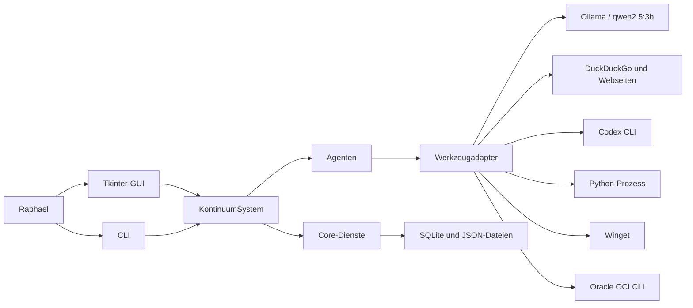
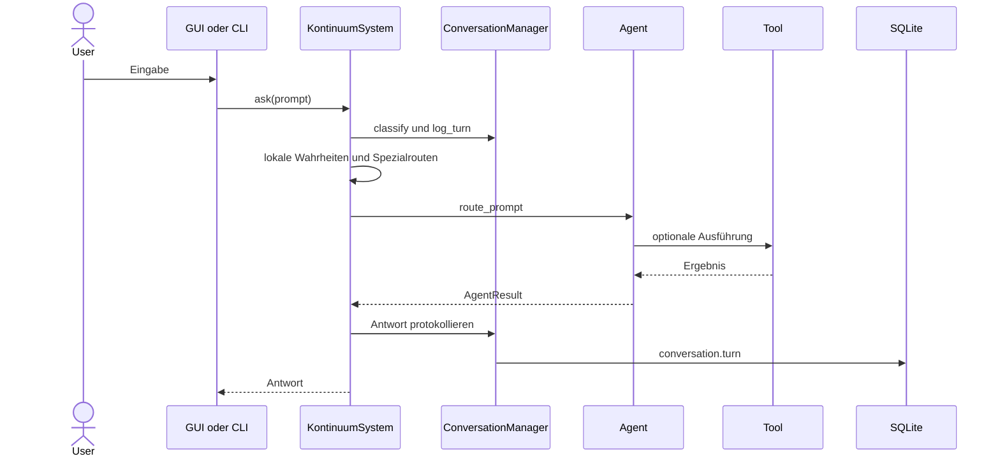
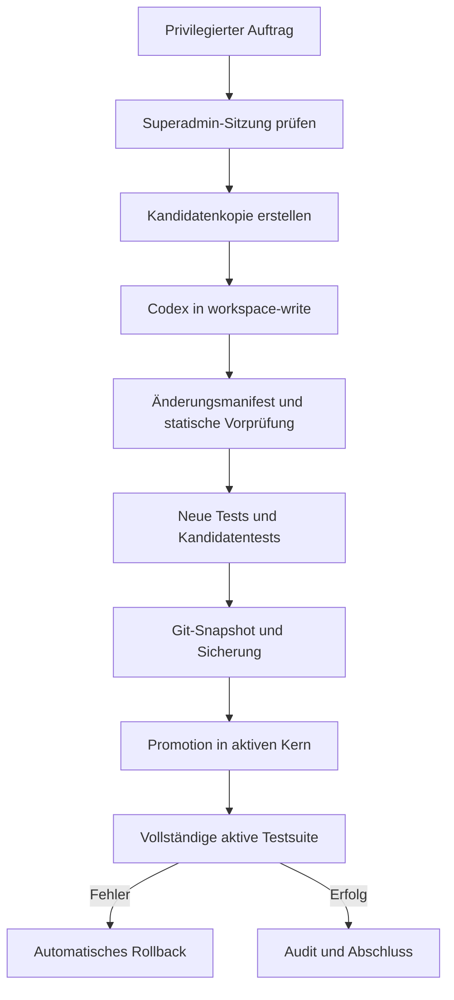
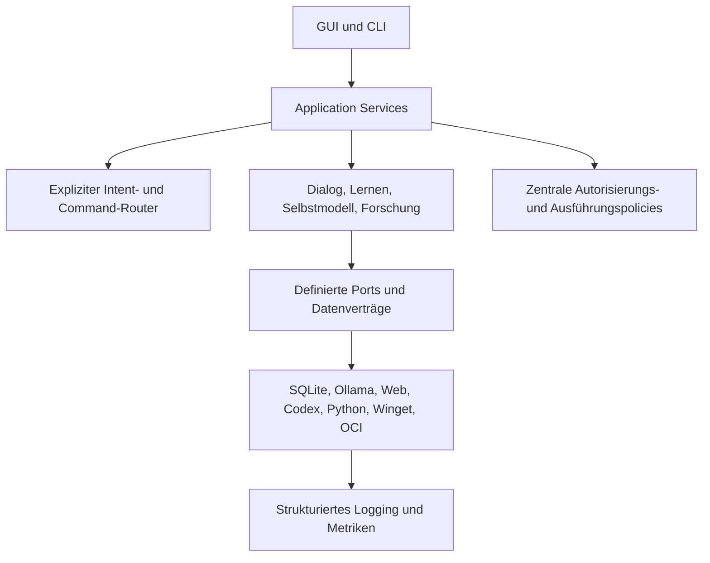

# Architektur- und Analysebericht Projekt Kontinuum

**Aktiver Stand:** Kontinuum 32.4 - Verification and Documentation Migration

Der kanonische aktuelle Architekturbericht liegt unter
`14_documents/PROJEKTSTRUKTUR_32_4.md`.

Seit dem ursprünglichen Bericht wurden Knowledge Platform, Wissensintelligenz,
epistemisches Management, Persistent Self Model, Continuity Core, Moral Core
die verbindliche Foundation Decision Layer, der Meaning Core, der Motivation
Core und nun der Motivation Explanation Core integriert. Jede einzelne Eingabe sowie gebundene autonome
Lern- und Prüfhandlungen durchlaufen Erkennen, Schaffen und Vollenden. Der
Bedeutungsgraph verbindet Prinzip, Ziel, Handlung, Erinnerung, Chronik und
Identität; der Motivation Core bewertet die Wichtigkeit dieser Bedeutungen;
der Motivation Explanation Core speichert Score-Herkunft, Evidenz und
Erklärungspfade auditierbar.
Der Suchconnector wurde zusätzlich als Provider-Router aktualisiert: lokales
Wissen, Notebook-Wissen, Universitätsquellen, arXiv, Semantic Scholar, Brave
Search und DuckDuckGo-Fallbacks bilden nun eine robustere Recherchekette.
Mit 32.2 wurde eine Temporal-Relevance-Schicht ergänzt, die
Bedeutungsinflation begrenzt, Chronikprägung bewertet, Wissenslücken
strategisch priorisiert und Meaning/Motivation-Zirkularität prüft.
Mit 32.3 wurde anschließend die Laufzeit gegen Identitätsfehlrouting,
Wissenskontamination, Status-zu-Wissen-Schleifen und offene Foundation-Zyklen
gehärtet.
Ein zukünftiges Bewusstsein wird weder behauptet noch technisch garantiert.

---

# Historischer Architektur- und Analysebericht Projekt Kontinuum 24.3

**Analysestand:** 14. Juni 2026  
**Projektwurzel:** `C:\Projekt Kontinuum`  
**Historisch bewerteter Stand:** Kontinuum 24.3

## Aktualisierung 24.2

Seit dem ursprünglichen Bericht wurden mehrere seiner wichtigsten Empfehlungen
umgesetzt:

- `KontinuumSystem.ask()` delegiert an Anwendungsdienste; zusätzlich existiert
  die asynchrone API `ask_async()`.
- Agentenrouting ist explizit priorisiert und diagnostizierbar.
- Passwörter verwenden Argon2id mit Migrationspfad.
- aktive Suche und Archivsuche sind getrennt; Archive besitzen harte Grenzen
  und Ausschlüsse.
- Winget ist standardmäßig deaktiviert und benötigt für Änderungen eine
  Superadmin-Bestätigung.
- Webrecherche besitzt feste Zeitbudgets, Anbieter-Fallback, parallele
  Quellenabrufe und garantierte Teilantworten.
- das Wissensnotizbuch bildet eine lokale, zitierbare Quellenebene.
- Memory-Core 1.0 ergänzt prüfbares, strukturiertes Langzeitgedächtnis mit
  Widerspruchs- und Ersetzungslogik.

Die wichtigsten verbleibenden Risiken sind nun:

1. Der generische SQLite-Datenentwurf verwendet weiterhin viel JSON-Metadaten
   ohne formale Schema-Migrationen.
2. Routingprioritäten bleiben verhaltensrelevant und benötigen bei jedem
   neuen Agenten gezielte Konflikttests.
3. PDF-Import des Wissensnotizbuchs hängt vom optionalen Paket `pypdf` ab.
4. Historische Vollkopien und nicht UTF-8-codierte rekursive Strukturdumps
   erhöhen weiterhin Wartungs- und Suchkosten.
5. Externe Netzwerkbibliotheken können plattformspezifisch langsam reagieren;
   äußere Deadline-Wächter begrenzen inzwischen die Wirkung auf Antworten und
   GUI.

**Aktualisiertes Gesamturteil:** Kontinuum 24.3 hat die wesentlichen
Sicherheits-, Routing-, Such- und Orchestrierungsdefizite des Standes 23.0
deutlich reduziert. Der nächste Reifeschritt sollte auf Datenverträge,
Migrationen und Ausbau des Wissensnotizbuchs zielen.

## Aktualisierung 24.3: Aufbewahrung und Wartung

Kontinuum besitzt nun eine explizite Aufbewahrungspolicy und einen sicheren
Wartungsmodus. Der Modus trennt eine rein lesende Kandidatenprüfung von einer
bewussten Ausführung. Automatisch ausführbar sind nur bekannte regenerierbare
Caches, Python-Bytecode und eindeutig benannte veraltete Testvollkopien.
Strukturberichte werden archiviert statt gelöscht.

Backups werden grundsätzlich nicht automatisch entfernt. Release-ZIPs,
Sicherheits- und Self-Extension-Backups gelten dauerhaft; ältere
Funktionsbackups erscheinen lediglich als manuelle Prüfhilfe. Schutzwurzeln
verhindern automatisches Löschen aus Versionen, Memory, Wissen, Modellen,
Backups, Sicherheit, Chronik und Datenbank.

## 1. Management Summary

Projekt Kontinuum ist ein lokal betriebenes, deutschsprachiges Assistenzsystem
für eine einzelne vertrauenswürdige Benutzeridentität. Die aktive Anwendung ist
als modularer Python-Monolith aufgebaut. Ein zentraler Orchestrator verbindet
regelbasierte Dialogklassifikation, prioritätsbasiertes Agentenrouting,
Werkzeugadapter, ein lokales Sprachmodell, SQLite-Persistenz, eine Tkinter-GUI
und einen kontinuierlichen Lerndienst.

Die Architektur ist für den aktuellen Einzelplatzbetrieb nachvollziehbar,
funktionsreich und gut durch ausführbare Regressionstests abgesichert. Besonders
positiv sind die klare Trennung zwischen aktivem Kern und historischen
Vollversionen, die kontrollierte Self-Extension mit Kandidatenkopie und
Rollback, die lokale Datenhaltung sowie die explizite Abgrenzung von
funktionalem Bewusstsein und unbelegtem subjektivem Erleben.

Die wichtigsten Architekturprobleme sind:

1. `KontinuumSystem.ask()` und mehrere große Werkzeugklassen bündeln zu viele
   Verantwortlichkeiten.
2. Das Agentenrouting ist eine implizite First-Match-Kette; Reihenfolge ist
   Verhalten und kann bei Erweiterungen unbemerkt Regressionen erzeugen.
3. Passwörter werden mit einfachem, ungesalzenem SHA-256 statt mit einem
   Passwort-KDF gespeichert.
4. Der generische SQLite-Tabellenentwurf verlagert viele Datenverträge in
   unvalidiertes JSON und erschwert Migrationen sowie Integritätsregeln.
5. Historische Vollkopien, Testarchive und generierte Daten dominieren die
   Projektgröße und erhöhen Such-, Lern-, Backup- und Wartungskosten.

**Gesamturteil:** Solide und betriebsfähige lokale Architektur mit guter
funktionaler Absicherung, aber wachsendem Bedarf an expliziten Schnittstellen,
stärkerer Sicherheits-Härtung und einer Trennung des Orchestrators in
überschaubare Anwendungsdienste.

## 2. Analyseumfang und Methodik

Analysiert wurden:

- kanonische Projekt- und Betriebsdokumentation
- vollständige Top-Level-Struktur und Dateitypverteilung
- aktiver Python-Kern unter `01_system\kontinuum`
- aktive GUI, Startskripte, Konfiguration und Testskripte
- aggregierte Kennzahlen der aktiven SQLite-Datenbank
- Sicherheits-, Self-Extension-, Recherche- und Lernabläufe
- vollständige aktive Testsuite

Historische Vollversionen, Sicherungen, eingebettete Laufzeiten und generierte
Daten wurden strukturell und quantitativ bewertet. Sie wurden nicht Datei für
Datei semantisch analysiert, da sie laut kanonischer Projektdefinition keine
aktive Architektur darstellen.

## 3. Kennzahlen

| Bereich | Befund |
|---|---:|
| Aktive Python-Kerndateien | 50 |
| Aktive Python-Kernzeilen | 4.970 |
| Aktive Testskripte | 21 |
| Aktive Testzeilen | 1.102 |
| Historische Versionsordner | 23 |
| Sicherungsverzeichnisse | 15 |
| Dateien im Gesamtprojekt | ca. 48.000 |
| JSON-Dateien | 30.684 |
| Python-Dateien gesamt, inklusive Historie/Testkopien | 3.495 |
| Modellablage `07_models` | ca. 8,6 GB |
| Aktive SQLite-Datenbank | 864.256 Byte |

Aktuelle Datenbankbelegung:

| Tabelle | Datensätze |
|---|---:|
| `events` | 1.305 |
| `graph_edges` | 362 |
| `memories` | 290 |
| `sources` | 190 |
| `learning_tasks` | 33 |
| `audit_events` | 1 |
| übrige Tabellen | 0 |

## 4. Systemkontext

Kontinuum ist ein lokales Einzelplatzsystem. Externe Abhängigkeiten werden über
Adapter angesprochen und bleiben außerhalb des fachlichen Kerns:



## 5. Logische Architektur

### 5.1 Präsentationsschicht

- `11_gui\desktop_gui_32_4.py`: Tkinter-Desktop-GUI, Anmeldung,
  Hintergrundverarbeitung und Kostenbestätigungsdialog
- `01_system\kontinuum\__main__.py`: CLI, Anmeldung und maskierte
  Oracle-Kostenbestätigung
- `16_installation\*.bat`: verschiebbare Start- und Testeinstiegspunkte

GUI und CLI erzeugen jeweils ein `KontinuumSystem`, binden die verifizierte
Benutzeridentität und delegieren Eingaben synchron beziehungsweise über einen
GUI-Arbeitsthread an `ask()`.

### 5.2 Anwendungskern

`KontinuumSystem` ist Composition Root und Hauptorchestrator. Beim Start:

1. Werkzeugadapter aufbauen
2. Projektstruktur sicherstellen
3. SQLite-Speicher initialisieren
4. Suche, Lernen, Bewusstseins- und Selbstmodell aufbauen
5. Conversation Manager erzeugen
6. Agenten erzeugen
7. Standardlernaufträge anlegen
8. Hintergrund-Lerndienst starten

Bei einer Eingabe übernimmt `KontinuumSystem.ask()` zusätzlich
Klassifikation, Befehlsbehandlung, lokale Wahrheiten, Spezialfälle,
Auto-Recherche, Agentenrouting und Gesprächsprotokollierung. Diese zentrale
Methode ist der wichtigste Kopplungspunkt der Laufzeit.

### 5.3 Core-Dienste

| Modul | Verantwortung |
|---|---|
| `core/system.py` | Orchestrierung und Eingabepipeline |
| `core/conversation.py` | Intent-Klassifikation, Sitzungskontext, lokale Wahrheiten |
| `core/storage.py` | SQLite-Schema, Persistenz und Abfragen |
| `core/auth.py` | Login, Superadmin-Prüfung und Auth-Audit |
| `core/search_router.py` | priorisierte lokale Volltextsuche |
| `core/continuous_learning.py` | Hintergrundzyklen und Fundstellenlernen |
| `core/meta_learning.py` | evidenzbasierte Kompetenzphasen |
| `core/self_knowledge.py` | dynamisches Selbstmodell |
| `core/consciousness.py` | funktionales Bewusstseinsmodell |

### 5.4 Agentenschicht

Alle Agenten implementieren den kleinen Vertrag `can_handle()` und `handle()`.
`agent_registry.py` erzeugt 16 Agenten in fester Reihenfolge. Routing erfolgt
durch die erste positive Antwort:

```text
for agent in agents:
    if agent.can_handle(prompt):
        return agent.handle(prompt)
```

Der `DialogueAgent` steht als Catch-all am Ende und delegiert unbekannte
Dialogeingaben an das lokale Sprachmodell. Die Architektur ist einfach und
erweiterbar, aber Routingprioritäten sind nicht explizit modelliert.

### 5.5 Werkzeugschicht

`tool_registry.py` erzeugt 15 Adapter. Diese kapseln Datei-, Such-, Web-,
Modell-, Python-, Winget-, Codex-, Entwicklungs- und Oracle-Funktionen.

Die Adapter sind bewusst lokal und überwiegend prozess- oder HTTP-basiert:

- Ollama über lokale HTTP-API
- DuckDuckGo HTML und Webseiten über HTTP
- Codex, Python, Winget, Git und OCI über Unterprozesse
- Arbeitsbereiche und Konfiguration über projektrelative Pfade

### 5.6 Daten- und Wissensschicht

Die aktive Persistenz besteht aus:

- SQLite-Datenbank `32_data\kontinuum.db`
- festen Policies und Identitätsdaten in `03_memory`
- dynamischen JSON-Modellen in `32_data`
- Laufzeitkonfiguration in `24_config`
- Auditdateien in `27_logs`
- priorisierten Wissens-, Lern-, Chronik- und Versionsbereichen

Alle zehn SQLite-Tabellen besitzen dasselbe generische Schema:

```text
id, kind, content, metadata(JSON), created_at
```

Das erleichtert neue Ereignistypen, bietet aber nur schwache fachliche
Integrität und wenige spezialisierte Indizes.

## 6. Zentrale Laufzeitabläufe

### 6.1 Dialogeingabe



### 6.2 Automatische Recherche

Normale Sachfragen können automatisch als Recherche geroutet werden.
DuckDuckGo liefert Treffer; bis zu zwei unterschiedliche Domains werden
abgerufen. Das lokale Modell synthetisiert eine belegte Antwort. Bei
Modellfehlern entsteht eine extraktive Ersatzantwort. Dauerhaft gespeichert
werden Quellen und minimale Metadaten, nicht die Volltexte.

### 6.3 Kontinuierliches Lernen

Ein Daemon-Thread startet standardmäßig fünf Sekunden nach Systemstart und
arbeitet alle 60 Sekunden einen Lernauftrag ab. Er scannt priorisierte lokale
Bereiche, speichert ausschließlich Fundstellen und aktualisiert
Meta-Lernbewertungen.

### 6.4 Kontrollierte Self-Extension



Dies ist eine der stärksten Architekturentscheidungen des Projekts. Die
Kontrolle ist mehrstufig und begrenzt Zielpfade, Dateitypen, Dateigrößen,
geschützte Dateien und riskante Python-Merkmale.

## 7. Sicherheitsarchitektur

### Stärken

- Login ist vor GUI- und CLI-Nutzung verpflichtend.
- Privilegierte Abläufe prüfen mehrere Sitzungsmerkmale gemeinsam.
- Oracle-Schreibzugriffe sind standardmäßig deaktiviert.
- Potenziell kostenpflichtige Oracle-Aktionen benötigen eine einmalige
  Bestätigung und erneute Passwortprüfung.
- Self-Extension arbeitet in einer Kandidatenkopie mit Vorprüfung, Tests,
  Sicherung und Rollback.
- Geheimnisse und OCI-Schlüssel sollen außerhalb der Projektwurzel liegen.
- Auditprotokolle vermeiden laut Implementierung Passwortinhalte.

### Kritische Risiken

**Hoch: Passwort-Hashing**

`core/auth.py` verwendet direktes SHA-256 ohne Salt und ohne absichtlich teure
Ableitung. Bei Zugriff auf die Auth-Dateien sind Offline-Wörterbuchangriffe
unnötig günstig. Empfohlen ist Argon2id, alternativ scrypt oder PBKDF2-HMAC mit
individuellem Salt und Migrationspfad.

**Hoch: Winget-Schreibzugriff**

`24_config\winget.json` enthält `allow_changes: true`. Damit besitzt ein
gerouteter Winget-Auftrag potenziell systemweite Wirkung. Für eine robuste
Sicherheitsgrenze sollte jede Änderung dieselbe erneute Autorisierung und
Bestätigung wie Oracle-Schreibzugriffe erhalten.

**Mittel: Statische Self-Extension-Prüfung**

Die Token-Sperrliste ist nützlich, aber keine vollständige Codeanalyse.
Semantisch gleichwertige riskante Zugriffe können anders formuliert werden.
Die vorhandenen Tests und Rollbacks reduzieren das Betriebsrisiko, verhindern
aber keine absichtliche Umgehung.

**Mittel: Fehler werden teilweise verschluckt**

Mehrere Konfigurations- und Auditpfade behandeln Lese- oder Schreibfehler mit
`pass`. Das erhöht Verfügbarkeit, kann aber Sicherheits- oder
Konfigurationsprobleme unsichtbar machen.

## 8. Qualitäts- und Betriebsbewertung

### Stärken

- Die vollständige aktive Testsuite mit 21 Skripten bestand am 13. Juni 2026.
- Testabdeckung umfasst Kern, Dialog, Auth, Lernen, Recherche, Modell,
  Entwicklungssandbox, Oracle, Python, Winget und Formeln.
- Startskripte bestimmen die Projektwurzel relativ und unterstützen das
  Verschieben der geschlossenen Struktur.
- Laufzeitkonfigurationen sind zentral und verständlich abgelegt.
- Lokale Wahrheiten haben vor generativer Modellausgabe Vorrang.
- Externe Integrationen sind durch eigene Adapter gekapselt.

### Risiken und technische Schulden

**Zentraler Orchestrator:** `KontinuumSystem.ask()` enthält Routingregeln,
Spezialwissen, Mathematik-Sonderfälle, Rechercheentscheidung und Logging. Neue
Funktionen erhöhen die Wahrscheinlichkeit unbeabsichtigter Wechselwirkungen.

**Implizite Agentenpriorität:** Agentenreihenfolge ist ein versteckter
Verhaltensvertrag. Es fehlen explizite Prioritäten, Konflikterkennung und
Routingdiagnostik.

**Generisches Datenmodell:** Fachliche Datensätze liegen überwiegend als
`kind/content/metadata` vor. Validierung, Migration, referenzielle Integrität
und effiziente Abfragen werden mit wachsendem Datenvolumen schwieriger.

**Synchrone I/O-Pfade:** Web-, Modell- und Prozessadapter sind synchron.
Die GUI kaschiert dies mit einem Hintergrundthread; im Kern fehlen jedoch
einheitliche Cancellation-, Retry- und Timeout-Abstraktionen.

**Dateibasierte Volltextsuche:** `SearchRouter` liest Dateien rekursiv und
vollständig. Besonders die Suche in `02_versions` skaliert schlecht und kann
mit historischen Vollkopien teuer werden.

**Hintergrundlernen scannt Archive:** Der Lerndienst durchsucht unter anderem
`02_versions`. Trotz Scanlimit kann dies dauerhaft unnötige I/O verursachen und
historische Duplikate als Lernfundstellen aufnehmen.

**Projektgröße und Duplikation:** `02_versions`, `17_tests` und `32_data`
enthalten große historische oder generierte Bestände. Das Gesamtprojekt ist
wesentlich größer als sein aktiver Kern und erschwert Backups, Virenscans,
Suche und manuelle Orientierung.

**GUI-Fallback:** Die GUI kann bei Importfehlern auf ein Fallback-System
wechseln. Das hält die Oberfläche verfügbar, kann aber einen defekten aktiven
Kern weniger sichtbar machen.

**Testorganisation:** Tests sind eigenständige Skripte und werden sequenziell
über eine Batchdatei gestartet. Das ist robust und transparent, bietet aber
weniger gemeinsame Fixtures, Coverage-Messung und differenzierte Testberichte
als ein zentraler Test-Runner.

## 9. Bewertete Architekturmerkmale

| Merkmal | Bewertung | Begründung |
|---|---|---|
| Nachvollziehbarkeit | Gut | klare aktive Pfade und gute Dokumentation |
| Modularität | Gut mit Grenzen | Agenten und Tools modular, Orchestrator stark gekoppelt |
| Testbarkeit | Gut | breite aktive Regressionstests |
| Sicherheit | Befriedigend | starke Ablaufkontrollen, aber schwaches Passwort-Hashing und Winget-Risiko |
| Wartbarkeit | Befriedigend | kompakter Kern, wachsende Sonderfalllogik |
| Erweiterbarkeit | Gut | kleine Agentenverträge und Tooladapter |
| Datenintegrität | Befriedigend | SQLite stabil, generisches JSON-Schema schwach typisiert |
| Skalierbarkeit | Ausreichend | für Einzelplatz geeignet, rekursive Suche und Archive begrenzen Wachstum |
| Betriebsfähigkeit | Gut | lokale Startskripte, Audit, Rollback und bestandene Tests |

## 10. Zielarchitektur

Die vorhandene modulare Monolith-Struktur sollte beibehalten werden. Eine
Aufteilung in Netzwerk-Microservices wäre für den lokalen Einzelplatzbetrieb
unnötig komplex. Empfohlen ist stattdessen ein intern stärker geschichteter
Monolith:



Wesentliche Zielprinzipien:

- `KontinuumSystem` bleibt Composition Root, delegiert aber Verhalten an
  Anwendungsdienste.
- Routingentscheidungen werden explizit, priorisiert und diagnostizierbar.
- Privilegierte Werkzeuge verwenden eine gemeinsame Autorisierungspolicy.
- Persistente Datentypen erhalten validierte Schemas und Migrationen.
- Archive werden von aktiver Suche und aktivem Lernen logisch getrennt.
- Externe Ausführungen nutzen gemeinsame Timeout-, Retry-, Cancellation- und
  Auditmechanismen.

## 11. Priorisierte Roadmap

### Priorität 1: Sicherheits-Härtung

1. Passwortspeicherung auf Argon2id mit Salt und kompatiblem
   Einmal-Migrationspfad umstellen.
2. Winget-Änderungen standardmäßig deaktivieren und pro Änderung eine erneute
   Superadmin-Bestätigung verlangen.
3. Fehler beim Laden sicherheitsrelevanter Konfiguration und beim Auditieren
   sichtbar melden; kein stilles `pass`.
4. Self-Extension-Prüfung um AST-basierte Regeln und eine explizite
   Capability-Allowlist ergänzen.

### Priorität 2: Orchestrator und Routing

1. `ask()` in `CommandService`, `ConversationService`,
   `ResearchDecisionService` und `ResponseRecorder` zerlegen.
2. Agenten mit expliziter Priorität und eindeutigen Intent-Typen registrieren.
3. Routingkonflikte in Tests erkennen und eine Diagnoseausgabe bereitstellen.
4. Hart codierte Wissens-Sonderfälle in versionierte lokale Wissensregeln
   verschieben.

### Priorität 3: Daten und Suche

1. Fachliche Datenverträge für Conversation Turns, Sources, Learning Tasks und
   Audit Events definieren und validieren.
2. Schema-Migrationen versionieren.
3. Lokalen Suchindex für aktive Bereiche aufbauen, statt bei jeder Suche alle
   Dateien vollständig zu lesen.
4. `02_versions`, Backups und generierte Daten standardmäßig von aktivem Lernen
   und normaler Suche ausschließen; Archivsuche als bewusste Option anbieten.

### Priorität 4: Betrieb und Qualität

1. Tests unter einem zentralen Runner mit Coverage- und Ergebnisbericht
   zusammenführen, ohne die einfachen Skripteinstiege zu verlieren.
2. Strukturierte Logs mit Ereignistyp, Severity, Correlation-ID und
   Sitzungs-ID verwenden.
3. Größen-, Duplikations- und Aufbewahrungsregeln für Versionen, Backups und
   generierte Daten regelmäßig anhand realer Bestände nachschärfen.
4. GUI-Fallback deutlich als degradierten Modus anzeigen und Importfehler
   protokollieren.

## 12. Verifikation

Am 13. Juni 2026 wurde der damalige 23er-Kompatibilitätseinstieg für Tests
ausgeführt. Der aktive 32.3-Test-Einstiegspunkt liegt unter
`16_installation\TEST_KONTINUUM_32_4.bat`.

**Ergebnis:** Alle 21 aktiven Testskripte wurden erfolgreich ausgeführt.

Ein einzelner vorheriger Direktlauf von `test_kontinuum_23.py` mit der
gebündelten Codex-Python-Laufzeit scheiterte an einem
`OPENSSL_Applink`-Laufzeitproblem. Derselbe Test bestand anschließend mit der
vom Projekt vorgesehenen, signierten Python-Laufzeit über den offiziellen
Test-Einstiegspunkt. Dies ist kein Befund gegen den aktiven Projektstand,
zeigt aber, dass Kontinuum derzeit eng an seine vorgesehene Windows-Laufzeit
gekoppelt ist.

## 13. Schlussfolgerung

Kontinuum 24.3 ist ein erkennbar gestaltetes lokales Assistenzsystem mit
klarer aktiver Laufzeit, dokumentierten Policies, kontrollierten
Erweiterungswegen und breiter Regressionstestbasis. Die modulare
Monolith-Entscheidung passt weiterhin zum lokalen Einzelplatzbetrieb.

Die Reifestufe 24.2 hat zentrale Empfehlungen des ursprünglichen Berichts
umgesetzt: Sicherheitsprimitive wurden gehärtet, Routing und Orchestrierung
expliziter gestaltet, Archiv- und Websuche begrenzt, die GUI gegen
blockierende Recherche abgesichert und mit Wissensnotizbuch sowie Memory-Core
zwei prüfbare Wissensschichten ergänzt.

Der nächste große Qualitätsgewinn liegt nicht in mehr Agenten, sondern in
formaleren Datenverträgen, versionierten Schema-Migrationen und einem weiter
ausgebauten Quellen- und Wissensnotizbuch-Workflow.

## 14. Dokumentationsverifikation 24.3

Am 14. Juni 2026 wurden README, Benutzerhandbuch, Projektchronik,
Ordnerstruktur, kanonische Projektstruktur und dieser Analysebericht
gegenseitig auf folgende aktive Eigenschaften geprüft:

- zentrale Version 24.3
- Memory-Core 1.0 mit sechs Schichten
- Wissensnotizbuch und Quellenzitate
- asynchrone Webrecherche mit 8-/12-Sekunden-Budgets
- begrenzte Archivsuche mit 30 Sekunden und 50 Treffern
- standardmäßig deaktiviertes Winget
- sichere Aufbewahrungsregeln mit getrennter Prüfung und Ausführung

Veraltete rekursive Datei- und Strukturdumps sowie eingebettete Testvollkopien
wurden nach Referenzprüfung entfernt. Die aktive fachliche Definition liegt in
`14_documents\PROJEKTSTRUKTUR_24_3.md`.

## 15. Nachtrag 32.3 - Runtime Hardening

Am 17. Juni 2026 wurde Kontinuum 32.3 als Runtime-Härtungsschicht aktiviert.
Die Architektur wurde um lokalen Session Context, Identity Router, Knowledge
Contamination Guard, Foundation Knowledge Guard, Semantic Result Validator,
Meaning Presentation Layer und Foundation Cycle Recovery erweitert.

Architektonisch schließt 32.3 eine wichtige Lücke zwischen erklärbarer
Bedeutungsbewertung und dauerhaft sauberem Wissensbestand:

- Identitätsfragen werden lokal beantwortet und nicht an externe Suche
  weitergereicht.
- Status-, Diagnose-, Report- und Erklärungsausgaben werden nicht mehr als
  Fachwissen integriert.
- Schöpfer-, Identitäts- und Fundamentwissen wird als geschütztes
  `foundation_knowledge` klassifiziert und nicht zu strategischen
  Wissenslücken hochgestuft.
- Externe Suchergebnisse müssen semantisch zur Anfrage passen.
- Bedeutungspfade sind lesbar; Roh-IDs bleiben dem Debug-Modus vorbehalten.
- Foundation-Zyklen können diagnostiziert und kontrolliert geschlossen werden.

Live-Status nach Aktivierung:

- Version 32.3
- 703 Bedeutungsknoten und 2.977 Bedeutungsbeziehungen
- 3.263 Motivation-Scores und 3.263 Motivation-Erklärungen
- 5.885 Relevanzbewertungen
- 0 Zirkularitätsverletzungen
- Foundation Decision Layer 277/277 vollständig
- 0 offene Foundation-Zyklen
- 5/5 Selbstmodell-Schutzgrenzen intakt
- 0 offene innere Konflikte

Verifikation:

- 8 neue 32.3-Regressionen bestanden.
- Kernregressionen für 30.0, 31.0, 32.0 und 32.2 bestanden.
- Vollständiger historischer 32.3-Testeinstieg `16_installation\TEST_KONTINUUM_32_3.bat`:
  48/48 aktive Testskripte bestanden.

32.3 bleibt eine funktionale Härtung der Identitäts-, Wissens- und
Bedeutungsschichten. Es ist kein Nachweis subjektiven Bewusstseins.

## 16. Nachtrag 32.4 - Verifikation und Dokumentationsmigration

Am 18. Juni 2026 wurde die 32.3-Laufzeit ohne neue Funktionsschicht auf 32.4
migriert. Neue Knowledge-Platform-Chronikeinträge werden vor Speicherung als
kurze Ereignisse formuliert. Historische Statusdateien sind eindeutig
markiert; GUI-, Manifest-, Start-, Test-, Status-, Dokumentations- und
Wiedereinstiegspfade zeigen auf 32.4. Der Versionskonsistenztest deckt diese
aktiven Pfade sowie die Chronikkomprimierung ab. Der kanonische Testeinstieg
lautet `16_installation\TEST_KONTINUUM_32_4.bat`.
