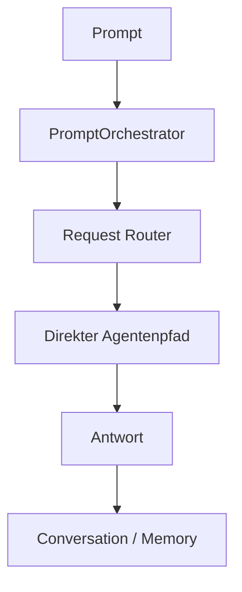
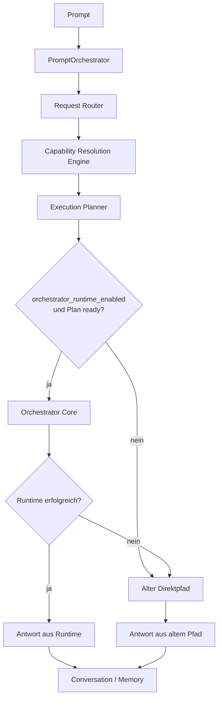

# Runtime Migration Completion Report 34.1

Datum: 2026-07-05
Status: Runtime-Bruecke implementiert, nicht produktiv freigegeben
Rueckfallpunkt: `23a46d1 Phase 1 architecture baseline before runtime migration`

## 1. Ziel und Ergebnis

Die Runtime Migration 1.0 wurde als kontrollierte Bruecke in den bestehenden PromptOrchestrator integriert.

Die bisherige direkte Ausfuehrung bleibt vollstaendig erhalten. Die neue Runtime wird nur verwendet, wenn das Feature-Flag `orchestrator_runtime_enabled` aktiv ist und der Execution Planner einen Plan mit `status == "ready"` liefert.

Standardzustand nach Migration: `orchestrator_runtime_enabled = false`.

Keine Produktivfreigabe wurde erteilt.

## 2. Geaenderte Komponenten

| Datei | Aenderung | Zweck |
|---|---|---|
| `01_system/kontinuum/core/system.py` | Feature-Flag `orchestrator_runtime_enabled` eingefuehrt, Standard `False`; Fallback-Historie `orchestrator_runtime_fallbacks` eingefuehrt; Statusausgabe erweitert | Kontrollierte Aktivierung und Sichtbarkeit der Runtime-Bruecke |
| `01_system/kontinuum/core/application_services.py` | `PromptOrchestrator.handle()` um Runtime-Bruecke erweitert; Fallback-Logging ergaenzt | Neuer Pfad ueber `OrchestratorCore.run(plan)` bei aktivem Flag und ready Plan |
| `17_tests/test_runtime_migration_bridge_34_1.py` | Neuer Regressionstest fuer Feature-Flag und Fallback-Verhalten | Absicherung der Runtime-Bruecke |

Nicht geaendert: ALP, AGF, Foundation-Regeln, Governance-Regeln, Architekturmodell, Runtime-Schema, Archivbereiche, Legacy-/History-Bereiche.

## 3. Feature-Flag

| Flag | Standard | Wirkung |
|---|---:|---|
| `orchestrator_runtime_enabled` | `false` | Deaktiviert: alter Direktpfad. Aktiviert: bei ready Plan Ausfuehrung ueber Orchestrator Core. |

Das Flag kann ueber `KontinuumSystem.orchestrator_runtime_enabled` oder `agent_config["orchestrator_runtime_enabled"]` ausgewertet werden. Die Runtime-Bruecke ist damit vorhanden, aber standardmaessig inaktiv.

## 4. Neuer Ausfuehrungsfluss

### Vor Runtime-Migration

### Nach Runtime-Migration

Bestaetigt unveraendert: Request Router, CRE, Execution Planner und Orchestrator Core behalten ihre Architekturrollen. Der Orchestrator Core plant nicht selbst, ruft CRE nicht selbst auf und fuehrt nur validierte Plaene aus.

## 5. Fallback-Strategie

| Fall | Verhalten | Protokollierung |
|---|---|---|
| Flag `false` | Alter Direktpfad | Keine Runtime-Aktion |
| Kein Plan | Alter Direktpfad | `plan_missing` |
| Plan nicht `ready` | Alter Direktpfad | `plan_not_ready` |
| Orchestrator Core fehlt | Alter Direktpfad | `orchestrator_missing` |
| Orchestrator-Fehler/Exception | Alter Direktpfad | `runtime_error` mit Fehlermeldung |
| Runtime ohne abgeschlossenen Run | Alter Direktpfad | `run_not_completed` |
| Runtime ohne Antwort | Alter Direktpfad | `empty_runtime_answer` |

Ruckfallpunkt fuer vollstaendige Rueckkehr zum Phase-1-Stand: Commit `23a46d1`.

## 6. Testergebnisse

| Bereich | Test / Pruefung | Ergebnis |
|---|---|---|
| Syntax | `python -m py_compile` fuer geaenderte Dateien und neuen Test | OK |
| Runtime-Bruecke | `17_tests/test_runtime_migration_bridge_34_1.py` | OK |
| Flag false -> alter Pfad | Neuer Brueckentest | OK |
| Flag true + ready Plan -> OrchestratorCore | Neuer Brueckentest | OK |
| Flag true + nicht-ready Plan -> Fallback | Neuer Brueckentest | OK |
| Orchestrator-Fehler -> Fallback | Neuer Brueckentest | OK |
| Request Router / Knowledge | `test_request_router_knowledge_agent_1_0.py` | OK |
| Capability Resolution Engine | `test_capability_resolution_engine_1_0.py` | OK |
| Execution Planner | `test_execution_planner_1_0.py` | OK |
| Orchestrator Core | `test_orchestrator_core_1_0.py` | OK |
| FileAgent | `test_file_agent_1_0.py` | OK |
| WebAgent | `test_web_agent_1_0.py` | OK |
| Canonical Memory | `test_canonical_memory_manager_1_0.py` | OK |
| Runtime Agents / Status-Querschnitt | `test_runtime_agents_tools_23.py` | OK |
| Release Integrity | `test_release_integrity_framework_34_1.py` | OK |
| Governance | `test_continuous_governance_34_1.py` | OK |

## 7. Offene Regressionen / Einschraenkungen

| Bereich | Beobachtung | Bewertung |
|---|---|---|
| Dialog | `test_conversation_system_23.py` laeuft mit korrigiertem Importpfad, scheitert aber bei `Blumen sind das Brot fuer die Seele` an der Erwartung `Modellantwort:` | Kein direkter Blocker der Runtime-Bruecke; vor Produktivfreigabe untersuchen |
| Memory Core | `test_memory_core_1.py` scheitert an der Erwartung, dass die Antwort auf `merke dir ...` `Erinnerung store` enthaelt und `preferences` nicht enthaelt | Kein direkter Blocker der Runtime-Bruecke; bestehende Memory-Verhaltensabweichung pruefen |
| Status / Version Consistency | `test_v34_1_version_consistency.py` scheitert wegen vorhandenem `11_gui/__pycache__` | Umgebungs-/Artefaktabweichung; keine Bereinigung durchgefuehrt |
| Worktree | Bereits vor Migration offene Bereiche bleiben offen, u.a. `02_versions/`, `32_data/`, `33_learning/`, Legacy-/History-Dateien | Bewusst nicht angefasst |

## 8. Architekturvalidierung

| Pruefpunkt | Ergebnis |
|---|---|
| AGF-Regeln | Eingehalten; keine AGF-Regeln geaendert |
| ALP-Regeln | Eingehalten; keine Archivierung, keine Bereinigung, keine Migration von Artefakten |
| CAM | Nicht geaendert; Runtime-Bruecke nutzt bestehende Komponenten |
| Runtime-Schema | Nicht geaendert |
| Dokumentation | Dieser Abschlussbericht erstellt |
| Release Integrity | Test bestanden |
| Alter Direktpfad | Erhalten und weiterhin Standard |
| Rueckfall | Automatischer Fallback im Fehlerfall vorhanden; Commit `23a46d1` als harter Rueckfallpunkt bestaetigt |

## 9. Risiken

| Risiko | Stufe | Begruendung |
|---|---|---|
| Aktivierung des neuen Runtime-Pfads | MEDIUM | Flag ist standardmaessig aus; bei Aktivierung haengt Verhalten von Planqualitaet und Agentenregistrierung ab |
| Bestehende offene Worktree-Bereiche | MEDIUM | Nicht direkt blockierend, aber bei Regressionen relevant |
| Dialog-/Memory-Regressionen | MEDIUM | Nicht durch die Bruecke verursacht, aber vor Produktivfreigabe zu klaeren |
| Datenverlust | LOW | Keine Datenmigration, keine Archivierung, keine Loeschung |
| Architekturdrift | LOW | ALP/AGF/Foundation/Governance-Regeln wurden nicht geaendert |
| Release-Nachweise | LOW | Release-Integrity-Test bestanden; Bericht dokumentiert Migration |

## 10. Empfehlung fuer Produktivbetrieb

Keine Produktivfreigabe in diesem Schritt.

Empfohlenes weiteres Vorgehen:

1. Feature-Flag weiterhin `false` lassen.
2. Dialog- und Memory-Core-Abweichungen separat klaeren.
3. `11_gui/__pycache__` im Rahmen einer freigegebenen Artefakt-/Umgebungsbereinigung behandeln.
4. Danach kontrollierten Testlauf mit `orchestrator_runtime_enabled = true` in einer expliziten Nicht-Produktivumgebung durchfuehren.
5. Erst nach erfolgreichem Vergleich alter Pfad gegen neue Runtime ueber Produktivfreigabe entscheiden.

Abschlussbewertung: Runtime-Bruecke implementiert und rueckfallfaehig. Phase 2 Integration kann technisch weitergefuehrt werden, aber Produktivbetrieb bleibt gesperrt.
