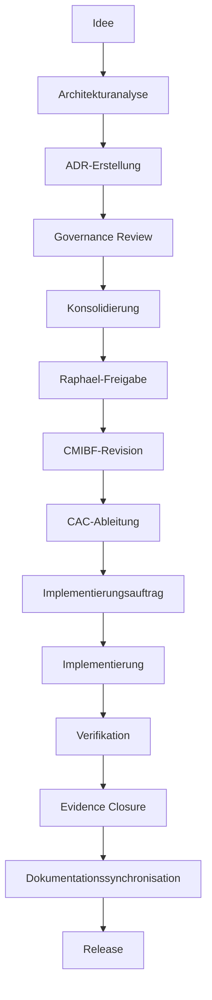

# Auftrag 19 – Architecture Governance Baseline Report 1.0

## Dokumentidentität

| Feld | Wert |
|---|---|
| Projekt | Projekt Kontinuum |
| Auftrag | Auftrag 19 – Architecture Governance Baseline Report 1.0 |
| Dokument | `31_reports/architecture_governance_baseline_report_1_0.md` |
| Datum | 2026-07-20 |
| Status | `DOCUMENTARY_BASELINE_NON_NORMATIVE` |
| Primäre normative Quelle | freigegebene CMIBF-1.0-Releasefassung |
| Entscheidungshoheit | Raphael Maria Schatz |
| Implementierungswirkung | keine |
| Runtime-Wirkung | keine |
| Release-Wirkung | keine |
| Zweck | belastbare Governance-Baselinedokumentation für zukünftige Architekturrevisionen |

## Nichtwirkungserklärung

Dieser Bericht besitzt ausschließlich Dokumentations- und Governancecharakter. Er:

- erzeugt keine normative Architektur;
- ersetzt oder verändert keine bestehende Architekturquelle;
- entscheidet keine offene Architekturfrage;
- genehmigt keinen ADR-Kandidaten;
- ändert keine CMIBF-, CAMap-, Glossar-, History- oder Chronikdatei;
- ändert keine Frameworkdokumente, Registries, Runtime, Tests, Konfigurationen oder Release-Artefakte;
- autorisiert keine Implementierung, Migration, Dokumentationssynchronisation oder Veröffentlichung;
- führt keinen CAC-Lauf, keine Tests und keine Git-Operation aus.

## Aussageklassen

Jede wesentliche Aussage dieses Berichts gehört genau einer der folgenden Klassen an:

| Kennzeichnung | Bedeutung |
|---|---|
| **Tatsache** | Durch eine freigegebene Architektur- oder Governancequelle bereits gültig oder als historischer Status nachweisbar. |
| **Konsolidierter Kandidat** | Fachlich konsolidierter Vorschlag aus Auftrag 18 und Phase 2 ohne normative Wirkung. |
| **Bewusst offen** | Noch nicht entscheidungsreif oder absichtlich nicht festgelegt. |
| **Empfehlung** | Vorgeschlagene spätere Bearbeitung ohne Entscheidungswirkung. |
| **Nicht Bestandteil der Baseline** | Ausdrücklich ausgeschlossen; darf nicht als Baselineaussage verwendet werden. |

# 1. Executive Summary

Die Governance-Baseline besteht aus drei klar getrennten Ebenen:

1. **Tatsache:** Die freigegebene CMIBF-1.0-Releasefassung bleibt die alleinige normative Architekturquelle. AFP verlangt Architektur vor Implementierung. CAWP trennt Analyse, Architektur, Implementierung und Runtimewirkung, verbietet nachträgliche Architekturrechtfertigung aus Code und bindet KI-Arbeit an menschliche Freigabe.
2. **Konsolidierter Kandidat:** Auftrag 18 enthält sechs vollständige Entscheidungsvorlagen sowie Entwürfe für ADR-Register, Versioning, Rollback, Impact- und Dependency-Governance. Phase 2 bewertet diese Vorbereitung als `ACCEPTED_WITH_CONDITIONS`. Keiner dieser Kandidaten ist bereits normativ.
3. **Bewusst offen:** Permanente ADR-IDs, Zielrevisionen, Authority-/Statusmapping und die entscheidungsspezifischen Policyparameter bleiben offen, bis Raphael sie in getrennten Architekturentscheidungen freigibt.

**Tatsache:** Auftrag 17 dokumentiert einen technischen und Governance-Reviewstatus `NO_GO`. Dieser Reviewstatus ist Evidenz für Handlungsbedarf, aber keine Architekturquelle. Vorhandener Code, Tests oder Registrierungen dürfen deshalb keine Architektur erzeugen.

Zwei vor einer normativen Übernahme zu lösende Architekturthemen sind bereits konsolidiert:

- **Konsolidierter Kandidat:** Das Arbeitskürzel `CADP` darf nicht dauerhaft für Architecture Decision Preparation verwendet werden, weil es kanonisch bereits Canonical Active Directory Policy bezeichnet.
- **Konsolidierter Kandidat:** Historische ADR-Lineage und fachliche ADR-Abhängigkeiten werden durch vier getrennte Beziehungen beschrieben: `Previous ADR`, `Successor ADR`, `Depends On` und `Required By`.

Gesamtergebnis:

```text
BASELINE_DOCUMENTATION: COMPLETE
EXISTING_GOVERNANCE_CAPTURED: YES
CONSOLIDATED_CANDIDATES_CAPTURED: YES
OPEN_TOPICS_CAPTURED: YES
INDIVIDUAL_ADR_APPROVAL: NOT_GRANTED
CMIBF_REVISION_AUTHORIZATION: NOT_GRANTED
IMPLEMENTATION_READINESS: NO_GO
NORMATIVE_EFFECT: NONE
```

# 2. Ziel und Geltungsbereich

## 2.1 Ziel

**Tatsache:** Auftrag 19 erstellt einen dokumentarischen Referenzstand, von dem zukünftige Governance- und Architekturreviews ausgehen können.

Der Bericht beantwortet:

- welche Governance bereits verbindlich ist;
- welche Architekturvorschläge konsolidierte Kandidaten sind;
- welche Themen bewusst offen bleiben;
- welche Reihenfolge für spätere Architektur-, Implementierungs- und Releasearbeit gilt;
- welche ADR-Beziehungen Historie und welche fachliche Abhängigkeiten ausdrücken;
- welche Inhalte ausdrücklich nicht Teil der Baseline sind.

## 2.2 Geltungsbereich

Der Bericht umfasst:

- CMIBF-, AFP- und CAWP-Governance;
- Autorität und Ableitung von CAMap, Glossar, History und Chronik;
- Reviewbefunde aus Auftrag 17;
- die sechs ADR-Kandidaten aus Auftrag 18;
- die Phase-2-Konsolidierung einschließlich Kandidaten-, Änderungs- und Offenheitsklassifikation;
- den vollständigen Governanceprozess bis zum Release;
- das getrennte ADR-Relationsmodell;
- priorisierte offene Governancefragen.

## 2.3 Ausgeschlossen

**Nicht Bestandteil der Baseline:** produktiver Code und sein aktueller Zustand als Architekturquelle.

**Nicht Bestandteil der Baseline:** nicht freigegebene CMIBF-Arbeitsfassungen als normative Quelle.

**Nicht Bestandteil der Baseline:** automatische Schlussfolgerungen aus vorhandenen Tests, Registrierungen oder Konfigurationen auf einen Architekturstatus.

**Nicht Bestandteil der Baseline:** konkrete Implementierungs-, Migrations-, Installations-, Test- oder Releaseentscheidungen.

**Nicht Bestandteil der Baseline:** eine stillschweigende Freigabe der sechs A18-ADR-Kandidaten.

**Nicht Bestandteil der Baseline:** ein generisches, maschinen- und menschenlesbares Aussage-, Autoritäts- oder Herkunftsschema. Insbesondere werden `DOCUMENTED` und „Schlussfolgerung des Baseline Reports selbst“ durch diesen Bericht weder als Status noch als Autoritätsstufe definiert oder angewendet.

# 3. Verbindliche Quellenbasis

## 3.1 Autorisierte Quellen und Autoritätsstufen

| Quelle | Rolle in diesem Bericht | Autoritätsstufe |
|---|---|---|
| freigegebene CMIBF-1.0-Releasefassung | einzige normative Architekturquelle und primäre Prüfbasis | **Tatsache – primär normativ** |
| Architecture First Principle (AFP) | verbindliches Architektur-vor-Implementierung-Prinzip; im CMIBF, Glossar und CAWP nachgewiesen | **Tatsache – normatives Prinzip** |
| Canonical AI Working Protocol 1.0 | freigegebenes Arbeits- und Governanceprotokoll für KI-Systeme | **Tatsache – verbindliche Arbeitsgovernance** |
| Canonical Architecture Map 1.0 | untergeordnete Architekturkarte ohne eigene Architekturautorität | **Tatsache – abbildend** |
| Canonical Glossary 1.0 | verbindliche Begriffs- und Akronymverwendung unter CMIBF | **Tatsache – terminologisch** |
| Canonical History Index 1.0 | kanonischer Historienindex; dokumentiert Entstehung und Status, erzeugt keine Architektur | **Tatsache – historisch** |
| Projektchronik | chronologische Projektevidenz; kein Ersatz für CMIBF | **Tatsache – historisch** |
| Auftrag-17-Reviewbericht | technische und Governance-Reviewevidenz mit `NO_GO`; nicht normativ | **Tatsache – analytischer Befund** |
| Auftrag-18 Architecture Decision Preparation | sechs vorbereitete ADR-Kandidaten und Governanceentwürfe; Berichtsfreigabe, aber keine Einzel-ADR-Freigabe | **Konsolidierter Kandidat – nicht normativ** |
| Auftrag-18 Phase-2 Governance Consolidation Report | fachliche Abnahme `ACCEPTED_WITH_CONDITIONS`; trennt bestehende Norm, Kandidat, Offenheit und Änderungswirkung | **Konsolidierter Kandidat – nicht normativ** |

## 3.2 Konkrete Quellenpfade

- `14_documents/fundamentale Gedanken/CMIBF/cmibf_releases/CMIBF_1_0_20260712_170045/CANONICAL_MASTER_IMPLEMENTATION_BLUEPRINT_FRAMEWORK_1_0.md`
- `14_documents/CANONICAL_AI_WORKING_PROTOCOL_1_0.md`
- `14_documents/CANONICAL_ARCHITECTURE_MAP_1_0.md`
- `14_documents/CANONICAL_GLOSSARY_1_0.md`
- `14_documents/CANONICAL_HISTORY_INDEX_1_0.md`
- `22_project_chronicle/PROJEKTCHRONIK_23.md`
- `31_reports/auftrag_17_framework_implementation_review_1_0.md`
- `31_reports/auftrag_18_architecture_decision_preparation_report.md`
- `31_reports/auftrag_18_phase_2_architecture_governance_consolidation_report.md`

AFP wird für diese Baseline ausschließlich über seine freigegebene Verankerung in CMIBF, CAWP und Canonical Glossary herangezogen; es wurde keine zusätzliche nicht freigegebene AFP-Arbeitsfassung verwendet.

## 3.3 Quellenhierarchie

**Tatsache:** Die maßgebliche Hierarchie lautet:

```text
CMIBF -> AFP -> CAWP -> CAC -> abgeleitete Architekturartefakte
```

**Tatsache:** CAMap stellt Architekturbeziehungen dar, besitzt aber keine eigenständige Architekturautorität. Ein Konflikt mit CMIBF wird zugunsten des CMIBF gelöst.

**Tatsache:** Glossar, History und Chronik dürfen Begriffe und Historie dokumentieren, aber keine konkurrierende Architektur erzeugen.

**Tatsache:** Auftrag 17, Auftrag 18 und Phase 2 dürfen Befunde, Kandidaten und Empfehlungen liefern, ändern aber den normativen Stand nicht.

## 3.4 Umgang mit nicht freigegebenen Dokumenten

**Tatsache:** Nicht freigegebene Dokumente dürfen in dieser Baseline nur als historische Arbeitsstände oder analytische Evidenz erscheinen.

**Nicht Bestandteil der Baseline:** normative Aussagen aus einer nicht freigegebenen CMIBF-Arbeitskopie, aus Code, Konfiguration, Registry oder ungeprüften Statusberichten.

# 4. Governance-Baseline

## 4.1 Bereits verbindliche Governance

| Kennzeichnung | Verbindliche Aussage | Grundlage |
|---|---|---|
| **Tatsache** | Die freigegebene CMIBF-1.0-Releasefassung ist Single Source of Truth und einzige normative Architekturquelle. | CMIBF Präambel und CAG 12.2 |
| **Tatsache** | Architektur geht jeder Implementierung voraus. | AFP; CMIBF; CAWP |
| **Tatsache** | Eine Implementierung darf nur aus einer definierten, geprüften und freigegebenen CMIBF-Grundlage hervorgehen. | AFP; CMIBF CIL; CAWP |
| **Tatsache** | Ist die Architekturgrundlage unklar, fehlend oder widersprüchlich, bleibt die Arbeit Analyse und darf nicht in Implementierung übergehen. | CAWP 4 |
| **Tatsache** | KI-Systeme dürfen analysieren, planen, prüfen und Vorschläge erzeugen, aber keine eigenständige normative Architekturautorität ausüben. | CMIBF menschliche Autorität; CAWP 2 und 7 |
| **Tatsache** | Vorhandener Code darf nicht nachträglich als Architektur gerechtfertigt werden. | CAWP 11 |
| **Tatsache** | Wesentliche Architekturänderungen benötigen einen versionierten ADR. | CMIBF CAG 12.5 |
| **Tatsache** | Der Governancepfad umfasst Antrag, Prüfung, Entscheidung, CMIBF-Aktualisierung, CAC-Ableitung, Validierung und Veröffentlichung. | CMIBF CAG 12.4 und CAGB 37.6 |
| **Tatsache** | CAC prüft und erzeugt deterministische Ableitungen; CAC entscheidet keine Architektur. | CMIBF CAC; CAWP Hierarchie |
| **Tatsache** | Abgeleitete Dokumente, Karten, Registries und Reports ersetzen das CMIBF nicht. | CMIBF CAG; CAMap; CAWP |
| **Tatsache** | Dokumentation beschreibt oder leitet Architektur ab, erzeugt aber keine eigene Architekturwahrheit. | CMIBF SSOT; CAWP 4 und 11 |
| **Tatsache** | Governance- und Dokumentationskomponenten besitzen ohne gesonderte Runtimearchitektur keine Runtime-Wirkung. | CMIBF Schichtenmodell; CAWP 1 |
| **Tatsache** | Normative Freigaben bleiben unter menschlicher Autorität; automatisierte Systeme dürfen keine Selbstfreigabe durchführen. | CMIBF menschliche Autorität; CAWP 7 |
| **Tatsache** | Raphael Maria Schatz ist in der aktuell autorisierten Projektbaseline die benannte endgültige Freigabe- und Entscheidungshoheit. Reviewrollen, CAGB-Modell oder künftige Boards ersetzen diese Hoheit nicht ohne spätere freigegebene Architekturänderung. | CMIBF Creator; freigegebenes CAWP; Auftrag-18-Baseline |
| **Tatsache** | Freigegebene Architekturstände werden nicht überschrieben; Evolution und Rückkehr bleiben historisch nachvollziehbar. | CMIBF CALERM 14.9/14.10 |
| **Tatsache** | Framework-IDs bleiben bei Umbenennung, Versionierung und Ablösung stabil. | CMIBF Framework Registry |
| **Tatsache** | Kanonische Akronyme dürfen nicht mehrdeutig verwendet werden. | Canonical Glossary Begriffsregeln |
| **Tatsache** | `CAF` bezeichnet `PK-FW-AGENT-003 / Canonical Agent Framework`. | CMIBF Framework Registry |
| **Tatsache** | `CAF-AUTH` bezeichnet `PK-FW-SEC-002 / Canonical Authentication Framework`. | CMIBF Framework Registry |
| **Tatsache** | Validation, Verification und Certification sind unterschiedliche, bereits definierte Prüfschritte; erfolgreiche Verifikation ist Voraussetzung der Zertifizierung. | CMIBF CAVCC und Glossar |
| **Tatsache** | Ein fehlender, blockierter oder nicht ausgeführter Pflichtnachweis darf nicht als erfolgreiche Prüfung dargestellt werden. | CAWP Transparenz- und Qualitätsgates |

## 4.2 Historischer Reviewstatus

**Tatsache:** Auftrag 17 bewertete die Implementierungsserie 01–16 mit `NO_GO`.

**Tatsache:** Der Review stellte vorhandene Implementierungen und fokussierte technische Evidenz fest, zugleich aber nicht reconciliierte Lifecyclezustände, Identity-, Audit-, Semantik-, Evidence-, Dokumentations- und Testumgebungsfragen.

**Tatsache:** Auftrag 17 konnte keinen CAC-Lauf beziehungsweise keine deterministische CAC-Ausgabe als Evidenz verwenden.

**Tatsache:** Dieser Reviewstatus legitimiert weder automatische Korrekturen noch eine rückwirkende Architekturfreigabe.

## 4.3 Grenze zwischen verbindlicher Norm und Bericht

**Tatsache:** Die Berichtsfreigabe von Auftrag 18 bestätigt die Vollständigkeit der Entscheidungsvorbereitung.

**Tatsache:** Auftrag 18 weist weiterhin `INDIVIDUAL_ADR_APPROVAL: NOT_GRANTED` und `IMPLEMENTATION_AUTHORIZATION: NOT_GRANTED` aus.

**Tatsache:** Phase 2 bewertet die Vorbereitung als `ACCEPTED_WITH_CONDITIONS`, nicht als pauschale Annahme aller Entscheidungen.

# 5. Architekturstatus

## 5.1 Statusklassen

| Statusklasse | Definition | Zulässige Wirkung |
|---|---|---|
| Bereits verbindlich | Durch freigegebene Architektur- oder Governancequelle gedeckt. | Darf als **Tatsache** im jeweiligen Geltungsbereich angewendet und geprüft werden. |
| Konsolidierter Kandidat | Fachlich geprüft und konsolidiert, aber nicht in freigegebenes CMIBF übernommen. | Darf Gegenstand eines ADR und einer Raphael-Entscheidung werden. |
| Bewusst offen | Noch unentschieden, abhängig oder ohne ausreichende Evidenz. | Darf analysiert, aber nicht stillschweigend geschlossen werden. |
| Nicht Bestandteil der Baseline | Aus Scope oder Autorität ausgeschlossen. | Darf keine Governance- oder Architekturaussage begründen. |

## 5.2 Statusübersicht

| Status | Gegenstände |
|---|---|
| **Bereits verbindlich** | CMIBF-SSOT; AFP; CAWP; menschliche Autorität; CAG/CAGB-Prozess; CAC als Ableitungsinstanz; stabile Framework-IDs; eindeutige Akronyme; unveränderliche Releasehistorie; CAF-/CAF-AUTH-Identitäten; Trennung von Validation/Verification/Certification. |
| **Konsolidierter Kandidat** | A18-ADR-001 bis 006; erweitertes ADR-Register; ADR-Kategorien und fachliche Authority Levels; ADR-Lifecycle; Architecture Versioning Policy; Architecture Rollback Policy; Impact-Matrizen; typisierter Dependency Graph; vierfaches Relationsmodell. |
| **Bewusst offen** | permanente ADR-IDs; konfliktfreier Ersatz für den Auftrag-18-Arbeitsnamen `CADP`; Zielrevision; Einzeloptionen; Authority-/CSM-Mapping; konkrete Policy-, Trust-, Evidence- und Testparameter. |
| **Nicht Bestandteil der Baseline** | vorhandener Code als Architekturquelle; automatische Migration; Runtimeänderung; Testausführung; Registryänderung; Releaseentscheidung; nicht freigegebene CMIBF-Arbeitsfassung; pauschale Freigabe aller sechs Kandidaten. |

## 5.3 Statuswirkung

**Tatsache:** „Konsolidierter Kandidat“ bedeutet nicht `APPROVED`, `IMPLEMENTED`, `VERIFIED`, `STABLE` oder releasefähig.

**Tatsache:** „Bewusst offen“ bedeutet nicht, dass eine Frage unwichtig oder beliebig ist. Sie bleibt gesperrt, bis ihre Voraussetzungen erfüllt sind.

**Tatsache:** „Nicht Bestandteil“ verhindert, dass technische Realität oder ein Arbeitsdokument zur konkurrierenden Architekturquelle wird.

# 6. Konsolidierte ADR-Kandidaten

## 6.1 Entscheidungskandidaten

### 6.1.1 A18-ADR-001 – CMIBF Lifecycle Reconciliation

**Konsolidierter Kandidat:** Vorhandene Implementierungen werden ausschließlich prospektiv als Übernahmekandidaten gegen eine zuvor freigegebene Architektur geprüft. Architekturstatus, Framework-Lifecycle, Implementierungsumfang, Verifikation und Releasefähigkeit bleiben getrennt.

**Bewusst offen:** Zuordnung der 16 Komponenten zu Framework-IDs beziehungsweise Profilen, Dependencytypen, Zielstatus und Behandlung nicht angenommener Kandidaten.

**Depends On:** A18-ADR-002.

**Required By:** A18-ADR-006 und A18-ADR-005; zusätzlich fachliche Grundlage späterer Reconciliation-Aufträge.

### 6.1.2 A18-ADR-002 – CAF / CAF-AUTH Identity Resolution

**Konsolidierter Kandidat:** `CAF` bleibt Canonical Agent Framework; `CAF-AUTH` bleibt Canonical Authentication Framework; die Framework-ID ist maschineller Primärschlüssel; historische Fehlbezeichnungen dürfen keine aktive Identitätsauflösung steuern.

**Tatsache:** Die beiden Zielidentitäten und Framework-IDs sind bereits in CMIBF 1.0 festgelegt.

**Bewusst offen:** Reichweite der ID-first-Regel, Legacy-Lesegrenze, Deprecation und spätere Migrationsflächen.

**Depends On:** keine der sechs A18-Entscheidungen.

**Required By:** A18-ADR-001 und A18-ADR-004.

### 6.1.3 A18-ADR-003 – Canonical Audit and Secret Handling Policy

**Konsolidierter Kandidat:** Auditierbarkeit wird durch Datenminimierung, Datenklassen, Allowlist-Felder und getrennte Audit-/Quarantänedomänen erreicht. Secrets, Credentials und Rohprompts gelangen standardmäßig nicht in persistente Auditdaten oder öffentliche IDs.

**Bewusst offen:** endgültige Datenklassen, Retention, Quarantänezulässigkeit, Zugriff, Verschlüsselung, Löschung, Incidentpfad und öffentliche Identifiergrundlage.

**Depends On:** keine der sechs A18-Entscheidungen.

**Required By:** A18-ADR-004 und A18-ADR-005; sicherheitsrelevant für A18-ADR-006.

### 6.1.4 A18-ADR-004 – Validation, Attestation and Authorization Semantics

**Konsolidierter Kandidat:** Structural Validation, Policy Match, Evidence Assessment, Attestation, Authorization Decision und Execution Admission werden getrennt. Niedrigere Prüfergebnisse erteilen keine höhere Autorität; Registry- und Autorisierungspfade reagieren fail-closed.

**Bewusst offen:** Issuer, Trust Domains, Autorisierungsautorität, Attestationsschema, Widerruf, Zeitmodell und genaue Einbindung in CAVCC.

**Depends On:** A18-ADR-002 und A18-ADR-003.

**Required By:** A18-ADR-006 und A18-ADR-005.

### 6.1.5 A18-ADR-005 – Evidence Closure and Documentation Synchronization

**Konsolidierter Kandidat:** Ein Evidence-Set bindet Architektur, CAC-Ableitungen, Implementierungsbaseline, Testumgebung, Ergebnisse, Ausnahmen und Freigaben. Dokumentationssynchronisation erfolgt erst nach Architekturentscheidung, Ableitung und Verifikation.

**Bewusst offen:** Evidence-Set-Schema, Pflichtartefakte, Final-Closure-Status, abgeleitete versus manuelle Dokumente und Behandlung blockierter Evidenz.

**Depends On:** A18-ADR-001 bis A18-ADR-004 sowie Verifikationsevidenz aus A18-ADR-006.

**Required By:** späterer Dokumentationssync und Release-Governance.

### 6.1.6 A18-ADR-006 – Canonical Test Environment and Verification Strategy

**Konsolidierter Kandidat:** Kanonische Verifikation verwendet eine identifizierte, reproduzierbare, isolierte und auditierbare Umgebung. Testresultate unterscheiden mindestens `PASS`, `FAIL`, `BLOCKED`, `NOT_RUN` und genehmigte Ausschlüsse.

**Bewusst offen:** konkrete Plattform-, Interpreter-, Dependency-, Hash-, Lizenz-, Netzwerk-, Schreib-, Manifest-, Timeout- und Budgetprofile.

**Depends On:** fachliche Verträge aus A18-ADR-001 bis A18-ADR-004.

**Required By:** A18-ADR-005 und spätere Implementierungs-/Releaseverifikation.

## 6.2 Querschnittskandidaten

| Kennzeichnung | Kandidat | Statusgrenze |
|---|---|---|
| **Konsolidierter Kandidat** | Architecture Decision Register mit erweiterten Pflichtfeldern. | Kein aktives Register, keine permanenten IDs. |
| **Konsolidierter Kandidat** | ADR-Kategorien zur Filterung und Reviewzuordnung. | Kategorien benötigen eigenen Namespace und Freigabe. |
| **Konsolidierter Kandidat** | Decision Authority Levels als fachliche Review-/Assuranceebenen. | Keine neuen entscheidungsbefugten Boards ohne CAGB-/Raphael-Mapping. |
| **Konsolidierter Kandidat** | ADR-Lifecycle von `Draft` bis `Verified`/`Historical`. | Muss mit Canonical State Model abgeglichen werden. |
| **Konsolidierter Kandidat** | Architecture Versioning Policy mit Major/Minor/Patch und Hotfix als Dringlichkeitsklasse. | LTS und Experimental müssen erhalten und eingeordnet werden. |
| **Konsolidierter Kandidat** | Forward-only Architecture Rollback/Reversal. | Inhaltliche Rückkehr bei neuer, höherer Version; kein Überschreiben. |
| **Konsolidierter Kandidat** | Impact-Matrizen und typisierter Decision Dependency Graph. | Bleiben analytisch, bis CMIBF/CAC sie autorisiert ableiten. |
| **Konsolidierter Kandidat** | Relationsmodell `Previous ADR`, `Successor ADR`, `Depends On`, `Required By`. | Semantik konsolidiert; normative Übernahme steht aus. |

## 6.3 Kandidatenreihenfolge

**Konsolidierter Kandidat:** Die fachliche Entscheidungsreihenfolge lautet:

```text
A18-ADR-002 und A18-ADR-003
  -> A18-ADR-001 und A18-ADR-004
  -> A18-ADR-006
  -> A18-ADR-005
```

Die Reihenfolge beschreibt fachliche Voraussetzungen, keine historische ADR-Lineage.

# 7. Offene Architekturthemen

## 7.1 Priorisierte Governancefragen

| Priorität | Kennzeichnung | Thema und Beschreibung | Warum bewusst offen | Auswirkung | Abhängigkeiten | Empfohlene spätere Bearbeitung |
|---|---|---|---|---|---|---|
| P0 | **Bewusst offen** | Konfliktfreier Name für Architecture Decision Preparation; `CADP` ist bereits Canonical Active Directory Policy. | Ein neues Kürzel wäre selbst eine Identitätsentscheidung und darf nicht in diesem Bericht erfunden werden. | Verhindert neue Akronymkollision und falsche Referenzen. | Glossar, History, CAMap, künftiges ADR-Register. | Separate Naming-/Identity-Entscheidung; bis dahin ausgeschriebene Bezeichnung ohne neues Akronym. |
| P0 | **Bewusst offen** | Normative Übernahme des vierfachen Relationsmodells. | Die Semantik ist konsolidiert, aber CMIBF-/Registerschema und Ableitungsregeln fehlen. | Verhindert Vermischung von Historie und Architekturabhängigkeit. | CAG/CAGB, ADR-Register, CAC, CSM. | Eigenständige Governanceentscheidung vor Aufbau eines produktiven ADR-Registers. |
| P0 | **Bewusst offen** | Verhältnis von Raphael, CAGB, Creator, Architecture Maintainer und vorgeschlagenen Authority Levels. | Neue Boards oder Quoren dürfen nicht implizit entstehen. | Bestimmt gültige Review- und Freigabepfade. | CMIBF Teil 12/37, Foundation/Creator, ADR-Register. | Rollen- und Assurancemodell entwerfen; finale Freigabehoheit nur ausdrücklich ändern. |
| P1 | **Bewusst offen** | Permanente ADR-ID-Konvention, Lifecycle und Kategorien. | Provisorische A18-IDs und Statuswerte sind noch nicht CSM-validiert. | Betrifft Traceability, Filterung, Historisierung und CAC-Ableitung. | Relationsmodell, CAG, CSM, CAC. | Nach Relations-/Authority-Entscheidung als eigener ADR behandeln. |
| P1 | **Bewusst offen** | Operative Reichweite der CAF-/CAF-AUTH-Auflösung. | CMIBF-Identitäten sind klar, aber aktive, historische und serialisierte Referenzen sind nicht vollständig inventarisiert. | Blockiert sichere Lifecycle-Reconciliation und Authorization-Semantik. | A18-ADR-002; Glossar; Registry; Consumerinventar. | A18-ADR-002 zuerst separat entscheiden; noch keine Migration. |
| P1 | **Bewusst offen** | Audit-, Secret-, Quarantäne- und Identifierpolicy. | Schutzrichtung ist konsolidiert, konkrete Daten- und Retentionregeln fehlen. | Hohe Security-, Datenschutz- und Evidence-Wirkung. | A18-ADR-003; CRL/API-Learning-Befunde; A18-ADR-004/005. | Datenklassen- und Schutzdomänenentwurf vervollständigen und separat freigeben. |
| P1 | **Bewusst offen** | Lifecycle-Reconciliation der 16 Implementierungskandidaten. | Identitäten, Profile und Zielstatus sind noch nicht vollständig zugeordnet. | Verhindert Architekturkonformitäts- und Releaseaussagen. | A18-ADR-002; später 003/004/006. | Nach Identity-Entscheidung vollständige Zuordnungsmatrix vorbereiten. |
| P1 | **Bewusst offen** | Attestation-, Authorization- und Admission-Verträge. | Issuer, Trust Domains, Autorität und Widerruf sind nicht entschieden. | Sicherheitskritisch; falsche Semantik könnte Validierung als Freigabe missbrauchen. | A18-ADR-002 und 003; CAVCC; CAF-AUTH; CODEAF/CWF. | A18-ADR-004 nach seinen Vorgängern separat entscheiden. |
| P2 | **Bewusst offen** | Kanonische Testumgebung und Verification Profiles. | Konkrete Plattform- und Dependencybaseline fehlt; Auftrag 17 dokumentiert Blocker. | Bestimmt Reproduzierbarkeit und Aussagekraft späterer Tests. | Verträge aus A18-ADR-001 bis 004. | A18-ADR-006 nach den fachlichen Verträgen konkretisieren. |
| P2 | **Bewusst offen** | Evidence-Set, Final Closure und Dokumentationssync. | Pflichtschema und Ableitungsgrenzen hängen von allen vorherigen Entscheidungen und Tests ab. | Bestimmt Abschluss-, History- und Releasefähigkeit. | A18-ADR-001 bis 004 und Evidenz aus 006. | A18-ADR-005 als letzten Governancevertrag entscheiden. |
| P2 | **Bewusst offen** | Integration von Versioning und Rollback in CMIBF. | Kandidatenmodell muss LTS/Experimental, CSM und bestehende Rollbackdefinition erhalten. | Betrifft jede künftige Architekturrevision. | ADR-Register, Relationsmodell, CAG/CALERM. | Nach Register-/Statusentscheidung als Governance-ADR behandeln. |
| P3 | **Bewusst offen** | Langfristige organisatorische Boards, zentraler Authorization Service, persistente Rohquarantäne und zusätzliche Plattformprofile. | Aktuell fehlt entweder ein konkreter Bedarf, ausreichende Evidenz oder ein freigegebener vorgelagerter Vertrag. | Kann Governancekomplexität und Runtimefläche erheblich erhöhen. | Entscheidungen 003/004/006; Projektwachstum. | Nur bei belegtem Bedarf reaktivieren; bis dahin keine Architektur vorwegnehmen. |

## 7.2 Warum offene Fragen nicht automatisch entschieden werden dürfen

**Tatsache:** AFP verbietet Implementierung vor Architekturentscheidung.

**Tatsache:** CAWP verbietet verdeckte Nebenentscheidungen und nachträgliche Architekturrechtfertigung.

**Tatsache:** Mehrere offene Fragen verändern Identität, Autorität, Security, Status, Kompatibilität oder Releasewirkung und sind daher architekturrelevant.

**Bewusst offen:** Die konkrete Lösung bleibt ausgesetzt, bis Abhängigkeiten, Optionen, Impact und Raphael-Freigabe vorliegen.

# 8. Governanceprozess

## 8.1 Vollständige Prozessfolge



## 8.2 Prozessstufen und Gates

| Nr. | Stufe | Inhalt | Ergebnis | Governancewirkung |
|---:|---|---|---|---|
| 1 | Idee | Bedarf, Problem oder Verbesserung wird beschrieben. | nicht normativer Ausgangspunkt | **Tatsache:** keine Implementierungs- oder Architekturfreigabe. |
| 2 | Architekturanalyse | Quellen, Konflikte, Optionen, Risiken, Abhängigkeiten und Impact werden geprüft. | Analysebefund | **Tatsache:** bleibt read-only, solange keine Änderung beauftragt ist. |
| 3 | ADR-Erstellung | Entscheidungskontext, Optionen, Empfehlung, Folgen und Freigabekriterien werden dokumentiert. | ADR-Entwurf | **Tatsache:** ein Entwurf ist noch keine Entscheidung. |
| 4 | Governance Review | Vollständigkeit, CMIBF-/AFP-Konformität, Terminologie, Security, Kompatibilität und Autorität werden geprüft. | Reviewbefund | **Tatsache:** Konflikte oder fehlende Evidenz blockieren. |
| 5 | Konsolidierung | Widersprüche, Relationsmodell, Dependencies, offene Punkte und Änderungswirkung werden bereinigt beziehungsweise sichtbar getrennt. | konsolidierter Kandidat | **Tatsache:** keine normative Wirkung. |
| 6 | Raphael-Freigabe | Raphael wählt, ändert, vertagt oder verwirft die Einzelentscheidung. | dokumentierte Entscheidung | **Tatsache:** notwendige menschliche Entscheidung; noch keine Implementierung. |
| 7 | CMIBF-Revision | Die genehmigte Entscheidung wird in einer kontrollierten neuen CMIBF-Fassung verankert. | freigegebene normative Revision | **Tatsache:** erst die ordnungsgemäß veröffentlichte CMIBF-Fassung bildet die neue Architekturbaseline. |
| 8 | CAC-Ableitung | CAC prüft die CMIBF-Fassung und erzeugt deterministische Artefakte. | Registry, Maps, Schemas, Berichte oder Blocker | **Tatsache:** Ableitung, keine neue Architekturentscheidung. |
| 9 | Implementierungsauftrag | Scope, Zielbaseline, Dateien, Risiken, Tests, Migration und Rückfallgrenzen werden separat autorisiert. | begrenzter Auftrag | **Tatsache:** keine Arbeit außerhalb des expliziten Scopes. |
| 10 | Implementierung | Die freigegebene Architektur wird technisch realisiert. | Implementierungskandidat | **Tatsache:** Code bleibt abgeleitet und darf die Architektur nicht umdefinieren. |
| 11 | Verifikation | Implementierung, Umgebung, Tests, Security und Architekturkonformität werden gegen die Baseline geprüft. | `PASS`, `FAIL`, `BLOCKED` oder `NOT_RUN` mit Evidenz | **Tatsache:** nur belegte Ergebnisse dürfen Claims tragen. |
| 12 | Evidence Closure | Architektur, CAC, Implementierung, Umgebung, Tests, Abweichungen und Freigaben werden an eine Baseline gebunden. | geschlossenes oder blockiertes Evidence-Set | **Konsolidierter Kandidat:** genaue Closure-Semantik steht noch aus. |
| 13 | Dokumentationssynchronisation | Abgeleitete und manuelle Dokumente werden kontrolliert gegen dieselbe Baseline aktualisiert. | konsistenter Dokumentationsstand | **Konsolidierter Kandidat:** erfolgt nach Verifikation und Closure, erzeugt keine Architektur. |
| 14 | Release | Eine separate Releaseprüfung bewertet Evidence, Compatibility, Migration, Rollback und Betriebsfreigabe. | Release oder Ablehnung | **Tatsache:** keine automatische Folge von Implementierung oder grünen Teiltests. |

## 8.3 Abbruch- und Rückführungsregeln

**Tatsache:** Ein Konflikt in Analyse, Review, CAC oder Verifikation stoppt den nachfolgenden Pfad.

**Tatsache:** Eine abgelehnte Entscheidung kehrt nicht als verdeckte Implementierungsannahme zurück.

**Tatsache:** Eine blockierte Prüfung bleibt `BLOCKED` oder `NOT_RUN` und wird nicht als `PASS` interpretiert.

**Konsolidierter Kandidat:** Reversal und Rollback erzeugen eine neue nachvollziehbare Entscheidung beziehungsweise Architekturversion; historische Stände bleiben erhalten.

# 9. Relationsmodell

## 9.1 Status des Modells

**Konsolidierter Kandidat:** Das folgende Relationsmodell ist die fachlich konsolidierte Grundlage für zukünftige ADR-Entwürfe. Es ist noch nicht in CMIBF verankert und besitzt durch diesen Bericht keine normative Wirkung.

## 9.2 Vier dauerhaft getrennte Beziehungen

| Beziehung | Bedeutung | Domäne |
|---|---|---|
| `Previous ADR` | historische Vorgängerversion derselben Entscheidungslineage | History / Lineage |
| `Successor ADR` | historische Nachfolgeentscheidung, die den aktuellen ADR ersetzt, erweitert oder revidiert | History / Lineage |
| `Depends On` | fachliche Voraussetzung, die vor Freigabe oder Anwendung des aktuellen ADR erfüllt sein muss | Architecture / Dependency |
| `Required By` | fachlicher Nachfolger, der den aktuellen ADR als Voraussetzung benötigt | Architecture / Dependency |

**Konsolidierter Kandidat:** Historische Beziehungen dürfen niemals für fachliche Abhängigkeiten verwendet werden.

**Konsolidierter Kandidat:** Fachliche Abhängigkeiten dürfen niemals als historische Ablösung dargestellt werden.

## 9.3 Pflege- und Ableitungsregel

**Konsolidierter Kandidat:** `Previous ADR` und `Depends On` sind die autoritativ gepflegten Vorwärtsreferenzen.

**Konsolidierter Kandidat:** `Successor ADR` und `Required By` werden als inverse Beziehungen abgeleitet oder zwingend bidirektional validiert.

**Konsolidierter Kandidat:** Lineage darf zusätzlich mit `SUPERSEDES`, `EXTENDS` oder `REVERSES` typisiert werden.

**Konsolidierter Kandidat:** Dependencies dürfen zusätzlich mit `BLOCKS`, `ENABLES` oder `PRODUCES_EVIDENCE_FOR` typisiert werden.

## 9.4 Beispiele

Historische Lineage:

```text
ADR-014 Previous ADR: ADR-001
ADR-001 Successor ADR: ADR-014
```

Dies bedeutet: ADR-014 ist eine historische Nachfolgeentscheidung zu ADR-001.

Fachliche Dependency:

```text
ADR-004 Depends On: ADR-002
ADR-002 Required By: ADR-004
```

Dies bedeutet: ADR-002 ist fachliche Voraussetzung von ADR-004. Keine Entscheidung ersetzt die andere.

## 9.5 Verbotene Vermischung

**Konsolidierter Kandidat:** A18-ADR-002 darf nicht als `Previous ADR` von A18-ADR-004 geführt werden, weil beide unterschiedliche Entscheidungsgegenstände besitzen.

**Konsolidierter Kandidat:** A18-ADR-004 führt A18-ADR-002 stattdessen unter `Depends On`; A18-ADR-002 führt A18-ADR-004 unter `Required By`.

# 10. Governanceprinzipien

| Kennzeichnung | Prinzip | Konsequenz |
|---|---|---|
| **Tatsache** | CMIBF ist Single Source of Truth. | Keine andere Datei, kein Code und kein Report darf konkurrierende normative Architektur erzeugen. |
| **Tatsache** | Architecture First Principle. | Entscheidung und freigegebene Architektur gehen der Implementierung voraus. |
| **Tatsache** | Read-only-Analyse trennt sich von Implementierung. | Analyse- und Reviewaufträge autorisieren keine Änderungen. |
| **Tatsache** | Keine rückwirkende Legitimierung bestehender Implementierungen. | Vorhandener Code bleibt Befund oder Übernahmekandidat, bis ein prospektiver Governancepfad abgeschlossen ist. |
| **Tatsache** | Entscheidungen entstehen vor Implementierungen. | Ein ADR-Entwurf oder vorhandener Code ersetzt keine Raphael-Freigabe und keine CMIBF-Revision. |
| **Tatsache** | Dokumentation erzeugt keine Architektur. | CAMap, Glossar, History, Chronik und Reports bleiben abbildend oder historisch. |
| **Tatsache** | Governance trennt sich von Runtime. | Governanceartefakte bewirken keine Runtimeänderung ohne freigegebene Runtimearchitektur und Implementierungsauftrag. |
| **Tatsache** | Freigaben erfolgen in der aktuellen Projektbaseline ausschließlich durch Raphael Maria Schatz. | KI, CAC, Reviewer oder vorgeschlagene Boards dürfen keine finale Selbst- oder Ersatzfreigabe erteilen. |
| **Tatsache** | Menschliche Autorität bleibt erhalten. | Automatisierung darf prüfen und ableiten, aber keine normative Entscheidung treffen. |
| **Tatsache** | Eindeutige Identität vor Referenzkomfort. | Stabile IDs und kollisionsfreie Akronyme haben Vorrang vor historischen Kurzformen. |
| **Tatsache** | Transparenz vor positiver Darstellung. | Unsicherheit, Blocker, nicht ausgeführte Prüfungen und Annahmen werden sichtbar ausgewiesen. |
| **Tatsache** | Historie bleibt unveränderlich nachvollziehbar. | Korrekturen erfolgen prospektiv über Nachfolger, neue Versionen oder datierte Einträge. |
| **Konsolidierter Kandidat** | Lineage und Dependency besitzen getrennte Relationstypen. | `Previous/Successor ADR` und `Depends On/Required By` werden niemals vermischt. |
| **Konsolidierter Kandidat** | Evidence Closure geht Dokumentationssynchronisation und Release voraus. | Ein konsistent formulierter Bericht darf fehlende Evidenz nicht ersetzen. |

# 11. Empfehlungen

## 11.1 Künftig unmittelbar behandelbare Themen

**Empfehlung:** Den konfliktfreien Namen für Architecture Decision Preparation als begrenzte Identity-/Naming-Entscheidung behandeln; bis dahin kein neues Akronym verwenden.

**Empfehlung:** Das Relationsmodell mit den vier festgelegten Begriffen als eigenen Governance-ADR formalisieren.

**Empfehlung:** A18-ADR-002 als erste fachliche Einzelentscheidung prüfen, da seine Zielidentitäten bereits im CMIBF verankert sind.

**Empfehlung:** A18-ADR-003 parallel fachlich vervollständigen, weil es keine A18-Vorgängerentscheidung besitzt und Sicherheitsvoraussetzung für A18-ADR-004 und A18-ADR-005 ist.

## 11.2 Themen mit zwingenden Vorentscheidungen

**Empfehlung:** A18-ADR-001 erst nach A18-ADR-002 abschließend entscheiden.

**Empfehlung:** A18-ADR-004 erst nach A18-ADR-002 und A18-ADR-003 entscheiden.

**Empfehlung:** A18-ADR-006 erst nach den fachlichen Verträgen aus A18-ADR-001 bis 004 konkretisieren.

**Empfehlung:** A18-ADR-005 erst nach belastbarer Verifikation aus A18-ADR-006 als letzten Closurevertrag entscheiden.

**Empfehlung:** CMIBF-, CAC-, CAMap-, Glossar-, History- und Chronikänderungen erst nach den jeweiligen Einzelentscheidungen und in einem separat freigegebenen Änderungsauftrag durchführen.

**Empfehlung:** Implementierungsaufträge erst nach freigegebener CMIBF-Revision, CAC-Ableitung beziehungsweise dokumentiertem Blocker und definierten Verifikationskriterien zulassen.

## 11.3 Bewusst langfristig offene Themen

**Empfehlung:** Ein formales Architecture Board oder Security Board erst bei belegtem organisatorischem Bedarf einrichten; bis dahin Rollen und Assurance Levels ohne konkurrierende Entscheidungshoheit modellieren.

**Empfehlung:** Einen zentralen Authorization Service nicht vorwegnehmen, solange A18-ADR-004 nur die Semantik und Verantwortungsgrenzen vorbereitet.

**Empfehlung:** Persistente Rohquarantäne standardmäßig offen beziehungsweise deaktiviert lassen, bis ein konkreter forensischer Zweck und vollständige Schutzgovernance beschlossen sind.

**Empfehlung:** Zusätzliche Plattform-/Containerprofile erst nach Festlegung eines primären reproduzierbaren Testprofils behandeln.

**Empfehlung:** LTS-, Experimental- und zukünftige Releaseprofile nur im Rahmen einer vollständigen CALERM-/Versioning-Entscheidung weiter konkretisieren.

**Empfehlung:** Ein generisches Aussage-, Autoritäts- und Herkunftsschema für ADRs, Policies, CMIBF-Revisionen, Reviews und weitere Governance-Dokumente erst in einer späteren, eigenständigen Governance-Evolution untersuchen. Die Diskussionsbegriffe `DOCUMENTED` und „Schlussfolgerung des Baseline Reports selbst“ bleiben bis dahin unverbindliche Entwicklungshinweise außerhalb dieser Baseline.

## 11.4 Nicht empfohlene nächste Schritte

**Empfehlung:** Keine pauschale Freigabe aller sechs ADR-Kandidaten.

**Empfehlung:** Keine automatische Umbenennung, Registrykorrektur, Migration oder Dokumentationssynchronisation.

**Empfehlung:** Keine Installation oder Testumgebungsänderung aus A18-ADR-006 ohne eigenen Auftrag.

**Empfehlung:** Kein Release auf Basis fokussierter Teiltests oder des Auftrag-18-Berichts.

# 12. Fazit

## 12.1 Baselineurteil

Diese Governance-Baseline dokumentiert den aktuellen, quellenbelegten Trennungszustand:

- **Tatsache:** Bestehende Governance bleibt unverändert gültig.
- **Konsolidierter Kandidat:** Die sechs A18-Entscheidungsvorlagen und ihre Governanceentwürfe sind fachlich belastbar vorbereitet, aber nicht normativ.
- **Bewusst offen:** Identität, Relationsübernahme, Einzeloptionen, Zielversionen und konkrete Policyparameter bleiben gesperrt, bis ihr Governancepfad abgeschlossen ist.
- **Nicht Bestandteil der Baseline:** Implementierung, Runtime, Tests, Migration, Registryänderung und Release.

Der Bericht ist damit eine kanonisch referenzierbare **Dokumentationsbaseline**, jedoch keine normative Architekturquelle. Er dient als Ausgangspunkt für spätere CMIBF-Revisionen und ersetzt keine davon.

## 12.2 Analytische Abschlussprüfung

| Prüfkriterium | Ergebnis | Kurzbewertung |
|---|---|---|
| Vollständigkeit | `PASS` | Alle zwölf geforderten Berichtsteile, Governanceebenen, Prozessstufen, Statusklassen, Relationsbegriffe, offenen Themen und Empfehlungen sind enthalten. |
| Konsistenz | `PASS` | Quellenhierarchie und Entscheidungsreihenfolge sind durchgängig; Berichts-, ADR-, Architektur-, Implementierungs- und Releasestatus bleiben getrennt. |
| Widerspruchsfreiheit | `PASS_WITH_IDENTIFIED_CONFLICTS` | Bekannte Konflikte (`CADP`, Relationsfelder) sind isoliert und nicht als gültige Norm übernommen. |
| Trennung der Aussageklassen | `PASS` | Tatsachen, konsolidierte Kandidaten, bewusst offene Punkte, Empfehlungen und Ausschlüsse sind sichtbar gekennzeichnet. |
| Keine normative Vorwegnahme | `PASS` | Keine Kandidatenoption, ID, Zielrevision, Authoritystruktur oder Policy wird als bereits verbindlich behauptet. |
| Keine Implementierung | `PASS` | Keine Implementierung beschrieben oder autorisiert. |
| Keine Runtimeänderung | `PASS` | Keine Runtime-Komponente oder produktive Wirkung verändert. |
| Keine Quellenänderung | `PASS` | CMIBF, CAMap, Glossar, Frameworkdokumente, Registries, History und Chronik blieben unverändert. |
| Keine Git-Operation | `PASS` | Weder `git add`, `git commit` noch `git push` wurde ausgeführt. |

## 12.3 Abschlussstatus

```text
ARCHITECTURE_GOVERNANCE_BASELINE_REPORT: COMPLETE
DOCUMENTARY_BASELINE: ESTABLISHED
NORMATIVE_EFFECT: NONE
INDIVIDUAL_ADR_APPROVAL: NOT_GRANTED
CMIBF_CHANGE_AUTHORIZATION: NOT_GRANTED
IMPLEMENTATION_AUTHORIZATION: NOT_GRANTED
RUNTIME_CHANGE: NONE
TEST_EXECUTION: NOT_PERFORMED
GIT_OPERATION: NOT_PERFORMED
RELEASE_AUTHORIZATION: NOT_GRANTED
```

Auftrag 19 endet mit diesem Bericht. Jeder weitere Architektur-, Dokumentations-, Implementierungs-, Migrations-, Test- oder Releaseschritt benötigt einen neuen ausdrücklichen Auftrag und die jeweils erforderliche Raphael-Freigabe.
