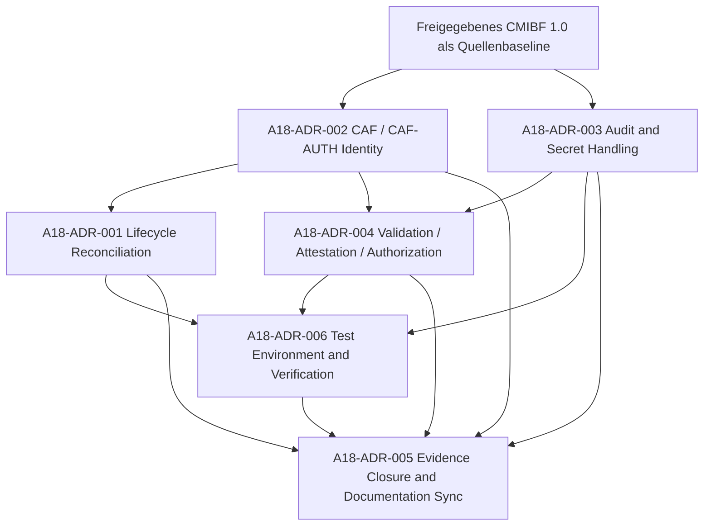

# Auftrag 18 – Architecture Decision Preparation (CADP) 1.0

## Dokumentidentität

| Feld | Wert |
|---|---|
| Projekt | Projekt Kontinuum |
| Auftrag | Auftrag 18 – Architekturentscheidungen vorbereiten |
| Dokument | `31_reports/auftrag_18_architecture_decision_preparation_report.md` |
| Datum | 2026-07-20 |
| Status | `COMPLETED_APPROVED` |
| Entscheidungshoheit | Raphael Maria Schatz |
| Berichtsfreigabe | erteilt durch Raphael Maria Schatz am 2026-07-20 |
| Freigabeumfang | Abnahme von Auftrag 18 und seiner Entscheidungsunterlagen; keine pauschale Einzel-ADR-, Implementierungs- oder Releasefreigabe |
| Normative Basis | freigegebenes CMIBF 1.0 Release, AFP, CAWP, CAMap, Canonical Glossary, Project Chronicle |
| Reviewbasis | Auftrag-17-Review 1.0 |
| Arbeitswirkung | ausschließlich Analyse, Architektur- und Governanceentwurf |
| Artefaktstatus | unverbindlicher Entscheidungsentwurf; kein Bestandteil der gültigen Architektur |

## Nichtwirkungserklärung

Dieses Dokument:

- implementiert keine Funktion;
- ändert kein Framework und keine Runtime-Komponente;
- ändert keine Tests, Registrierungen oder Konfigurationen;
- vergibt keine endgültigen Framework- oder ADR-IDs;
- ändert keine Versionsnummer und keinen Lifecycle-Status;
- führt keinen CAC-Lauf, keine Tests und keine Migration aus;
- erteilt aus sich heraus keine Einzel-ADR-, Implementierungs- oder Releasefreigabe;
- ersetzt oder verändert keine bestehende normative Quelle.

Die Begriffe `MUST`, `SHOULD` und `MAY` sind in diesem Bericht vorgeschlagene normative Anforderungen. Die Abnahme von Auftrag 18 macht sie noch nicht normativ. Sie werden erst durch Raphaels ausdrückliche Freigabe der jeweiligen Einzelentscheidung und ihre ordnungsgemäße Aufnahme in eine freigegebene CMIBF-Fassung verbindlich.

## Freigabevermerk

Raphael Maria Schatz hat Auftrag 18 und den vorliegenden CADP-Bericht am 2026-07-20 zur Abnahme freigegeben. Damit ist die Erstellung der Entscheidungsunterlagen abgeschlossen und darf versioniert werden.

Diese Berichtsfreigabe:

- bestätigt die Vollständigkeit der Architektur- und Governancevorbereitung;
- genehmigt die Ablage und Versionierung dieses Berichts;
- wählt noch keine der Entscheidungsoptionen als verbindliche Architektur;
- setzt keinen ADR auf `APPROVED`, `IMPLEMENTED` oder `VERIFIED`;
- ändert keine CMIBF-Version, kein Framework und keinen Lifecycle-Status;
- autorisiert keine Implementierung, Migration, Dokumentationssynchronisation oder Releasehandlung.

Die Kapitel 4 bis 8 enthalten ausschließlich vorgeschlagene Governanceartefakte. Decision Register, Versioning Policy, Rollback Policy, Impact-Matrizen und Dependency Graph sind Entwürfe beziehungsweise Kandidaten für eine künftige CMIBF-Revision. Sie beschreiben weder den gegenwärtig verbindlichen Architekturstand noch eine bereits beschlossene Zielversion. Insbesondere wird keine Aufnahme in CMIBF 1.1 vorweggenommen.

## Verbindliche Quellenbasis

Primäre normative Quelle dieses Auftrags ist ausschließlich:

- `14_documents/fundamentale Gedanken/CMIBF/cmibf_releases/CMIBF_1_0_20260712_170045/CANONICAL_MASTER_IMPLEMENTATION_BLUEPRINT_FRAMEWORK_1_0.md`

Ergänzend und nach Maßgabe des Auftrags verbindlich:

- `14_documents/ARCHITECTURE_GOVERNANCE_FRAMEWORK_1_0.md`
- `14_documents/CANONICAL_AI_WORKING_PROTOCOL_1_0.md`
- `14_documents/CANONICAL_ARCHITECTURE_MAP_1_0.md`
- `14_documents/CANONICAL_GLOSSARY_1_0.md`
- `14_documents/CANONICAL_HISTORY_INDEX_1_0.md`
- `22_project_chronicle/PROJEKTCHRONIK_23.md`
- `31_reports/auftrag_17_framework_implementation_review_1_0.md`

Die nicht freigegebene CMIBF-Arbeitsfassung wird in diesem Auftrag nicht als normative Quelle verwendet.

# 1. Executive Summary

Auftrag 17 hat sechzehn vorhandene und fokussiert getestete Frameworkkomponenten festgestellt, zugleich aber eine nicht geschlossene Architektur-, Identitäts-, Daten-, Validierungs-, Evidenz- und Testumgebungs-Governance dokumentiert. Der Gesamtstatus bleibt `NO_GO`.

Auftrag 18 bereitet sechs Entscheidungen vor:

| ID | Entscheidung | Kernaussage der Empfehlung | Priorität |
|---|---|---|---|
| A18-ADR-001 | CMIBF Lifecycle Reconciliation | Vorhandene Implementierungen nur prospektiv als Übernahmekandidaten gegen zuvor freigegebene Architektur prüfen; keine rückwirkende Legitimierung. | P1 |
| A18-ADR-002 | CAF / CAF-AUTH Identity Resolution | `CAF` bleibt Canonical Agent Framework; `CAF-AUTH` bleibt Canonical Authentication Framework; stabile Framework-ID ist primärer Schlüssel. | P1 |
| A18-ADR-003 | Canonical Audit and Secret Handling Policy | Audit-/Review-Domäne und Rohquarantäne trennen; keine Rohprompts und keine secretabhängigen öffentlichen IDs. | P1 |
| A18-ADR-004 | Canonical Validation, Attestation and Authorization Semantics | Validierung, Evidenzprüfung, Attestation, Autorisierung und Ausführungszulassung strikt trennen. | P2 mit Sicherheitswirkung |
| A18-ADR-005 | Evidence Closure and Documentation Synchronization | Abschluss über ein versioniertes Evidence-Set; Doku-Sync erst nach Architektur- und Testabschluss. | P2 |
| A18-ADR-006 | Canonical Test Environment and Verification Strategy | Reproduzierbare, isolierte und vollständig identifizierte Testumgebung mit ehrlicher `BLOCKED`-Semantik. | P2/P3, releaseblockierend |

Die sechs Entscheidungen sind nicht unabhängig. Identity Resolution muss vor der endgültigen Lifecycle-Zuordnung abgeschlossen werden. Audit-/Secret-Regeln und Identity bilden Voraussetzungen der Attestierungs- und Autorisierungssemantik. Die Teststrategie muss die freigegebenen Verträge prüfen. Evidence Closure und Dokumentationssynchronisation bilden den letzten Schritt.

Dieses Dokument empfiehlt eine Freigabereihenfolge. Seine Berichtsfreigabe schließt Auftrag 18 ab, ersetzt aber keine separate Freigabe der sechs Einzelentscheidungen.

# 2. Bewertung jeder Entscheidung

## 2.1 Entscheidung 1 – CMIBF Lifecycle Reconciliation

### 2.1.1 Architekturziel

Ziel ist ein widerspruchsfreier, prospektiver und CAC-ableitbarer Zusammenhang zwischen:

- freigegebener CMIBF-Architektur;
- eindeutiger Frameworkidentität;
- Framework-Lifecycle;
- begrenztem Implementierungsprofil;
- tatsächlichem Implementierungsumfang;
- Verifikationsstatus;
- Releasefähigkeit;
- Evidence-Set.

Vorhandener Code soll weder ignoriert noch rückwirkend kanonisiert werden. Er soll als beobachteter, nicht normativer Übernahmekandidat behandelt werden, der erst nach einer vorausgehenden Architekturfreigabe auf Konformität geprüft werden kann.

### 2.1.2 Problemdefinition

Auftrag 17 stellt fest:

- CRL, MR, CAICF, API Learning Connector, CLPF und CDFX besitzen keine CMIBF-Framework-ID;
- CCP, CIF, CMLF, CEF, CHIF, CLMSF, CODEAF und CWF stehen in der freigegebenen Registry auf `PLANNED`;
- CPVF ist in der nicht freigegebenen Fortschreibung dokumentiert, nicht jedoch eindeutig in der freigegebenen CMIBF-1.0-Baseline verankert;
- Authentication ist in CMIBF als `CAF-AUTH / PLANNED` geführt, während aktive Folgeartefakte `CAF` verwenden;
- alle sechzehn Komponenten sind als Dienste in `KontinuumSystem` vorhanden;
- ein verfügbarer Validator oder Beobachtungsvertrag implementiert nicht zwingend den vollständigen Scope des namensgleichen Frameworks.

Eine direkte Statusanpassung würde Architektur aus vorhandener Implementierung ableiten. Das widerspricht AFP, CMIBF-CAG und CAVCC.

### 2.1.3 Architekturprinzipien

1. Single Source of Truth: Nur die freigegebene CMIBF-Fassung definiert Architektur.
2. Architecture First: Architekturfreigabe geht Implementierungsannahme voraus.
3. Prospective Conformance: Konformität wirkt erst ab erfolgreicher Prüfung und darf nicht rückdatiert werden.
4. Scope Truthfulness: Ein Teilmodul darf nicht den Status des Gesamtframeworks beanspruchen.
5. Stable Identity: Jede Komponente benötigt genau eine stabile kanonische Identität.
6. Explicit Lifecycle: Jeder Statuswechsel benötigt Ursache, Vorgängerstatus, Evidenz und Freigabe.
7. Deterministic Derivation: Registry, Dependency Graph und Statusmatrix werden durch CAC abgeleitet oder validiert.
8. Traceability by Design: Entscheidung, Blueprint, Profil, Code und Tests bleiben verbunden.
9. No Implicit Activation: Dokumentation oder Registrierung allein begründet keine Releasefähigkeit.

### 2.1.4 Normative Anforderungen

#### MUST

- Jede der sechzehn Komponenten MUST einer eindeutigen, freigegebenen Framework-ID oder einem ausdrücklich definierten Implementierungsprofil zugeordnet sein.
- Vorhandener Code MUST bis zur prospektiven Annahme als nicht normativer Übernahmekandidat behandelt werden.
- Architekturstatus, Framework-Lifecycle, Implementierungsumfang, Verifikation und Releasefähigkeit MUST unterscheidbar sein.
- Eine vorhandene Teilimplementierung MUST einen begrenzten Scope und Ausschlüsse deklarieren.
- Statusübergänge MUST zeitlich, sachlich und evidenzbezogen nachvollziehbar sein.
- Keine Reconciliation MUST einen früheren AFP-Verstoß rückwirkend in Konformität umdeuten.
- Dependencies MUST typisiert und gegen den Status der Zielkomponenten validiert werden.
- Der CAC MUST inkonsistente Identitäten, fehlende Referenzen und ungültige Statuskombinationen ablehnen.
- Releasefähigkeit MUST standardmäßig `false` bzw. nicht erteilt bleiben, bis alle Gates bestanden sind.

#### SHOULD

- Die Architektur SHOULD ein separates Implementierungsprofil pro begrenzter Realisierung verwenden.
- Reconciliation SHOULD frameworkweise und in Abhängigkeitsreihenfolge erfolgen.
- Bereits vorhandene Tests SHOULD als technische Evidenz übernommen, aber nicht als Architekturfreigabe interpretiert werden.
- Nicht angenommene Kandidaten SHOULD kontrolliert deaktiviert, ersetzt oder historisiert werden; dies benötigt einen späteren Auftrag.

#### MAY

- Ein vorhandener Implementierungskandidat MAY nach vollständiger Architektur- und Konformitätsprüfung unverändert angenommen werden.
- Mehrere Implementierungsprofile MAY dasselbe Framework realisieren, wenn Scope, Identität und Zuständigkeiten eindeutig bleiben.

### 2.1.5 Abhängigkeiten

| Abhängigkeit | Bedeutung |
|---|---|
| CMIBF | **Tatsache:** Die freigegebene Fassung definiert Identitäten, Lifecycle, Profile, Dependencies und Zielstatus. |
| CAC | **Empfehlung:** CAC soll nach einer Freigabe Registry, Statusmatrix und Dependency-Nachweise ableiten bzw. inkonsistente Zustände verweigern. |
| CAMap | **Empfehlung:** CAMap soll nur einen zuvor freigegebenen Zielstand und seine Schichten abbilden. |
| CAWP | **Tatsache:** CAWP verlangt die transparente Trennung von Befund, Annahme, Freigabe und Implementierung. |
| Bestehende Frameworks | Alle Aufträge 01–16 sowie ihre Konsumenten und `KontinuumSystem` sind betroffen. |

Zwingende Entscheidungsabhängigkeit: A18-ADR-002 muss vor der abschließenden Identitätszuordnung dieser Entscheidung geklärt sein.

### 2.1.6 Auswirkungen

| Dimension | Auswirkung |
|---|---|
| Architektur | Einführung eines präzisen Reconciliation- und Profilmodells innerhalb einer später freigegebenen CMIBF-Revision. |
| Governance | Keine nachträgliche Legitimierung; jeder Kandidat benötigt eigenständige Bewertung und Raphael-Freigabe. |
| Sicherheit | Nicht freigegebene Komponenten dürfen keine zusätzlichen Consumer oder Befugnisse erhalten. |
| Dokumentation | Statusaussagen werden erst nach der Entscheidung und Verifikation synchronisiert. |
| Teststrategie | Zuordnungs-, Scope-, Dependency-, Status- und Konformitätstests erforderlich. |
| Runtime | Diese Entscheidung ändert keine Runtime; spätere Annahme oder Deaktivierung benötigt eigenen Auftrag. |
| Erweiterbarkeit | Künftige Legacy-Übernahmen werden kontrollierbar, ohne den normalen AFP-Weg zu ersetzen. |

### 2.1.7 Risikoanalyse

| Zeitraum | Risiken |
|---|---|
| Kurzfristig | Release bleibt blockiert; Statusanzeigen und Dokumente bleiben erklärungsbedürftig. |
| Mittelfristig | Unvollständige Profile könnten als vollständige Frameworkimplementierung missverstanden werden; Dependency-Fehler können erst bei CAC-Validierung sichtbar werden. |
| Langfristig | Ein zu großzügiger Übernahmepfad könnte zum Präzedenzfall für Implementation First werden und AFP aushöhlen. |

### 2.1.8 Entscheidungsoptionen

| Option | Vorteile | Nachteile | Risiken |
|---|---|---|---|
| A – Direkte Statusanpassung | Schnell, geringer initialer Aufwand. | Keine unabhängige Architektur- oder Scopeprüfung. | Rückwirkende Legitimierung, Scope-Inflation, CAC-Umgehung. |
| B – Vollständiger Rückzug und Neuimplementierung | Strengste AFP-Konformität, klarer Neustart. | Hoher Aufwand und mögliche Betriebsfolgen. | Verlust nutzbarer Arbeit, unnötige Migration, Deaktivierungsrisiken. |
| C – Prospektive kontrollierte Übernahme | Bewahrt AFP, nutzt vorhandene technische Arbeit nach Prüfung, bildet Teilimplementierungen ehrlich ab. | Höherer Governance- und Evidenzaufwand. | Fehlklassifikation von Kandidaten, wenn Scope oder Dependencies unvollständig sind. |

### 2.1.9 Empfehlung

Empfohlen wird Option C.

Sie entspricht CMIBF-CAG, CAVCC und CALERM, weil sie die bestehende technische Realität als Prüfgegenstand behandelt, ohne daraus normative Architektur abzuleiten. Die frühere Implementierung bleibt historischer Befund. Erst eine neue, prospektive Entscheidung kann den Kandidaten gegen freigegebene Architektur prüfen und gegebenenfalls ab diesem Zeitpunkt annehmen.

### 2.1.10 Freigabekriterien

Raphael darf diese Architekturentscheidung freigeben, wenn:

- A18-ADR-002 beschlossen ist;
- alle sechzehn Zielidentitäten oder Profile vollständig benannt und abgegrenzt sind;
- feststeht, dass keine Rückdatierung oder rückwirkende Konformität erfolgt;
- Dependencies und Zielstatus fachlich vollständig vorliegen;
- der Umgang mit abgelehnten oder nur teilweise konformen Kandidaten geregelt ist;
- CAC-Verweigerungsbedingungen definiert sind;
- Releasefähigkeit ausdrücklich außerhalb dieser Entscheidung bleibt.

### 2.1.11 Implementierungsvoraussetzungen

Bevor ein späterer Implementierungsauftrag entstehen darf, müssen:

1. die freigegebene Architekturrevision veröffentlicht sein;
2. CAC-Ableitungen oder ein formal akzeptierter CAC-Blocker vorliegen;
3. für jede Komponente ein Scope- und Dependency-Mapping existieren;
4. A18-ADR-003, A18-ADR-004 und A18-ADR-006 soweit betroffen freigegeben sein;
5. ein Evidence-Set und ein Rollback-/Deaktivierungsplan vorliegen;
6. ein separater, frameworkbezogener Auftrag mit eindeutiger Änderungsfläche erteilt werden.

## 2.2 Entscheidung 2 – CAF / CAF-AUTH Identity Resolution

### 2.2.1 Architekturziel

Ziel ist eine dauerhafte, nicht mehrdeutige und maschinenlesbar sichere Identität für Agenten- und Authentication-Architektur.

Kanonisches Zielbild:

| Framework-ID | Kürzel | Kanonischer Name |
|---|---|---|
| `PK-FW-AGENT-003` | `CAF` | Canonical Agent Framework |
| `PK-FW-SEC-002` | `CAF-AUTH` | Canonical Authentication Framework |

Die Framework-ID ist primärer Referenzschlüssel. Das Kürzel dient der menschlichen Lesbarkeit und darf keine Sicherheitsentscheidung tragen.

### 2.2.2 Problemdefinition

Die freigegebene CMIBF-Registry reserviert `CAF` für das Canonical Agent Framework und `CAF-AUTH` für Authentication. Die Authentication-Folgedokumente, Konfiguration und Implementierung verwenden jedoch `CAF`. CODEAF verwendet `CAF` fachlich teilweise im Sinn von Authentication, während die Registry-Dependency auf das Agent Framework zeigt.

Damit sind Name, Dependency und Sicherheitsbedeutung mehrdeutig. Eine ungezielte Umbenennung oder globale Ersetzung könnte den Fehler vergrößern.

### 2.2.3 Architekturprinzipien

1. Unique Canonical Identity.
2. Stable Framework ID.
3. Human-readable Acronym is not an authorization token.
4. Semantic Dependency Resolution statt Textsubstitution.
5. Historical Continuity ohne aktive Aliasmehrdeutigkeit.
6. Authentication ist von Agentenstandard und Autorisierung getrennt.
7. Fail Closed bei mehrdeutiger Identität.

### 2.2.4 Normative Anforderungen

#### MUST

- `PK-FW-AGENT-003` MUST `CAF / Canonical Agent Framework` bezeichnen.
- `PK-FW-SEC-002` MUST `CAF-AUTH / Canonical Authentication Framework` bezeichnen.
- Maschinenlesbare Dependencies MUST primär Framework-IDs verwenden.
- Aktive Authentication-Artefakte MUST nach einer späteren Migration `CAF-AUTH` verwenden.
- `CAF` MUST in aktiven Resolvern nicht als Authentication-Alias auflösbar sein.
- Jede bestehende `CAF`-Referenz MUST semantisch klassifiziert werden, bevor sie geändert wird.
- Historische Nachweise MUST erhalten bleiben und MAY nur durch Korrektur-/Successorhinweise ergänzt werden.
- Kein Frameworkname oder Kürzel MUST als Identitäts-, Authentisierungs- oder Autorisierungsnachweis akzeptiert werden.
- Mehrdeutige Referenzen MUST durch CAC bzw. Validatoren abgelehnt werden.

#### SHOULD

- CODEAF SHOULD getrennte Dependencies für Agent Framework und Authentication ausweisen.
- Deprecation-Hinweise SHOULD die frühere Authentication-Verwendung von `CAF` auffindbar halten, ohne sie aktiv aufzulösen.
- Serialisierte Referenzen SHOULD eine Schema- und Identity-Version tragen.

#### MAY

- Ein kontrollierter Leseadapter MAY historische Authentication-Labels erkennen, wenn er sie ausschließlich als Legacy-Befund meldet und keine aktive Auflösung vornimmt.

### 2.2.5 Abhängigkeiten

| Abhängigkeit | Bedeutung |
|---|---|
| CMIBF | **Tatsache:** Die freigegebene Fassung enthält beide stabilen IDs und die erste kanonische Kürzelzuordnung. |
| CAC | **Empfehlung:** CAC soll nach einer Freigabe Eindeutigkeit prüfen und eindeutige Registry-/Dependency-Artefakte erzeugen. |
| CAMap | **Empfehlung:** CAMap soll Agenten- und Security-Komponente getrennt darstellen. |
| CAWP | **Tatsache:** CAWP verlangt klare, nicht irreführende Referenzen und offene Legacygrenzen. |
| Bestehende Frameworks | CAF Agent, CAF-AUTH, CODEAF, CLMSF, CSPST, CWF, CAIM, CIM und alle weiteren CAF-Konsumenten. |

Diese Entscheidung ist Vorgänger von A18-ADR-001 und A18-ADR-004.

### 2.2.6 Auswirkungen

| Dimension | Auswirkung |
|---|---|
| Architektur | Beseitigt die Namenskollision und typisiert Agenten- und Security-Dependencies. |
| Governance | Erfordert kontrollierte Referenzinventur und Raphael-Freigabe. |
| Sicherheit | Verhindert, dass Agentenstandard und Authentication-Nachweis verwechselt werden. |
| Dokumentation | Aktive Dokumente müssen später zielgerichtet, historische nur append-only korrigiert werden. |
| Teststrategie | Identity-, Alias-, Resolver-, Dependency- und negative Securitytests. |
| Runtime | Keine Änderung in Auftrag 18; spätere Migration kann Kompatibilitätsadapter benötigen. |
| Erweiterbarkeit | Stabile IDs erlauben weitere Security- und Agentenframeworks ohne Kürzelkollision. |

### 2.2.7 Risikoanalyse

| Zeitraum | Risiken |
|---|---|
| Kurzfristig | Menschen und Tools interpretieren `CAF` weiterhin unterschiedlich. |
| Mittelfristig | Unvollständige Migration erzeugt parallele IDs oder fehlerhafte Dependencies. |
| Langfristig | Ein Legacyalias könnte dauerhaft sicherheitskritische Mehrdeutigkeit erhalten. |

### 2.2.8 Entscheidungsoptionen

| Option | Vorteile | Nachteile | Risiken |
|---|---|---|---|
| A – Authentication übernimmt `CAF-AUTH` | Entspricht freigegebenem CMIBF; geringste normative Änderung. | Spätere kontrollierte Migration aktiver Folgeartefakte nötig. | Unvollständige Referenzmigration. |
| B – Authentication behält `CAF`, Agent Framework wird umbenannt | Entspricht aktuellen Authentication-Folgeartefakten. | Verändert die erste CMIBF-Reservierung und Agentenarchitektur. | Größere Migration und Governance-Verstoß. |
| C – Beide behalten `CAF`, nur IDs unterscheiden | Weniger sichtbare Änderungen. | Menschlich und dokumentarisch dauerhaft mehrdeutig. | Fehlauflösung in Logs, Aufträgen und Sicherheitsbeziehungen. |

### 2.2.9 Empfehlung

Empfohlen wird Option A.

Die freigegebene CMIBF-Version enthält bereits die eindeutige Zielidentität. Der notwendige spätere Eingriff liegt deshalb in der kontrollierten Angleichung der abgeleiteten und implementierten Artefakte, nicht in einer neuen Namensentscheidung gegen die CMIBF-Registry.

### 2.2.10 Freigabekriterien

Raphael darf diese Entscheidung freigeben, wenn:

- beide Zielidentitäten ausdrücklich bestätigt sind;
- die Framework-ID als primärer Resolver-Schlüssel festgelegt ist;
- historische `CAF`-Authentication-Verweise nicht aktiv auflösbar bleiben;
- die semantische Einzelprüfung aller CAF-Verweise verbindlich ist;
- keine globale automatische Umbenennung vorgesehen ist.

### 2.2.11 Implementierungsvoraussetzungen

Vor einem späteren Implementierungsauftrag müssen:

1. ein vollständiges CAF-Referenzinventar vorliegen;
2. jede Referenz als Agent, Authentication, historisch oder unklar klassifiziert sein;
3. CMIBF- und CAC-Zielartefakte freigegeben sein;
4. Kompatibilitäts-, Deprecation- und Rückfallregeln beschlossen sein;
5. betroffene Tests und Consumer vollständig benannt sein;
6. Änderungen an Dokumentation, Konfiguration und Runtime getrennt beauftragt werden.

## 2.3 Entscheidung 3 – Canonical Audit and Secret Handling Policy

### 2.3.1 Architekturziel

Ziel ist ein projektweiter, komponentenübergreifender Datenvertrag, der Auditierbarkeit ermöglicht, ohne geheime oder unnötig sensible Inhalte zu persistieren, zu exportieren oder in öffentliche Identifikatoren einfließen zu lassen.

Das Zielmodell trennt:

- datensparsame Audit-/Review-Domäne;
- flüchtige Rohverarbeitung;
- optional separat freizugebende Quarantäne-Domäne;
- sichere kanonische Identifikatoren;
- Integritätsreferenzen innerhalb ihrer Schutzdomäne.

### 2.3.2 Problemdefinition

Auftrag 17 belegt:

- CRL persistiert den vollständigen Caller-Prompt als Eventinhalt;
- der API Learning Connector bildet `content_hash` und `source_id` vor Redaction aus Rohdaten;
- MR, CCP, CIF, CPVF, CHIF, CLPF und CWF besitzen keinen gemeinsamen Vertrag für caller-kontrollierte Hash- oder Auditgrundlagen;
- Größen-, Retention-, Datenklassifikations- und Secretregeln sind nicht projektweit vereinheitlicht.

Ein kryptographischer Hash eines Secrets ist nicht automatisch unkritisch. Er kann Gleichheit, Wiederverwendung oder Wörterbuchangriffe unterstützen.

### 2.3.3 Architekturprinzipien

1. Data Minimization.
2. Secrets are non-observable by default.
3. Domain Separation.
4. Least Privilege und Need to Know.
5. Explicit Retention.
6. Safe Identifier Contract.
7. Redaction before review or public identity derivation.
8. No raw-content logging.
9. Integrity evidence remains within its protection domain.
10. Keine automatische Altbestandsmigration.

### 2.3.4 Normative Anforderungen

#### MUST

- Secrets, Credentials, Tokens, Recovery-Daten und private Schlüssel MUST aus Audit-, Log-, Report- und öffentlichen ID-Feldern ausgeschlossen sein.
- Rohprompts und beliebige Caller-Inhalte MUST standardmäßig nicht persistent gespeichert werden.
- Öffentliche Review-, Source- und Correlation-IDs MUST aus einer versionierten, normalisierten und bereinigten Darstellung entstehen.
- Caller-gelieferte Referenzen MUST Typ-, Format- und Maximallängenprüfungen bestehen.
- Die Datenklassen `SECRET/CREDENTIAL`, `SENSITIVE_CONTENT`, `SAFE_IDENTIFIER` und `PUBLIC_CONTENT` MUST unterscheidbar sein.
- Redaction MUST vor Review-Handoff, Knowledge-Handoff und öffentlicher Identifierbildung erfolgen.
- Eine persistente Rohquarantäne MUST eine gesonderte Raphael-Freigabe, Zweckbindung, Zugriffspolitik, Verschlüsselung, Retention und Löschstrategie besitzen.
- Raw-Integrity-Material MUST die Quarantäne-Domäne nicht als öffentlicher Identifier verlassen.
- Auditfelder MUST allowlist-basiert definiert sein.
- Bestehende gespeicherte Daten MUST ohne gesonderten Auftrag weder durchsucht noch verändert oder gelöscht werden.

#### SHOULD

- Rohverarbeitung SHOULD flüchtig erfolgen.
- Audit SHOULD Ergebniscode, Policy-Version, Datenklasse, Redaction-Anzahl und sichere Referenz statt Inhalt speichern.
- Identifier SHOULD Domain Separation und Schema-/Policy-Version enthalten.
- Retention SHOULD so kurz wie fachlich möglich sein.
- Fehlermeldungen SHOULD keine verworfenen sensitiven Eingaben spiegeln.

#### MAY

- Geschützte Quarantäne MAY für ausdrücklich genehmigte forensische oder Provenienzfälle verwendet werden.
- Opaque Zufallsreferenzen MAY anstelle inhaltsbasierter IDs genutzt werden, wenn Deduplizierung nicht erforderlich ist.

### 2.3.5 Abhängigkeiten

| Abhängigkeit | Bedeutung |
|---|---|
| CMIBF | **Empfehlung:** Eine spätere freigegebene Fassung soll die projektweite Audit-, Datenklassifikations- und Schutzdomänenregel definieren. |
| CAC | **Empfehlung:** CAC soll daraus Schemas, verbotene Felder, Limits und Validierungsregeln ableiten. |
| CAMap | **Empfehlung:** CAMap soll zulässige Datenflüsse und Domänengrenzen zeigen. |
| CAWP | **Tatsache:** CAWP begrenzt die Wiederholung oder unmarkierte Übernahme sensibler Inhalte in KI-Berichte. |
| Bestehende Frameworks | Primär CRL und API Learning Connector; zusätzlich MR, CCP, CIF, CPVF, CHIF, CLPF, CWF und gemeinsame Storage-/Auditpfade. |

Diese Entscheidung ist Vorgänger von A18-ADR-004 und Voraussetzung für die sichere Evidenzbildung in A18-ADR-005.

### 2.3.6 Auswirkungen

| Dimension | Auswirkung |
|---|---|
| Architektur | Gemeinsamer Daten- und Auditvertrag statt komponentenspezifischer Ad-hoc-Regeln. |
| Governance | Retention, Quarantäne und Altbestandsbehandlung benötigen explizite Verantwortung. |
| Sicherheit | Reduziert Secret-Leakage, Korrelation und unbeabsichtigte Backup-Persistenz. |
| Dokumentation | Datenklassen, erlaubte Auditfelder und Grenzen müssen später synchronisiert werden. |
| Teststrategie | Negative Secret-, Größen-, Hash-, Redaction- und Persistenztests. |
| Runtime | Auftrag 18 ändert nichts; spätere CRL-/API-Anpassungen sind sicherheitsrelevant. |
| Erweiterbarkeit | Einheitliches Pflichtprofil für künftige Connectoren, Agenten und Validatoren. |

### 2.3.7 Risikoanalyse

| Zeitraum | Risiken |
|---|---|
| Kurzfristig | Weitere CRL-Ereignisse können sensible Prompts enthalten; secretabhängige API-IDs können weitergegeben werden. |
| Mittelfristig | Änderung der ID-Grundlage kann Referenzen und Deduplizierung beeinflussen; Quarantäne kann zur Schattenablage werden. |
| Langfristig | Ohne zentrale Policy entstehen neue uneinheitliche Logging- und Retentionregeln sowie dauerhafte sensible Korrelationen. |

### 2.3.8 Entscheidungsoptionen

| Option | Vorteile | Nachteile | Risiken |
|---|---|---|---|
| A – Redaction vor jeder Nutzung, keine Rohquarantäne | Einfach, datensparsam, gut testbar. | Exakte Rohintegrität und Reproduktion nicht möglich. | Fachliche Provenienzanforderungen könnten später fehlen. |
| B – Getrennte Audit- und Quarantänedomänen, Quarantäne standardmäßig aus | Gute Balance zwischen Minimierung, Integrität und Erweiterbarkeit. | Höherer Policy- und Zugriffsaufwand. | Fehlkonfiguration der Domänengrenze. |
| C – Grundsätzlich verschlüsseltes Roharchiv | Maximale spätere Reproduzierbarkeit. | Große Angriffsfläche, Schlüssel- und Löschkomplexität. | Langfristige Secret- und Datenschutzbelastung. |

### 2.3.9 Empfehlung

Empfohlen wird Option B mit flüchtiger Rohverarbeitung als Standard und persistenter Quarantäne nur nach gesonderter Freigabe.

Diese Option erhält notwendige Erweiterbarkeit, ohne Rohdatenhaltung als Normalfall zu etablieren. Sie trennt öffentliche Traceability von sensibler Integritätsevidenz und behebt sowohl CRL-Rohpersistenz als auch secretabhängige API-IDs auf derselben Architekturgrundlage.

### 2.3.10 Freigabekriterien

Raphael darf diese Entscheidung freigeben, wenn:

- Datenklassen und erlaubte Auditfelder vollständig definiert sind;
- entschieden ist, ob und wann persistente Quarantäne zulässig ist;
- Zugriff, Retention, Löschung und Incident-Behandlung geklärt sind;
- die öffentliche Identifiergrundlage festgelegt ist;
- der Altbestand ausdrücklich von automatischer Prüfung oder Migration ausgeschlossen bleibt.

### 2.3.11 Implementierungsvoraussetzungen

Vor einem späteren Implementierungsauftrag müssen:

1. CMIBF-Policy und CAC-Schemas freigegeben sein;
2. ein Datenfluss- und Schutzdomänenmodell vorliegen;
3. negative Securitytests spezifiziert sein;
4. ID-Versionierung und Kompatibilitätsstrategie beschlossen sein;
5. Codeänderung und eventuelle Datenuntersuchung getrennt beauftragt sein;
6. Produktionsdaten und Backups ohne eigene Freigabe unangetastet bleiben.

## 2.4 Entscheidung 4 – Canonical Validation, Attestation and Authorization Semantics

### 2.4.1 Architekturziel

Ziel ist ein eindeutiger, typisierter Entscheidungsvertrag, der folgende Ebenen strikt trennt:

1. Structural Validation;
2. Policy Match;
3. Evidence Assessment;
4. Attestation;
5. Authorization Decision;
6. Execution Admission.

Kein Ergebnis einer niedrigeren Ebene darf automatisch die Autorität einer höheren Ebene erhalten.

### 2.4.2 Problemdefinition

CODEAF kann Gates aufgrund nicht leerer caller-gelieferter Felder als `passed` markieren. CWF kann aus caller-gelieferten Rollen, Approvals und Capabilities `allowed=True` ableiten. Beide führen zwar nicht aus, ihre Felder können aber von zukünftigen Consumern als Freigabe missverstanden werden.

Zusätzlich:

- CWF mischt aktuelle Uhrzeit in semantische Resultate;
- Capability-Registry-Fehler werden als leere Registry behandelt;
- CRL nennt Quellverfügbarkeit `evidence`, ohne Inhalts- oder Claimprüfung;
- CAF-AUTH erzeugt nur nicht attestierte Beobachtungen.

### 2.4.3 Architekturprinzipien

1. Separation of Decision Authority.
2. Validation is not authorization.
3. Caller assertion is not attestation.
4. Deny by default and fail closed.
5. Evidence maturity is explicit.
6. Deterministic semantic results.
7. Time and provenance metadata are separated from semantics.
8. Registry failure is not an empty valid registry.
9. Authorization is scoped and purpose-bound.
10. Execution requires fresh enforcement.

### 2.4.4 Normative Anforderungen

#### MUST

- Structural Validation MUST ausschließlich Struktur- und lokale Regelkonformität aussagen.
- Policy Match MUST als nicht autoritativ gekennzeichnet sein.
- Evidence Assessment MUST Verfügbarkeit, Inspektion und Claim-Support unterscheiden.
- Attestation MUST einen akzeptierten Issuer, Trust Domain, Subject, Scope, Policy-Version, Gültigkeit und Widerrufszustand enthalten.
- Caller-gelieferte Identity-, Role-, Approval- oder Capability-Werte MUST als `UNATTESTED` gelten.
- Authorization MUST Subject, Action, Resource, Scope, Kontext, Policy und Attestationen binden.
- Autorisierungsergebnisse MUST mindestens `PERMIT`, `DENY` und `INDETERMINATE` unterscheiden.
- `DENY` und `INDETERMINATE` MUST beide jede Ausführung verhindern.
- Execution Admission MUST unmittelbar vor Ausführung durch einen zuständigen Enforcement Point erfolgen.
- Semantische Validierung MUST bei identischen Eingaben und identischem Evaluationskontext deterministisch sein.
- Aktuelle Zeit MUST injiziert oder als getrennte Provenienzmetadaten geführt werden.
- Registryzustände MUST `AVAILABLE`, `EMPTY`, `UNAVAILABLE`, `INVALID` und `CALLER_SUPPLIED` unterscheiden.
- Sicherheits- und Autorisierungspfade MUST bei Registryfehler fail-closed reagieren.

#### SHOULD

- Ergebnisse SHOULD typisierte Statuswerte statt mehrdeutiger Booleans verwenden.
- Kompatibilitätsfelder wie `allowed` oder `passed` SHOULD nur in begrenzten Adaptern fortbestehen und niemals Autorität erteilen.
- Attestationen SHOULD kurzlebig, widerrufbar und an einen Zweck gebunden sein.
- Policy Decision und Execution Admission SHOULD auditierbar, aber datensparsam sein.

#### MAY

- Nicht operative Discovery MAY Warnungen statt Fehlern liefern, wenn das Ergebnis ausdrücklich keine Ausführungswirkung besitzt.
- Ein zentraler Autorisierungsdienst MAY später entworfen werden; er ist nicht Teil dieser Entscheidung.

### 2.4.5 Abhängigkeiten

| Abhängigkeit | Bedeutung |
|---|---|
| CMIBF | **Empfehlung:** Eine spätere freigegebene Fassung soll Rollen, Semantik, Autoritäten und Verträge definieren. |
| CAC | **Empfehlung:** CAC soll daraus getrennte Schemas und Validierungsregeln ableiten. |
| CAMap | **Empfehlung:** CAMap soll Validator, Attester, Policy Decision Point und Enforcement Point getrennt darstellen. |
| CAWP | **Tatsache:** CAWP verlangt genaue Aussagen über Prüftiefe, Unsicherheit und Autorität. |
| Bestehende Frameworks | CODEAF, CWF, CAF-AUTH und CRL primär; CRE, Execution Planner, Orchestrator, Release Integrity und Tools als Consumer. |

Zwingende Vorgänger: A18-ADR-002 und A18-ADR-003.

### 2.4.6 Auswirkungen

| Dimension | Auswirkung |
|---|---|
| Architektur | Ersetzt mehrdeutige Gate-/Allowed-Semantik durch geschichtete Verträge. |
| Governance | Legt fest, wer welche Art von Entscheidung treffen darf. |
| Sicherheit | Verhindert Rechtegewinn aus Callerbehauptungen oder Registrydegradation. |
| Dokumentation | Begriffe und Feldsemantik müssen später in CODEAF, CWF, CAF-AUTH und CRL synchronisiert werden. |
| Teststrategie | Negative Attestation-, Scope-, Expiry-, Revocation-, Registry- und Determinismustests. |
| Runtime | Keine Verbindung zu operativen Consumern, bis alle Verträge freigegeben und validiert sind. |
| Erweiterbarkeit | Gemeinsame Grundlage für spätere Policy- und Enforcement-Komponenten. |

### 2.4.7 Risikoanalyse

| Zeitraum | Risiken |
|---|---|
| Kurzfristig | Aktuelle positive Booleans können falsch gelesen werden. |
| Mittelfristig | Adapter können alte und neue Semantik vermischen; Trust Domains oder Issuer können unvollständig definiert sein. |
| Langfristig | Ohne klare Schichtung kann deklarative Prüfung unbemerkt zur Sicherheitsautorität werden. |

### 2.4.8 Entscheidungsoptionen

| Option | Vorteile | Nachteile | Risiken |
|---|---|---|---|
| A – Nur Feldnamen entschärfen | Kleine spätere Änderung, reduziert direkte Fehlinterpretation. | Attestation, Evidence, Zeit und Registryfehler bleiben ungelöst. | Scheinsicherheit durch kosmetische Korrektur. |
| B – Mehrschichtiger Vertrag | Vollständig, sicher, testbar und erweiterbar. | Höherer Architektur- und Migrationsaufwand. | Komplexität bei unklarer Authority-Zuordnung. |
| C – Sofort zentraler Autorisierungsdienst | Einheitlicher operativer Punkt. | Neue Runtime und neues Framework-/Komponentendesign erforderlich. | Scope-Überschreitung und verfrühte Kopplung. |

### 2.4.9 Empfehlung

Empfohlen wird Option B.

Nur die vollständige Schichtung beseitigt gleichzeitig die CODEAF-/CWF-Mehrdeutigkeit, den CRL-Evidenzfehler, die CAF-AUTH-Attestationsgrenze, die CWF-Zeitabhängigkeit und die stille Registrydegradation. Ein zentraler Autorisierungsdienst ist weder notwendig noch in Auftrag 18 zulässig.

### 2.4.10 Freigabekriterien

Raphael darf diese Entscheidung freigeben, wenn:

- alle sechs Ebenen und ihre zulässigen Aussagen bestätigt sind;
- Issuer, Trust Domains und Autorisierungsautorität benannt sind;
- `DENY`/`INDETERMINATE`-Semantik und fail-closed akzeptiert sind;
- Zeit-, Registry- und Evidenzstatus vollständig spezifiziert sind;
- feststeht, dass CODEAF und CWF keine Autorisierungsinstanzen sind.

### 2.4.11 Implementierungsvoraussetzungen

Vor einem späteren Implementierungsauftrag müssen:

1. A18-ADR-002 und A18-ADR-003 freigegeben sein;
2. CMIBF-Verträge und CAC-Schemas vorliegen;
3. alle operativen Consumer inventarisiert und bis zur Freigabe getrennt sein;
4. ein Kompatibilitätsmodell für alte Felder vorliegen;
5. negative Sicherheits- und Determinismustests vollständig definiert sein;
6. jede Runtime-Anbindung einen gesonderten Auftrag erhalten.

## 2.5 Entscheidung 5 – Evidence Closure and Documentation Synchronization

### 2.5.1 Architekturziel

Ziel ist ein atomarer, reproduzierbarer und freigabebezogener Abschlussgegenstand, der dieselbe Baseline für Architektur, CAC-Ableitungen, Implementierungsprofile, Tests, Dokumentation und Freigabe bindet.

Dokumentationssynchronisation ist ein nachgelagerter Ableitungsschritt. Sie darf keine Architektur erzeugen oder einen ungeklärten Zustand durch konsistente Formulierungen scheinbar legitimieren.

### 2.5.2 Problemdefinition

Auftrag 17 stellt fest:

- CAMap bildet das aktive Portfolio 01–16 nicht ab;
- History Index, Chronik und direkte Frameworkdokumente beschreiben mehrere aktive Komponenten weiterhin als Konzept ohne Runtime-Wirkung;
- Glossareinträge fehlen;
- Konfigurationen und Statusberichte widersprechen sich;
- ein Abschlussbericht der Implementierungsserie fehlt;
- wesentliche CRL-/Serienartefakte waren nicht Teil der überprüften Baseline;
- CRL unterscheidet Quellverfügbarkeit nicht von geprüfter Evidenz.

Es fehlt ein kanonischer Closure-Vertrag.

### 2.5.3 Architekturprinzipien

1. Evidence before closure.
2. One baseline per closure decision.
3. Documentation is derived, not normative by itself.
4. Evidence maturity is explicit.
5. Append-only history.
6. Atomic synchronization.
7. No green status with blocked mandatory evidence.
8. Reproducibility from clean baseline.
9. Separation of current truth and historical truth.

### 2.5.4 Normative Anforderungen

#### MUST

- Jeder Abschluss MUST ein eindeutig versioniertes Evidence-Set besitzen.
- Das Evidence-Set MUST CMIBF-Version, CAC-Version/-Status, ADRs, Frameworkidentitäten, Profile, Implementierungsbaseline, Testumgebung, Testresultate, Ausnahmen und Freigaben binden.
- Evidence MUST Verfügbarkeit, Inspektion und Claim-Support getrennt ausweisen.
- Fehlende oder blockierte Pflichtevidenz MUST Closure verhindern.
- Dokumentationssynchronisation MUST nach Architekturentscheidung, CAC-Ableitung und Verifikation erfolgen.
- CAMap, Glossar, History, Chronik, Frameworkdokumente und Statusartefakte MUST gegen dieselbe Baseline geprüft werden.
- Historische Chronik- und Releaseaussagen MUST unverändert erhalten bleiben.
- Korrekturen MUST als neue datierte Einträge oder Successor-/Superseded-Verweise erfolgen.
- Ein Abschlussbericht MUST Tatsachen, Annahmen, Entscheidungen, Blocker und nicht ausgeführte Prüfungen unterscheiden.
- Ein Evidence-Set MUST die Audit-/Secret-Regeln aus A18-ADR-003 einhalten.

#### SHOULD

- Das Evidence-Set SHOULD maschinenlesbaren Kern und menschenlesbare Zusammenfassung besitzen.
- Dokumentationssync SHOULD aus CAC-Artefakten oder einer explizit freigegebenen Ableitungsmatrix erfolgen.
- Cross-document-Prüfungen SHOULD automatisierbar sein.
- Abschlussartefakte SHOULD isoliert und reproduzierbar versioniert werden.

#### MAY

- Eine vorläufige Closure MAY den Status `BLOCKED` oder `PARTIAL` tragen, darf aber keine Freigabe oder vollständige Konformität behaupten.

### 2.5.5 Abhängigkeiten

| Abhängigkeit | Bedeutung |
|---|---|
| CMIBF | **Empfehlung:** Eine spätere freigegebene Fassung soll Closure-Gate, Pflichtartefakte und normative Baseline definieren. |
| CAC | **Empfehlung:** CAC soll Registry, Maps, Matrizen und Evidence-Metadaten erzeugen oder validieren. |
| CAMap | **Empfehlung:** CAMap soll erst nach Zielarchitektur und Dependency-Abschluss synchronisiert werden. |
| CAWP | **Tatsache:** CAWP verlangt Transparenz, Traceability und klare Abschlusskommunikation. |
| Bestehende Frameworks | Alle Aufträge 01–16 und ihre Dokumente, Statusberichte, Konfigurationen und Tests. |

Zwingende Vorgänger: A18-ADR-001 bis A18-ADR-004 und die Verifikation nach A18-ADR-006.

### 2.5.6 Auswirkungen

| Dimension | Auswirkung |
|---|---|
| Architektur | Etabliert Closure als prüfbaren Architekturschritt. |
| Governance | Keine Abschluss- oder Releasebehauptung ohne vollständige Pflichtevidenz. |
| Sicherheit | Evidence-Sets dürfen keine Secrets oder Rohinhalte enthalten. |
| Dokumentation | Zentrale und frameworkbezogene Dokumente werden atomar gegen eine Baseline synchronisiert. |
| Teststrategie | Schema-, Link-, Hash-, Baseline-, Semantik- und Reproduktionstests. |
| Runtime | Keine direkte Wirkung; Runtimezustand wird nur belegt, nicht verändert. |
| Erweiterbarkeit | Wiederverwendbares Closure-Muster für spätere Frameworkserien. |

### 2.5.7 Risikoanalyse

| Zeitraum | Risiken |
|---|---|
| Kurzfristig | Dokumente bleiben bis zum Abschluss widersprüchlich; voreiliger Sync könnte falsche Wahrheit festschreiben. |
| Mittelfristig | Evidence-Set kann unvollständig oder zu groß werden; Baseline und Dokumente können auseinanderlaufen. |
| Langfristig | Ohne automatisierbare Ableitung kehrt Dokumentationsdrift wieder; Historie könnte durch rückwirkende Korrektur verfälscht werden. |

### 2.5.8 Entscheidungsoptionen

| Option | Vorteile | Nachteile | Risiken |
|---|---|---|---|
| A – Einmalige manuelle Synchronisation | Schnell und einfach verständlich. | Keine dauerhafte Closure- oder Ableitungslogik. | Wiederkehrende Drift und menschliche Fehler. |
| B – Versioniertes Evidence-Set mit kontrolliertem Doku-Sync | Reproduzierbar, auditierbar, erweiterbar. | Höherer Schema- und Prozessaufwand. | Unvollständige Pflichtfelder oder fehlerhafte Baselinebindung. |
| C – Dokumentationsfreeze mit Caveat | Keine voreiligen Änderungen. | Problem bleibt offen; kein Abschluss. | Caveat wird dauerhaft und verdeckt operative Wahrheit. |

### 2.5.9 Empfehlung

Empfohlen wird Option B.

Sie entspricht CMIBF-CAG, CAVCC, CALERM und CAWP-Traceability. Der Evidence-Set-Ansatz verhindert, dass einzelne Dokumente unabhängig voneinander den Status definieren. Gleichzeitig bleibt die Chronik historisch unverändert.

### 2.5.10 Freigabekriterien

Raphael darf diese Entscheidung freigeben, wenn:

- Pflichtfelder und Statussemantik des Evidence-Sets vollständig sind;
- feststeht, welche Dokumente abgeleitet und welche append-only sind;
- der Umgang mit fehlenden, ungetrackten oder widersprechenden Artefakten geregelt ist;
- Secret- und Datenschutzgrenzen bestätigt sind;
- Doku-Sync ausdrücklich als letzter Schritt festgelegt ist.

### 2.5.11 Implementierungsvoraussetzungen

Vor einem späteren Dokumentations- oder Toolauftrag müssen:

1. A18-ADR-001 bis A18-ADR-004 freigegeben sein;
2. Verifikation nach A18-ADR-006 belastbare Ergebnisse liefern;
3. eine freigegebene CMIBF-/CAC-Baseline existieren;
4. ein exaktes Artefaktinventar und eine Sync-Matrix vorliegen;
5. History-/Chronik-Schutzregeln feststehen;
6. Dokumentations-, Konfigurations- und Runtimeänderungen getrennt beauftragt werden.

## 2.6 Entscheidung 6 – Canonical Test Environment and Verification Strategy

### 2.6.1 Architekturziel

Ziel ist eine reproduzierbare, identifizierte, isolierte und auditierbare Testumgebung, in der ein Ergebnis unabhängig von impliziten Hostzuständen fachlich gleich bewertet werden kann.

Die Strategie muss fokussierte, angrenzende, Security-, Architektur- und Gesamttests unterscheiden und `PASS`, `FAIL`, `BLOCKED`, `NOT_RUN` sowie genehmigte Ausnahmen ehrlich abbilden.

### 2.6.2 Problemdefinition

Auftrag 17 belegt:

- 16 von 16 fokussierten Framework-Testeinstiegen bestanden;
- 11 ausgewählte angrenzende Regressionen bestanden;
- `test_auth_23.py` war wegen fehlendem `argon2` blockiert;
- vollständige Pytest-Collection endete ohne vollständiges Ergebnis;
- CWF war zunächst nicht als direkter Einstieg reproduzierbar;
- der Release-Starter bindet eine lokale Python-3.14-Installation;
- ein vollständiges, aktives Dependency-Lock- und Environment-Manifest ist nicht als gemeinsame kanonische Grundlage belegt.

Damit ist der fokussierte Teststand positiv, die vollständige Verifikationsaussage aber begrenzt.

### 2.6.3 Architekturprinzipien

1. Reproducible Environment.
2. Explicit Dependency Identity.
3. Test Isolation.
4. Result Honesty.
5. No productive side effects.
6. Bounded execution and timeouts.
7. Deterministic inputs.
8. Complete test inventory.
9. Environment evidence is part of test evidence.
10. Blocked is not passed.

### 2.6.4 Normative Anforderungen

#### MUST

- Jede kanonische Verifikation MUST eine Environment-ID und einen Fingerprint besitzen.
- Interpreter, Distribution, Version, Architektur, Betriebssystem und relevante Laufzeitparameter MUST dokumentiert sein.
- Direkte und transitive Dependencies MUST versioniert, integritätsgesichert und lizenzbezogen nachvollziehbar sein.
- Pflichtabhängigkeiten wie `argon2` MUST explizit im freigegebenen Testprofil enthalten sein.
- Tests MUST in einem isolierten Testroot ohne produktive Daten laufen.
- Netzwerkzugriff MUST standardmäßig deaktiviert oder ausdrücklich als eigenes Profil freigegeben sein.
- Schreibrechte MUST auf freigegebene temporäre Pfade begrenzt sein.
- Testresultate MUST `PASS`, `FAIL`, `BLOCKED`, `NOT_RUN` und `EXCLUDED_APPROVED` unterscheiden.
- Fehlende Dependency MUST `BLOCKED`, nicht `PASS`, erzeugen.
- Jedes Testprofil MUST ein explizites Testmanifest, Timeout und Suitebudget besitzen.
- Semantische Tests MUST kontrollierte Zeit, Zufall, Locale und Testdaten verwenden.
- Testberichte MUST Umgebung, Manifest, Resultat, Dauer, Blocker und Ausnahmen enthalten.

#### SHOULD

- Die Umgebung SHOULD lokal/offline reproduzierbar sein.
- Paketquellen und Hashes SHOULD vor Installation geprüft werden.
- Fokussierte Tests SHOULD vor angrenzenden und vollständigen Regressionen laufen.
- Testentdeckung SHOULD getrennt von Testausführung geprüft werden.
- Ein Environment Self-Check SHOULD jeder fachlichen Verifikation vorausgehen.
- Container oder Images SHOULD nur ergänzende Profile sein, solange Windows-/GUI-spezifische Pfade relevant sind.

#### MAY

- Mehrere freigegebene Plattformprofile MAY existieren, wenn ihre Unterschiede und erwarteten Ergebnisse dokumentiert sind.
- Ein unveränderliches Testimage MAY später als sekundäres Reproduktionsprofil verwendet werden.

### 2.6.5 Abhängigkeiten

| Abhängigkeit | Bedeutung |
|---|---|
| CMIBF | **Empfehlung:** Eine spätere freigegebene Fassung soll Verification Environment, Testprofile und Statussemantik definieren. |
| CAC | **Empfehlung:** CAC soll Testanforderungen und betroffene Regressionen aus freigegebenen Architekturänderungen ableiten. |
| CAMap | **Empfehlung:** CAMap soll die Beziehung zwischen Testumgebung, Frameworks und Release Integrity zeigen. |
| CAWP | **Tatsache:** CAWP verlangt die offene Meldung blockierter und nicht ausgeführter Prüfungen. |
| Bestehende Frameworks | Alle Aufträge 01–16, Auth, Foundation, CRE, Execution Planner, Orchestrator und Release Integrity. |

Die endgültige Testmatrix benötigt die freigegebenen Verträge aus A18-ADR-001 bis A18-ADR-004. Ihre Ergebnisse sind Vorgänger der Closure nach A18-ADR-005.

### 2.6.6 Auswirkungen

| Dimension | Auswirkung |
|---|---|
| Architektur | Verifikation wird an einen reproduzierbaren Environment-Vertrag gebunden. |
| Governance | Blockierte Pflichtprüfungen verhindern vollständige Freigabe. |
| Sicherheit | Testdaten-, Netzwerk- und Schreibisolation werden verbindlich. |
| Dokumentation | Environment-, Profil- und Ergebnisnachweise werden Bestandteil des Evidence-Sets. |
| Teststrategie | Klare Profile und stufenweise Ausführung statt unbestimmter Gesamtsuite. |
| Runtime | Keine produktive Wirkung; Paketinstallation oder Runneränderung benötigt eigenen Auftrag. |
| Erweiterbarkeit | Neue Frameworks deklarieren Dependencies, Profile und Regressionen von Anfang an. |

### 2.6.7 Risikoanalyse

| Zeitraum | Risiken |
|---|---|
| Kurzfristig | Auth-Regression bleibt blockiert und Full-Suite-Status unvollständig. |
| Mittelfristig | Host- und Paketdrift erzeugen nicht reproduzierbare Ergebnisse; Testprofile können auseinanderlaufen. |
| Langfristig | Ohne Lock- und Environment-Policy verlieren historische Zertifizierungen ihre Reproduzierbarkeit. |

### 2.6.8 Entscheidungsoptionen

| Option | Vorteile | Nachteile | Risiken |
|---|---|---|---|
| A – Aktuelle Hostumgebung dokumentieren | Geringer Aufwand, nahe am bestehenden Gate. | Nicht hermetisch, Paketdrift und Rechnerbindung. | Spätere Nichtreproduzierbarkeit. |
| B – Projektgebundene reproduzierbare Umgebung | Vollständig identifiziert, auditierbar, lokal reproduzierbar. | Packaging-, Lizenz- und Pflegeaufwand. | Unvollständiger Lock oder inkompatible Paketbasis. |
| C – Container/Image als alleinige Umgebung | Hohe Isolation und Reproduzierbarkeit. | Neue Toolchain, mögliche Abweichung von Windows-/GUI-Realität. | Grüne Containerergebnisse trotz Hostinkompatibilität. |

### 2.6.9 Empfehlung

Empfohlen wird Option B. Option C kann später als zusätzliches Profil dienen.

Nur eine projektgebundene Umgebung löst den dokumentierten `argon2`-Blocker, die implizite Hostabhängigkeit und die fehlende Gesamttest-Reproduzierbarkeit, ohne eine neue externe Betriebsplattform vorauszusetzen.

### 2.6.10 Freigabekriterien

Raphael darf diese Entscheidung freigeben, wenn:

- Interpreter- und Plattformprofile festgelegt sind;
- Dependency-, Hash-, Lizenz- und Offlinepolitik vollständig sind;
- Isolation, Netzwerk- und Schreibgrenzen bestätigt sind;
- Testprofile, Statussemantik, Timeouts und Suitebudgets feststehen;
- `BLOCKED` ausdrücklich keine grüne Freigabe erzeugt.

### 2.6.11 Implementierungsvoraussetzungen

Vor einem späteren Implementierungs- oder Installationsauftrag müssen:

1. Abhängigkeitsbeschaffung und Installation ausdrücklich autorisiert sein;
2. ein vollständiges, geprüftes Dependency-Manifest vorliegen;
3. Testroot und Produktionsdatentrennung feststehen;
4. ein Environment Self-Check spezifiziert sein;
5. die Testmanifeststruktur und Ergebnisformate freigegeben sein;
6. keine produktiven Tests oder Datenzugriffe implizit erlaubt werden.

# 3. Konsolidierte Empfehlungen

## 3.1 Gemeinsame Architekturentscheidung

Die sechs Vorlagen sollten als ein zusammenhängendes Governancepaket bewertet, aber einzeln freigegeben werden. Eine Teilfreigabe darf keine nachgelagerte Entscheidung implizit vorwegnehmen.

## 3.2 Empfohlene Reihenfolge

1. A18-ADR-002 – CAF / CAF-AUTH Identity Resolution.
2. A18-ADR-001 – CMIBF Lifecycle Reconciliation.
3. A18-ADR-003 – Canonical Audit and Secret Handling Policy.
4. A18-ADR-004 – Validation, Attestation and Authorization Semantics.
5. A18-ADR-006 – Canonical Test Environment and Verification Strategy.
6. A18-ADR-005 – Evidence Closure and Documentation Synchronization.

A18-ADR-003 kann fachlich parallel zu A18-ADR-001 vorbereitet werden. Seine Freigabe muss jedoch vor A18-ADR-004 und vor jeder Evidence-Set-Implementierung vorliegen.

## 3.3 Gemeinsame Sperrregeln

- Kein ADR in diesem Bericht gilt als genehmigt.
- Keine Empfehlung ändert die freigegebene CMIBF-1.0-Version.
- Keine spätere Implementierung darf mehrere ADRs stillschweigend in einem ungetrennten Auftrag umsetzen.
- Keine Dokumentationssynchronisation darf vor Architektur- und Testabschluss erfolgen.
- Kein blockierter Pflichttest darf als grüne Gesamtverifikation erscheinen.
- Keine vorhandene Implementierung darf allein aufgrund dieses Berichts den Status `APPROVED`, `IMPLEMENTED`, `VALIDATING` oder `STABLE` erhalten.

# 4. Vorgeschlagenes Architecture Decision Register (ADR) – Entwurf

> **Entwurfsstatus:** Dieser Abschnitt ist ein unverbindlicher Vorschlag für eine künftige CMIBF-Revision. Er erzeugt kein aktives Register, vergibt keine permanente ID und setzt keinen Status.

## 4.1 Zweck

Das vorgeschlagene Architecture Decision Register soll nach einer gesonderten Freigabe als konzeptioneller, zentraler Index wesentlicher Architekturentscheidungen dienen. Es würde weder CMIBF noch CAC ersetzen. Sein Zweck wäre, Entscheidungen auffindbar, versionierbar und über Vorgänger, Nachfolger, Evidenz und Architekturversionen rückverfolgbar zu machen.

## 4.2 Vorgeschlagenes ID-Modell

Vorgeschlagenes Zielformat, noch nicht kanonisiert oder vergeben:

```text
PK-ADR-<fortlaufende sechsstellige Nummer>
```

Beispiel:

```text
PK-ADR-000001
```

Die in Auftrag 18 verwendeten IDs `A18-ADR-001` bis `A18-ADR-006` sind ausschließlich provisorische Berichtsschlüssel. Eine endgültige ID-Vergabe erfolgt erst nach Governanceprüfung und Raphael-Freigabe. Eine einmal vergebene permanente ADR-ID darf nicht wiederverwendet werden.

## 4.3 Vorgeschlagenes ADR-Lifecycle-Modell

Die folgenden Statuswerte sind Kandidaten. Sie gelten weder außerhalb dieses Entwurfs noch für bestehende Architektur- oder Runtimeartefakte.

| Status | Typ | Bedeutung |
|---|---|---|
| `DRAFT` | primärer Lifecycle | Unvollständiger Arbeitsentwurf; nicht entscheidungsreif. |
| `PREPARED` | primärer Lifecycle | Entscheidungsunterlagen vollständig vorbereitet, aber weder geprüft noch freigegeben. |
| `UNDER_REVIEW` | primärer Lifecycle | Formale Architektur-, Security-, Foundation- und/oder Governanceprüfung läuft. |
| `APPROVED` | primärer Lifecycle | Von Raphael als Architekturentscheidung freigegeben; noch keine Implementierungs- oder Releaseaussage. |
| `IMPLEMENTED` | primärer Lifecycle | Mindestens eine gesondert autorisierte Implementierung ordnet sich der Entscheidung zu; Konformität ist noch nicht abschließend belegt. |
| `VERIFIED` | primärer Lifecycle | Implementierung und Pflichtartefakte wurden gegen die freigegebene Entscheidung geprüft und durch ein geschlossenes Evidence-Set belegt. |
| `HISTORICAL` | primärer Lifecycle | Nicht mehr aktiv; unveränderlich für Historie und Reproduzierbarkeit erhalten. |
| `REJECTED` | Abschlusszweig | Geprüft und nicht angenommen. |
| `WITHDRAWN` | Abschlusszweig | Vor Freigabe kontrolliert zurückgezogen. |
| `SUPERSEDED` | Ablösungszweig | Durch eine ausdrücklich verlinkte Nachfolgeentscheidung ersetzt. |
| `REVERSED` | Ablösungszweig | Wirkung durch eine spätere genehmigte Gegenentscheidung prospektiv zurückgenommen. |

Vorgeschlagener regulärer Fortschritt:

```text
DRAFT -> PREPARED -> UNDER_REVIEW -> APPROVED -> IMPLEMENTED -> VERIFIED
```

`VERIFIED` bleibt aktiv, bis eine ausdrückliche Ablösung, Gegenentscheidung oder Historisierung erfolgt. Mögliche Abschlusszweige:

```text
DRAFT/PREPARED/UNDER_REVIEW -> WITHDRAWN oder REJECTED -> HISTORICAL
APPROVED/IMPLEMENTED/VERIFIED -> SUPERSEDED oder REVERSED -> HISTORICAL
```

Kein Übergang erfolgt automatisch. `IMPLEMENTED` setzt einen gesonderten Implementierungsauftrag voraus. `VERIFIED` setzt freigegebene Prüfkriterien und ein geschlossenes Evidence-Set voraus. Keiner dieser Statuswerte erteilt für sich eine Runtime-, Migrations- oder Releasefreigabe.

Ein Status im ADR-Register ist kein Framework-Lifecycle-Status und keine Runtimefreigabe.

## 4.4 Vorgeschlagene Decision Authority Levels

`Decision Authority Level` soll die erforderliche fachliche Prüf- und Eskalationsebene klassifizieren. Das Feld ersetzt nicht die Freigabeautorität: Die endgültige Entscheidungshoheit verbleibt bei Raphael. Mehrere Levels dürfen einem ADR zugeordnet werden.

| Decision Authority Level | Vorgeschlagener Anwendungsbereich |
|---|---|
| `CREATOR` | Erstellung, Pflege und fachliche Herleitung des Entwurfs; keine Selbstfreigabe. |
| `ARCHITECTURE_BOARD` | Systemstruktur, Frameworkidentität, Schichten, Abhängigkeiten, Verträge und Kompatibilität. |
| `SECURITY_BOARD` | Secrets, Trust, Authentisierung, Autorisierung, Attestation, Audit und Schutzdomänen. |
| `FOUNDATION` | Fundamentale Prinzipien, menschliche Entscheidungshoheit, unantastbare Projektgrundlagen und Foundation-Kompatibilität. |
| `GOVERNANCE` | Lifecycle, Evidenz, Dokumentationsclosure, Status, Freigabeprozess, Versionierung und Rollback. |

Die Bezeichnungen sind Rollenklassen dieses Entwurfs. Sie behaupten nicht, dass entsprechende Gremien bereits organisatorisch eingerichtet oder entscheidungsbefugt sind. Zuständigkeit, Besetzung, Quorum und Eskalationsregeln müssten vor einer operativen Nutzung separat freigegeben werden.

## 4.5 Vorgeschlagene ADR-Kategorien

Ein ADR soll mindestens eine primäre Kategorie und darf mehrere sekundäre Kategorien besitzen. Die Kategorien dienen Filterung, Routing, Impact-Analyse und der Auswahl erforderlicher Prüfinstanzen.

| ADR-Kategorie | Gegenstand |
|---|---|
| `ARCHITECTURE` | Struktur, Komponenten, Schichten, Abhängigkeiten und kanonische Zielarchitektur. |
| `SECURITY` | Schutzbedarf, Trust, Identität, Secrets, Audit und Security Controls. |
| `GOVERNANCE` | Entscheidung, Freigabe, Lifecycle, Compliance, Evidence und Kontrollverfahren. |
| `FOUNDATION` | Fundamentale Prinzipien, menschliche Autorität und unverhandelbare Projektgrundlagen. |
| `INTERFACE` | Öffentliche Verträge, Schemas, Protokolle, Identifikatoren und Kompatibilitätsgrenzen. |
| `DEPLOYMENT` | Installations-, Umgebungs-, Migrations- und Betriebsgrenzen; keine Deploymentfreigabe durch die Kategorie. |
| `TESTING` | Testumgebung, Testprofile, Verifikation, Regression und Ergebnissemantik. |
| `DOCUMENTATION` | Kanonische Dokumente, Synchronisation, Historisierung und Traceability. |

Kategorien sind mehrwertig, versioniert und kontrolliert erweiterbar. Eine neue Kategorie würde eine eigene Governanceprüfung benötigen; Freitextvarianten sollen vermieden werden.

## 4.6 Vorgeschlagene Pflichtfelder

Falls Raphael das Registermodell freigibt, sollen die nachfolgenden `MUST`-Anforderungen als Kandidaten in die maßgebliche normative Quelle übernommen werden.

Jeder ADR-Eintrag MUST mindestens enthalten:

- Decision-ID;
- Titel;
- ADR-Kategorie mit mindestens einer primären Kategorie;
- Decision Authority Level mit mindestens einer fachlichen Prüfebene;
- Lifecycle-Status einschließlich vollständiger Statushistorie;
- Priorität;
- Verantwortlicher;
- Antragsteller/Autor;
- Genehmigungsdatum;
- Entscheidungsdatum;
- Vorgänger;
- Nachfolger;
- `supersedes` / `superseded_by`;
- betroffene Frameworks;
- betroffene CMIBF-Kapitel;
- Abhängigkeiten zu anderen ADRs;
- Entscheidungsoptionen;
- gewählte Option;
- fachliche Begründung;
- Kompatibilitätsstatus;
- Rollback-/Reversal-Strategie;
- Evidence-Set;
- CAC-Version und CAC-Status;
- CMIBF-Quellversion und Zielversion;
- Validierungsstatus;
- offene Risiken;
- Freigabeautorität.

## 4.7 Konzeptionelles Initialregister

Das folgende Initialregister ist keine aktive Registry. Sämtliche Werte sind Vorschläge; `PREPARED` bezeichnet ausschließlich den Bearbeitungsstand dieser Entscheidungsvorlagen innerhalb von Auftrag 18 und keine Freigabe oder Statusänderung an Projektartefakten.

| Decision-ID | Titel | ADR-Kategorie | Decision Authority Level | Lifecycle-Status | Priorität | Verantwortlicher | Genehmigungsdatum | Vorgänger | Nachfolger | Betroffene Frameworks | ADR-Abhängigkeiten | Evidence-Set | CAC-Version | CMIBF-Version |
|---|---|---|---|---|---|---|---|---|---|---|---|---|---|---|
| `A18-ADR-001` | CMIBF Lifecycle Reconciliation | `ARCHITECTURE`, `GOVERNANCE` | `ARCHITECTURE_BOARD`, `GOVERNANCE` | `PREPARED` | P1 | Raphael Maria Schatz | – | `A18-ADR-002` | `A18-ADR-005`, `A18-ADR-006` | Aufträge 01–16, CMIBF Registry, CAM, RI | benötigt 002; beeinflusst 004–006 | erforderlich; noch nicht erzeugt; Basis A17/A18 | CAC 1.0 specified, nicht ausgeführt | CMIBF 1.0 Release als Quelle; Zielversion unentschieden |
| `A18-ADR-002` | CAF / CAF-AUTH Identity Resolution | `ARCHITECTURE`, `INTERFACE` | `ARCHITECTURE_BOARD` | `PREPARED` | P1 | Raphael Maria Schatz | – | keine | `A18-ADR-001`, `A18-ADR-004` | CAF Agent, CAF-AUTH, CODEAF, CLMSF, CSPST, CWF, CAIM, CIM | keine ADR-Voraussetzung | erforderlich; noch nicht erzeugt; Basis A17/A18 | CAC 1.0 specified, nicht ausgeführt | CMIBF 1.0 Release als Quelle; Zielversion unentschieden |
| `A18-ADR-003` | Canonical Audit and Secret Handling Policy | `SECURITY`, `GOVERNANCE` | `SECURITY_BOARD`, `GOVERNANCE` | `PREPARED` | P1 | Raphael Maria Schatz | – | keine | `A18-ADR-004`, `A18-ADR-005` | CRL, API Connector, MR, CCP, CIF, CPVF, CHIF, CLPF, CWF | beeinflusst 004/005 | erforderlich; noch nicht erzeugt; Basis A17/A18 | CAC 1.0 specified, nicht ausgeführt | CMIBF 1.0 Release als Quelle; Zielversion unentschieden |
| `A18-ADR-004` | Validation, Attestation and Authorization Semantics | `ARCHITECTURE`, `SECURITY`, `INTERFACE` | `ARCHITECTURE_BOARD`, `SECURITY_BOARD` | `PREPARED` | P2/Security | Raphael Maria Schatz | – | `A18-ADR-002`, `A18-ADR-003` | `A18-ADR-005`, `A18-ADR-006` | CODEAF, CWF, CAF-AUTH, CRL, CRE, EP, OC, RI | benötigt 002/003 | erforderlich; noch nicht erzeugt; Basis A17/A18 | CAC 1.0 specified, nicht ausgeführt | CMIBF 1.0 Release als Quelle; Zielversion unentschieden |
| `A18-ADR-005` | Evidence Closure and Documentation Synchronization | `GOVERNANCE`, `DOCUMENTATION` | `GOVERNANCE` | `PREPARED` | P2 | Raphael Maria Schatz | – | `A18-ADR-001` bis `004`, `A18-ADR-006` | keine | Aufträge 01–16, CAMap, Glossar, History, Chronicle, RI | benötigt 001–004 und Verifikation 006 | definiert Ziel-Evidence-Set; noch nicht erzeugt | CAC 1.0 specified, nicht ausgeführt | CMIBF 1.0 Release als Quelle; Zielversion unentschieden |
| `A18-ADR-006` | Canonical Test Environment and Verification Strategy | `TESTING`, `DEPLOYMENT`, `GOVERNANCE` | `ARCHITECTURE_BOARD`, `GOVERNANCE` | `PREPARED` | P2/P3 | Raphael Maria Schatz | – | fachliche Verträge `A18-ADR-001` bis `004` | `A18-ADR-005` | alle 16 Frameworks, Auth, Foundation, CRE, EP, OC, RI | Testmatrix benötigt 001–004 | erforderlich; noch nicht erzeugt; Basis A17/A18 | CAC 1.0 specified, nicht ausgeführt | CMIBF 1.0 Release als Quelle; Zielversion unentschieden |

## 4.8 Vorgeschlagene Registerregeln

Auch diese Regeln sind bis zu Raphaels Freigabe und der kontrollierten Aufnahme in eine freigegebene CMIBF-Fassung nicht verbindlich.

- Ein ADR MUST unveränderliche permanente ID und versionierte Inhalte besitzen.
- Eine genehmigte Entscheidung MUST nicht überschrieben, sondern durch Nachfolger, Erweiterung oder Reversal fortgeschrieben werden.
- Ein ADR MUST alle direkten Decision-Dependencies nennen.
- Ein ADR MUST mindestens eine kontrollierte ADR-Kategorie und ein Decision Authority Level besitzen.
- Ein ADR mit mehreren Kategorien SHOULD eine Primärkategorie ausweisen.
- Decision Authority Levels MUST erforderliche Prüfpfade markieren, dürfen aber Raphaels Freigabehoheit nicht ersetzen.
- `APPROVED` MUST eine dokumentierte Raphael-Freigabe und ein Datum besitzen.
- `APPROVED` MUST keine Implementierung, Verifikation oder Releasefreigabe implizieren.
- `IMPLEMENTED` MUST einen gesondert freigegebenen Implementierungsauftrag und die betroffenen Artefakte referenzieren.
- `VERIFIED` MUST freigegebene Prüfkriterien, CAC-/Teststatus und ein geschlossenes Evidence-Set referenzieren.
- Jeder Statusübergang MUST Zeitpunkt, Verantwortlichen, Grundlage und Vorgängerstatus unveränderlich protokollieren.
- Ein ADR ohne freigegebene CMIBF-Zielversion oder ohne Pflicht-Evidence MUST keine Implementierung autorisieren.
- CAC-Status MUST `NOT_RUN`, `PASSED`, `FAILED` oder `BLOCKED` unterscheiden.
- Evidence-Set-Referenzen MUST eindeutig und unveränderlich sein.
- Registereinträge MAY aus CMIBF/CAC abgeleitet werden; manuelle Einträge besitzen keine höhere Autorität als CMIBF.

# 5. Empfohlene Architecture Versioning Policy – Entwurf

> **Entwurfsstatus:** Diese Policy ist ein unverbindlicher Kandidat für eine künftige CMIBF-Revision. Sie ändert keine Versionsnummer, klassifiziert keine Änderung abschließend und gilt nicht ab sofort.

## 5.1 Zweck

Der vorgeschlagene Policy-Entwurf würde das freigegebene CMIBF-Versionsmodell konkretisieren und Architektur-, Governance- sowie Dokumentationsänderungen nach ihrer semantischen Wirkung einordnen. Ob und in welcher CMIBF-Version diese Konkretisierung aufgenommen wird, bleibt Raphaels späterer Entscheidung vorbehalten.

## 5.2 Versionsformat

Vorgeschlagenes numerisches Format:

```text
MAJOR.MINOR.PATCH
```

Ein Hotfix ist kein dauerhaftes viertes Zahlenfeld. Er ist eine besonders dringliche Änderungsklasse, die nach vollständiger Freigabe die nächste zulässige Patchversion verwendet und als `HOTFIX` im ADR sowie in der Versionshistorie gekennzeichnet wird.

## 5.3 Revisionsklassen

### Major Revision

Nach diesem Entwurf wäre eine Major Revision erforderlich, wenn mindestens eines gilt:

- grundlegende Architekturprinzipien oder Autoritäten ändern sich;
- bestehende normative Verträge werden inkompatibel verändert oder entfernt;
- Frameworkidentitäten oder zentrale Hierarchien werden inkompatibel neu geordnet;
- Runtime-, Daten-, Security- oder Governance-Consumer benötigen zwingende Migration;
- eine Rückwärtskompatibilität kann nicht aufrechterhalten werden.

Major MUST eine Migrationsstrategie, Compatibility Matrix, Rollback-/Reversal-Strategie und vollständige Rezertifizierung besitzen.

### Minor Revision

Nach diesem Entwurf wäre eine Minor Revision angemessen, wenn:

- neue rückwärtskompatible normative Regeln ergänzt werden;
- optionale Architekturverträge oder zusätzliche Profile hinzukommen;
- bestehende Regeln präzisiert und funktional erweitert werden, ohne gültige Consumer zu brechen;
- neue Governance-Gates eingeführt werden, die bestehende zulässige Semantik nicht rückwirkend verändern.

Minor MUST Impact Analysis und betroffene Regressionen dokumentieren.

### Patch Revision

Nach diesem Entwurf wäre eine Patch Revision angemessen, wenn:

- ein Fehler ohne Änderung der beabsichtigten Architektursemantik korrigiert wird;
- ein Widerspruch, Verweis, Tippfehler oder nicht normatives Beispiel berichtigt wird;
- eine Klarstellung ausschließlich die bereits freigegebene Bedeutung präzisiert;
- abgeleitete Artefakte wegen eines deterministischen Generatorfehlers neu erzeugt werden, ohne Architektursemantik zu verändern.

Sobald sich normative Bedeutung, Pflichten, Autoritäten oder Kompatibilität ändern, ist die Änderung nicht mehr nur Patch.

### Hotfix

Ein Hotfix ist eine dringende, eng begrenzte Korrektur eines freigegebenen Architekturstands bei:

- akuter Sicherheitsgefährdung;
- falscher oder gefährlicher normativer Anweisung;
- blockierender Identitäts- oder Referenzkollision;
- schwerem Integritätsfehler in einem Releaseartefakt.

Hotfix MUST weiterhin ADR, Raphael-Freigabe, CAC, Validierung, Historisierung und neue Patchversion durchlaufen. Dringlichkeit darf AFP oder Governance nicht umgehen.

## 5.4 Änderungstypen

| Änderungstyp | Klassifikation |
|---|---|
| Architekturänderung | Major bei Inkompatibilität; Minor bei rückwärtskompatibler normativer Erweiterung; Patch nur bei semantikneutraler Korrektur. |
| Dokumentationsänderung | Bleibt dokumentarisch, wenn keine normative Bedeutung verändert wird. Änderung normativer Bedeutung wird als Architektur- oder Governanceänderung klassifiziert. |
| Governanceänderung | Major bei Änderung von Entscheidungshoheit oder inkompatiblen Gates; Minor bei rückwärtskompatibler neuer Regel; Patch bei reiner Klarstellung. |
| CAC-/Ableitungsänderung | Architekturversion unverändert nur, wenn dieselbe Semantik deterministisch korrekt neu abgeleitet wird; Generatorversion und Evidence-Set ändern sich. |
| Hotfix | Dringlichkeitsklasse mit regulärer Patchnummer, niemals Governance-Bypass. |

## 5.5 Dokumentationsversionierung

- Eine reine Synchronisation abgeleiteter Dokumente MUST die zugrunde liegende CMIBF-Version referenzieren.
- Sie MUST nicht automatisch die CMIBF-Architekturversion ändern.
- Wird die freigegebene CMIBF-Datei selbst verändert, MUST eine neue CMIBF-Version entstehen; freigegebene Dateien werden nicht überschrieben.
- Historische Dokumente MUST unverändert bleiben.
- Korrekturen historischer Aussagen MUST durch neue Chronik-/Korrektureinträge erfolgen.
- Dokumentversion, Architekturquellversion und Generatorversion SHOULD getrennt geführt werden.

## 5.6 Governanceversionierung

- Änderungen an `MUST`, Freigabeautorität, Ablehnungsbedingungen oder Pflicht-Gates gelten als normative Governanceänderung.
- Eine Governanceänderung MUST einen ADR, Impact Analysis, Compatibility Status und Freigabe besitzen.
- Prozessredaktion ohne semantische Wirkung MAY als Patch klassifiziert werden.
- Frühere Governanceentscheidungen MUST historisch reproduzierbar bleiben.

## 5.7 Rückwärtskompatibilität

Kompatibilität wird mindestens in folgenden Dimensionen bewertet:

| Dimension | Prüffrage |
|---|---|
| Identity | Bleiben IDs, Namen und Referenzauflösung gültig? |
| Structural | Bleiben Schemas und Pflichtfelder verarbeitbar? |
| Behavioral | Bleibt die zulässige Bedeutung von Ergebnissen und Gates erhalten? |
| Security | Werden Trust-, Authentisierungs- oder Autorisierungsannahmen verändert? |
| Data | Bleiben persistierte Daten und Referenzen interpretierbar? |
| Evidence | Bleiben frühere Nachweise nachvollziehbar und korrekt eingeordnet? |
| Tooling/CAC | Können CAC und Validatoren alte und neue Versionen reproduzieren? |

Zulässige Compatibility-Statuswerte:

- `COMPATIBLE`;
- `CONDITIONALLY_COMPATIBLE`;
- `INCOMPATIBLE`;
- `NOT_APPLICABLE`;
- `UNKNOWN_BLOCKED`.

`UNKNOWN_BLOCKED` MUST Freigabe verhindern, wenn eine Pflichtdimension betroffen ist.

## 5.8 Versionsregeln

- Versionsnummern MUST monoton fortschreiten; Rollback senkt keine Versionsnummer.
- Ein freigegebener Stand MUST nie überschrieben werden.
- Jede Revision MUST Vorgänger, enthaltene ADRs, Veröffentlichungsdatum, Kompatibilität und Evidence-Set referenzieren.
- Breaking Changes MUST ausdrücklich markiert werden.
- Eine Patchklassifikation MUST nicht verwendet werden, um eine normative Änderung ohne ausreichende Prüfung einzuschleusen.
- Pre-release- oder Experimentalstände MAY existieren, dürfen aber nicht als freigegebene kanonische Baseline gelten.

## 5.9 Einordnung der sechs Entscheidungen

Eine endgültige Versionsklasse darf erst nach vollständiger Impact- und Compatibility-Bewertung festgelegt werden. Vorläufige Einschätzung:

| Entscheidung | Vorläufige mögliche Klasse | Begründung |
|---|---|---|
| A18-ADR-001 | Minor oder Major | Neues Reconciliation-/Profilmodell; Major, falls bestehende Lifecycle-Semantik inkompatibel geändert wird. |
| A18-ADR-002 | Minor mit möglicher Migrationswirkung | CMIBF-Zielidentität besteht bereits; aktive Folgeartefakte benötigen spätere Angleichung. |
| A18-ADR-003 | Minor | Neue rückwärtskompatible Schutzpolicy; mögliche ID-Migration separat bewerten. |
| A18-ADR-004 | Major oder Minor | Major, falls bestehende Consumer `allowed/passed` operativ verwenden; sonst kontrollierte Minor-Erweiterung. |
| A18-ADR-005 | Minor | Neues Closure-/Evidence-Modell ohne unmittelbare Runtimewirkung. |
| A18-ADR-006 | Minor | Neues Verification-Environment- und Statusmodell; Toolingmigration separat. |

Diese Einstufung ist keine Versionsentscheidung.

# 6. Empfohlene Architecture Rollback Policy – Entwurf

> **Entwurfsstatus:** Diese Policy ist ein unverbindlicher Governancevorschlag. Sie löst keinen Rollback aus, verändert keine Entscheidung und entfaltet ohne Raphael-Freigabe keine normative Wirkung.

## 6.1 Zweck

Der vorgeschlagene Policy-Entwurf soll nach einer gesonderten Freigabe regeln, wie eine bereits freigegebene Architekturentscheidung später ersetzt, zurückgenommen, erweitert oder historisiert werden könnte, ohne freigegebene Historie zu überschreiben.

Architekturrollback ist eine neue prospektive Governanceentscheidung. Er ist keine Löschung und keine rückwirkende Änderung der Vergangenheit.

## 6.2 Vorgeschlagene Rollback-Grundsätze

1. Last Known Good: Rückkehr nur zu einem zuvor freigegebenen und konsistenten Stand.
2. Forward-only History: Rollback erzeugt eine neue Version und eine neue Entscheidung.
3. Immutable Releases: Freigegebene CMIBF-Stände werden nicht überschrieben.
4. Explicit Dependency Closure: Teilrollback nur bei vollständig geprüften Abhängigkeiten.
5. Separate Architecture and Runtime: Architekturrollback ändert keine Runtime automatisch.
6. Evidence Preservation: Frühere Prüfungen bleiben historisch erhalten.
7. Human Authority: Freigegebene Entscheidungen können nur durch Raphael oder ausdrücklich höchste freigegebene Autorität ersetzt werden.
8. No Emergency Bypass: Auch Hotfix und Reversal benötigen ADR, Prüfung, CAC und Validierung.

## 6.3 Zulässige Aktionen

### Ersetzen

- Neue Entscheidung erhält neue ADR-ID.
- Alter ADR erhält `SUPERSEDED`.
- `superseded_by` und `supersedes` werden beidseitig gesetzt.
- Zielarchitektur erhält eine neue Version.
- Migration und Kompatibilitätsfrist werden definiert.

### Zurücknehmen

- Vor Freigabe: ADR kann `WITHDRAWN` werden.
- Nach Freigabe: eine neue Reversal-Entscheidung ist erforderlich; der alte ADR wird `REVERSED` oder `SUPERSEDED`, bleibt aber historisch gültig für seinen damaligen Zeitraum.
- Die neue Architekturversion verweist auf den Last-Known-Good-Stand.

### Erweitern

- Erweiterung erhält neue ADR-ID oder ausdrücklich versionierten Folge-ADR.
- Beziehung `EXTENDS` wird dokumentiert.
- Die ursprüngliche Entscheidung bleibt gültig, soweit sie nicht ausdrücklich verändert wird.
- Kompatibilität und zusätzliche Tests werden bewertet.

### Historisieren

- Nicht mehr aktive Entscheidungen erhalten `HISTORICAL`, wenn keine aktive normative Wirkung verbleibt.
- Historisierung darf Inhalte, Evidenz oder Genehmigungsdaten nicht verändern.
- Historische ADRs bleiben auffindbar und reproduzierbar.

## 6.4 Rollback-Auslöser

Ein Rollback-/Reversal-Verfahren SHOULD geprüft werden bei:

- Sicherheits- oder Identitätsgefährdung;
- falscher normativer Annahme;
- CAC-Nichtdeterminismus oder nicht reproduzierbarer Ableitung;
- fehlender oder widerlegter Pflichtevidenz;
- unerwartetem Breaking Change;
- unauflösbarem Dependency-Konflikt;
- Verletzung von Foundation, AFP oder menschlicher Entscheidungshoheit;
- nicht beherrschbarer Migration oder Datengefährdung.

## 6.5 Governanceablauf

```text
Rollback Trigger
  -> Adoption-/Release-Freeze für den betroffenen Architekturstand
  -> Incident- und Impact-Analyse
  -> Last-Known-Good-Baseline bestimmen
  -> Reversal-/Successor-ADR vorbereiten
  -> Dependency- und Compatibility-Prüfung
  -> Raphael-Entscheidung
  -> neue CMIBF-Version erzeugen
  -> CAC-Ableitung
  -> Validierung und Zertifizierungsbewertung
  -> Veröffentlichung der neuen Architekturbaseline
  -> gesonderter Implementierungs-/Migrationsauftrag, falls erforderlich
  -> Evidence Closure und Historisierung
```

## 6.6 Teilrollback

Nach diesem Entwurf wäre ein Teilrollback nur zulässig, wenn:

- der betroffene Scope eindeutig abgegrenzt ist;
- keine abhängige Entscheidung in einen ungültigen Zustand fällt;
- Security-, Daten- und Runtimeverträge kompatibel bleiben;
- CAC und Impact Matrix die Dependency Closure bestätigen;
- ein vollständiger Regressionsplan existiert.

Andernfalls ist ein Rollback auf eine vollständige freigegebene Baseline erforderlich.

## 6.7 Runtime- und Datenabgrenzung

- Ein Architekturrollback MUST keine Runtime automatisch verändern.
- Runtime-Rollback, Konfigurationsänderung, Datenmigration oder Datenwiederherstellung MUST jeweils einen eigenen Auftrag und eigene Freigabe besitzen.
- Datenverluste oder Historienverluste MUST durch den Architekturrollback ausgeschlossen sein.
- Secret- oder Security-Incidents MAY einen sofortigen Nutzungsfreeze begründen, aber keine unkontrollierte Datei- oder Datenänderung.

## 6.8 Rollback-Evidence

Jeder Reversal-/Rollback-Vorgang MUST mindestens dokumentieren:

- Trigger und Schweregrad;
- betroffene ADRs und Architekturversionen;
- Last-Known-Good-Baseline;
- Impact Matrix;
- Compatibility Status;
- CAC-Version und Ergebnis;
- Test-/Verification-Plan und Ergebnisse;
- Migrations- und Runtimeabgrenzung;
- Raphael-Freigabe;
- Successor-/Predecessor-Beziehungen;
- Abschluss- und Historisierungsstatus.

## 6.9 Anwendung auf Auftrag 18

Da keine der sechs Entscheidungen freigegeben ist, wäre aktuell nur `WITHDRAWN` oder `REJECTED` möglich. `SUPERSEDED`, `REVERSED` oder ein Architekturrollback setzen eine frühere Freigabe voraus. Auftrag 18 führt keine dieser Statusänderungen aus.

# 7. Vorgeschlagene Architecture Impact Matrices – Entwurf

> **Entwurfsstatus:** Die folgenden Matrizen sind analytische Prognosen möglicher späterer Änderungsflächen. Sie sind weder freigegebene Change-Sets noch verbindliche Änderungsaufträge und autorisieren keine Anpassung.

## 7.1 Impact-Matrix A18-ADR-001 – Lifecycle Reconciliation

| Bereich | Betroffene Elemente | Art der Auswirkung |
|---|---|---|
| Frameworks | CRL, MR, CAICF, API Learning Connector, CCP, CIF, CPVF, CMLF, CEF, CHIF, CLPF, CDFX, CAF-AUTH, CLMSF, CODEAF, CWF | Identität, Profil, Lifecycle, Scope, Dependency und Releasefähigkeit müssen geprüft werden. |
| Dokumente | freigegebene CMIBF-Folgerevision; 16 Frameworkdokumente; Status-/Completion-Reports | Spätere konsistente Zielstatus- und Scopebeschreibung. |
| Konfigurationen | alle 16 Frameworkkonfigurationen; `agent_config`-/Systemregistrierungsbezüge | Nur spätere Zuordnungs- und Identityprüfung; keine Änderung in Auftrag 18. |
| Tests | 16 fokussierte Tests, 11 angrenzende Regressionen, neue Registry-/Status-/Scopeprüfungen | Nachweis technischer Realisierung und Architekturzuordnung. |
| Governance | AFP, CAG, CAVCC, CALERM, AGF, RI | Prospektive Annahme, keine Rückdatierung, harte Release-Sperre. |
| CAC | Framework Registry, Dependency Graph, Status- und Version Matrix, Validierungsbericht | Deterministische Ableitung und Verweigerung unvollständiger Zuordnung. |
| CAMap | gesamtes Portfolio 01–16 | Spätere Abbildung freigegebener Komponentenprofile. |
| Glossar | Reconciliation, Implementierungsprofil, Coverage, Releasefähigkeit | Neue oder präzisierte Begriffe erst nach Freigabe. |
| History | First implementation, canonical adoption, predecessor/successor | Tatsächliche Reihenfolge ohne rückwirkende Umdeutung. |
| Projektchronik | Auftrag-17-Befund und spätere Entscheidung | Append-only Einordnung. |

## 7.2 Impact-Matrix A18-ADR-002 – CAF / CAF-AUTH

| Bereich | Betroffene Elemente | Art der Auswirkung |
|---|---|---|
| Frameworks | Canonical Agent Framework, Canonical Authentication Framework, CODEAF, CLMSF, CSPST, CWF, CAIM, CIM | Semantische Trennung von Agentenstandard und Authentication. |
| Dokumente | `CANONICAL_AUTHENTICATION_FRAMEWORK_1_0.md`, `CANONICAL_CODE_AGENT_FRAMEWORK_1_0.md`, CLMSF-/CWF-Dokumente, Statusberichte | Spätere gezielte Korrektur aktiver Referenzen. |
| Konfigurationen | `canonical_authentication_framework_1_0.json`, CODEAF-/CWF- und mögliche Consumerkonfigurationen | Framework-ID und Dependencyreferenzen später angleichen. |
| Tests | `test_authentication_framework_1_0.py`, `test_auth_23.py`, CODEAF-/CWF-Tests, Identity-/Resolvertests | Eindeutigkeit und Legacy-Rejection. |
| Governance | CMIBF-Identitätsregel, Glossar-Naming, AGF | Keine doppelten Kürzel, keine globale Ersetzung. |
| CAC | Registry- und Dependency-Uniqueness | Kollision muss harter Fehler sein. |
| CAMap | Agenten- und Security-Layer | Getrennte Knoten und Kanten. |
| Glossar | `CAF`, `CAF-AUTH`, Authentication, Agent Framework | Getrennte Definitionen und Legacyhinweis. |
| History | bestehender CAF-Authentication-Eintrag und fehlender Agent-Framework-Eintrag | Spätere Korrektur-/Successor-Einordnung. |
| Projektchronik | Auftrag 13 und spätere Identitätsentscheidung | Historischen Text bewahren, neue Korrektur ergänzen. |

## 7.3 Impact-Matrix A18-ADR-003 – Audit and Secret Handling

| Bereich | Betroffene Elemente | Art der Auswirkung |
|---|---|---|
| Frameworks | CRL, API Learning Connector, MR, CCP, CIF, CPVF, CHIF, CLPF, CWF, Audit-/Storagepfade | Gemeinsamer Datenklassifikations-, Redaction-, Hash- und Retentionvertrag. |
| Dokumente | CRL-Dokument, API-Architekturbericht, betroffene Frameworkdokumente | Spätere Beschreibung zulässiger Auditfelder und Quarantänegrenzen. |
| Konfigurationen | CRL-, API-, MR-, CCP-, CIF-, CPVF-, CHIF-, CLPF-, CWF-Konfigurationen | Limits, Datenklassen und Policy-Versionen; keine Änderung jetzt. |
| Tests | CRL-, API- und F005-Frameworktests | Negative Secrets, Größenlimits, Hashstabilität, keine Rohpersistenz. |
| Governance | Security, Datenschutz, Retention, Incident, Backup | Raphael-Freigabe für Quarantäne und Altbestandszugriff. |
| CAC | Audit-/Identifier-Schemas und verbotene Felder | Generierte Validierungsregeln und Domain-Separation-Prüfung. |
| CAMap | Audit-, Review- und Quarantänedomänen | Erlaubte und verbotene Datenflüsse. |
| Glossar | Secret Material, Sensitive Content, Safe Identifier, Redaction, Quarantine | Präzise kanonische Begriffe. |
| History | Einführung und spätere Migration der Policy | Nachvollziehbare Policy-Versionen. |
| Projektchronik | Sicherheitsentscheidung ohne Secretbeispiele | Append-only Ereignis und spätere Umsetzungsevidenz. |

## 7.4 Impact-Matrix A18-ADR-004 – Validation / Attestation / Authorization

| Bereich | Betroffene Elemente | Art der Auswirkung |
|---|---|---|
| Frameworks | CODEAF, CWF, CAF-AUTH, CRL, CRE, EP, OC, RI, Tool-Gates | Trennung von Strukturprüfung, Evidence, Attestation, Policy Decision und Enforcement. |
| Dokumente | CODEAF-, CWF-, CAF-AUTH-, CRL-Dokumente | Spätere eindeutige Semantik und Authoritygrenzen. |
| Konfigurationen | CODEAF Gates, CWF Transition Rules, CAF-AUTH-Modell, Capability Registry-Verweise | Neue typisierte Statusfelder und Fail-closed-Policy. |
| Tests | CODEAF-, CWF-, CAF-AUTH-, CRL-, CRE-/EP-/OC-Regressionen | Negative Callerassertion, Attestation, Scope, Expiry, Registryfehler, Determinismus. |
| Governance | Deny-by-default, Trust Domains, Issuer, Policy Decision Authority | Menschliche Freigabe und getrennte Autoritäten. |
| CAC | getrennte Resultat- und Attestationsschemas | Keine mehrdeutigen `allowed`-/`passed`-Verträge. |
| CAMap | Validator, Attester, PDP, PEP/Execution Admission | Getrennte Architekturrollen. |
| Glossar | Validation, Verification, Evidence, Attestation, Authorization, Admission | Normativ eindeutige Begriffe. |
| History | Semantikversionen und Consumer-Migration | Alte Verträge historisch auffindbar. |
| Projektchronik | Entscheidung und spätere Migration | Keine rückwirkende Bedeutungsänderung. |

## 7.5 Impact-Matrix A18-ADR-005 – Evidence Closure

| Bereich | Betroffene Elemente | Art der Auswirkung |
|---|---|---|
| Frameworks | alle Aufträge 01–16, CAM, RI, CKS/CDI | Einheitliches Abschluss- und Evidence-Modell. |
| Dokumente | CAMap, Glossar, History Index, Chronik, 16 Frameworkdokumente, Status-/Completion-/Final-Reports | Atomare spätere Synchronisation gegen eine Baseline. |
| Konfigurationen | Frameworkstatus, Evidence-/Release-Integrity-Konfigurationen | Spätere Referenz auf Evidence-Set und Baseline. |
| Tests | Dokumentationsaudit, Schema, Links, Hashes, Statuskonsistenz, Clean-baseline-Reproduktion | Closure-Nachweis. |
| Governance | Closure-Gate, Pflichtnachweise, Ausnahmen | Kein Abschluss bei fehlender Pflichtevidenz. |
| CAC | Evidence Manifest, Registry, Maps, Statusmatrizen | Erzeugung oder Validierung derselben Baseline. |
| CAMap | Portfolio und Beziehungen | Sync erst nach Entscheidungen und Verifikation. |
| Glossar | neue freigegebene Begriffe und Identitäten | Keine Vorabkanonisierung. |
| History | First mention, decision, implementation, verification, successor | Vollständige Lineage. |
| Projektchronik | append-only Abschluss- und Korrektureinträge | Historie bleibt unverändert. |

## 7.6 Impact-Matrix A18-ADR-006 – Test Environment

| Bereich | Betroffene Elemente | Art der Auswirkung |
|---|---|---|
| Frameworks | alle 16 Frameworks, Auth, Foundation, CRE, EP, OC, RI | Deklaration von Testprofilen und Dependencies. |
| Dokumente | Test-/Installationsdokumentation, RI-Dokumente, Framework-Teststrategien | Spätere Environment- und Profilbeschreibung. |
| Konfigurationen | `release_integrity_34_1.json`, Testmanifest, Environment-/Dependency-Verträge | Spätere explizite Profile und Statussemantik. |
| Tests | `17_tests/test_*.py`, Auth-Regression, Collection, fokussierte und angrenzende Tests | Isolation, Reproduzierbarkeit, Blockertransparenz. |
| Governance | Dependencybeschaffung, Lizenz, Netzwerk, Schreibrechte, Timeouts | Getrennte Installations- und Testfreigabe. |
| CAC | Impact-basierte Testanforderungen | Ableitung betroffener Regressionen und Pflichtprofile. |
| CAMap | Testumgebung, RI, Frameworkbeziehungen | Governancepfad der Verifikation. |
| Glossar | Environment, Profile, Fingerprint, PASS/FAIL/BLOCKED/NOT_RUN | Einheitliche Statussprache. |
| History | Environment- und Zertifizierungsbaseline | Historische Reproduzierbarkeit. |
| Projektchronik | freigegebene Testbaseline und Ergebnisse | Append-only, keine implizite Gesamtfreigabe. |

# 8. Vorgeschlagener Decision Dependency Graph – Entwurf

> **Entwurfsstatus:** Der Graph visualisiert die fachlich empfohlene Entscheidungsreihenfolge. Er ist bis zu Raphaels Freigabe weder normativ noch ausführungssteuernd.

## 8.1 Vorgeschlagener Abhängigkeitsgraph



## 8.2 Abhängigkeitsliste

| Entscheidung | Vorgeschlagene Pflichtvorgänger | Kann parallel vorbereitet werden | Erwartete Nachfolgerwirkung |
|---|---|---|---|
| A18-ADR-002 | freigegebene CMIBF-Baseline | A18-ADR-003 | Identitätsgrundlage für 001 und 004 |
| A18-ADR-001 | A18-ADR-002 | A18-ADR-003 | Scope-/Lifecycle-Grundlage für 006 und 005 |
| A18-ADR-003 | freigegebene CMIBF-Baseline | A18-ADR-002/001 | Sicherheitsgrundlage für 004, 006 und 005 |
| A18-ADR-004 | A18-ADR-002 und 003 | Detailarbeit an 001 | Semantikgrundlage für Testmatrix und Closure |
| A18-ADR-006 | freigegebene Anforderungen aus 001–004 | Environment-Inventur | erzeugt Prüfevidenz für 005 |
| A18-ADR-005 | 001–004 und Verifikation aus 006 | keine abschließende Ausführung | letzter Closure- und Doku-Sync-Schritt |

## 8.3 Im Entwurf nicht empfohlene Reihenfolgen

- Doku-Sync vor A18-ADR-005 und vor Prüfevidenz.
- Lifecycle-Zuordnung mit ungeklärtem `CAF`/`CAF-AUTH`.
- Autorisierungssemantik vor Identity- und Secretvertrag.
- Gesamtfreigabe bei blockierter Testumgebung.
- CAC-Ableitung aus nicht freigegebenen Entscheidungsinhalten.

# 9. Offene Architekturfragen

## 9.1 Übergreifend

1. Welche konkrete zukünftige CMIBF-Version soll die genehmigten ADRs aufnehmen?
2. Welche permanente ADR-ID-Sequenz ist konfliktfrei und wird durch CAC verwaltet?
3. Ist CAC 1.0 technisch verfügbar oder bleibt seine Ausführung zunächst ein dokumentierter Blocker?
4. Welche Instanz erfüllt praktisch die im CMIBF beschriebene CAGB-/Architecture-Maintainer-Rolle neben Raphaels Entscheidungshoheit?
5. Sind `ARCHITECTURE_BOARD` und `SECURITY_BOARD` lediglich Prüfrollen oder sollen dafür formale Gremien mit Besetzung, Quorum und Eskalationsweg entstehen?
6. Werden mehrere Decision Authority Levels kumulativ geprüft, oder bestimmt das fachlich höchste Level den Reviewpfad?
7. Wer darf ADR-Kategorien zuweisen oder das kontrollierte Kategorienvokabular erweitern?
8. Welche konkrete Evidenz und welche Instanz dürfen den Übergang von `IMPLEMENTED` zu `VERIFIED` bestätigen?

## 9.2 Lifecycle

1. Welche endgültigen Framework-IDs und Klassen erhalten CRL, MR, CAICF, API Learning Connector, CLPF und CDFX?
2. Wird ein separates Implementierungsprofilmodell im CMIBF ergänzt oder werden Teilkomponenten eigenständig identifiziert?
3. Welche vorhandenen Komponenten müssen bis zur Reconciliation von neuen Consumern eingefroren werden?
4. Unter welchen Bedingungen darf unveränderter Bestand prospektiv angenommen werden?

## 9.3 Identity

1. Welche aktiven `CAF`-Referenzen meinen Agent Framework, welche Authentication?
2. Benötigt CODEAF beide Dependencies ausdrücklich?
3. Wie lange dürfen historische Authentication-Labels lesend erkannt werden?
4. Welche serialisierten oder persistierten Referenzen sind von einer späteren Migration betroffen?

## 9.4 Audit und Secrets

1. Ist persistente Rohquarantäne überhaupt erforderlich?
2. Welche Retention gilt je Datenklasse?
3. Wer darf Quarantänezugriff freigeben und auditieren?
4. Welche bereits vorhandenen CRL-Events könnten sensible Inhalte enthalten, ohne dass sie in diesem Auftrag untersucht werden?
5. Wie werden alte und neue Identifier-Versionen kompatibel referenziert?

## 9.5 Validation / Attestation / Authorization

1. Welche Komponenten dürfen Attestationen ausstellen?
2. Welche Trust Domains existieren initial?
3. Wo liegt die Autorisierungsentscheidung, ohne ein neues Framework in Auftrag 18 zu schaffen?
4. Wie werden Widerruf, Frische und Zweckbindung geprüft?
5. Welche bisherigen Consumer verwenden `allowed` oder `passed` eventuell bereits operativ?

## 9.6 Evidence Closure

1. Welche Artefakte waren im Auftrag-17-Baseline-Commit nicht enthalten und sollen später übernommen werden?
2. Welche Dokumente sind CAC-ableitbar, welche bleiben kontrolliert manuell?
3. Welches maschinenlesbare Format erhält der Evidence-Set-Kern?
4. Welche Pflichtnachweise dürfen als `BLOCKED` statt vollständig fehlend geführt werden?

## 9.7 Testumgebung

1. Welche Python-Distribution und Version ist kanonisch zu unterstützen?
2. Welche geprüfte `argon2`-Version ist mit dieser Umgebung kompatibel?
3. Wie werden direkte Testskripte und pytest-basierte Tests in einem Manifest vereinheitlicht?
4. Welche Tests dürfen Netzwerk, Prozesse oder temporäre Schreibzugriffe verwenden?
5. Welche maximale Gesamtdauer und welche per-Test-Timeouts gelten?

# 10. Empfehlungen an Raphael

## 10.1 Empfohlene Entscheidungen

Raphael sollte fachlich folgende Richtungen bestätigen oder ablehnen:

1. **Identity:** `CAF` bleibt Canonical Agent Framework; Authentication verwendet `CAF-AUTH`.
2. **Lifecycle:** bestehender Code wird nur prospektiv als Übernahmekandidat geprüft.
3. **Audit/Secrets:** getrennte Audit- und Quarantänedomänen; Rohquarantäne standardmäßig deaktiviert.
4. **Semantik:** vollständige Trennung von Validierung, Evidence, Attestation, Autorisierung und Admission.
5. **Testumgebung:** projektgebundene reproduzierbare Umgebung statt impliziter Hostbaseline.
6. **Closure:** Evidence-Set und Dokumentationssynchronisation bilden den letzten Schritt.

## 10.2 Empfohlene Freigabeform

Für jede Entscheidung sollte Raphael separat dokumentieren:

- provisorische und endgültige ADR-ID;
- primäre und sekundäre ADR-Kategorien;
- erforderliche Decision Authority Levels und tatsächlich absolvierte Reviewpfade;
- Lifecycle-Ausgangsstatus und freigegebener Zielstatus;
- genehmigte Option;
- fachliche Begründung;
- Änderungs-/Versionsklasse;
- Kompatibilitätsstatus;
- offene Bedingungen;
- Freigabedatum;
- ausdrücklich nicht freigegebene Folgearbeiten.

## 10.3 Empfohlene Sperre bis zur Freigabe

Bis zur ausdrücklichen Entscheidung sollten:

- keine Framework-, Registry- oder Lifecycle-Statuswerte geändert werden;
- keine CAF-/CAF-AUTH-Umbenennung durchgeführt werden;
- keine CRL-/API-Datenmigration oder Altbestandsprüfung stattfinden;
- keine Gate- oder Authorization-Felder geändert werden;
- keine Dependency installiert oder Testumgebung erzeugt werden;
- keine zentrale Dokumentationssynchronisation erfolgen;
- keine Releaseentscheidung aus den vorliegenden Teiltests abgeleitet werden.

## 10.4 Abschlussstatus Auftrag 18

```text
ARCHITECTURE_DECISION_PREPARATION: COMPLETE
CADP_DELIVERABLE_APPROVAL: GRANTED_2026_07_20
INDIVIDUAL_ADR_APPROVAL: NOT_GRANTED
IMPLEMENTATION_AUTHORIZATION: NOT_GRANTED
MIGRATION_AUTHORIZATION: NOT_GRANTED
DOCUMENTATION_SYNC_AUTHORIZATION: NOT_GRANTED
TEST_EXECUTION: NOT_PERFORMED
CAC_EXECUTION: NOT_PERFORMED
RELEASE_DECISION: NOT_GRANTED
```

Auftrag 18 ist mit Raphaels Berichtsfreigabe vom 2026-07-20 abgeschlossen. Die sechs Einzelentscheidungen bleiben vorbereitete Kandidaten. Jede Einzel-ADR-Freigabe und jeder weitere Implementierungs-, Migrations-, Synchronisations- oder Releaseschritt benötigt eine neue, ausdrückliche Entscheidung oder einen gesonderten Auftrag durch Raphael.
